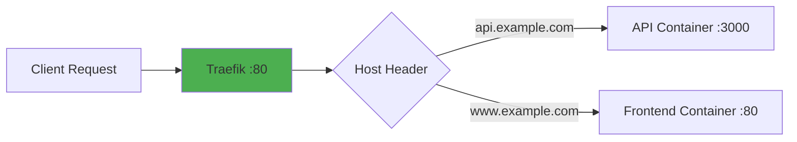

# How to Use Docker Labels for Container Management

Author: [nawazdhandala](https://www.github.com/nawazdhandala)

Tags: Docker, Container Management, DevOps, Automation, Organization

Description: Learn how to use Docker labels to organize containers, enable service discovery, integrate with reverse proxies, and build automated workflows based on metadata.

---

Docker labels are key-value pairs attached to containers, images, volumes, and networks. They provide a flexible way to add metadata that other tools can read for automation, routing, monitoring, and organization.

## Label Basics

Labels are strings that can contain any information you choose. They persist with the object and are queryable through the Docker API.

```bash
# Add labels when running a container
docker run -d \
  --name webapp \
  --label environment=production \
  --label team=platform \
  --label version=2.4.1 \
  nginx:alpine

# View labels on a container
docker inspect webapp --format '{{json .Config.Labels}}' | jq

# Output:
# {
#   "environment": "production",
#   "team": "platform",
#   "version": "2.4.1"
# }
```

### Labels in Dockerfiles

```dockerfile
FROM node:20-slim

# Add labels to the image
LABEL maintainer="platform-team@company.com"
LABEL org.opencontainers.image.title="API Service"
LABEL org.opencontainers.image.version="2.4.1"
LABEL org.opencontainers.image.description="REST API for customer data"
LABEL org.opencontainers.image.source="https://github.com/company/api"

WORKDIR /app
COPY . .
CMD ["node", "server.js"]
```

### Labels in Docker Compose

```yaml
version: '3.8'

services:
  api:
    image: myapp/api:latest
    labels:
      # Simple key-value labels
      environment: "production"
      team: "backend"

      # Namespaced labels (recommended for tools)
      com.company.service: "api"
      com.company.owner: "backend-team"

      # Multi-line labels for complex data
      com.company.oncall: |
        primary: alice@company.com
        secondary: bob@company.com
```

## Filtering Containers by Labels

Labels become powerful when you filter operations based on them.

```bash
# List containers with specific label
docker ps --filter "label=environment=production"

# List all containers with a label key (any value)
docker ps --filter "label=team"

# Combine multiple label filters (AND logic)
docker ps --filter "label=environment=production" --filter "label=team=platform"

# Stop all containers with a specific label
docker stop $(docker ps -q --filter "label=environment=staging")

# Remove all containers with a specific label
docker rm $(docker ps -aq --filter "label=disposable=true")
```

## Reverse Proxy Integration with Traefik

Traefik reads labels to automatically configure routing. This eliminates manual proxy configuration.

```yaml
version: '3.8'

services:
  traefik:
    image: traefik:v3.0
    command:
      - "--providers.docker=true"
      - "--providers.docker.exposedbydefault=false"
      - "--entrypoints.web.address=:80"
    ports:
      - "80:80"
    volumes:
      - /var/run/docker.sock:/var/run/docker.sock:ro

  api:
    image: myapp/api:latest
    labels:
      # Enable Traefik for this container
      traefik.enable: "true"

      # Define the router
      traefik.http.routers.api.rule: "Host(`api.example.com`)"
      traefik.http.routers.api.entrypoints: "web"

      # Define the service (port mapping)
      traefik.http.services.api.loadbalancer.server.port: "3000"

      # Add middleware (optional)
      traefik.http.routers.api.middlewares: "api-ratelimit"
      traefik.http.middlewares.api-ratelimit.ratelimit.average: "100"

  frontend:
    image: myapp/frontend:latest
    labels:
      traefik.enable: "true"
      traefik.http.routers.frontend.rule: "Host(`www.example.com`)"
      traefik.http.routers.frontend.entrypoints: "web"
      traefik.http.services.frontend.loadbalancer.server.port: "80"
```



## Monitoring and Observability Labels

Prometheus and other monitoring tools use labels for service discovery and metric organization.

```yaml
services:
  api:
    image: myapp/api:latest
    labels:
      # Prometheus scraping configuration
      prometheus.io/scrape: "true"
      prometheus.io/port: "9090"
      prometheus.io/path: "/metrics"

      # Custom metric labels
      prometheus.io/job: "api-service"
      prometheus.io/environment: "production"

  # Prometheus configured to read Docker labels
  prometheus:
    image: prom/prometheus:latest
    volumes:
      - ./prometheus.yml:/etc/prometheus/prometheus.yml
```

```yaml
# prometheus.yml - Docker service discovery
scrape_configs:
  - job_name: 'docker'
    docker_sd_configs:
      - host: unix:///var/run/docker.sock
    relabel_configs:
      # Only scrape containers with prometheus.io/scrape=true
      - source_labels: [__meta_docker_container_label_prometheus_io_scrape]
        action: keep
        regex: true

      # Use prometheus.io/port label for the target port
      - source_labels: [__meta_docker_container_label_prometheus_io_port]
        target_label: __address__
        regex: (.+)
        replacement: ${1}
```

## Organizational Labels

Use consistent labeling schemes to organize containers across teams and environments.

```yaml
# Recommended label schema
services:
  api:
    labels:
      # OCI standard labels (widely recognized)
      org.opencontainers.image.title: "Customer API"
      org.opencontainers.image.version: "${VERSION}"
      org.opencontainers.image.revision: "${GIT_SHA}"
      org.opencontainers.image.created: "${BUILD_DATE}"

      # Company-specific labels
      com.company.team: "backend"
      com.company.cost-center: "engineering"
      com.company.environment: "production"
      com.company.service: "customer-api"

      # Operational labels
      com.company.oncall-email: "backend-oncall@company.com"
      com.company.runbook: "https://wiki.company.com/runbooks/customer-api"
      com.company.sla-tier: "critical"
```

### Label Naming Conventions

Follow these conventions to avoid conflicts:

```bash
# Use reverse DNS notation for custom labels
com.yourcompany.label-name

# Use dots to create hierarchies
com.yourcompany.team
com.yourcompany.team.lead
com.yourcompany.team.slack-channel

# Standard prefixes
org.opencontainers.*  # OCI standard labels
io.prometheus.*       # Prometheus-related
traefik.*            # Traefik configuration
```

## Automated Workflows with Labels

Build automation that responds to container labels.

```bash
#!/bin/bash
# cleanup-old-containers.sh
# Remove containers labeled as temporary that are older than 1 hour

docker ps -aq \
  --filter "label=disposable=true" \
  --filter "status=exited" \
  | xargs -r docker rm

# Find containers by label and apply actions
for container in $(docker ps -q --filter "label=backup=true"); do
  echo "Backing up container: $container"
  docker exec "$container" /backup.sh
done
```

```python
# Python script using Docker SDK
import docker

client = docker.from_env()

# Find all production containers
prod_containers = client.containers.list(
    filters={"label": "environment=production"}
)

for container in prod_containers:
    labels = container.labels
    print(f"Container: {container.name}")
    print(f"  Team: {labels.get('team', 'unknown')}")
    print(f"  Version: {labels.get('version', 'unknown')}")
```

## Labels on Other Docker Objects

Labels work on images, volumes, and networks too.

```bash
# Label a volume for identification
docker volume create \
  --label project=webapp \
  --label backup=daily \
  webapp_data

# Filter volumes by label
docker volume ls --filter "label=backup=daily"

# Label a network
docker network create \
  --label environment=production \
  --label team=platform \
  production_network

# Build image with labels
docker build \
  --label "git.commit=$(git rev-parse HEAD)" \
  --label "build.date=$(date -u +%Y-%m-%dT%H:%M:%SZ)" \
  -t myapp:latest .
```

## Querying Labels with Format Templates

Extract specific label values using Go templates.

```bash
# Get single label value
docker inspect webapp --format '{{index .Config.Labels "environment"}}'

# List all labels in readable format
docker inspect webapp --format '{{range $k, $v := .Config.Labels}}{{$k}}={{$v}}{{"\n"}}{{end}}'

# Find containers missing required labels
docker ps --format '{{.Names}}: {{.Label "team"}}' | grep ": $"

# Export labels to JSON for processing
docker inspect $(docker ps -q) --format '{"name":"{{.Name}}","labels":{{json .Config.Labels}}}' | jq -s
```

## Best Practices

1. **Use namespaced labels** to avoid conflicts between tools
2. **Document your label schema** so all teams use consistent labels
3. **Include build metadata** (git SHA, build date) for traceability
4. **Add operational labels** (oncall, runbook URLs) for incident response
5. **Filter cleanup operations** by labels to avoid deleting important containers
6. **Version your label schema** if you change label meanings over time

---

Labels transform Docker from a container runtime into an organized, automated platform. Start with a consistent labeling scheme across your organization, use labels to drive reverse proxy routing and monitoring, and build automation that queries labels to perform targeted operations. The investment in proper labeling pays off as your container fleet grows.
