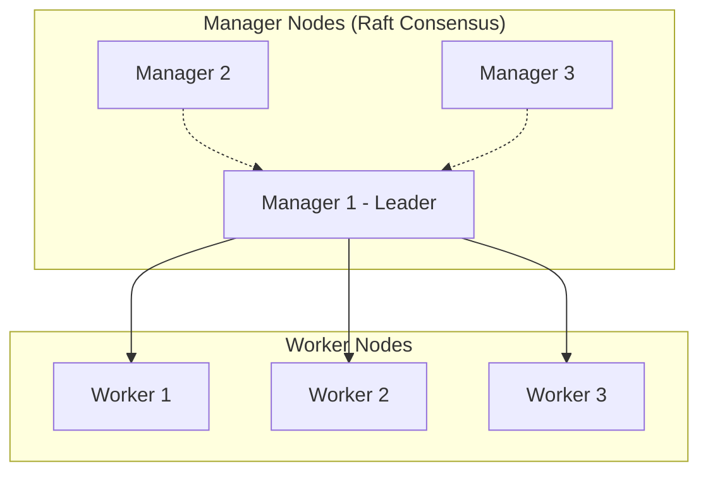
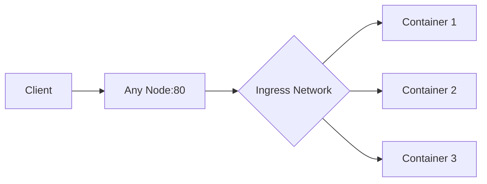

# How to Set Up Docker Swarm for Orchestration

Author: [nawazdhandala](https://www.github.com/nawazdhandala)

Tags: Docker, Docker Swarm, Orchestration, High Availability, DevOps

Description: Learn how to initialize a Docker Swarm cluster, deploy services with replicas, configure load balancing, and manage a production-ready container orchestration platform.

---

Docker Swarm turns a group of Docker hosts into a single virtual cluster. It provides built-in orchestration, load balancing, and service discovery without requiring additional tools. While Kubernetes dominates enterprise deployments, Swarm remains a solid choice for simpler orchestration needs.

## Swarm Architecture Overview

A Swarm cluster consists of manager and worker nodes. Managers handle orchestration decisions. Workers run the actual containers.



For high availability, use 3 or 5 manager nodes. The Raft consensus algorithm tolerates (N-1)/2 failures.

## Initialize the Swarm

On the first manager node, initialize the swarm.

```bash
# Initialize swarm on the first manager
# --advertise-addr specifies the address other nodes use to join
docker swarm init --advertise-addr 192.168.1.10

# Output includes join tokens
# To add a worker to this swarm, run:
#   docker swarm join --token SWMTKN-1-xxx 192.168.1.10:2377
# To add a manager to this swarm, run:
#   docker swarm join-token manager
```

### Add Worker Nodes

On each worker node, run the join command with the worker token.

```bash
# On worker nodes
docker swarm join --token SWMTKN-1-xxxworkertoken 192.168.1.10:2377

# Verify join succeeded
docker info | grep "Swarm"
# Swarm: active
```

### Add Additional Managers

For high availability, add more manager nodes.

```bash
# On the first manager, get the manager join token
docker swarm join-token manager

# On additional manager nodes
docker swarm join --token SWMTKN-1-xxxmanagertoken 192.168.1.10:2377
```

### Verify Cluster Status

```bash
# View all nodes in the swarm
docker node ls

# Output
# ID                           HOSTNAME   STATUS  AVAILABILITY  MANAGER STATUS
# abc123 *                     manager1   Ready   Active        Leader
# def456                       manager2   Ready   Active        Reachable
# ghi789                       manager3   Ready   Active        Reachable
# jkl012                       worker1    Ready   Active
# mno345                       worker2    Ready   Active
```

## Deploy Services

Swarm services define how containers run across the cluster.

```bash
# Create a simple replicated service
docker service create \
  --name webapp \
  --replicas 3 \
  --publish 80:80 \
  nginx:alpine

# View running services
docker service ls

# View service details and replica placement
docker service ps webapp
```

### Service with Resource Limits

```bash
# Create service with CPU and memory constraints
docker service create \
  --name api \
  --replicas 5 \
  --limit-cpu 0.5 \
  --limit-memory 512M \
  --reserve-cpu 0.25 \
  --reserve-memory 256M \
  --publish 3000:3000 \
  myapp/api:latest
```

### Update Running Services

```bash
# Scale service replicas
docker service scale webapp=5

# Update image (rolling update by default)
docker service update --image nginx:1.25 webapp

# Update with rollback configuration
docker service update \
  --image myapp/api:v2 \
  --update-parallelism 2 \
  --update-delay 10s \
  --update-failure-action rollback \
  api
```

## Deploy with Stack Files

Stack files use Docker Compose syntax with Swarm-specific extensions.

```yaml
# stack.yml
version: '3.8'

services:
  web:
    image: nginx:alpine
    ports:
      - "80:80"
    deploy:
      replicas: 3
      update_config:
        parallelism: 1
        delay: 10s
        failure_action: rollback
      restart_policy:
        condition: on-failure
        delay: 5s
        max_attempts: 3
      resources:
        limits:
          cpus: '0.5'
          memory: 256M
        reservations:
          cpus: '0.25'
          memory: 128M
    networks:
      - webnet

  api:
    image: myapp/api:latest
    deploy:
      replicas: 2
      placement:
        constraints:
          - node.role == worker
          - node.labels.tier == backend
    environment:
      - DATABASE_URL=postgres://db:5432/app
    networks:
      - webnet
      - backend

  db:
    image: postgres:15
    deploy:
      replicas: 1
      placement:
        constraints:
          - node.labels.storage == ssd
    volumes:
      - pgdata:/var/lib/postgresql/data
    networks:
      - backend

networks:
  webnet:
  backend:

volumes:
  pgdata:
```

```bash
# Deploy the stack
docker stack deploy -c stack.yml myapp

# View stack services
docker stack services myapp

# View tasks across all services
docker stack ps myapp

# Remove the stack
docker stack rm myapp
```

## Networking in Swarm

Swarm creates overlay networks that span all nodes.

```bash
# Create an overlay network
docker network create \
  --driver overlay \
  --attachable \
  my-network

# Services on the same network can reach each other by service name
# DNS automatically resolves service names to container IPs
```

### Ingress Load Balancing

The built-in routing mesh distributes external traffic across all replicas.

```bash
# Published ports are available on ALL swarm nodes
# Request to any node on port 80 is routed to an available web container
docker service create --name web --replicas 3 --publish 80:80 nginx:alpine

# Traffic flow:
# Client -> Any Swarm Node:80 -> Routing Mesh -> Available Container
```



## Node Management

### Add Labels for Placement Constraints

```bash
# Add labels to nodes for placement decisions
docker node update --label-add tier=frontend worker1
docker node update --label-add tier=backend worker2
docker node update --label-add storage=ssd worker3

# Use labels in placement constraints
docker service create \
  --name api \
  --constraint 'node.labels.tier==backend' \
  myapp/api:latest
```

### Drain Nodes for Maintenance

```bash
# Prevent new tasks from being scheduled on a node
docker node update --availability drain worker1

# Existing tasks are moved to other nodes
docker service ps myapp

# Return node to active status
docker node update --availability active worker1
```

### Remove Nodes

```bash
# On the node being removed, leave the swarm
docker swarm leave

# On a manager, remove the node from the cluster
docker node rm worker1
```

## Secrets and Configs

Swarm provides built-in secret management.

```bash
# Create a secret from a file
echo "supersecretpassword" | docker secret create db_password -

# Create a secret from a file
docker secret create ssl_cert /path/to/cert.pem

# List secrets
docker secret ls
```

```yaml
# stack.yml - Using secrets
version: '3.8'

services:
  db:
    image: postgres:15
    secrets:
      - db_password
    environment:
      POSTGRES_PASSWORD_FILE: /run/secrets/db_password

secrets:
  db_password:
    external: true
```

### Configs for Non-Sensitive Data

```bash
# Create a config
docker config create nginx_config ./nginx.conf

# Use in service
docker service create \
  --name web \
  --config source=nginx_config,target=/etc/nginx/nginx.conf \
  nginx:alpine
```

## Monitoring Swarm Health

```bash
# Check cluster-wide service status
docker service ls

# View service logs across all replicas
docker service logs webapp --follow

# Inspect node health
docker node ls

# View events across the swarm
docker events --filter scope=swarm
```

### Health Checks for Services

```yaml
services:
  api:
    image: myapp/api:latest
    healthcheck:
      test: ["CMD", "curl", "-f", "http://localhost:3000/health"]
      interval: 30s
      timeout: 10s
      retries: 3
      start_period: 40s
    deploy:
      replicas: 3
```

Unhealthy containers are automatically replaced by Swarm.

## Production Considerations

### Manager Node Recommendations

- Use an odd number of managers (3 or 5)
- Spread managers across availability zones
- Managers can also run workloads, but dedicated managers are safer

### Backup Swarm State

```bash
# Stop Docker on manager (brief downtime)
sudo systemctl stop docker

# Backup the swarm state
sudo tar -cvzf swarm-backup.tar.gz /var/lib/docker/swarm

# Restart Docker
sudo systemctl start docker
```

### Restore from Backup

```bash
# On a new manager node
sudo systemctl stop docker
sudo tar -xvzf swarm-backup.tar.gz -C /
sudo docker swarm init --force-new-cluster
```

---

Docker Swarm provides production-grade orchestration with minimal setup complexity. Initialize the swarm, add nodes, and deploy services using familiar Docker Compose syntax. The built-in load balancing, secrets management, and rolling updates handle most production requirements. For teams that find Kubernetes too complex for their needs, Swarm remains a practical alternative that can scale to hundreds of nodes.
