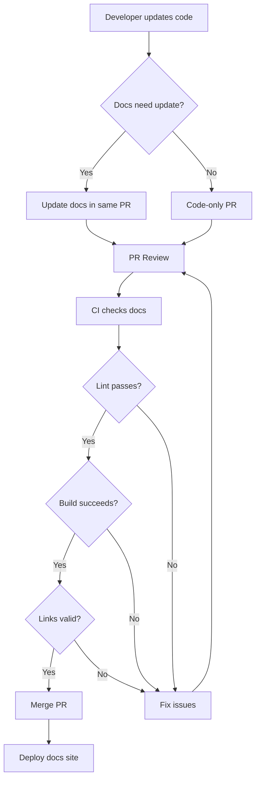

# How to Implement Documentation as Code

Author: [nawazdhandala](https://www.github.com/nawazdhandala)

Tags: Documentation, Developer Experience, Git, Markdown, CI/CD

Description: Learn how to treat documentation like source code by storing it in version control, automating builds, and integrating docs into your development workflow.

---

Documentation that lives in wikis or Google Docs quickly becomes outdated. Developers update code but forget to update the separate documentation. Documentation as Code solves this by keeping docs alongside source code, using the same version control, review process, and CI/CD pipelines. When documentation lives in the same repository as code, it stays in sync.

## Why Documentation as Code?

Traditional documentation approaches have fundamental problems:

- **Wikis become stale**: No one remembers to update them after code changes
- **Access is fragmented**: Docs in one system, code in another
- **No review process**: Changes go live without peer review
- **No version history**: Hard to see what changed and when

Documentation as Code applies software engineering practices to documentation:

- **Version control**: Track changes, blame, and history
- **Code review**: Pull requests for docs, just like code
- **Automated testing**: Lint prose, check links, validate examples
- **CI/CD**: Automatically build and deploy on merge

## Project Structure

Organize documentation within your repository:

```
project/
├── docs/
│   ├── getting-started.md
│   ├── architecture.md
│   ├── api/
│   │   ├── authentication.md
│   │   └── endpoints.md
│   ├── guides/
│   │   ├── deployment.md
│   │   └── troubleshooting.md
│   └── reference/
│       └── configuration.md
├── src/
├── mkdocs.yml          # Documentation site config
└── README.md
```

## Setting Up MkDocs

MkDocs generates static documentation sites from Markdown. Install it:

```bash
# Install MkDocs with Material theme
pip install mkdocs mkdocs-material
```

Create `mkdocs.yml`:

```yaml
# mkdocs.yml - Documentation site configuration

site_name: Project Documentation
site_description: Complete documentation for the project
site_url: https://docs.example.com

# Repository information
repo_name: org/project
repo_url: https://github.com/org/project
edit_uri: edit/main/docs/

# Theme configuration
theme:
  name: material
  palette:
    # Light/dark mode toggle
    - scheme: default
      toggle:
        icon: material/brightness-7
        name: Switch to dark mode
    - scheme: slate
      toggle:
        icon: material/brightness-4
        name: Switch to light mode
  features:
    - navigation.instant
    - navigation.tracking
    - navigation.tabs
    - navigation.sections
    - search.suggest
    - search.highlight
    - content.code.copy
    - content.action.edit

# Navigation structure
nav:
  - Home: index.md
  - Getting Started:
    - Installation: getting-started/installation.md
    - Quick Start: getting-started/quickstart.md
    - Configuration: getting-started/configuration.md
  - Guides:
    - Deployment: guides/deployment.md
    - Authentication: guides/authentication.md
    - Troubleshooting: guides/troubleshooting.md
  - API Reference:
    - Overview: api/overview.md
    - Endpoints: api/endpoints.md
  - Architecture: architecture.md

# Extensions for enhanced Markdown
markdown_extensions:
  - admonition
  - codehilite
  - pymdownx.superfences:
      custom_fences:
        - name: mermaid
          class: mermaid
          format: !!python/name:pymdownx.superfences.fence_code_format
  - pymdownx.tabbed:
      alternate_style: true
  - pymdownx.details
  - toc:
      permalink: true

# Plugins
plugins:
  - search
  - git-revision-date-localized:
      enable_creation_date: true
```

Build and serve locally:

```bash
# Start development server with live reload
mkdocs serve

# Build static site
mkdocs build
```

## Alternative: Docusaurus

For JavaScript projects, Docusaurus integrates well:

```bash
# Create Docusaurus site in docs folder
npx create-docusaurus@latest docs classic --typescript
```

Configure `docusaurus.config.ts`:

```typescript
// docs/docusaurus.config.ts
import type { Config } from '@docusaurus/types';

const config: Config = {
  title: 'Project Documentation',
  tagline: 'Comprehensive guides and API reference',
  url: 'https://docs.example.com',
  baseUrl: '/',
  organizationName: 'org',
  projectName: 'project',

  presets: [
    [
      'classic',
      {
        docs: {
          routeBasePath: '/',
          sidebarPath: './sidebars.ts',
          editUrl: 'https://github.com/org/project/edit/main/docs/',
          // Show last update time
          showLastUpdateTime: true,
          // Show last author
          showLastUpdateAuthor: true,
        },
        blog: false,
        theme: {
          customCss: './src/css/custom.css',
        },
      },
    ],
  ],

  themeConfig: {
    navbar: {
      title: 'Project Docs',
      items: [
        { to: '/getting-started', label: 'Getting Started', position: 'left' },
        { to: '/api', label: 'API', position: 'left' },
        { to: '/guides', label: 'Guides', position: 'left' },
        {
          href: 'https://github.com/org/project',
          label: 'GitHub',
          position: 'right',
        },
      ],
    },
    footer: {
      style: 'dark',
      copyright: `Copyright ${new Date().getFullYear()}. Built with Docusaurus.`,
    },
    prism: {
      theme: require('prism-react-renderer/themes/github'),
      darkTheme: require('prism-react-renderer/themes/dracula'),
    },
  },
};

export default config;
```

## Automated Documentation Checks

Add linting and validation to your CI pipeline:

```yaml
# .github/workflows/docs.yml
name: Documentation

on:
  push:
    paths:
      - 'docs/**'
      - 'mkdocs.yml'
  pull_request:
    paths:
      - 'docs/**'
      - 'mkdocs.yml'

jobs:
  lint:
    runs-on: ubuntu-latest
    steps:
      - uses: actions/checkout@v4

      - name: Lint Markdown
        uses: DavidAnson/markdownlint-cli2-action@v14
        with:
          globs: 'docs/**/*.md'

      - name: Check spelling
        uses: streetsidesoftware/cspell-action@v5
        with:
          files: 'docs/**/*.md'

      - name: Check links
        uses: lycheeverse/lychee-action@v1
        with:
          args: --verbose docs/**/*.md
          fail: true

  build:
    runs-on: ubuntu-latest
    needs: lint
    steps:
      - uses: actions/checkout@v4
        with:
          fetch-depth: 0

      - name: Setup Python
        uses: actions/setup-python@v5
        with:
          python-version: '3.11'

      - name: Install dependencies
        run: pip install mkdocs mkdocs-material mkdocs-git-revision-date-localized-plugin

      - name: Build documentation
        run: mkdocs build --strict

      - name: Upload artifact
        uses: actions/upload-pages-artifact@v3
        with:
          path: site/

  deploy:
    if: github.ref == 'refs/heads/main'
    needs: build
    runs-on: ubuntu-latest
    permissions:
      pages: write
      id-token: write
    environment:
      name: github-pages
      url: ${{ steps.deployment.outputs.page_url }}
    steps:
      - name: Deploy to GitHub Pages
        id: deployment
        uses: actions/deploy-pages@v4
```

## Markdown Linting Configuration

Create `.markdownlint.json`:

```json
{
  "default": true,
  "MD013": {
    "line_length": 120,
    "code_blocks": false,
    "tables": false
  },
  "MD024": {
    "siblings_only": true
  },
  "MD033": {
    "allowed_elements": ["details", "summary", "br"]
  },
  "MD041": false
}
```

And `.cspell.json` for spell checking:

```json
{
  "version": "0.2",
  "language": "en",
  "words": [
    "kubernetes",
    "kubectl",
    "configmap",
    "namespace",
    "microservice",
    "observability"
  ],
  "ignorePaths": [
    "node_modules/**",
    "*.json",
    "*.yaml"
  ]
}
```

## API Documentation Generation

Generate API docs from source code:

```yaml
# For OpenAPI specs, use Redoc or Swagger UI
# mkdocs.yml
plugins:
  - search
  - render_swagger:
      spec: api/openapi.yaml

# Or generate from code annotations
# Python example with mkdocstrings
plugins:
  - search
  - mkdocstrings:
      handlers:
        python:
          paths: [src]
          options:
            show_source: true
            show_signature_annotations: true
```

For TypeScript, use TypeDoc:

```bash
# Install TypeDoc
npm install --save-dev typedoc typedoc-plugin-markdown

# Generate markdown from source
npx typedoc --out docs/api --plugin typedoc-plugin-markdown src/index.ts
```

## Documentation Workflow

Here is how docs flow through development:



## Writing Effective Documentation

Structure your Markdown for clarity:

```markdown
# Feature Name

Brief description of what this feature does and why you would use it.

## Prerequisites

- Requirement 1
- Requirement 2

## Quick Start

Get up and running in 5 minutes:

```bash
# Install the package
npm install @org/package

# Run the setup wizard
npx @org/package init
```

## Configuration

### Basic Configuration

Explanation of basic options...

```yaml
# config.yaml
setting: value
nested:
  option: true
```

### Advanced Configuration

For complex scenarios...

## Examples

### Example 1: Common Use Case

```python
# Complete, runnable example
from package import Client

client = Client(api_key="your-key")
result = client.operation()
print(result)
```

### Example 2: Edge Case

...

## Troubleshooting

### Error: Connection refused

**Cause**: The server is not running.

**Solution**: Start the server with `npm start`.

### Error: Authentication failed

**Cause**: Invalid API key.

**Solution**: Check your API key in the dashboard.

## See Also

- [Related Feature](./related-feature.md)
- [API Reference](./api/reference.md)
```

## Versioned Documentation

Maintain docs for multiple versions:

```yaml
# mkdocs.yml with mike for versioning
plugins:
  - search
  - mike:
      canonical_version: latest
      version_selector: true
```

Deploy versioned docs:

```bash
# Deploy version 1.0
mike deploy --push --update-aliases 1.0 latest

# Deploy version 2.0 and update latest alias
mike deploy --push --update-aliases 2.0 latest

# List deployed versions
mike list
```

## Best Practices

1. **Keep docs next to code**: Documentation in `docs/` or inline with source files stays more current than external wikis.

2. **Review docs like code**: Require documentation updates in PRs that change user-facing behavior.

3. **Test code examples**: Extract and run code blocks in CI to ensure they work.

4. **Use diagrams for architecture**: Mermaid diagrams in Markdown stay version controlled and easy to update.

5. **Write for your audience**: Separate getting-started guides (for beginners) from reference docs (for experts).

Documentation as Code ensures your docs evolve alongside your software. When updating code requires updating docs in the same commit, documentation stays accurate. When docs go through code review, quality improves. When CI validates docs, broken links and typos get caught before users see them.
