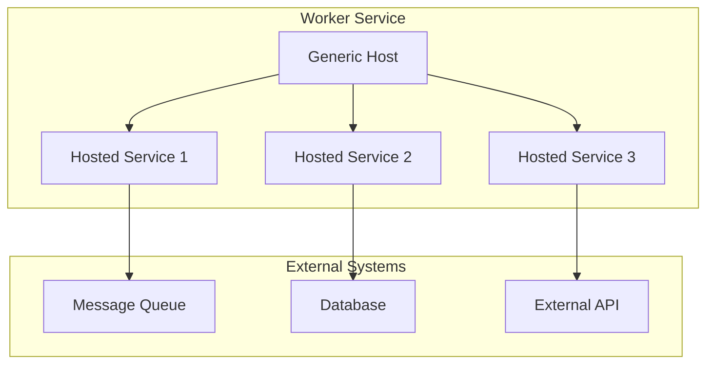

# How to Build Background Services with .NET Worker Service

Author: [nawazdhandala](https://www.github.com/nawazdhandala)

Tags: .NET, C#, Worker Service, Background Services, Hosted Services, ASP.NET Core, Microservices

Description: Learn how to build robust background services using .NET Worker Service. This guide covers hosted services, timed background tasks, queue processing, and best practices for long-running operations.

---

Background services are essential for handling tasks that run independently of user requests. Whether you need to process messages from a queue, run scheduled tasks, or perform cleanup operations, .NET Worker Service provides a solid foundation for building these services.

## What is .NET Worker Service?

.NET Worker Service is a template for creating long-running background applications. Unlike web applications that respond to HTTP requests, worker services run continuously and perform tasks in the background.



## Creating a Worker Service Project

Start by creating a new worker service project:

```bash
dotnet new worker -n MyWorkerService
cd MyWorkerService
```

This creates a basic project with a `Worker.cs` file that inherits from `BackgroundService`:

```csharp
// Worker.cs
public class Worker : BackgroundService
{
    private readonly ILogger<Worker> _logger;

    public Worker(ILogger<Worker> logger)
    {
        _logger = logger;
    }

    // This method runs when the service starts
    protected override async Task ExecuteAsync(CancellationToken stoppingToken)
    {
        while (!stoppingToken.IsCancellationRequested)
        {
            _logger.LogInformation("Worker running at: {time}", DateTimeOffset.Now);
            await Task.Delay(1000, stoppingToken);
        }
    }
}
```

## Understanding the Host Lifecycle

The Generic Host manages the lifetime of your background services:

```csharp
// Program.cs
var builder = Host.CreateApplicationBuilder(args);

// Register your worker services
builder.Services.AddHostedService<Worker>();

// Build and run the host
var host = builder.Build();
await host.RunAsync();
```

The host calls these methods in order:

1. `StartAsync` - Called when the host starts
2. `ExecuteAsync` - Your main processing loop
3. `StopAsync` - Called when the host shuts down

## Timed Background Service

For tasks that run on a schedule, implement a timed background service:

```csharp
// TimedBackgroundService.cs
public class TimedBackgroundService : BackgroundService
{
    private readonly ILogger<TimedBackgroundService> _logger;
    private readonly IServiceScopeFactory _scopeFactory;
    private readonly TimeSpan _period = TimeSpan.FromMinutes(5);

    public TimedBackgroundService(
        ILogger<TimedBackgroundService> logger,
        IServiceScopeFactory scopeFactory)
    {
        _logger = logger;
        _scopeFactory = scopeFactory;
    }

    protected override async Task ExecuteAsync(CancellationToken stoppingToken)
    {
        _logger.LogInformation("Timed service starting");

        // Use PeriodicTimer for accurate intervals
        using var timer = new PeriodicTimer(_period);

        // Run immediately on startup
        await DoWorkAsync(stoppingToken);

        // Then run on each timer tick
        while (await timer.WaitForNextTickAsync(stoppingToken))
        {
            await DoWorkAsync(stoppingToken);
        }
    }

    private async Task DoWorkAsync(CancellationToken stoppingToken)
    {
        _logger.LogInformation("Timed task executing at {Time}", DateTime.UtcNow);

        // Create a scope to resolve scoped services
        using var scope = _scopeFactory.CreateScope();
        var dbContext = scope.ServiceProvider.GetRequiredService<ApplicationDbContext>();

        try
        {
            // Perform your scheduled task
            var expiredRecords = await dbContext.Sessions
                .Where(s => s.ExpiresAt < DateTime.UtcNow)
                .ToListAsync(stoppingToken);

            if (expiredRecords.Any())
            {
                dbContext.Sessions.RemoveRange(expiredRecords);
                await dbContext.SaveChangesAsync(stoppingToken);
                _logger.LogInformation("Cleaned up {Count} expired sessions", expiredRecords.Count);
            }
        }
        catch (Exception ex)
        {
            _logger.LogError(ex, "Error during scheduled task execution");
        }
    }
}
```

## Queue Processing Service

For processing messages from a queue, create a dedicated worker:

```csharp
// QueueProcessingService.cs
public class QueueProcessingService : BackgroundService
{
    private readonly ILogger<QueueProcessingService> _logger;
    private readonly IServiceScopeFactory _scopeFactory;
    private readonly Channel<WorkItem> _queue;
    private readonly int _maxConcurrency;

    public QueueProcessingService(
        ILogger<QueueProcessingService> logger,
        IServiceScopeFactory scopeFactory,
        Channel<WorkItem> queue,
        IConfiguration configuration)
    {
        _logger = logger;
        _scopeFactory = scopeFactory;
        _queue = queue;
        _maxConcurrency = configuration.GetValue<int>("Queue:MaxConcurrency", 4);
    }

    protected override async Task ExecuteAsync(CancellationToken stoppingToken)
    {
        _logger.LogInformation("Queue processor starting with concurrency: {Max}", _maxConcurrency);

        // Process multiple items concurrently
        var tasks = Enumerable.Range(0, _maxConcurrency)
            .Select(_ => ProcessQueueAsync(stoppingToken));

        await Task.WhenAll(tasks);
    }

    private async Task ProcessQueueAsync(CancellationToken stoppingToken)
    {
        await foreach (var workItem in _queue.Reader.ReadAllAsync(stoppingToken))
        {
            using var scope = _scopeFactory.CreateScope();
            var processor = scope.ServiceProvider.GetRequiredService<IWorkItemProcessor>();

            try
            {
                _logger.LogInformation("Processing work item {Id}", workItem.Id);
                await processor.ProcessAsync(workItem, stoppingToken);
                _logger.LogInformation("Completed work item {Id}", workItem.Id);
            }
            catch (Exception ex)
            {
                _logger.LogError(ex, "Failed to process work item {Id}", workItem.Id);
                // Implement retry logic or dead letter queue here
            }
        }
    }
}

// WorkItem.cs
public record WorkItem(string Id, string Type, string Payload, DateTime CreatedAt);

// IWorkItemProcessor.cs
public interface IWorkItemProcessor
{
    Task ProcessAsync(WorkItem item, CancellationToken cancellationToken);
}
```

Register the queue and service:

```csharp
// Program.cs
var builder = Host.CreateApplicationBuilder(args);

// Create a bounded channel for backpressure
builder.Services.AddSingleton(Channel.CreateBounded<WorkItem>(new BoundedChannelOptions(1000)
{
    FullMode = BoundedChannelFullMode.Wait
}));

builder.Services.AddScoped<IWorkItemProcessor, WorkItemProcessor>();
builder.Services.AddHostedService<QueueProcessingService>();

var host = builder.Build();
await host.RunAsync();
```

## Health Monitoring for Workers

Add health checks to monitor your worker services:

```csharp
// WorkerHealthCheck.cs
public class WorkerHealthCheck : IHealthCheck
{
    private readonly WorkerHealthState _state;

    public WorkerHealthCheck(WorkerHealthState state)
    {
        _state = state;
    }

    public Task<HealthCheckResult> CheckHealthAsync(
        HealthCheckContext context,
        CancellationToken cancellationToken = default)
    {
        // Check if the worker has processed items recently
        var timeSinceLastProcess = DateTime.UtcNow - _state.LastProcessedAt;

        if (timeSinceLastProcess > TimeSpan.FromMinutes(10))
        {
            return Task.FromResult(HealthCheckResult.Unhealthy(
                $"No items processed in {timeSinceLastProcess.TotalMinutes:F1} minutes"));
        }

        if (timeSinceLastProcess > TimeSpan.FromMinutes(5))
        {
            return Task.FromResult(HealthCheckResult.Degraded(
                $"Processing may be slow, last item {timeSinceLastProcess.TotalMinutes:F1} minutes ago"));
        }

        return Task.FromResult(HealthCheckResult.Healthy());
    }
}

// WorkerHealthState.cs - Thread-safe state tracking
public class WorkerHealthState
{
    private DateTime _lastProcessedAt = DateTime.UtcNow;

    public DateTime LastProcessedAt => _lastProcessedAt;

    public void RecordProcessed()
    {
        Interlocked.Exchange(ref _lastProcessedAt, DateTime.UtcNow);
    }
}
```

## Graceful Shutdown Handling

Proper shutdown handling prevents data loss and ensures clean termination:

```csharp
// GracefulWorker.cs
public class GracefulWorker : BackgroundService
{
    private readonly ILogger<GracefulWorker> _logger;
    private readonly Channel<WorkItem> _queue;
    private int _activeProcessingCount;

    public GracefulWorker(ILogger<GracefulWorker> logger, Channel<WorkItem> queue)
    {
        _logger = logger;
        _queue = queue;
    }

    protected override async Task ExecuteAsync(CancellationToken stoppingToken)
    {
        try
        {
            await foreach (var item in _queue.Reader.ReadAllAsync(stoppingToken))
            {
                Interlocked.Increment(ref _activeProcessingCount);
                try
                {
                    await ProcessItemAsync(item, stoppingToken);
                }
                finally
                {
                    Interlocked.Decrement(ref _activeProcessingCount);
                }
            }
        }
        catch (OperationCanceledException) when (stoppingToken.IsCancellationRequested)
        {
            _logger.LogInformation("Shutdown requested, waiting for {Count} items to complete",
                _activeProcessingCount);
        }
    }

    public override async Task StopAsync(CancellationToken cancellationToken)
    {
        _logger.LogInformation("Worker stopping, completing in-flight work");

        // Wait for active processing to complete
        var timeout = TimeSpan.FromSeconds(30);
        var deadline = DateTime.UtcNow.Add(timeout);

        while (_activeProcessingCount > 0 && DateTime.UtcNow < deadline)
        {
            await Task.Delay(100, cancellationToken);
        }

        if (_activeProcessingCount > 0)
        {
            _logger.LogWarning("Timeout reached with {Count} items still processing",
                _activeProcessingCount);
        }

        await base.StopAsync(cancellationToken);
    }

    private async Task ProcessItemAsync(WorkItem item, CancellationToken stoppingToken)
    {
        // Your processing logic here
        await Task.Delay(100, stoppingToken);
    }
}
```

## Configuration and Dependency Injection

Configure your worker service with proper dependency injection:

```csharp
// Program.cs
var builder = Host.CreateApplicationBuilder(args);

// Load configuration
builder.Configuration.AddJsonFile("appsettings.json", optional: false);
builder.Configuration.AddEnvironmentVariables();

// Configure logging
builder.Logging.AddConsole();
builder.Logging.AddDebug();

// Register services
builder.Services.Configure<WorkerOptions>(builder.Configuration.GetSection("Worker"));
builder.Services.AddDbContext<ApplicationDbContext>(options =>
    options.UseSqlServer(builder.Configuration.GetConnectionString("Default")));

// Register health checks with HTTP endpoint
builder.Services.AddHealthChecks()
    .AddCheck<WorkerHealthCheck>("worker_health");

builder.Services.AddSingleton<WorkerHealthState>();
builder.Services.AddHostedService<TimedBackgroundService>();
builder.Services.AddHostedService<QueueProcessingService>();

var host = builder.Build();

// Expose health check endpoint
host.MapHealthChecks("/health");

await host.RunAsync();
```

## Running Multiple Workers

You can run multiple workers for different tasks:

```csharp
// Program.cs
builder.Services.AddHostedService<EmailNotificationWorker>();
builder.Services.AddHostedService<ReportGenerationWorker>();
builder.Services.AddHostedService<DataSyncWorker>();
builder.Services.AddHostedService<CleanupWorker>();
```

Each worker runs in parallel and handles its specific responsibility.

## Deploying to Kubernetes

Deploy your worker service with proper pod configuration:

```yaml
# deployment.yaml
apiVersion: apps/v1
kind: Deployment
metadata:
  name: my-worker-service
spec:
  replicas: 2
  selector:
    matchLabels:
      app: my-worker-service
  template:
    metadata:
      labels:
        app: my-worker-service
    spec:
      containers:
        - name: worker
          image: myregistry/my-worker-service:latest
          resources:
            requests:
              cpu: 100m
              memory: 128Mi
            limits:
              cpu: 500m
              memory: 256Mi
          livenessProbe:
            httpGet:
              path: /health
              port: 8080
            initialDelaySeconds: 10
            periodSeconds: 30
          env:
            - name: DOTNET_ENVIRONMENT
              value: Production
      terminationGracePeriodSeconds: 45
```

## Best Practices

| Practice | Description |
|----------|-------------|
| Use CancellationToken | Always check and respect the stopping token |
| Scope Services | Create scopes for scoped dependencies like DbContext |
| Handle Exceptions | Log and handle exceptions to prevent worker crashes |
| Implement Health Checks | Monitor worker health with custom health checks |
| Graceful Shutdown | Complete in-flight work before stopping |
| Configure Timeouts | Set appropriate timeouts for long-running operations |

## Summary

.NET Worker Service provides a robust foundation for building background services. Key points:

- Use `BackgroundService` as the base class for your workers
- Create service scopes when accessing scoped dependencies
- Implement proper cancellation handling for graceful shutdowns
- Add health checks to monitor worker status
- Use `PeriodicTimer` for accurate timed tasks
- Use `Channel<T>` for efficient queue processing

---

*Need to monitor your background services in production? [OneUptime](https://oneuptime.com) provides comprehensive monitoring and alerting for .NET Worker Services.*

**Related Reading:**
- [How to Set Up Kubernetes for .NET Applications](https://oneuptime.com/blog/post/2026-01-19-kubernetes-dotnet-applications/view) - Deploy .NET apps to Kubernetes
- [How to Build Health Probes with ASP.NET Core Health Checks](https://oneuptime.com/blog/post/2026-01-25-aspnet-core-health-checks/view) - Comprehensive health monitoring
