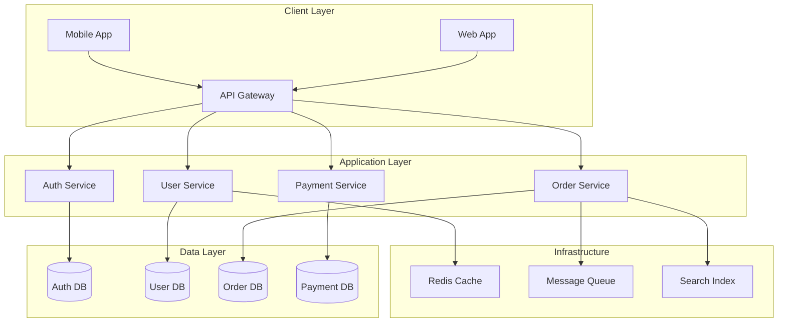

# How to Implement Effective Onboarding Documentation

Author: [nawazdhandala](https://www.github.com/nawazdhandala)

Tags: Onboarding, Documentation, Developer Experience, Team Management, Engineering Culture

Description: Learn how to create onboarding documentation that gets new developers productive quickly, covering environment setup, architecture overviews, and team processes.

---

A new developer joins your team. Without good onboarding documentation, they spend weeks asking questions, reading outdated wikis, and reverse-engineering how things work. With effective onboarding docs, they ship their first feature within days. This guide shows you how to create documentation that actually helps new team members succeed.

## The Cost of Poor Onboarding

Bad onboarding has measurable costs:

- New hires take months instead of weeks to become productive
- Senior developers spend hours answering the same questions repeatedly
- Institutional knowledge stays locked in people's heads
- High early turnover as frustrated developers leave

Good onboarding documentation is an investment that pays dividends every time someone new joins.

## Onboarding Documentation Structure

Organize onboarding docs in a clear progression:

```
onboarding/
├── README.md                    # Start here
├── 01-first-day/
│   ├── accounts-access.md       # Getting accounts set up
│   ├── dev-environment.md       # Local environment setup
│   └── first-pr.md              # Ship something small
├── 02-first-week/
│   ├── architecture.md          # System overview
│   ├── codebase-tour.md         # Key directories and patterns
│   └── team-processes.md        # How we work
├── 03-first-month/
│   ├── deep-dives/              # Detailed system documentation
│   ├── on-call.md               # Incident response
│   └── ownership-areas.md       # Taking ownership
└── reference/
    ├── glossary.md              # Terms and acronyms
    ├── runbooks/                # Operational procedures
    └── faq.md                   # Common questions
```

## Day One: Getting Set Up

The first document should get developers to a working environment:

```markdown
# Day One: Environment Setup

Welcome to the team! This guide gets your development environment running.

## Prerequisites

You should already have:

- [ ] Laptop with admin access
- [ ] GitHub account added to the org
- [ ] Slack access
- [ ] 1Password team invitation

## Step 1: Clone the Repository

```bash
# Clone the main repository
git clone git@github.com:acme/platform.git
cd platform

# Install dependencies
make setup
```

This takes about 10 minutes. While it runs, continue to Step 2.

## Step 2: Configure Access

### AWS Access

1. Log into AWS SSO: https://acme.awsapps.com/start
2. Select "Development" account
3. Click "Command line or programmatic access"
4. Copy the credentials to `~/.aws/credentials`

### Database Access

Request database read access in #platform-requests Slack channel:

```
@platform-team Please grant read access to dev databases for [your-name]
```

## Step 3: Start the Development Server

```bash
# Start all services
make dev

# Verify it's working
curl http://localhost:3000/health
# Should return: {"status": "ok"}
```

## Step 4: Verify Your Setup

Run the verification script:

```bash
./scripts/verify-setup.sh
```

Expected output:
```
✓ Docker running
✓ Node.js v20.x installed
✓ PostgreSQL connection successful
✓ Redis connection successful
✓ AWS credentials valid
✓ All services healthy
```

## Troubleshooting

### Error: "Docker daemon not running"

Start Docker Desktop and wait for it to fully initialize.

### Error: "Port 3000 already in use"

```bash
# Find and kill the process
lsof -i :3000
kill -9 <PID>
```

### Error: "Database connection refused"

The database container might not be ready. Wait 30 seconds and retry.

## Next Steps

Once your setup is verified:

1. Read [Architecture Overview](../02-first-week/architecture.md)
2. Pick a [Good First Issue](https://github.com/acme/platform/labels/good-first-issue)
3. Join the #dev-onboarding Slack channel
```

## First Week: Understanding the System

Provide architectural context:

```markdown
# Architecture Overview

This document explains how our system is structured and why.

## High-Level Architecture



## Service Responsibilities

### Auth Service
- User authentication and session management
- OAuth integration with Google and GitHub
- API key management

**Owner**: @auth-team
**Repository**: `acme/auth-service`
**Runbook**: [Auth Runbook](../reference/runbooks/auth.md)

### User Service
- User profile management
- Preferences and settings
- Account deletion and data export

**Owner**: @user-team
**Repository**: `acme/user-service`

### Order Service
- Shopping cart functionality
- Order processing and fulfillment
- Inventory management

**Owner**: @commerce-team
**Repository**: `acme/order-service`

## Data Flow Example

Here is how a user placing an order flows through the system:

1. **Web App** sends POST to `/api/orders`
2. **API Gateway** validates JWT token with Auth Service
3. **Order Service** receives validated request
4. Order Service publishes `order.created` event to queue
5. **Payment Service** consumes event, processes payment
6. Payment Service publishes `payment.completed` event
7. Order Service updates order status
8. User receives confirmation email

## Key Design Decisions

### Why Microservices?

We chose microservices because:
- Teams can deploy independently
- Services can scale independently
- Technology choices can vary by service

Trade-offs we accept:
- More complex deployment
- Network latency between services
- Distributed transactions are hard

### Why PostgreSQL?

- Strong consistency guarantees
- Excellent JSON support for flexible schemas
- Team expertise

### Why Redis for Caching?

- Sub-millisecond latency
- Built-in data structures (sorted sets for leaderboards)
- Pub/sub for real-time features

## Where to Learn More

- [Database Schema Documentation](./database-schemas.md)
- [API Documentation](https://api.acme.com/docs)
- [Infrastructure Diagrams](./infrastructure.md)
```

## First Month: Going Deeper

As developers get comfortable, point them to deeper resources:

```markdown
# Taking Ownership

After your first few PRs, you are ready to own features end-to-end.

## Ownership Expectations

When you own a feature:

1. **Design**: Write a brief design doc for non-trivial changes
2. **Implement**: Write code, tests, and documentation
3. **Review**: Address code review feedback
4. **Deploy**: Ship to staging, then production
5. **Monitor**: Watch metrics and logs after deploy
6. **Support**: Handle questions and bug reports

## On-Call Participation

After 30 days, you will join the on-call rotation:

- One week every 6 weeks
- Primary and secondary on-call
- Escalation after 15 minutes without response

Read the [On-Call Guide](./on-call.md) before your first rotation.

## Finding Work

### Good First Issues

Issues labeled `good-first-issue` are:
- Well-defined scope
- Limited blast radius
- Documented context

### Team Backlog

Our backlog lives in Linear. Your manager will help prioritize.

### Tech Debt

The `tech-debt` label marks improvement opportunities. These are great when you have spare cycles between features.

## Getting Help

### Synchronous Help

- **Slack #dev-help**: Quick questions
- **Pair programming**: Book time with a teammate
- **Office hours**: Thursdays 2-4pm

### Asynchronous Help

- **Code review comments**: Ask questions in PRs
- **Architecture docs**: Check the docs folder first
- **Search Slack history**: Someone probably asked before
```

## Reference Materials

Create a glossary for team-specific terminology:

```markdown
# Glossary

Terms and acronyms used at Acme.

## A

**API Gateway**: The service that routes all external requests. See [Gateway Documentation](./gateway.md).

## B

**Blue-Green Deployment**: Our deployment strategy where we run two identical environments and switch traffic between them.

## C

**Customer**: An organization that pays for our product. Not to be confused with User.

## F

**Feature Flag**: Configuration that enables/disables features without deployment. Managed in LaunchDarkly.

## P

**PII**: Personally Identifiable Information. Data that can identify an individual. Special handling required.

**Platform Team**: The team responsible for infrastructure and developer tools. Slack: #platform.

## S

**SLO**: Service Level Objective. Our target reliability. Currently 99.9% availability.

**Staging**: Pre-production environment at staging.acme.com.
```

## Automation

Automate what you can:

```bash
#!/bin/bash
# scripts/verify-setup.sh
# Verifies a new developer's environment is correctly configured

set -e

echo "Verifying development environment..."

# Check Docker
if docker info > /dev/null 2>&1; then
    echo "✓ Docker running"
else
    echo "✗ Docker not running"
    exit 1
fi

# Check Node version
required_node="20"
current_node=$(node -v | cut -d'v' -f2 | cut -d'.' -f1)
if [ "$current_node" -ge "$required_node" ]; then
    echo "✓ Node.js v${current_node}.x installed"
else
    echo "✗ Node.js v${required_node}+ required (found v${current_node})"
    exit 1
fi

# Check database connection
if pg_isready -h localhost -p 5432 > /dev/null 2>&1; then
    echo "✓ PostgreSQL connection successful"
else
    echo "✗ PostgreSQL connection failed"
    exit 1
fi

# Check Redis connection
if redis-cli ping > /dev/null 2>&1; then
    echo "✓ Redis connection successful"
else
    echo "✗ Redis connection failed"
    exit 1
fi

# Check AWS credentials
if aws sts get-caller-identity > /dev/null 2>&1; then
    echo "✓ AWS credentials valid"
else
    echo "✗ AWS credentials invalid or missing"
    exit 1
fi

# Check all services healthy
if curl -s http://localhost:3000/health | grep -q "ok"; then
    echo "✓ All services healthy"
else
    echo "✗ Services not healthy"
    exit 1
fi

echo ""
echo "Environment verified successfully!"
```

## Feedback Loop

Include a way to improve the docs:

```markdown
# Improving These Docs

This documentation is never finished. If something was confusing or missing during your onboarding, please fix it!

## How to Contribute

1. Click "Edit this page" on any doc
2. Make your changes
3. Submit a pull request
4. Tag your onboarding buddy for review

## What to Document

- Steps that were missing or unclear
- Errors you encountered and how you fixed them
- Questions you asked that should be in the FAQ
- Outdated information

## Recognition

We track documentation contributions. Improving onboarding docs is valued work!
```

## Best Practices

1. **Test with real new hires**: Have each new developer follow the docs and note where they get stuck.

2. **Keep it current**: Outdated docs are worse than no docs. Review quarterly.

3. **Link, do not duplicate**: Point to authoritative sources rather than copying information that will get stale.

4. **Progressive disclosure**: Start simple, add complexity as developers progress.

5. **Include the "why"**: Explaining why things are done a certain way helps developers make better decisions.

Effective onboarding documentation is a competitive advantage. Teams with great onboarding attract better talent, ramp them faster, and retain them longer. The time you invest in documentation pays back many times over.
