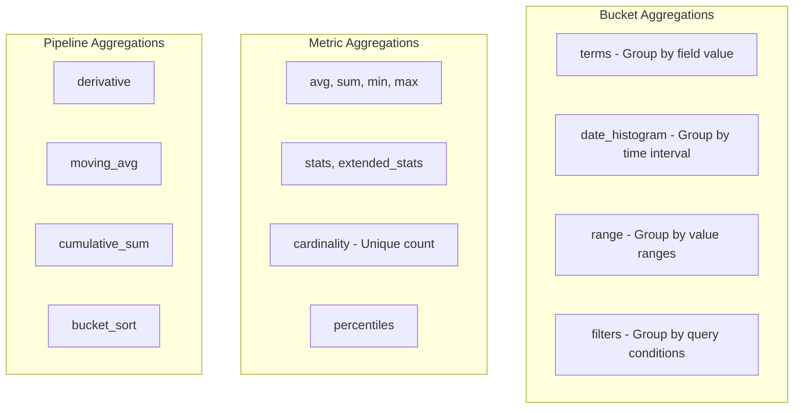

# How to Implement Aggregations in Elasticsearch

Author: [nawazdhandala](https://www.github.com/nawazdhandala)

Tags: Elasticsearch, Aggregations, Analytics, Data Analysis, Metrics, Search

Description: A comprehensive guide to Elasticsearch aggregations covering bucket aggregations, metric aggregations, pipeline aggregations, and practical examples for building analytics dashboards.

---

> Aggregations are Elasticsearch's answer to analytics. While queries find documents, aggregations summarize your data - computing statistics, grouping results, and building the data structures that power dashboards. This guide shows you how to use aggregations effectively.

Whether you're building real-time analytics, faceted search, or data visualizations, understanding aggregations is essential.

---

## Prerequisites

Before we begin, ensure you have:
- Elasticsearch 8.x running
- Sample data indexed (we'll create some)
- curl or Kibana Dev Tools

Let's create sample data for our examples:

```bash
# Create index with sample e-commerce data
curl -X PUT "localhost:9200/orders" -H 'Content-Type: application/json' -d'
{
  "mappings": {
    "properties": {
      "order_id": { "type": "keyword" },
      "customer_id": { "type": "keyword" },
      "product_category": { "type": "keyword" },
      "product_name": { "type": "text", "fields": { "keyword": { "type": "keyword" } } },
      "price": { "type": "float" },
      "quantity": { "type": "integer" },
      "order_date": { "type": "date" },
      "status": { "type": "keyword" },
      "shipping_country": { "type": "keyword" }
    }
  }
}'

# Index sample orders
curl -X POST "localhost:9200/orders/_bulk" -H 'Content-Type: application/json' -d'
{"index": {}}
{"order_id": "ORD001", "customer_id": "C001", "product_category": "Electronics", "product_name": "iPhone 15", "price": 999.0, "quantity": 1, "order_date": "2024-01-15", "status": "delivered", "shipping_country": "USA"}
{"index": {}}
{"order_id": "ORD002", "customer_id": "C002", "product_category": "Electronics", "product_name": "MacBook Pro", "price": 2499.0, "quantity": 1, "order_date": "2024-01-16", "status": "delivered", "shipping_country": "UK"}
{"index": {}}
{"order_id": "ORD003", "customer_id": "C001", "product_category": "Clothing", "product_name": "Winter Jacket", "price": 149.0, "quantity": 2, "order_date": "2024-01-17", "status": "shipped", "shipping_country": "USA"}
{"index": {}}
{"order_id": "ORD004", "customer_id": "C003", "product_category": "Electronics", "product_name": "AirPods Pro", "price": 249.0, "quantity": 1, "order_date": "2024-01-18", "status": "processing", "shipping_country": "Canada"}
{"index": {}}
{"order_id": "ORD005", "customer_id": "C004", "product_category": "Books", "product_name": "Python Cookbook", "price": 49.0, "quantity": 3, "order_date": "2024-01-19", "status": "delivered", "shipping_country": "USA"}
{"index": {}}
{"order_id": "ORD006", "customer_id": "C002", "product_category": "Electronics", "product_name": "Samsung TV", "price": 1299.0, "quantity": 1, "order_date": "2024-01-20", "status": "shipped", "shipping_country": "UK"}
{"index": {}}
{"order_id": "ORD007", "customer_id": "C005", "product_category": "Clothing", "product_name": "Running Shoes", "price": 129.0, "quantity": 1, "order_date": "2024-01-21", "status": "delivered", "shipping_country": "Germany"}
{"index": {}}
{"order_id": "ORD008", "customer_id": "C001", "product_category": "Books", "product_name": "Elasticsearch Guide", "price": 59.0, "quantity": 1, "order_date": "2024-01-22", "status": "delivered", "shipping_country": "USA"}
'
```

---

## Aggregation Types Overview



---

## Metric Aggregations

Metric aggregations compute numeric values from your data.

```bash
# Basic metrics - avg, sum, min, max, count
curl -X GET "localhost:9200/orders/_search?pretty" -H 'Content-Type: application/json' -d'
{
  "size": 0,
  "aggs": {
    "average_price": {
      "avg": { "field": "price" }
    },
    "total_revenue": {
      "sum": { "field": "price" }
    },
    "min_price": {
      "min": { "field": "price" }
    },
    "max_price": {
      "max": { "field": "price" }
    },
    "order_count": {
      "value_count": { "field": "order_id" }
    }
  }
}'

# Stats aggregation - all basic metrics in one
curl -X GET "localhost:9200/orders/_search?pretty" -H 'Content-Type: application/json' -d'
{
  "size": 0,
  "aggs": {
    "price_stats": {
      "stats": { "field": "price" }
    }
  }
}'

# Extended stats - includes variance and std deviation
curl -X GET "localhost:9200/orders/_search?pretty" -H 'Content-Type: application/json' -d'
{
  "size": 0,
  "aggs": {
    "price_extended_stats": {
      "extended_stats": { "field": "price" }
    }
  }
}'

# Cardinality - count unique values
curl -X GET "localhost:9200/orders/_search?pretty" -H 'Content-Type: application/json' -d'
{
  "size": 0,
  "aggs": {
    "unique_customers": {
      "cardinality": { "field": "customer_id" }
    }
  }
}'

# Percentiles
curl -X GET "localhost:9200/orders/_search?pretty" -H 'Content-Type: application/json' -d'
{
  "size": 0,
  "aggs": {
    "price_percentiles": {
      "percentiles": {
        "field": "price",
        "percents": [25, 50, 75, 90, 99]
      }
    }
  }
}'
```

---

## Bucket Aggregations

Bucket aggregations group documents based on field values or criteria.

### Terms Aggregation

Group by field values (like SQL GROUP BY):

```bash
# Orders by category
curl -X GET "localhost:9200/orders/_search?pretty" -H 'Content-Type: application/json' -d'
{
  "size": 0,
  "aggs": {
    "orders_by_category": {
      "terms": {
        "field": "product_category",
        "size": 10
      }
    }
  }
}'

# Orders by status with order control
curl -X GET "localhost:9200/orders/_search?pretty" -H 'Content-Type: application/json' -d'
{
  "size": 0,
  "aggs": {
    "orders_by_status": {
      "terms": {
        "field": "status",
        "size": 10,
        "order": { "_count": "desc" }
      }
    }
  }
}'

# Show "other" bucket for excluded terms
curl -X GET "localhost:9200/orders/_search?pretty" -H 'Content-Type: application/json' -d'
{
  "size": 0,
  "aggs": {
    "top_countries": {
      "terms": {
        "field": "shipping_country",
        "size": 3,
        "show_term_doc_count_error": true,
        "shard_size": 25
      }
    }
  }
}'
```

### Date Histogram

Group by time intervals:

```bash
# Orders per day
curl -X GET "localhost:9200/orders/_search?pretty" -H 'Content-Type: application/json' -d'
{
  "size": 0,
  "aggs": {
    "orders_over_time": {
      "date_histogram": {
        "field": "order_date",
        "calendar_interval": "day"
      }
    }
  }
}'

# Orders per week with timezone
curl -X GET "localhost:9200/orders/_search?pretty" -H 'Content-Type: application/json' -d'
{
  "size": 0,
  "aggs": {
    "weekly_orders": {
      "date_histogram": {
        "field": "order_date",
        "calendar_interval": "week",
        "time_zone": "America/New_York",
        "format": "yyyy-MM-dd"
      }
    }
  }
}'

# Fixed interval (exact duration, not calendar-aware)
curl -X GET "localhost:9200/orders/_search?pretty" -H 'Content-Type: application/json' -d'
{
  "size": 0,
  "aggs": {
    "hourly_orders": {
      "date_histogram": {
        "field": "order_date",
        "fixed_interval": "1h"
      }
    }
  }
}'
```

### Range Aggregation

Group by value ranges:

```bash
# Price ranges
curl -X GET "localhost:9200/orders/_search?pretty" -H 'Content-Type: application/json' -d'
{
  "size": 0,
  "aggs": {
    "price_ranges": {
      "range": {
        "field": "price",
        "ranges": [
          { "key": "budget", "to": 100 },
          { "key": "mid-range", "from": 100, "to": 500 },
          { "key": "premium", "from": 500, "to": 1000 },
          { "key": "luxury", "from": 1000 }
        ]
      }
    }
  }
}'

# Date ranges
curl -X GET "localhost:9200/orders/_search?pretty" -H 'Content-Type: application/json' -d'
{
  "size": 0,
  "aggs": {
    "date_ranges": {
      "date_range": {
        "field": "order_date",
        "ranges": [
          { "key": "last_week", "from": "now-7d/d", "to": "now/d" },
          { "key": "last_month", "from": "now-30d/d", "to": "now-7d/d" },
          { "key": "older", "to": "now-30d/d" }
        ]
      }
    }
  }
}'
```

### Filters Aggregation

Group by query conditions:

```bash
# Multiple filter buckets
curl -X GET "localhost:9200/orders/_search?pretty" -H 'Content-Type: application/json' -d'
{
  "size": 0,
  "aggs": {
    "order_filters": {
      "filters": {
        "filters": {
          "high_value": { "range": { "price": { "gte": 500 } } },
          "electronics": { "term": { "product_category": "Electronics" } },
          "usa_orders": { "term": { "shipping_country": "USA" } }
        }
      }
    }
  }
}'
```

---

## Nested Aggregations

Combine bucket and metric aggregations for detailed analysis:

```bash
# Revenue by category
curl -X GET "localhost:9200/orders/_search?pretty" -H 'Content-Type: application/json' -d'
{
  "size": 0,
  "aggs": {
    "categories": {
      "terms": {
        "field": "product_category",
        "size": 10
      },
      "aggs": {
        "total_revenue": {
          "sum": { "field": "price" }
        },
        "avg_price": {
          "avg": { "field": "price" }
        },
        "order_count": {
          "value_count": { "field": "order_id" }
        }
      }
    }
  }
}'

# Category trends over time
curl -X GET "localhost:9200/orders/_search?pretty" -H 'Content-Type: application/json' -d'
{
  "size": 0,
  "aggs": {
    "daily": {
      "date_histogram": {
        "field": "order_date",
        "calendar_interval": "day"
      },
      "aggs": {
        "categories": {
          "terms": {
            "field": "product_category"
          },
          "aggs": {
            "revenue": {
              "sum": { "field": "price" }
            }
          }
        }
      }
    }
  }
}'

# Top products per category
curl -X GET "localhost:9200/orders/_search?pretty" -H 'Content-Type: application/json' -d'
{
  "size": 0,
  "aggs": {
    "categories": {
      "terms": {
        "field": "product_category"
      },
      "aggs": {
        "top_products": {
          "terms": {
            "field": "product_name.keyword",
            "size": 3
          },
          "aggs": {
            "total_sold": {
              "sum": { "field": "quantity" }
            }
          }
        }
      }
    }
  }
}'
```

---

## Pipeline Aggregations

Pipeline aggregations work on the output of other aggregations:

```bash
# Cumulative sum of daily revenue
curl -X GET "localhost:9200/orders/_search?pretty" -H 'Content-Type: application/json' -d'
{
  "size": 0,
  "aggs": {
    "daily": {
      "date_histogram": {
        "field": "order_date",
        "calendar_interval": "day"
      },
      "aggs": {
        "daily_revenue": {
          "sum": { "field": "price" }
        },
        "cumulative_revenue": {
          "cumulative_sum": {
            "buckets_path": "daily_revenue"
          }
        }
      }
    }
  }
}'

# Moving average
curl -X GET "localhost:9200/orders/_search?pretty" -H 'Content-Type: application/json' -d'
{
  "size": 0,
  "aggs": {
    "daily": {
      "date_histogram": {
        "field": "order_date",
        "calendar_interval": "day"
      },
      "aggs": {
        "daily_orders": {
          "value_count": { "field": "order_id" }
        },
        "moving_avg_orders": {
          "moving_fn": {
            "buckets_path": "daily_orders",
            "window": 3,
            "script": "MovingFunctions.unweightedAvg(values)"
          }
        }
      }
    }
  }
}'

# Bucket sort - top categories by revenue
curl -X GET "localhost:9200/orders/_search?pretty" -H 'Content-Type: application/json' -d'
{
  "size": 0,
  "aggs": {
    "categories": {
      "terms": {
        "field": "product_category",
        "size": 100
      },
      "aggs": {
        "total_revenue": {
          "sum": { "field": "price" }
        },
        "revenue_bucket_sort": {
          "bucket_sort": {
            "sort": [
              { "total_revenue": { "order": "desc" } }
            ],
            "size": 5
          }
        }
      }
    }
  }
}'

# Derivative - day over day change
curl -X GET "localhost:9200/orders/_search?pretty" -H 'Content-Type: application/json' -d'
{
  "size": 0,
  "aggs": {
    "daily": {
      "date_histogram": {
        "field": "order_date",
        "calendar_interval": "day"
      },
      "aggs": {
        "daily_revenue": {
          "sum": { "field": "price" }
        },
        "revenue_change": {
          "derivative": {
            "buckets_path": "daily_revenue"
          }
        }
      }
    }
  }
}'
```

---

## Combining Queries with Aggregations

Filter data before aggregating:

```bash
# Aggregate only delivered orders
curl -X GET "localhost:9200/orders/_search?pretty" -H 'Content-Type: application/json' -d'
{
  "size": 0,
  "query": {
    "term": {
      "status": "delivered"
    }
  },
  "aggs": {
    "delivered_by_category": {
      "terms": {
        "field": "product_category"
      },
      "aggs": {
        "revenue": {
          "sum": { "field": "price" }
        }
      }
    }
  }
}'

# Post-filter: filter results but not aggregations
curl -X GET "localhost:9200/orders/_search?pretty" -H 'Content-Type: application/json' -d'
{
  "size": 10,
  "query": {
    "match_all": {}
  },
  "post_filter": {
    "term": {
      "product_category": "Electronics"
    }
  },
  "aggs": {
    "all_categories": {
      "terms": {
        "field": "product_category"
      }
    }
  }
}'

# Global aggregation - ignore query filter
curl -X GET "localhost:9200/orders/_search?pretty" -H 'Content-Type: application/json' -d'
{
  "size": 0,
  "query": {
    "term": {
      "product_category": "Electronics"
    }
  },
  "aggs": {
    "electronics_avg": {
      "avg": { "field": "price" }
    },
    "all_products": {
      "global": {},
      "aggs": {
        "overall_avg": {
          "avg": { "field": "price" }
        }
      }
    }
  }
}'
```

---

## Python Analytics Service

Here's a complete analytics service using aggregations:

```python
from elasticsearch import Elasticsearch
from typing import Dict, Any, List, Optional
from dataclasses import dataclass
from datetime import datetime, timedelta

@dataclass
class CategoryMetrics:
    category: str
    order_count: int
    total_revenue: float
    avg_order_value: float

@dataclass
class TimeSeriesPoint:
    timestamp: str
    value: float
    cumulative: Optional[float] = None

class AnalyticsService:
    def __init__(self, hosts: List[str], index_name: str):
        self.es = Elasticsearch(hosts)
        self.index = index_name

    def get_category_breakdown(
        self,
        start_date: Optional[str] = None,
        end_date: Optional[str] = None
    ) -> List[CategoryMetrics]:
        """Get revenue breakdown by category"""

        query = {"match_all": {}}
        if start_date or end_date:
            date_filter = {}
            if start_date:
                date_filter["gte"] = start_date
            if end_date:
                date_filter["lte"] = end_date
            query = {"range": {"order_date": date_filter}}

        body = {
            "size": 0,
            "query": query,
            "aggs": {
                "categories": {
                    "terms": {
                        "field": "product_category",
                        "size": 50
                    },
                    "aggs": {
                        "total_revenue": {"sum": {"field": "price"}},
                        "avg_order_value": {"avg": {"field": "price"}},
                        "order_count": {"value_count": {"field": "order_id"}}
                    }
                }
            }
        }

        response = self.es.search(index=self.index, body=body)

        results = []
        for bucket in response["aggregations"]["categories"]["buckets"]:
            results.append(CategoryMetrics(
                category=bucket["key"],
                order_count=bucket["order_count"]["value"],
                total_revenue=bucket["total_revenue"]["value"],
                avg_order_value=bucket["avg_order_value"]["value"]
            ))

        return results

    def get_revenue_time_series(
        self,
        interval: str = "day",
        include_cumulative: bool = False
    ) -> List[TimeSeriesPoint]:
        """Get revenue over time with optional cumulative sum"""

        aggs = {
            "revenue": {"sum": {"field": "price"}}
        }

        if include_cumulative:
            aggs["cumulative"] = {
                "cumulative_sum": {"buckets_path": "revenue"}
            }

        body = {
            "size": 0,
            "aggs": {
                "over_time": {
                    "date_histogram": {
                        "field": "order_date",
                        "calendar_interval": interval,
                        "format": "yyyy-MM-dd"
                    },
                    "aggs": aggs
                }
            }
        }

        response = self.es.search(index=self.index, body=body)

        results = []
        for bucket in response["aggregations"]["over_time"]["buckets"]:
            point = TimeSeriesPoint(
                timestamp=bucket["key_as_string"],
                value=bucket["revenue"]["value"]
            )
            if include_cumulative:
                point.cumulative = bucket["cumulative"]["value"]
            results.append(point)

        return results

    def get_top_customers(self, limit: int = 10) -> List[Dict[str, Any]]:
        """Get top customers by order value"""

        body = {
            "size": 0,
            "aggs": {
                "customers": {
                    "terms": {
                        "field": "customer_id",
                        "size": 100
                    },
                    "aggs": {
                        "total_spent": {"sum": {"field": "price"}},
                        "order_count": {"value_count": {"field": "order_id"}},
                        "avg_order": {"avg": {"field": "price"}},
                        "top_sort": {
                            "bucket_sort": {
                                "sort": [{"total_spent": {"order": "desc"}}],
                                "size": limit
                            }
                        }
                    }
                }
            }
        }

        response = self.es.search(index=self.index, body=body)

        results = []
        for bucket in response["aggregations"]["customers"]["buckets"]:
            results.append({
                "customer_id": bucket["key"],
                "total_spent": bucket["total_spent"]["value"],
                "order_count": bucket["order_count"]["value"],
                "avg_order_value": bucket["avg_order"]["value"]
            })

        return results

    def get_geographic_breakdown(self) -> Dict[str, Dict[str, float]]:
        """Get order distribution by country"""

        body = {
            "size": 0,
            "aggs": {
                "countries": {
                    "terms": {
                        "field": "shipping_country",
                        "size": 50
                    },
                    "aggs": {
                        "revenue": {"sum": {"field": "price"}},
                        "orders": {"value_count": {"field": "order_id"}},
                        "avg_order": {"avg": {"field": "price"}}
                    }
                }
            }
        }

        response = self.es.search(index=self.index, body=body)

        results = {}
        for bucket in response["aggregations"]["countries"]["buckets"]:
            results[bucket["key"]] = {
                "revenue": bucket["revenue"]["value"],
                "orders": bucket["orders"]["value"],
                "avg_order_value": bucket["avg_order"]["value"]
            }

        return results

    def get_funnel_metrics(self) -> Dict[str, int]:
        """Get order status funnel"""

        body = {
            "size": 0,
            "aggs": {
                "status_funnel": {
                    "filters": {
                        "filters": {
                            "processing": {"term": {"status": "processing"}},
                            "shipped": {"term": {"status": "shipped"}},
                            "delivered": {"term": {"status": "delivered"}},
                            "cancelled": {"term": {"status": "cancelled"}}
                        }
                    }
                }
            }
        }

        response = self.es.search(index=self.index, body=body)

        return {
            status: data["doc_count"]
            for status, data in response["aggregations"]["status_funnel"]["buckets"].items()
        }

    def get_price_distribution(self) -> Dict[str, int]:
        """Get order distribution by price ranges"""

        body = {
            "size": 0,
            "aggs": {
                "price_ranges": {
                    "range": {
                        "field": "price",
                        "ranges": [
                            {"key": "under_50", "to": 50},
                            {"key": "50_to_100", "from": 50, "to": 100},
                            {"key": "100_to_500", "from": 100, "to": 500},
                            {"key": "500_to_1000", "from": 500, "to": 1000},
                            {"key": "over_1000", "from": 1000}
                        ]
                    }
                }
            }
        }

        response = self.es.search(index=self.index, body=body)

        return {
            bucket["key"]: bucket["doc_count"]
            for bucket in response["aggregations"]["price_ranges"]["buckets"]
        }


# Usage example
if __name__ == "__main__":
    analytics = AnalyticsService(
        hosts=["localhost:9200"],
        index_name="orders"
    )

    # Category breakdown
    print("Category Breakdown:")
    for cat in analytics.get_category_breakdown():
        print(f"  {cat.category}: ${cat.total_revenue:.2f} ({cat.order_count} orders)")

    # Time series with cumulative
    print("\nDaily Revenue:")
    for point in analytics.get_revenue_time_series(include_cumulative=True):
        print(f"  {point.timestamp}: ${point.value:.2f} (cumulative: ${point.cumulative:.2f})")

    # Top customers
    print("\nTop Customers:")
    for customer in analytics.get_top_customers(limit=5):
        print(f"  {customer['customer_id']}: ${customer['total_spent']:.2f}")

    # Geographic breakdown
    print("\nGeographic Breakdown:")
    for country, metrics in analytics.get_geographic_breakdown().items():
        print(f"  {country}: ${metrics['revenue']:.2f}")
```

---

## Best Practices

**Performance:**
- Set `size: 0` when you only need aggregations
- Use `doc_values` for fields you aggregate on
- Limit terms aggregation size to what you actually need
- Consider using `sampler` aggregation for large datasets

**Accuracy:**
- Increase `shard_size` for more accurate terms aggregations
- Use `show_term_doc_count_error` to detect potential inaccuracies
- Cardinality is an approximation; increase precision_threshold for more accuracy

**Memory:**
- Avoid deep nesting of aggregations
- Use `bucket_sort` instead of large `size` values
- Consider using `composite` aggregation for pagination

---

## Conclusion

Aggregations transform Elasticsearch from a search engine into a powerful analytics platform. The key takeaways are:

- Metric aggregations compute statistics like sum, avg, and percentiles
- Bucket aggregations group data by field values, time, or ranges
- Pipeline aggregations work on the output of other aggregations
- Nesting aggregations lets you build multi-dimensional analytics

With these patterns, you can build real-time dashboards and analytics features that scale.

---

*Need to visualize your Elasticsearch aggregations? [OneUptime](https://oneuptime.com) provides dashboards and alerting for your entire infrastructure.*
