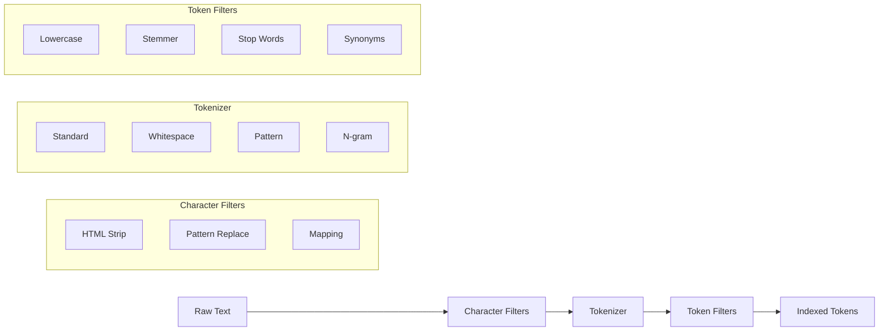

# How to Configure Analyzers in Elasticsearch

Author: [nawazdhandala](https://www.github.com/nawazdhandala)

Tags: Elasticsearch, Analyzers, Text Analysis, Tokenizers, Filters, Search

Description: Learn how to configure and customize Elasticsearch analyzers for optimal text search, covering tokenizers, character filters, token filters, and building custom analysis pipelines.

---

> Analyzers are the secret sauce behind Elasticsearch's powerful text search. They transform raw text into searchable tokens through a pipeline of character filters, tokenizers, and token filters. Understanding how to configure analyzers is essential for building search that actually works for your users.

This guide shows you how analyzers work and how to customize them for your specific search requirements.

---

## Prerequisites

Before starting, ensure you have:
- Elasticsearch 8.x running
- Basic understanding of mappings
- curl or Kibana Dev Tools

---

## How Analyzers Work

An analyzer processes text through three stages:



Let's see this in action:

```bash
# Test the standard analyzer
curl -X POST "localhost:9200/_analyze?pretty" -H 'Content-Type: application/json' -d'
{
  "analyzer": "standard",
  "text": "The Quick Brown Fox-Jumps over the lazy DOG!"
}'

# Output: [the, quick, brown, fox, jumps, over, the, lazy, dog]
```

---

## Built-in Analyzers

Elasticsearch provides several pre-configured analyzers:

```bash
# Standard analyzer - default, good for most languages
curl -X POST "localhost:9200/_analyze?pretty" -H 'Content-Type: application/json' -d'
{
  "analyzer": "standard",
  "text": "The 2 QUICK Brown-Foxes jumped over the lazy dog"
}'

# Simple analyzer - splits on non-letters, lowercases
curl -X POST "localhost:9200/_analyze?pretty" -H 'Content-Type: application/json' -d'
{
  "analyzer": "simple",
  "text": "The 2 QUICK Brown-Foxes jumped over the lazy dog"
}'

# Whitespace analyzer - splits only on whitespace
curl -X POST "localhost:9200/_analyze?pretty" -H 'Content-Type: application/json' -d'
{
  "analyzer": "whitespace",
  "text": "The 2 QUICK Brown-Foxes jumped over the lazy dog"
}'

# Keyword analyzer - no tokenization, treats entire input as single token
curl -X POST "localhost:9200/_analyze?pretty" -H 'Content-Type: application/json' -d'
{
  "analyzer": "keyword",
  "text": "The 2 QUICK Brown-Foxes"
}'

# English analyzer - with stemming and stop words
curl -X POST "localhost:9200/_analyze?pretty" -H 'Content-Type: application/json' -d'
{
  "analyzer": "english",
  "text": "The foxes were running quickly through the forest"
}'
# Output: [foxes, run, quick, through, forest] - "the", "were" removed, "running" stemmed to "run"
```

---

## Character Filters

Character filters transform the raw text before tokenization:

```bash
# HTML strip - removes HTML tags
curl -X POST "localhost:9200/_analyze?pretty" -H 'Content-Type: application/json' -d'
{
  "char_filter": ["html_strip"],
  "tokenizer": "standard",
  "text": "<p>Hello <b>World</b>!</p>"
}'
# Output: [Hello, World]

# Pattern replace - use regex to transform text
curl -X PUT "localhost:9200/test_index" -H 'Content-Type: application/json' -d'
{
  "settings": {
    "analysis": {
      "char_filter": {
        "phone_number_filter": {
          "type": "pattern_replace",
          "pattern": "[^0-9]",
          "replacement": ""
        }
      },
      "analyzer": {
        "phone_analyzer": {
          "tokenizer": "keyword",
          "char_filter": ["phone_number_filter"]
        }
      }
    }
  }
}'

# Test the phone analyzer
curl -X POST "localhost:9200/test_index/_analyze?pretty" -H 'Content-Type: application/json' -d'
{
  "analyzer": "phone_analyzer",
  "text": "(555) 123-4567"
}'
# Output: [5551234567]

# Mapping char filter - replace specific characters
curl -X PUT "localhost:9200/emoji_index" -H 'Content-Type: application/json' -d'
{
  "settings": {
    "analysis": {
      "char_filter": {
        "emoji_filter": {
          "type": "mapping",
          "mappings": [
            ":) => happy",
            ":( => sad",
            "<3 => love",
            ":D => excited"
          ]
        }
      },
      "analyzer": {
        "emoji_analyzer": {
          "tokenizer": "standard",
          "char_filter": ["emoji_filter"]
        }
      }
    }
  }
}'

curl -X POST "localhost:9200/emoji_index/_analyze?pretty" -H 'Content-Type: application/json' -d'
{
  "analyzer": "emoji_analyzer",
  "text": "I love this :) <3"
}'
# Output: [I, love, this, happy, love]
```

---

## Tokenizers

Tokenizers split text into tokens:

```bash
# Standard tokenizer - splits on word boundaries
curl -X POST "localhost:9200/_analyze?pretty" -H 'Content-Type: application/json' -d'
{
  "tokenizer": "standard",
  "text": "john.doe@example.com visited https://example.com"
}'

# UAX URL Email tokenizer - preserves URLs and emails
curl -X POST "localhost:9200/_analyze?pretty" -H 'Content-Type: application/json' -d'
{
  "tokenizer": "uax_url_email",
  "text": "john.doe@example.com visited https://example.com"
}'

# Pattern tokenizer - split on custom pattern
curl -X PUT "localhost:9200/pattern_index" -H 'Content-Type: application/json' -d'
{
  "settings": {
    "analysis": {
      "tokenizer": {
        "comma_tokenizer": {
          "type": "pattern",
          "pattern": ","
        }
      },
      "analyzer": {
        "csv_analyzer": {
          "tokenizer": "comma_tokenizer",
          "filter": ["trim", "lowercase"]
        }
      }
    }
  }
}'

curl -X POST "localhost:9200/pattern_index/_analyze?pretty" -H 'Content-Type: application/json' -d'
{
  "analyzer": "csv_analyzer",
  "text": "Apple, Banana, Cherry"
}'

# N-gram tokenizer - for substring matching
curl -X PUT "localhost:9200/ngram_index" -H 'Content-Type: application/json' -d'
{
  "settings": {
    "analysis": {
      "tokenizer": {
        "ngram_tokenizer": {
          "type": "ngram",
          "min_gram": 2,
          "max_gram": 4,
          "token_chars": ["letter", "digit"]
        }
      },
      "analyzer": {
        "ngram_analyzer": {
          "tokenizer": "ngram_tokenizer",
          "filter": ["lowercase"]
        }
      }
    }
  }
}'

# Edge n-gram - for autocomplete
curl -X PUT "localhost:9200/autocomplete_index" -H 'Content-Type: application/json' -d'
{
  "settings": {
    "analysis": {
      "tokenizer": {
        "edge_ngram_tokenizer": {
          "type": "edge_ngram",
          "min_gram": 1,
          "max_gram": 20,
          "token_chars": ["letter", "digit"]
        }
      },
      "analyzer": {
        "autocomplete_analyzer": {
          "tokenizer": "edge_ngram_tokenizer",
          "filter": ["lowercase"]
        }
      }
    }
  }
}'

curl -X POST "localhost:9200/autocomplete_index/_analyze?pretty" -H 'Content-Type: application/json' -d'
{
  "analyzer": "autocomplete_analyzer",
  "text": "Search"
}'
# Output: [s, se, sea, sear, searc, search]
```

---

## Token Filters

Token filters transform the tokens produced by the tokenizer:

```bash
# Lowercase filter
curl -X POST "localhost:9200/_analyze?pretty" -H 'Content-Type: application/json' -d'
{
  "tokenizer": "standard",
  "filter": ["lowercase"],
  "text": "HELLO World"
}'

# Stop words filter
curl -X POST "localhost:9200/_analyze?pretty" -H 'Content-Type: application/json' -d'
{
  "tokenizer": "standard",
  "filter": ["lowercase", "stop"],
  "text": "The quick brown fox jumps over the lazy dog"
}'

# Stemmer filter
curl -X POST "localhost:9200/_analyze?pretty" -H 'Content-Type: application/json' -d'
{
  "tokenizer": "standard",
  "filter": ["lowercase", "porter_stem"],
  "text": "running runs runner"
}'
# Output: [run, run, runner]

# ASCII folding - remove accents
curl -X POST "localhost:9200/_analyze?pretty" -H 'Content-Type: application/json' -d'
{
  "tokenizer": "standard",
  "filter": ["lowercase", "asciifolding"],
  "text": "Cafe resume naive"
}'
# Also handles: cafe, resume, naive

# Synonym filter
curl -X PUT "localhost:9200/synonym_index" -H 'Content-Type: application/json' -d'
{
  "settings": {
    "analysis": {
      "filter": {
        "my_synonyms": {
          "type": "synonym",
          "synonyms": [
            "quick, fast, speedy",
            "big, large, huge",
            "laptop, notebook => computer"
          ]
        }
      },
      "analyzer": {
        "synonym_analyzer": {
          "tokenizer": "standard",
          "filter": ["lowercase", "my_synonyms"]
        }
      }
    }
  }
}'

curl -X POST "localhost:9200/synonym_index/_analyze?pretty" -H 'Content-Type: application/json' -d'
{
  "analyzer": "synonym_analyzer",
  "text": "quick laptop"
}'
# Output: [quick, fast, speedy, computer]
```

---

## Building Custom Analyzers

Combine components to create analyzers tailored to your needs:

```bash
# E-commerce product search analyzer
curl -X PUT "localhost:9200/products" -H 'Content-Type: application/json' -d'
{
  "settings": {
    "analysis": {
      "char_filter": {
        "ampersand_filter": {
          "type": "mapping",
          "mappings": ["& => and"]
        }
      },
      "filter": {
        "english_stop": {
          "type": "stop",
          "stopwords": "_english_"
        },
        "english_stemmer": {
          "type": "stemmer",
          "language": "english"
        },
        "product_synonyms": {
          "type": "synonym",
          "synonyms": [
            "tv, television",
            "phone, mobile, smartphone",
            "laptop, notebook, computer"
          ]
        },
        "min_length": {
          "type": "length",
          "min": 2
        }
      },
      "analyzer": {
        "product_analyzer": {
          "type": "custom",
          "char_filter": ["html_strip", "ampersand_filter"],
          "tokenizer": "standard",
          "filter": [
            "lowercase",
            "asciifolding",
            "english_stop",
            "min_length",
            "product_synonyms",
            "english_stemmer"
          ]
        },
        "product_search_analyzer": {
          "type": "custom",
          "tokenizer": "standard",
          "filter": [
            "lowercase",
            "asciifolding",
            "product_synonyms"
          ]
        }
      }
    }
  },
  "mappings": {
    "properties": {
      "name": {
        "type": "text",
        "analyzer": "product_analyzer",
        "search_analyzer": "product_search_analyzer"
      },
      "description": {
        "type": "text",
        "analyzer": "product_analyzer",
        "search_analyzer": "product_search_analyzer"
      }
    }
  }
}'

# Test the analyzer
curl -X POST "localhost:9200/products/_analyze?pretty" -H 'Content-Type: application/json' -d'
{
  "analyzer": "product_analyzer",
  "text": "Samsung 55\" Smart TV & Sound Bar"
}'
```

---

## Language-Specific Analyzers

Configure analyzers for different languages:

```bash
# Multi-language index
curl -X PUT "localhost:9200/multilang" -H 'Content-Type: application/json' -d'
{
  "settings": {
    "analysis": {
      "analyzer": {
        "german_custom": {
          "type": "custom",
          "tokenizer": "standard",
          "filter": [
            "lowercase",
            "german_stop",
            "german_normalization",
            "german_stemmer"
          ]
        },
        "french_custom": {
          "type": "custom",
          "tokenizer": "standard",
          "filter": [
            "lowercase",
            "french_elision",
            "french_stop",
            "french_stemmer"
          ]
        },
        "spanish_custom": {
          "type": "custom",
          "tokenizer": "standard",
          "filter": [
            "lowercase",
            "spanish_stop",
            "spanish_stemmer"
          ]
        }
      },
      "filter": {
        "german_stop": {
          "type": "stop",
          "stopwords": "_german_"
        },
        "german_stemmer": {
          "type": "stemmer",
          "language": "light_german"
        },
        "french_elision": {
          "type": "elision",
          "articles_case": true,
          "articles": ["l", "m", "t", "qu", "n", "s", "j", "d", "c"]
        },
        "french_stop": {
          "type": "stop",
          "stopwords": "_french_"
        },
        "french_stemmer": {
          "type": "stemmer",
          "language": "light_french"
        },
        "spanish_stop": {
          "type": "stop",
          "stopwords": "_spanish_"
        },
        "spanish_stemmer": {
          "type": "stemmer",
          "language": "light_spanish"
        }
      }
    }
  },
  "mappings": {
    "properties": {
      "content_en": {
        "type": "text",
        "analyzer": "english"
      },
      "content_de": {
        "type": "text",
        "analyzer": "german_custom"
      },
      "content_fr": {
        "type": "text",
        "analyzer": "french_custom"
      },
      "content_es": {
        "type": "text",
        "analyzer": "spanish_custom"
      }
    }
  }
}'
```

---

## Normalizers for Keywords

Normalizers apply transformations to keyword fields:

```bash
curl -X PUT "localhost:9200/normalized_index" -H 'Content-Type: application/json' -d'
{
  "settings": {
    "analysis": {
      "normalizer": {
        "lowercase_normalizer": {
          "type": "custom",
          "filter": ["lowercase", "asciifolding"]
        }
      }
    }
  },
  "mappings": {
    "properties": {
      "category": {
        "type": "keyword",
        "normalizer": "lowercase_normalizer"
      },
      "sku": {
        "type": "keyword"
      }
    }
  }
}'

# Now "Electronics" and "electronics" will match
curl -X POST "localhost:9200/normalized_index/_doc" -H 'Content-Type: application/json' -d'
{
  "category": "Electronics",
  "sku": "ABC-123"
}'

curl -X GET "localhost:9200/normalized_index/_search?pretty" -H 'Content-Type: application/json' -d'
{
  "query": {
    "term": {
      "category": "electronics"
    }
  }
}'
```

---

## Python Analyzer Testing Utility

Here's a utility to test and compare analyzers:

```python
from elasticsearch import Elasticsearch
from typing import List, Dict, Any

class AnalyzerTester:
    def __init__(self, hosts: List[str]):
        self.es = Elasticsearch(hosts)

    def analyze(
        self,
        text: str,
        analyzer: str = "standard",
        index: str = None
    ) -> List[str]:
        """Analyze text and return tokens"""

        body = {
            "analyzer": analyzer,
            "text": text
        }

        if index:
            response = self.es.indices.analyze(index=index, body=body)
        else:
            response = self.es.indices.analyze(body=body)

        return [token["token"] for token in response["tokens"]]

    def analyze_with_details(
        self,
        text: str,
        analyzer: str = "standard",
        index: str = None
    ) -> List[Dict[str, Any]]:
        """Analyze text and return detailed token info"""

        body = {
            "analyzer": analyzer,
            "text": text,
            "explain": True
        }

        if index:
            response = self.es.indices.analyze(index=index, body=body)
        else:
            response = self.es.indices.analyze(body=body)

        return response.get("detail", {}).get("tokenizer", {}).get("tokens", [])

    def compare_analyzers(
        self,
        text: str,
        analyzers: List[str],
        index: str = None
    ) -> Dict[str, List[str]]:
        """Compare how different analyzers tokenize the same text"""

        results = {}
        for analyzer in analyzers:
            try:
                results[analyzer] = self.analyze(text, analyzer, index)
            except Exception as e:
                results[analyzer] = [f"Error: {str(e)}"]

        return results

    def test_custom_analyzer(
        self,
        text: str,
        tokenizer: str,
        char_filters: List[str] = None,
        token_filters: List[str] = None
    ) -> List[str]:
        """Test a custom analyzer configuration"""

        body = {
            "tokenizer": tokenizer,
            "text": text
        }

        if char_filters:
            body["char_filter"] = char_filters
        if token_filters:
            body["filter"] = token_filters

        response = self.es.indices.analyze(body=body)
        return [token["token"] for token in response["tokens"]]

    def find_analyzer_differences(
        self,
        texts: List[str],
        analyzer1: str,
        analyzer2: str,
        index: str = None
    ) -> List[Dict[str, Any]]:
        """Find texts where two analyzers produce different results"""

        differences = []
        for text in texts:
            tokens1 = self.analyze(text, analyzer1, index)
            tokens2 = self.analyze(text, analyzer2, index)

            if tokens1 != tokens2:
                differences.append({
                    "text": text,
                    analyzer1: tokens1,
                    analyzer2: tokens2
                })

        return differences

    def create_test_index(
        self,
        index_name: str,
        analyzer_config: Dict[str, Any]
    ) -> bool:
        """Create an index with custom analyzer for testing"""

        if self.es.indices.exists(index=index_name):
            self.es.indices.delete(index=index_name)

        self.es.indices.create(
            index=index_name,
            body={
                "settings": {
                    "analysis": analyzer_config
                }
            }
        )
        return True


# Usage example
if __name__ == "__main__":
    tester = AnalyzerTester(["localhost:9200"])

    test_text = "The Quick Brown Foxes jumped over the lazy dogs"

    # Compare built-in analyzers
    print("Analyzer Comparison:")
    print("-" * 50)

    comparison = tester.compare_analyzers(
        test_text,
        ["standard", "simple", "whitespace", "english"]
    )

    for analyzer, tokens in comparison.items():
        print(f"\n{analyzer}:")
        print(f"  {tokens}")

    # Test custom configuration
    print("\n\nCustom Analyzer Test:")
    print("-" * 50)

    custom_tokens = tester.test_custom_analyzer(
        "Running runners run quickly",
        tokenizer="standard",
        token_filters=["lowercase", "porter_stem"]
    )
    print(f"With stemming: {custom_tokens}")

    # Create index with custom analyzer and test
    print("\n\nCustom Index Analyzer:")
    print("-" * 50)

    analyzer_config = {
        "analyzer": {
            "my_analyzer": {
                "type": "custom",
                "tokenizer": "standard",
                "filter": ["lowercase", "asciifolding", "porter_stem"]
            }
        }
    }

    tester.create_test_index("analyzer_test", analyzer_config)
    tokens = tester.analyze("Cafe running dogs", "my_analyzer", "analyzer_test")
    print(f"My analyzer: {tokens}")
```

---

## Best Practices

**Analyzer Selection:**
- Use language-specific analyzers when you know the content language
- Test your analyzers with real queries before deployment
- Consider using different analyzers for indexing vs searching

**Performance:**
- Keep token filters to a minimum for better indexing speed
- Avoid expensive filters like shingles on large fields
- Use keyword type when you don't need analysis

**Search Quality:**
- Use synonyms carefully as they can reduce precision
- Test stemmer aggressiveness for your domain
- Consider edge n-grams for autocomplete instead of wildcards

**Maintenance:**
- Document your custom analyzers
- Version your synonym files
- Test analyzer changes with a subset of data first

---

## Conclusion

Analyzers are the bridge between raw text and searchable tokens. Understanding how to configure them lets you build search experiences tailored to your specific needs. Key takeaways:

- Character filters transform text before tokenization
- Tokenizers split text into tokens
- Token filters transform the resulting tokens
- Different use cases require different analyzer configurations

Take time to test your analyzers with real queries. The right analyzer configuration can make the difference between search that frustrates users and search that delights them.

---

*Want to monitor your Elasticsearch search quality? [OneUptime](https://oneuptime.com) provides observability for your entire search infrastructure.*
