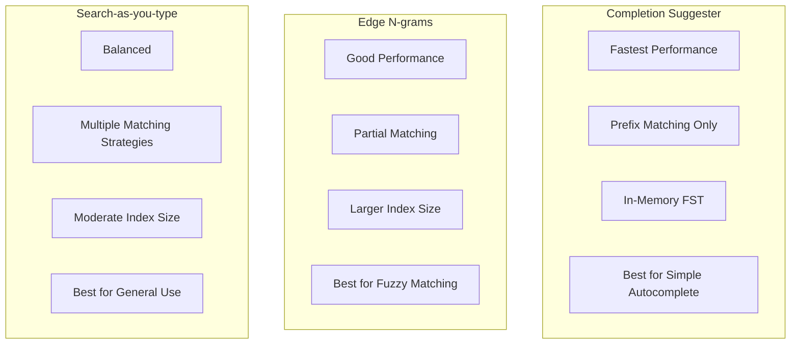

# How to Implement Autocomplete in Elasticsearch

Author: [nawazdhandala](https://www.github.com/nawazdhandala)

Tags: Elasticsearch, Autocomplete, Search, Completion Suggester, Type-ahead, UX

Description: Learn how to implement fast and accurate autocomplete functionality in Elasticsearch using completion suggesters, edge n-grams, and search-as-you-type fields for optimal user experience.

---

> Autocomplete is one of the most important search UX features. Users expect instant suggestions as they type, helping them find what they're looking for faster. Elasticsearch provides several approaches to implement autocomplete, each with different trade-offs. This guide covers the most effective methods.

We'll explore three main approaches: completion suggesters for pure prefix matching, edge n-grams for flexible partial matching, and the search-as-you-type field for a balanced solution.

---

## Prerequisites

Before starting, ensure you have:
- Elasticsearch 8.x running
- Basic understanding of mappings and analyzers
- curl or Kibana Dev Tools

---

## Approach Comparison



---

## Method 1: Completion Suggester

The completion suggester is optimized for speed using an in-memory finite state transducer (FST). It's the fastest option for prefix-based autocomplete.

### Index Setup

```bash
# Create index with completion field
curl -X PUT "localhost:9200/products_suggest" -H 'Content-Type: application/json' -d'
{
  "mappings": {
    "properties": {
      "name": {
        "type": "text"
      },
      "name_suggest": {
        "type": "completion",
        "analyzer": "simple",
        "preserve_separators": true,
        "preserve_position_increments": true,
        "max_input_length": 50
      },
      "category": {
        "type": "keyword"
      },
      "popularity": {
        "type": "integer"
      }
    }
  }
}'

# Index products with suggestions
curl -X POST "localhost:9200/products_suggest/_bulk" -H 'Content-Type: application/json' -d'
{"index": {}}
{"name": "iPhone 15 Pro", "name_suggest": {"input": ["iPhone 15 Pro", "iPhone", "Apple iPhone"], "weight": 100}, "category": "Electronics", "popularity": 95}
{"index": {}}
{"name": "iPhone 15", "name_suggest": {"input": ["iPhone 15", "iPhone", "Apple iPhone"], "weight": 90}, "category": "Electronics", "popularity": 90}
{"index": {}}
{"name": "iPad Pro 12.9", "name_suggest": {"input": ["iPad Pro", "iPad", "Apple iPad"], "weight": 85}, "category": "Electronics", "popularity": 85}
{"index": {}}
{"name": "MacBook Pro 16", "name_suggest": {"input": ["MacBook Pro", "MacBook", "Apple MacBook", "Laptop"], "weight": 80}, "category": "Electronics", "popularity": 80}
{"index": {}}
{"name": "Samsung Galaxy S24", "name_suggest": {"input": ["Samsung Galaxy", "Galaxy S24", "Samsung"], "weight": 75}, "category": "Electronics", "popularity": 75}
{"index": {}}
{"name": "Sony WH-1000XM5", "name_suggest": {"input": ["Sony Headphones", "WH-1000XM5", "Sony"], "weight": 70}, "category": "Audio", "popularity": 70}
'
```

### Querying with Completion Suggester

```bash
# Basic completion suggestion
curl -X GET "localhost:9200/products_suggest/_search?pretty" -H 'Content-Type: application/json' -d'
{
  "suggest": {
    "product_suggest": {
      "prefix": "iph",
      "completion": {
        "field": "name_suggest",
        "size": 5,
        "skip_duplicates": true
      }
    }
  }
}'

# Completion with fuzzy matching (handles typos)
curl -X GET "localhost:9200/products_suggest/_search?pretty" -H 'Content-Type: application/json' -d'
{
  "suggest": {
    "product_suggest": {
      "prefix": "iphon",
      "completion": {
        "field": "name_suggest",
        "size": 5,
        "fuzzy": {
          "fuzziness": "AUTO"
        }
      }
    }
  }
}'

# Completion with category filter using contexts
curl -X GET "localhost:9200/products_suggest/_search?pretty" -H 'Content-Type: application/json' -d'
{
  "suggest": {
    "product_suggest": {
      "prefix": "mac",
      "completion": {
        "field": "name_suggest",
        "size": 5,
        "contexts": {
          "category": ["Electronics"]
        }
      }
    }
  }
}'
```

### Completion with Contexts

Add category context for filtered suggestions:

```bash
# Create index with context-aware completion
curl -X PUT "localhost:9200/products_context" -H 'Content-Type: application/json' -d'
{
  "mappings": {
    "properties": {
      "name": {
        "type": "text"
      },
      "suggest": {
        "type": "completion",
        "contexts": [
          {
            "name": "category",
            "type": "category"
          },
          {
            "name": "location",
            "type": "geo",
            "precision": 4
          }
        ]
      }
    }
  }
}'

# Index with contexts
curl -X POST "localhost:9200/products_context/_doc" -H 'Content-Type: application/json' -d'
{
  "name": "iPhone 15 Pro",
  "suggest": {
    "input": "iPhone 15 Pro",
    "contexts": {
      "category": ["Electronics", "Phones"],
      "location": {"lat": 40.7128, "lon": -74.0060}
    }
  }
}'
```

---

## Method 2: Edge N-grams

Edge n-grams create tokens from the beginning of each word, enabling partial matching with regular queries.

### Index Setup

```bash
# Create index with edge n-gram analyzer
curl -X PUT "localhost:9200/products_ngram" -H 'Content-Type: application/json' -d'
{
  "settings": {
    "analysis": {
      "filter": {
        "edge_ngram_filter": {
          "type": "edge_ngram",
          "min_gram": 1,
          "max_gram": 20
        }
      },
      "analyzer": {
        "autocomplete_index": {
          "type": "custom",
          "tokenizer": "standard",
          "filter": [
            "lowercase",
            "edge_ngram_filter"
          ]
        },
        "autocomplete_search": {
          "type": "custom",
          "tokenizer": "standard",
          "filter": [
            "lowercase"
          ]
        }
      }
    }
  },
  "mappings": {
    "properties": {
      "name": {
        "type": "text",
        "analyzer": "autocomplete_index",
        "search_analyzer": "autocomplete_search"
      },
      "name_exact": {
        "type": "keyword"
      },
      "category": {
        "type": "keyword"
      },
      "popularity": {
        "type": "integer"
      }
    }
  }
}'

# Test the analyzer
curl -X POST "localhost:9200/products_ngram/_analyze?pretty" -H 'Content-Type: application/json' -d'
{
  "analyzer": "autocomplete_index",
  "text": "iPhone"
}'
# Output: [i, ip, iph, ipho, iphon, iphone]

# Index products
curl -X POST "localhost:9200/products_ngram/_bulk" -H 'Content-Type: application/json' -d'
{"index": {}}
{"name": "iPhone 15 Pro", "name_exact": "iPhone 15 Pro", "category": "Electronics", "popularity": 95}
{"index": {}}
{"name": "iPhone 15", "name_exact": "iPhone 15", "category": "Electronics", "popularity": 90}
{"index": {}}
{"name": "iPad Pro 12.9", "name_exact": "iPad Pro 12.9", "category": "Electronics", "popularity": 85}
{"index": {}}
{"name": "MacBook Pro 16", "name_exact": "MacBook Pro 16", "category": "Electronics", "popularity": 80}
{"index": {}}
{"name": "Samsung Galaxy S24", "name_exact": "Samsung Galaxy S24", "category": "Electronics", "popularity": 75}
'
```

### Querying Edge N-grams

```bash
# Simple autocomplete query
curl -X GET "localhost:9200/products_ngram/_search?pretty" -H 'Content-Type: application/json' -d'
{
  "query": {
    "match": {
      "name": {
        "query": "iph",
        "operator": "and"
      }
    }
  },
  "sort": [
    { "popularity": "desc" }
  ],
  "size": 5
}'

# Autocomplete with boosting exact matches
curl -X GET "localhost:9200/products_ngram/_search?pretty" -H 'Content-Type: application/json' -d'
{
  "query": {
    "bool": {
      "should": [
        {
          "match": {
            "name": {
              "query": "iphone",
              "boost": 1
            }
          }
        },
        {
          "match_phrase_prefix": {
            "name_exact": {
              "query": "iphone",
              "boost": 2
            }
          }
        }
      ]
    }
  },
  "sort": [
    "_score",
    { "popularity": "desc" }
  ],
  "size": 5
}'
```

---

## Method 3: Search-as-you-type Field

The search_as_you_type field type is purpose-built for autocomplete, automatically creating optimized subfields.

### Index Setup

```bash
# Create index with search-as-you-type
curl -X PUT "localhost:9200/products_sayt" -H 'Content-Type: application/json' -d'
{
  "mappings": {
    "properties": {
      "name": {
        "type": "search_as_you_type",
        "max_shingle_size": 3
      },
      "description": {
        "type": "text"
      },
      "category": {
        "type": "keyword"
      },
      "popularity": {
        "type": "integer"
      },
      "price": {
        "type": "float"
      }
    }
  }
}'

# Index products
curl -X POST "localhost:9200/products_sayt/_bulk" -H 'Content-Type: application/json' -d'
{"index": {}}
{"name": "iPhone 15 Pro Max", "description": "Latest Apple smartphone", "category": "Electronics", "popularity": 95, "price": 1199}
{"index": {}}
{"name": "iPhone 15 Pro", "description": "Pro Apple smartphone", "category": "Electronics", "popularity": 90, "price": 999}
{"index": {}}
{"name": "iPhone 15", "description": "Apple smartphone", "category": "Electronics", "popularity": 85, "price": 799}
{"index": {}}
{"name": "iPad Pro 12.9 inch", "description": "Apple tablet", "category": "Electronics", "popularity": 80, "price": 1099}
{"index": {}}
{"name": "MacBook Pro 16 inch", "description": "Apple laptop", "category": "Electronics", "popularity": 75, "price": 2499}
{"index": {}}
{"name": "Samsung Galaxy S24 Ultra", "description": "Samsung flagship", "category": "Electronics", "popularity": 70, "price": 1299}
'
```

### Querying Search-as-you-type

```bash
# Multi-match across all generated fields
curl -X GET "localhost:9200/products_sayt/_search?pretty" -H 'Content-Type: application/json' -d'
{
  "query": {
    "multi_match": {
      "query": "iphone 15",
      "type": "bool_prefix",
      "fields": [
        "name",
        "name._2gram",
        "name._3gram",
        "name._index_prefix"
      ]
    }
  },
  "size": 5
}'

# With highlighting
curl -X GET "localhost:9200/products_sayt/_search?pretty" -H 'Content-Type: application/json' -d'
{
  "query": {
    "multi_match": {
      "query": "mac pro",
      "type": "bool_prefix",
      "fields": [
        "name",
        "name._2gram",
        "name._3gram",
        "name._index_prefix"
      ]
    }
  },
  "highlight": {
    "fields": {
      "name": {}
    }
  },
  "size": 5
}'

# Combined with filters
curl -X GET "localhost:9200/products_sayt/_search?pretty" -H 'Content-Type: application/json' -d'
{
  "query": {
    "bool": {
      "must": [
        {
          "multi_match": {
            "query": "pro",
            "type": "bool_prefix",
            "fields": [
              "name",
              "name._2gram",
              "name._3gram",
              "name._index_prefix"
            ]
          }
        }
      ],
      "filter": [
        { "term": { "category": "Electronics" } },
        { "range": { "price": { "lte": 1500 } } }
      ]
    }
  },
  "sort": [
    "_score",
    { "popularity": "desc" }
  ],
  "size": 5
}'
```

---

## Python Autocomplete Service

Here's a complete autocomplete service implementation:

```python
from elasticsearch import Elasticsearch
from typing import List, Dict, Any, Optional
from dataclasses import dataclass
from enum import Enum

class AutocompleteMethod(Enum):
    COMPLETION = "completion"
    NGRAM = "ngram"
    SEARCH_AS_YOU_TYPE = "sayt"

@dataclass
class Suggestion:
    text: str
    score: float
    category: Optional[str] = None
    metadata: Optional[Dict[str, Any]] = None

class AutocompleteService:
    def __init__(self, hosts: List[str]):
        self.es = Elasticsearch(hosts)

    def setup_completion_index(self, index_name: str) -> bool:
        """Create index with completion suggester"""

        if self.es.indices.exists(index=index_name):
            self.es.indices.delete(index=index_name)

        self.es.indices.create(
            index=index_name,
            body={
                "mappings": {
                    "properties": {
                        "name": {"type": "text"},
                        "suggest": {
                            "type": "completion",
                            "analyzer": "simple",
                            "contexts": [
                                {"name": "category", "type": "category"}
                            ]
                        },
                        "category": {"type": "keyword"},
                        "popularity": {"type": "integer"}
                    }
                }
            }
        )
        return True

    def setup_ngram_index(self, index_name: str) -> bool:
        """Create index with edge n-gram analyzer"""

        if self.es.indices.exists(index=index_name):
            self.es.indices.delete(index=index_name)

        self.es.indices.create(
            index=index_name,
            body={
                "settings": {
                    "analysis": {
                        "filter": {
                            "edge_ngram_filter": {
                                "type": "edge_ngram",
                                "min_gram": 1,
                                "max_gram": 20
                            }
                        },
                        "analyzer": {
                            "autocomplete_index": {
                                "type": "custom",
                                "tokenizer": "standard",
                                "filter": ["lowercase", "edge_ngram_filter"]
                            },
                            "autocomplete_search": {
                                "type": "custom",
                                "tokenizer": "standard",
                                "filter": ["lowercase"]
                            }
                        }
                    }
                },
                "mappings": {
                    "properties": {
                        "name": {
                            "type": "text",
                            "analyzer": "autocomplete_index",
                            "search_analyzer": "autocomplete_search"
                        },
                        "category": {"type": "keyword"},
                        "popularity": {"type": "integer"}
                    }
                }
            }
        )
        return True

    def setup_sayt_index(self, index_name: str) -> bool:
        """Create index with search-as-you-type field"""

        if self.es.indices.exists(index=index_name):
            self.es.indices.delete(index=index_name)

        self.es.indices.create(
            index=index_name,
            body={
                "mappings": {
                    "properties": {
                        "name": {
                            "type": "search_as_you_type",
                            "max_shingle_size": 3
                        },
                        "category": {"type": "keyword"},
                        "popularity": {"type": "integer"}
                    }
                }
            }
        )
        return True

    def index_document(
        self,
        index_name: str,
        name: str,
        category: str,
        popularity: int,
        method: AutocompleteMethod
    ) -> bool:
        """Index a document for autocomplete"""

        if method == AutocompleteMethod.COMPLETION:
            doc = {
                "name": name,
                "suggest": {
                    "input": self._generate_inputs(name),
                    "weight": popularity,
                    "contexts": {"category": [category]}
                },
                "category": category,
                "popularity": popularity
            }
        else:
            doc = {
                "name": name,
                "category": category,
                "popularity": popularity
            }

        self.es.index(index=index_name, body=doc)
        return True

    def _generate_inputs(self, name: str) -> List[str]:
        """Generate multiple input variations for completion"""

        inputs = [name]
        words = name.split()

        # Add individual words
        inputs.extend(words)

        # Add bigrams
        for i in range(len(words) - 1):
            inputs.append(f"{words[i]} {words[i+1]}")

        return list(set(inputs))

    def suggest_completion(
        self,
        index_name: str,
        prefix: str,
        size: int = 5,
        category: str = None,
        fuzzy: bool = False
    ) -> List[Suggestion]:
        """Get suggestions using completion suggester"""

        completion_config = {
            "field": "suggest",
            "size": size,
            "skip_duplicates": True
        }

        if fuzzy:
            completion_config["fuzzy"] = {"fuzziness": "AUTO"}

        if category:
            completion_config["contexts"] = {"category": [category]}

        response = self.es.search(
            index=index_name,
            body={
                "suggest": {
                    "autocomplete": {
                        "prefix": prefix,
                        "completion": completion_config
                    }
                }
            }
        )

        suggestions = []
        for option in response["suggest"]["autocomplete"][0]["options"]:
            suggestions.append(Suggestion(
                text=option["text"],
                score=option["_score"],
                category=option["_source"].get("category"),
                metadata={"popularity": option["_source"].get("popularity")}
            ))

        return suggestions

    def suggest_ngram(
        self,
        index_name: str,
        query: str,
        size: int = 5,
        category: str = None
    ) -> List[Suggestion]:
        """Get suggestions using edge n-gram matching"""

        bool_query = {
            "must": [
                {"match": {"name": {"query": query, "operator": "and"}}}
            ]
        }

        if category:
            bool_query["filter"] = [{"term": {"category": category}}]

        response = self.es.search(
            index=index_name,
            body={
                "query": {"bool": bool_query},
                "sort": [
                    "_score",
                    {"popularity": "desc"}
                ],
                "size": size,
                "_source": ["name", "category", "popularity"]
            }
        )

        return [
            Suggestion(
                text=hit["_source"]["name"],
                score=hit["_score"],
                category=hit["_source"].get("category"),
                metadata={"popularity": hit["_source"].get("popularity")}
            )
            for hit in response["hits"]["hits"]
        ]

    def suggest_sayt(
        self,
        index_name: str,
        query: str,
        size: int = 5,
        category: str = None
    ) -> List[Suggestion]:
        """Get suggestions using search-as-you-type"""

        must_clause = {
            "multi_match": {
                "query": query,
                "type": "bool_prefix",
                "fields": [
                    "name",
                    "name._2gram",
                    "name._3gram",
                    "name._index_prefix"
                ]
            }
        }

        bool_query = {"must": [must_clause]}

        if category:
            bool_query["filter"] = [{"term": {"category": category}}]

        response = self.es.search(
            index=index_name,
            body={
                "query": {"bool": bool_query},
                "sort": [
                    "_score",
                    {"popularity": "desc"}
                ],
                "size": size,
                "_source": ["name", "category", "popularity"]
            }
        )

        return [
            Suggestion(
                text=hit["_source"]["name"],
                score=hit["_score"],
                category=hit["_source"].get("category"),
                metadata={"popularity": hit["_source"].get("popularity")}
            )
            for hit in response["hits"]["hits"]
        ]

    def suggest(
        self,
        index_name: str,
        query: str,
        method: AutocompleteMethod,
        size: int = 5,
        category: str = None,
        fuzzy: bool = False
    ) -> List[Suggestion]:
        """Universal suggest method"""

        if method == AutocompleteMethod.COMPLETION:
            return self.suggest_completion(
                index_name, query, size, category, fuzzy
            )
        elif method == AutocompleteMethod.NGRAM:
            return self.suggest_ngram(
                index_name, query, size, category
            )
        else:
            return self.suggest_sayt(
                index_name, query, size, category
            )


# Usage example
if __name__ == "__main__":
    service = AutocompleteService(["http://localhost:9200"])

    # Setup and populate indices
    products = [
        ("iPhone 15 Pro Max", "Electronics", 100),
        ("iPhone 15 Pro", "Electronics", 95),
        ("iPhone 15", "Electronics", 90),
        ("iPad Pro 12.9", "Electronics", 85),
        ("MacBook Pro 16", "Electronics", 80),
        ("Samsung Galaxy S24", "Electronics", 75),
        ("Sony WH-1000XM5", "Audio", 70),
    ]

    # Test completion suggester
    print("Setting up completion index...")
    service.setup_completion_index("products_completion")
    for name, cat, pop in products:
        service.index_document(
            "products_completion", name, cat, pop,
            AutocompleteMethod.COMPLETION
        )

    print("\nCompletion suggestions for 'iph':")
    for s in service.suggest_completion("products_completion", "iph"):
        print(f"  {s.text} (score: {s.score})")

    # Test search-as-you-type
    print("\nSetting up search-as-you-type index...")
    service.setup_sayt_index("products_sayt")
    for name, cat, pop in products:
        service.index_document(
            "products_sayt", name, cat, pop,
            AutocompleteMethod.SEARCH_AS_YOU_TYPE
        )

    # Wait for indexing
    service.es.indices.refresh(index="products_sayt")

    print("\nSearch-as-you-type suggestions for 'mac pro':")
    for s in service.suggest_sayt("products_sayt", "mac pro"):
        print(f"  {s.text} (score: {s.score:.2f})")
```

---

## Best Practices

**Choosing the Right Method:**
- Use completion suggester for pure speed with prefix matching
- Use edge n-grams when you need partial word matching
- Use search-as-you-type for balanced general-purpose autocomplete

**Performance:**
- Keep completion suggester weights updated based on popularity
- Limit edge n-gram max_gram to reduce index size
- Use filters to narrow results before matching

**User Experience:**
- Return results in under 100ms
- Show 5-10 suggestions maximum
- Highlight matched portions
- Consider category grouping

---

## Conclusion

Autocomplete significantly improves search UX when implemented well. Key takeaways:

- Completion suggesters are fastest for prefix matching
- Edge n-grams enable flexible partial matching
- Search-as-you-type provides a balanced approach
- Choose based on your specific requirements

With these techniques, you can build autocomplete that feels instant and helpful to users.

---

*Need to monitor your search performance? [OneUptime](https://oneuptime.com) provides observability for your entire application stack.*
