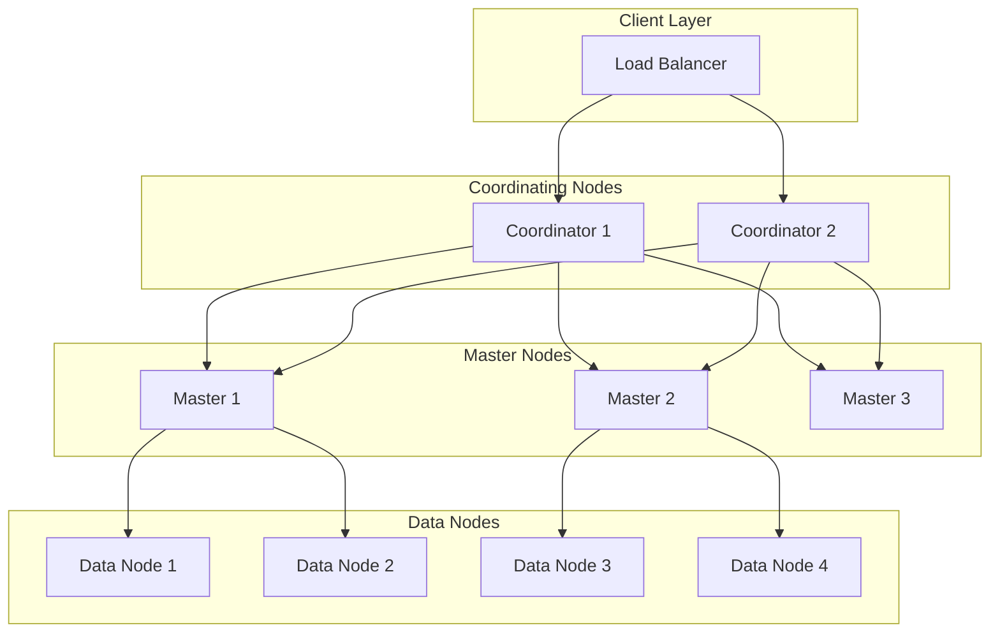

# How to Set Up an Elasticsearch Cluster for Production

Author: [nawazdhandala](https://www.github.com/nawazdhandala)

Tags: Elasticsearch, Search, Cluster, Production, DevOps, Infrastructure

Description: A practical guide to setting up an Elasticsearch cluster for production environments, covering node configuration, cluster topology, hardware requirements, and best practices for reliability and performance.

---

> Setting up Elasticsearch for production requires careful planning around cluster topology, node roles, hardware allocation, and network configuration. A poorly configured cluster can lead to data loss, slow queries, and operational nightmares.

This guide walks you through the essential steps to deploy a production-ready Elasticsearch cluster that can handle real workloads while maintaining high availability.

---

## Prerequisites

Before we begin, ensure you have:
- At least 3 servers for a minimum viable cluster
- Ubuntu 22.04 or RHEL 8+ on each server
- A minimum of 8GB RAM per node (16GB recommended)
- SSD storage for data nodes
- Network connectivity between all nodes

---

## Cluster Topology Overview

A production Elasticsearch cluster should separate node roles for optimal performance and stability. Here's a typical topology:



---

## Step 1: Install Elasticsearch on All Nodes

First, install Elasticsearch on each server. We'll use version 8.x which includes security features by default.

```bash
# Import the Elasticsearch GPG key
wget -qO - https://artifacts.elastic.co/GPG-KEY-elasticsearch | sudo gpg --dearmor -o /usr/share/keyrings/elasticsearch-keyring.gpg

# Add the repository
echo "deb [signed-by=/usr/share/keyrings/elasticsearch-keyring.gpg] https://artifacts.elastic.co/packages/8.x/apt stable main" | sudo tee /etc/apt/sources.list.d/elastic-8.x.list

# Update and install
sudo apt-get update && sudo apt-get install elasticsearch

# Note: Save the generated password for the elastic user shown during installation
```

---

## Step 2: Configure Master Nodes

Master nodes manage cluster state and should be dedicated machines without data responsibilities. Create this configuration on each master node:

```yaml
# /etc/elasticsearch/elasticsearch.yml on master nodes

# Cluster identification - must match across all nodes
cluster.name: production-cluster

# Unique node name - change for each master node
node.name: master-1

# Node role configuration - master-only node
node.roles: [ master ]

# Network settings - bind to all interfaces for cluster communication
network.host: 0.0.0.0

# Port for HTTP API
http.port: 9200

# Port for inter-node communication
transport.port: 9300

# Discovery settings - list all master-eligible nodes
discovery.seed_hosts:
  - 192.168.1.10:9300  # master-1
  - 192.168.1.11:9300  # master-2
  - 192.168.1.12:9300  # master-3

# Initial master nodes for bootstrapping - only needed on first start
cluster.initial_master_nodes:
  - master-1
  - master-2
  - master-3

# Prevent split-brain with minimum master nodes
# For 3 master nodes, quorum is 2
discovery.zen.minimum_master_nodes: 2

# Path configuration
path.data: /var/lib/elasticsearch
path.logs: /var/log/elasticsearch

# Memory lock to prevent swapping
bootstrap.memory_lock: true

# Security settings
xpack.security.enabled: true
xpack.security.transport.ssl.enabled: true
xpack.security.transport.ssl.verification_mode: certificate
xpack.security.transport.ssl.keystore.path: elastic-certificates.p12
xpack.security.transport.ssl.truststore.path: elastic-certificates.p12
```

---

## Step 3: Configure Data Nodes

Data nodes store the actual index data and handle search and indexing operations. They need more disk space and memory.

```yaml
# /etc/elasticsearch/elasticsearch.yml on data nodes

cluster.name: production-cluster

# Unique name for each data node
node.name: data-1

# Data node role - handles indexing and search
node.roles: [ data ]

network.host: 0.0.0.0
http.port: 9200
transport.port: 9300

# Point to master nodes for discovery
discovery.seed_hosts:
  - 192.168.1.10:9300
  - 192.168.1.11:9300
  - 192.168.1.12:9300

# Data storage paths - use multiple paths for striping across disks
path.data:
  - /mnt/ssd1/elasticsearch
  - /mnt/ssd2/elasticsearch
path.logs: /var/log/elasticsearch

bootstrap.memory_lock: true

# Security settings - same certificates across cluster
xpack.security.enabled: true
xpack.security.transport.ssl.enabled: true
xpack.security.transport.ssl.verification_mode: certificate
xpack.security.transport.ssl.keystore.path: elastic-certificates.p12
xpack.security.transport.ssl.truststore.path: elastic-certificates.p12
```

---

## Step 4: Configure Coordinating Nodes

Coordinating nodes handle client requests, distribute queries to data nodes, and aggregate results. They should not store data.

```yaml
# /etc/elasticsearch/elasticsearch.yml on coordinating nodes

cluster.name: production-cluster

node.name: coord-1

# Empty roles array makes this a coordinating-only node
node.roles: [ ]

network.host: 0.0.0.0
http.port: 9200
transport.port: 9300

discovery.seed_hosts:
  - 192.168.1.10:9300
  - 192.168.1.11:9300
  - 192.168.1.12:9300

path.data: /var/lib/elasticsearch
path.logs: /var/log/elasticsearch

bootstrap.memory_lock: true

xpack.security.enabled: true
xpack.security.transport.ssl.enabled: true
xpack.security.transport.ssl.verification_mode: certificate
xpack.security.transport.ssl.keystore.path: elastic-certificates.p12
xpack.security.transport.ssl.truststore.path: elastic-certificates.p12
```

---

## Step 5: Configure JVM Memory Settings

Proper heap sizing is critical for Elasticsearch performance. Set the heap to no more than 50% of available RAM, and never exceed 31GB.

```bash
# /etc/elasticsearch/jvm.options.d/heap.options

# Set initial and maximum heap size to the same value
# This prevents expensive heap resizing during operation

# For a node with 32GB RAM, allocate 16GB to heap
-Xms16g
-Xmx16g

# For nodes with less RAM, adjust accordingly
# 8GB RAM node: -Xms4g / -Xmx4g
# 16GB RAM node: -Xms8g / -Xmx8g
```

---

## Step 6: Configure System Settings

Elasticsearch requires specific system settings to run properly in production.

```bash
# /etc/security/limits.conf
# Add these lines for the elasticsearch user

elasticsearch soft nofile 65535
elasticsearch hard nofile 65535
elasticsearch soft nproc 4096
elasticsearch hard nproc 4096
elasticsearch soft memlock unlimited
elasticsearch hard memlock unlimited
```

Configure the systemd service to allow memory locking:

```ini
# /etc/systemd/system/elasticsearch.service.d/override.conf

[Service]
LimitMEMLOCK=infinity
LimitNOFILE=65535
LimitNPROC=4096
```

Disable swap and set virtual memory limits:

```bash
# Disable swap entirely
sudo swapoff -a

# Set vm.max_map_count for Elasticsearch memory mapping
echo "vm.max_map_count=262144" | sudo tee -a /etc/sysctl.conf
sudo sysctl -p
```

---

## Step 7: Generate and Distribute Certificates

Elasticsearch requires TLS certificates for secure inter-node communication.

```bash
# On one node, generate the certificate authority
cd /usr/share/elasticsearch
sudo bin/elasticsearch-certutil ca --out /etc/elasticsearch/elastic-stack-ca.p12 --pass ""

# Generate node certificates signed by the CA
sudo bin/elasticsearch-certutil cert --ca /etc/elasticsearch/elastic-stack-ca.p12 --out /etc/elasticsearch/elastic-certificates.p12 --pass ""

# Set proper ownership
sudo chown elasticsearch:elasticsearch /etc/elasticsearch/elastic-certificates.p12
sudo chmod 640 /etc/elasticsearch/elastic-certificates.p12

# Copy certificates to all other nodes
# Use scp or your preferred method to distribute elastic-certificates.p12
```

---

## Step 8: Start the Cluster

Start the master nodes first, then data nodes, and finally coordinating nodes.

```bash
# Reload systemd configuration
sudo systemctl daemon-reload

# Enable Elasticsearch to start on boot
sudo systemctl enable elasticsearch

# Start Elasticsearch
sudo systemctl start elasticsearch

# Check status
sudo systemctl status elasticsearch

# View logs for troubleshooting
sudo journalctl -u elasticsearch -f
```

---

## Step 9: Verify Cluster Health

Once all nodes are running, verify the cluster is healthy.

```bash
# Check cluster health
# Green = all shards allocated
# Yellow = primary shards allocated, replicas pending
# Red = primary shards missing
curl -k -u elastic:your_password https://localhost:9200/_cluster/health?pretty

# Expected output for a healthy cluster:
# {
#   "cluster_name": "production-cluster",
#   "status": "green",
#   "number_of_nodes": 9,
#   "number_of_data_nodes": 4,
#   ...
# }

# List all nodes and their roles
curl -k -u elastic:your_password https://localhost:9200/_cat/nodes?v

# Check master node status
curl -k -u elastic:your_password https://localhost:9200/_cat/master?v
```

---

## Step 10: Configure Index Defaults

Set sensible defaults for new indices to ensure proper replication and shard allocation.

```bash
# Set default index settings via index template
curl -k -u elastic:your_password -X PUT "https://localhost:9200/_template/default_settings" -H 'Content-Type: application/json' -d'
{
  "index_patterns": ["*"],
  "order": 0,
  "settings": {
    "number_of_shards": 3,
    "number_of_replicas": 1,
    "refresh_interval": "5s",
    "index.routing.allocation.total_shards_per_node": 2
  }
}'
```

---

## Production Checklist

Before going live, verify these items:

**Hardware and Resources:**
- [ ] SSD storage on all data nodes
- [ ] Adequate RAM (minimum 16GB per data node)
- [ ] CPU cores aligned with expected query load
- [ ] Network bandwidth sufficient for replication

**Configuration:**
- [ ] Dedicated master nodes (minimum 3 for quorum)
- [ ] Memory lock enabled
- [ ] Swap disabled
- [ ] Heap size properly configured
- [ ] File descriptor limits increased

**Security:**
- [ ] TLS enabled for transport layer
- [ ] TLS enabled for HTTP layer
- [ ] Strong passwords set for built-in users
- [ ] Network firewall rules in place

**Monitoring:**
- [ ] Cluster health monitoring configured
- [ ] Disk space alerts set up
- [ ] Query latency monitoring enabled
- [ ] Log aggregation configured

---

## Troubleshooting Common Issues

### Cluster Not Forming

Check these common causes:

```bash
# Verify nodes can reach each other on transport port
nc -zv 192.168.1.10 9300

# Check for firewall issues
sudo iptables -L -n | grep 9300

# Verify cluster name matches on all nodes
grep cluster.name /etc/elasticsearch/elasticsearch.yml
```

### Out of Memory Errors

If you see heap errors:

```bash
# Check current heap usage
curl -k -u elastic:your_password https://localhost:9200/_nodes/stats/jvm?pretty

# Verify heap settings
grep -E "^-Xm" /etc/elasticsearch/jvm.options.d/*.options
```

### Slow Query Performance

For query performance issues:

```bash
# Check shard allocation
curl -k -u elastic:your_password https://localhost:9200/_cat/shards?v

# Review slow query logs
tail -f /var/log/elasticsearch/production-cluster_index_search_slowlog.log
```

---

## Conclusion

Setting up an Elasticsearch cluster for production requires attention to node roles, proper resource allocation, and security configuration. The key points to remember are:

- Use dedicated master nodes to ensure cluster stability
- Size your heap appropriately and never disable memory lock
- Always use TLS for both transport and HTTP layers
- Monitor cluster health continuously

With these configurations in place, your Elasticsearch cluster will be ready to handle production workloads reliably.

---

*Need to monitor your Elasticsearch cluster alongside your applications? [OneUptime](https://oneuptime.com) provides unified observability for infrastructure and applications. Start monitoring your entire stack today.*
