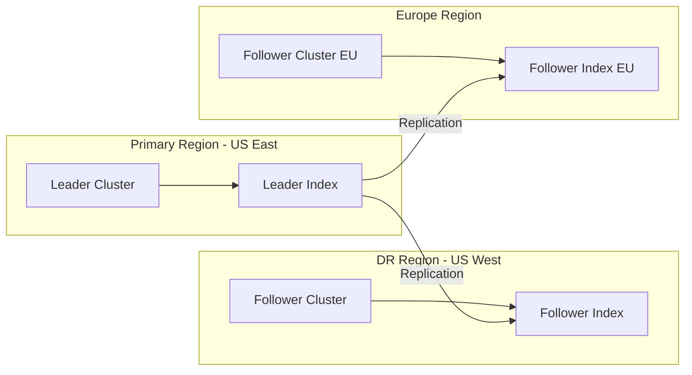

# How to Implement Cross-Cluster Replication in Elasticsearch

Author: [nawazdhandala](https://www.github.com/nawazdhandala)

Tags: Elasticsearch, Cross-Cluster Replication, CCR, Disaster Recovery, High Availability

Description: Learn how to set up cross-cluster replication in Elasticsearch for disaster recovery, geographic distribution, and data locality, with practical examples and monitoring strategies.

---

> Cross-cluster replication (CCR) allows you to replicate indices from one Elasticsearch cluster to another. This is essential for disaster recovery, geographic distribution of data, and keeping data close to users in different regions. This guide shows you how to implement CCR effectively.

CCR creates follower indices that automatically stay in sync with leader indices, providing near real-time replication across clusters.

---

## Prerequisites

Before starting, ensure you have:
- Two or more Elasticsearch clusters (8.x recommended)
- Network connectivity between clusters
- Platinum or Enterprise license (CCR is not available in the free tier)
- TLS configured on both clusters

---

## CCR Architecture Overview



---

## Step 1: Configure Remote Clusters

First, configure the follower cluster to recognize the leader cluster:

```bash
# On the follower cluster, add the leader cluster as a remote
curl -X PUT "https://follower-cluster:9200/_cluster/settings" \
  -H 'Content-Type: application/json' \
  -u elastic:password \
  -d '{
    "persistent": {
      "cluster": {
        "remote": {
          "leader-cluster": {
            "seeds": [
              "leader-node1:9300",
              "leader-node2:9300",
              "leader-node3:9300"
            ],
            "transport.compress": true,
            "skip_unavailable": false
          }
        }
      }
    }
  }'

# Verify remote cluster connection
curl -X GET "https://follower-cluster:9200/_remote/info?pretty" \
  -u elastic:password

# Expected response shows connected: true
# {
#   "leader-cluster": {
#     "connected": true,
#     "mode": "sniff",
#     "seeds": ["leader-node1:9300"],
#     "num_nodes_connected": 3,
#     ...
#   }
# }
```

---

## Step 2: Configure CCR Permissions

Create roles with CCR privileges on both clusters:

```bash
# On the leader cluster - role for CCR read access
curl -X PUT "https://leader-cluster:9200/_security/role/ccr_read_role" \
  -H 'Content-Type: application/json' \
  -u elastic:password \
  -d '{
    "cluster": [
      "read_ccr"
    ],
    "indices": [
      {
        "names": ["*"],
        "privileges": ["monitor", "read", "view_index_metadata"]
      }
    ]
  }'

# On the follower cluster - role for CCR management
curl -X PUT "https://follower-cluster:9200/_security/role/ccr_manage_role" \
  -H 'Content-Type: application/json' \
  -u elastic:password \
  -d '{
    "cluster": [
      "manage_ccr"
    ],
    "indices": [
      {
        "names": ["*"],
        "privileges": ["monitor", "read", "write", "manage_follow_index"]
      }
    ]
  }'

# Create a user with CCR role on follower cluster
curl -X PUT "https://follower-cluster:9200/_security/user/ccr_user" \
  -H 'Content-Type: application/json' \
  -u elastic:password \
  -d '{
    "password": "secure_ccr_password",
    "roles": ["ccr_manage_role"]
  }'
```

---

## Step 3: Create a Follower Index

Replicate a specific index from the leader to the follower:

```bash
# Create a follower index
curl -X PUT "https://follower-cluster:9200/products-replica/_ccr/follow" \
  -H 'Content-Type: application/json' \
  -u elastic:password \
  -d '{
    "remote_cluster": "leader-cluster",
    "leader_index": "products",
    "settings": {
      "index.number_of_replicas": 1
    },
    "max_read_request_operation_count": 5120,
    "max_outstanding_read_requests": 12,
    "max_read_request_size": "32mb",
    "max_write_request_operation_count": 5120,
    "max_write_request_size": "9223372036854775807b",
    "max_outstanding_write_requests": 9,
    "max_write_buffer_count": 2147483647,
    "max_write_buffer_size": "512mb",
    "max_retry_delay": "500ms",
    "read_poll_timeout": "1m"
  }'

# Check follower index status
curl -X GET "https://follower-cluster:9200/products-replica/_ccr/stats?pretty" \
  -u elastic:password
```

---

## Step 4: Auto-Follow Patterns

Set up automatic following for indices matching a pattern:

```bash
# Create an auto-follow pattern
curl -X PUT "https://follower-cluster:9200/_ccr/auto_follow/logs_pattern" \
  -H 'Content-Type: application/json' \
  -u elastic:password \
  -d '{
    "remote_cluster": "leader-cluster",
    "leader_index_patterns": ["logs-*"],
    "follow_index_pattern": "{{leader_index}}-replica",
    "settings": {
      "index.number_of_replicas": 1
    },
    "max_read_request_operation_count": 5120,
    "max_outstanding_read_requests": 12,
    "max_read_request_size": "32mb",
    "max_write_request_operation_count": 5120,
    "max_outstanding_write_requests": 9,
    "max_write_buffer_count": 2147483647,
    "max_write_buffer_size": "512mb",
    "max_retry_delay": "500ms",
    "read_poll_timeout": "1m"
  }'

# List auto-follow patterns
curl -X GET "https://follower-cluster:9200/_ccr/auto_follow?pretty" \
  -u elastic:password

# Get auto-follow stats
curl -X GET "https://follower-cluster:9200/_ccr/auto_follow/logs_pattern/stats?pretty" \
  -u elastic:password
```

---

## Step 5: Monitoring CCR

Monitor replication lag and health:

```bash
# Get CCR stats for all follower indices
curl -X GET "https://follower-cluster:9200/_ccr/stats?pretty" \
  -u elastic:password

# Get stats for a specific follower index
curl -X GET "https://follower-cluster:9200/products-replica/_ccr/stats?pretty" \
  -u elastic:password

# Response includes important metrics:
# {
#   "indices": [{
#     "index": "products-replica",
#     "shards": [{
#       "shard_id": 0,
#       "leader_index": "products",
#       "leader_global_checkpoint": 1000,
#       "leader_max_seq_no": 1000,
#       "follower_global_checkpoint": 998,
#       "follower_max_seq_no": 998,
#       "last_requested_seq_no": 1000,
#       "outstanding_read_requests": 1,
#       "outstanding_write_requests": 0,
#       "write_buffer_operation_count": 2,
#       "follower_mapping_version": 1,
#       "total_read_time_millis": 5000,
#       "total_read_remote_exec_time_millis": 4500,
#       "successful_read_requests": 100,
#       "failed_read_requests": 0,
#       "operations_read": 1000,
#       "total_write_time_millis": 3000,
#       "successful_write_requests": 95,
#       "failed_write_requests": 0,
#       "operations_written": 998,
#       "time_since_last_read_millis": 500
#     }]
#   }]
# }

# Check follower index info
curl -X GET "https://follower-cluster:9200/products-replica/_ccr/info?pretty" \
  -u elastic:password
```

---

## Step 6: Handling Failover

When the leader cluster becomes unavailable, promote the follower:

```bash
# Pause following (optional, automatic if leader is down)
curl -X POST "https://follower-cluster:9200/products-replica/_ccr/pause_follow" \
  -u elastic:password

# Promote follower to a regular index (can now accept writes)
curl -X POST "https://follower-cluster:9200/products-replica/_ccr/unfollow" \
  -u elastic:password

# Now products-replica is a normal index and can accept writes
# Update your application to point to the follower cluster
```

---

## Step 7: Resuming Replication After Recovery

After the leader recovers, you may need to re-establish replication:

```bash
# Option 1: Resume following (if data hasn't diverged)
curl -X POST "https://follower-cluster:9200/products-replica/_ccr/resume_follow" \
  -H 'Content-Type: application/json' \
  -u elastic:password \
  -d '{
    "max_read_request_operation_count": 5120,
    "max_outstanding_read_requests": 12
  }'

# Option 2: If data has diverged, delete follower and recreate
curl -X DELETE "https://follower-cluster:9200/products-replica" \
  -u elastic:password

curl -X PUT "https://follower-cluster:9200/products-replica/_ccr/follow" \
  -H 'Content-Type: application/json' \
  -u elastic:password \
  -d '{
    "remote_cluster": "leader-cluster",
    "leader_index": "products"
  }'
```

---

## Bi-Directional Replication Pattern

For active-active setups where both clusters can accept writes:

```bash
# On Cluster A - follow cluster B's indices
curl -X PUT "https://cluster-a:9200/_ccr/auto_follow/cluster_b_pattern" \
  -H 'Content-Type: application/json' \
  -u elastic:password \
  -d '{
    "remote_cluster": "cluster-b",
    "leader_index_patterns": ["orders-b-*"],
    "follow_index_pattern": "{{leader_index}}-from-b"
  }'

# On Cluster B - follow cluster A's indices
curl -X PUT "https://cluster-b:9200/_ccr/auto_follow/cluster_a_pattern" \
  -H 'Content-Type: application/json' \
  -u elastic:password \
  -d '{
    "remote_cluster": "cluster-a",
    "leader_index_patterns": ["orders-a-*"],
    "follow_index_pattern": "{{leader_index}}-from-a"
  }'

# Application writes to orders-a-* on Cluster A
# Application writes to orders-b-* on Cluster B
# Both clusters have complete view via replicated indices
```

---

## Python CCR Manager

Here's a utility for managing CCR:

```python
from elasticsearch import Elasticsearch
from typing import List, Dict, Any, Optional
from dataclasses import dataclass
from datetime import datetime

@dataclass
class ReplicationStatus:
    index: str
    leader_checkpoint: int
    follower_checkpoint: int
    lag: int
    last_sync_ms: int
    status: str

class CCRManager:
    def __init__(
        self,
        follower_hosts: List[str],
        username: str = "elastic",
        password: str = None,
        ca_certs: str = None
    ):
        self.es = Elasticsearch(
            follower_hosts,
            basic_auth=(username, password) if password else None,
            ca_certs=ca_certs
        )

    def add_remote_cluster(
        self,
        remote_name: str,
        seed_hosts: List[str],
        compress: bool = True
    ) -> bool:
        """Add a remote cluster connection"""

        body = {
            "persistent": {
                "cluster": {
                    "remote": {
                        remote_name: {
                            "seeds": seed_hosts,
                            "transport.compress": compress,
                            "skip_unavailable": False
                        }
                    }
                }
            }
        }

        self.es.cluster.put_settings(body=body)
        return True

    def check_remote_connection(self, remote_name: str = None) -> Dict[str, Any]:
        """Check remote cluster connection status"""

        info = self.es.cluster.remote_info()

        if remote_name:
            return info.get(remote_name, {})
        return info

    def create_follower_index(
        self,
        leader_index: str,
        follower_index: str,
        remote_cluster: str,
        settings: Dict[str, Any] = None
    ) -> bool:
        """Create a follower index"""

        body = {
            "remote_cluster": remote_cluster,
            "leader_index": leader_index
        }

        if settings:
            body["settings"] = settings

        self.es.ccr.follow(index=follower_index, body=body)
        return True

    def create_auto_follow(
        self,
        pattern_name: str,
        remote_cluster: str,
        leader_patterns: List[str],
        follow_pattern: str = "{{leader_index}}-replica",
        settings: Dict[str, Any] = None
    ) -> bool:
        """Create an auto-follow pattern"""

        body = {
            "remote_cluster": remote_cluster,
            "leader_index_patterns": leader_patterns,
            "follow_index_pattern": follow_pattern
        }

        if settings:
            body["settings"] = settings

        self.es.ccr.put_auto_follow_pattern(name=pattern_name, body=body)
        return True

    def get_replication_status(self) -> List[ReplicationStatus]:
        """Get replication status for all follower indices"""

        stats = self.es.ccr.stats()
        results = []

        for index_stats in stats.get("follow_stats", {}).get("indices", []):
            index_name = index_stats["index"]

            for shard in index_stats.get("shards", []):
                leader_cp = shard.get("leader_global_checkpoint", 0)
                follower_cp = shard.get("follower_global_checkpoint", 0)
                lag = leader_cp - follower_cp

                # Determine status based on lag and errors
                failed_reads = shard.get("failed_read_requests", 0)
                failed_writes = shard.get("failed_write_requests", 0)

                if failed_reads > 0 or failed_writes > 0:
                    status = "error"
                elif lag > 1000:
                    status = "lagging"
                elif lag > 0:
                    status = "syncing"
                else:
                    status = "in_sync"

                results.append(ReplicationStatus(
                    index=index_name,
                    leader_checkpoint=leader_cp,
                    follower_checkpoint=follower_cp,
                    lag=lag,
                    last_sync_ms=shard.get("time_since_last_read_millis", 0),
                    status=status
                ))

        return results

    def pause_replication(self, follower_index: str) -> bool:
        """Pause replication for a follower index"""
        self.es.ccr.pause_follow(index=follower_index)
        return True

    def resume_replication(self, follower_index: str) -> bool:
        """Resume replication for a follower index"""
        self.es.ccr.resume_follow(index=follower_index, body={})
        return True

    def promote_follower(self, follower_index: str) -> bool:
        """Promote follower to a regular index (unfollow)"""

        # Pause first
        try:
            self.es.ccr.pause_follow(index=follower_index)
        except Exception:
            pass  # May already be paused

        # Close the index
        self.es.indices.close(index=follower_index)

        # Unfollow to make it a regular index
        self.es.ccr.unfollow(index=follower_index)

        # Reopen the index
        self.es.indices.open(index=follower_index)

        return True

    def delete_auto_follow(self, pattern_name: str) -> bool:
        """Delete an auto-follow pattern"""
        self.es.ccr.delete_auto_follow_pattern(name=pattern_name)
        return True

    def list_auto_follow_patterns(self) -> List[Dict[str, Any]]:
        """List all auto-follow patterns"""

        response = self.es.ccr.get_auto_follow_pattern()
        patterns = []

        for pattern in response.get("patterns", []):
            patterns.append({
                "name": pattern["name"],
                "remote_cluster": pattern["pattern"]["remote_cluster"],
                "leader_patterns": pattern["pattern"]["leader_index_patterns"],
                "follow_pattern": pattern["pattern"]["follow_index_pattern"]
            })

        return patterns

    def setup_disaster_recovery(
        self,
        remote_cluster: str,
        index_patterns: List[str]
    ) -> Dict[str, bool]:
        """Set up disaster recovery with auto-follow for specified patterns"""

        results = {}

        for pattern in index_patterns:
            # Create a safe pattern name
            pattern_name = f"dr_{pattern.replace('*', '').replace('-', '_')}"

            try:
                self.create_auto_follow(
                    pattern_name=pattern_name,
                    remote_cluster=remote_cluster,
                    leader_patterns=[pattern],
                    follow_pattern="{{leader_index}}-dr",
                    settings={
                        "index.number_of_replicas": 1
                    }
                )
                results[pattern] = True
            except Exception as e:
                print(f"Failed to create auto-follow for {pattern}: {e}")
                results[pattern] = False

        return results


# Usage example
if __name__ == "__main__":
    # Initialize CCR manager pointing to follower cluster
    ccr = CCRManager(
        follower_hosts=["https://follower-cluster:9200"],
        username="elastic",
        password="follower_password",
        ca_certs="/path/to/ca.crt"
    )

    # Add leader cluster as remote
    print("Adding remote cluster...")
    ccr.add_remote_cluster(
        remote_name="leader-dc",
        seed_hosts=[
            "leader-node1:9300",
            "leader-node2:9300"
        ]
    )

    # Verify connection
    print("\nChecking remote connection...")
    connection = ccr.check_remote_connection("leader-dc")
    print(f"  Connected: {connection.get('connected', False)}")
    print(f"  Nodes: {connection.get('num_nodes_connected', 0)}")

    # Set up DR for common index patterns
    print("\nSetting up disaster recovery...")
    results = ccr.setup_disaster_recovery(
        remote_cluster="leader-dc",
        index_patterns=["logs-*", "metrics-*", "orders-*"]
    )

    for pattern, success in results.items():
        status = "OK" if success else "FAILED"
        print(f"  {pattern}: {status}")

    # Check replication status
    print("\nReplication Status:")
    for status in ccr.get_replication_status():
        print(f"  {status.index}: {status.status} (lag: {status.lag})")

    # List auto-follow patterns
    print("\nAuto-follow patterns:")
    for pattern in ccr.list_auto_follow_patterns():
        print(f"  {pattern['name']}: {pattern['leader_patterns']}")
```

---

## Monitoring and Alerting

Set up monitoring for CCR health:

```bash
# Create a watch for replication lag (if using Watcher)
curl -X PUT "https://follower-cluster:9200/_watcher/watch/ccr_lag_alert" \
  -H 'Content-Type: application/json' \
  -u elastic:password \
  -d '{
    "trigger": {
      "schedule": {
        "interval": "5m"
      }
    },
    "input": {
      "http": {
        "request": {
          "host": "localhost",
          "port": 9200,
          "path": "/_ccr/stats",
          "auth": {
            "basic": {
              "username": "elastic",
              "password": "password"
            }
          }
        }
      }
    },
    "condition": {
      "script": {
        "source": "def indices = ctx.payload.follow_stats.indices; for (idx in indices) { for (shard in idx.shards) { if (shard.leader_global_checkpoint - shard.follower_global_checkpoint > 10000) { return true; } } } return false;"
      }
    },
    "actions": {
      "notify": {
        "webhook": {
          "method": "POST",
          "host": "alerts.example.com",
          "port": 443,
          "path": "/ccr-alert",
          "body": "CCR replication lag detected"
        }
      }
    }
  }'
```

---

## Best Practices

**Network:**
- Use dedicated network links between datacenters if possible
- Configure appropriate timeouts for your network latency
- Use compression for cross-region replication

**Capacity Planning:**
- Follower clusters need sufficient resources to handle replication load
- Plan for catch-up bandwidth after outages
- Monitor and alert on replication lag

**Failover Testing:**
- Regularly test failover procedures
- Document the promotion process
- Ensure applications can switch endpoints

**Security:**
- Use TLS between clusters
- Create dedicated CCR users with minimal privileges
- Rotate certificates regularly

---

## Conclusion

Cross-cluster replication provides a robust foundation for disaster recovery and data distribution in Elasticsearch. Key takeaways:

- CCR replicates indices automatically from leader to follower clusters
- Auto-follow patterns simplify management for dynamic index creation
- Monitor replication lag to ensure your RPO requirements are met
- Test failover procedures regularly to ensure they work when needed

With CCR properly configured, you can confidently handle regional outages and provide data locality for users across the globe.

---

*Need to monitor cross-cluster replication health? [OneUptime](https://oneuptime.com) provides unified observability for distributed Elasticsearch deployments.*
