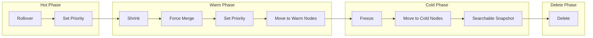

# How to Configure Index Lifecycle Management in Elasticsearch

Author: [nawazdhandala](https://www.github.com/nawazdhandala)

Tags: Elasticsearch, ILM, Index Lifecycle Management, Data Management, Storage Optimization

Description: Learn how to configure Elasticsearch Index Lifecycle Management to automatically manage indices through hot, warm, cold, and delete phases, optimizing storage costs and performance.

---

> Index Lifecycle Management (ILM) automates the management of indices as they age. Instead of manually monitoring and moving indices, ILM handles rollover, shrinking, force merging, and deletion based on policies you define. This guide shows you how to implement ILM for efficient data management.

ILM is essential for time-series data like logs and metrics where older data is accessed less frequently and can be stored more efficiently.

---

## Prerequisites

Before starting, ensure you have:
- Elasticsearch 8.x running
- Understanding of index templates
- Hot, warm, and cold node attributes configured (for tiered storage)

---

## ILM Phases Overview



---

## Node Configuration for Tiered Storage

First, configure node attributes to identify hot, warm, and cold nodes:

```yaml
# On hot nodes (fast SSDs, more RAM)
# elasticsearch.yml
node.attr.data: hot

# On warm nodes (larger HDDs, less RAM)
# elasticsearch.yml
node.attr.data: warm

# On cold nodes (cheapest storage)
# elasticsearch.yml
node.attr.data: cold
```

---

## Creating an ILM Policy

Create a policy that manages indices through all phases:

```bash
# Create a comprehensive ILM policy for logs
curl -X PUT "localhost:9200/_ilm/policy/logs_policy" \
  -H 'Content-Type: application/json' \
  -d '{
    "policy": {
      "phases": {
        "hot": {
          "min_age": "0ms",
          "actions": {
            "rollover": {
              "max_primary_shard_size": "50gb",
              "max_age": "1d",
              "max_docs": 100000000
            },
            "set_priority": {
              "priority": 100
            }
          }
        },
        "warm": {
          "min_age": "7d",
          "actions": {
            "shrink": {
              "number_of_shards": 1
            },
            "forcemerge": {
              "max_num_segments": 1
            },
            "allocate": {
              "require": {
                "data": "warm"
              }
            },
            "set_priority": {
              "priority": 50
            }
          }
        },
        "cold": {
          "min_age": "30d",
          "actions": {
            "allocate": {
              "require": {
                "data": "cold"
              }
            },
            "set_priority": {
              "priority": 0
            }
          }
        },
        "delete": {
          "min_age": "90d",
          "actions": {
            "delete": {}
          }
        }
      }
    }
  }'

# Verify the policy
curl -X GET "localhost:9200/_ilm/policy/logs_policy?pretty"
```

---

## Creating an Index Template with ILM

Link the ILM policy to an index template:

```bash
# Create component template for ILM settings
curl -X PUT "localhost:9200/_component_template/ilm_settings" \
  -H 'Content-Type: application/json' \
  -d '{
    "template": {
      "settings": {
        "index.lifecycle.name": "logs_policy",
        "index.lifecycle.rollover_alias": "logs"
      }
    }
  }'

# Create component template for log mappings
curl -X PUT "localhost:9200/_component_template/log_mappings" \
  -H 'Content-Type: application/json' \
  -d '{
    "template": {
      "mappings": {
        "properties": {
          "@timestamp": { "type": "date" },
          "message": { "type": "text" },
          "level": { "type": "keyword" },
          "service": { "type": "keyword" },
          "host": { "type": "keyword" }
        }
      }
    }
  }'

# Create the index template
curl -X PUT "localhost:9200/_index_template/logs_template" \
  -H 'Content-Type: application/json' \
  -d '{
    "index_patterns": ["logs-*"],
    "priority": 100,
    "composed_of": ["ilm_settings", "log_mappings"],
    "template": {
      "settings": {
        "number_of_shards": 3,
        "number_of_replicas": 1,
        "index.routing.allocation.require.data": "hot"
      }
    }
  }'
```

---

## Bootstrapping the Initial Index

Create the first index with the write alias:

```bash
# Create the initial index with the rollover alias
curl -X PUT "localhost:9200/logs-000001" \
  -H 'Content-Type: application/json' \
  -d '{
    "aliases": {
      "logs": {
        "is_write_index": true
      }
    }
  }'

# Verify the alias
curl -X GET "localhost:9200/_alias/logs?pretty"
```

---

## Understanding Rollover

Rollover creates a new index when conditions are met:

```bash
# Check rollover conditions manually
curl -X POST "localhost:9200/logs/_rollover?dry_run" \
  -H 'Content-Type: application/json' \
  -d '{
    "conditions": {
      "max_primary_shard_size": "50gb",
      "max_age": "1d",
      "max_docs": 100000000
    }
  }'

# Force a rollover (useful for testing)
curl -X POST "localhost:9200/logs/_rollover" \
  -H 'Content-Type: application/json'

# After rollover, you'll have:
# logs-000001: read-only, in warm/cold phase
# logs-000002: write index (is_write_index: true)
```

---

## Monitoring ILM

Check the status of your indices in ILM:

```bash
# Get ILM status for all indices
curl -X GET "localhost:9200/_ilm/explain?pretty"

# Get ILM status for specific index
curl -X GET "localhost:9200/logs-000001/_ilm/explain?pretty"

# Response shows current phase, action, and step:
# {
#   "indices": {
#     "logs-000001": {
#       "index": "logs-000001",
#       "managed": true,
#       "policy": "logs_policy",
#       "lifecycle_date_millis": 1705315800000,
#       "age": "5d",
#       "phase": "warm",
#       "phase_time_millis": 1705315900000,
#       "action": "forcemerge",
#       "action_time_millis": 1705315950000,
#       "step": "forcemerge",
#       "step_time_millis": 1705316000000
#     }
#   }
# }

# Get ILM status overview
curl -X GET "localhost:9200/_ilm/status?pretty"
```

---

## Handling ILM Errors

When ILM encounters an error, the index moves to an error state:

```bash
# Check for indices in error state
curl -X GET "localhost:9200/*/_ilm/explain?only_errors=true&pretty"

# Retry the failed step
curl -X POST "localhost:9200/logs-000001/_ilm/retry"

# Move an index to a specific phase (skip phases)
curl -X POST "localhost:9200/_ilm/move/logs-000001" \
  -H 'Content-Type: application/json' \
  -d '{
    "current_step": {
      "phase": "hot",
      "action": "complete",
      "name": "complete"
    },
    "next_step": {
      "phase": "warm",
      "action": "shrink",
      "name": "shrink"
    }
  }'
```

---

## Advanced ILM Patterns

### Metrics with Different Retention

```bash
# Short-term metrics policy
curl -X PUT "localhost:9200/_ilm/policy/metrics_short_policy" \
  -H 'Content-Type: application/json' \
  -d '{
    "policy": {
      "phases": {
        "hot": {
          "actions": {
            "rollover": {
              "max_primary_shard_size": "30gb",
              "max_age": "1d"
            }
          }
        },
        "delete": {
          "min_age": "7d",
          "actions": {
            "delete": {}
          }
        }
      }
    }
  }'

# Long-term metrics policy with compression
curl -X PUT "localhost:9200/_ilm/policy/metrics_long_policy" \
  -H 'Content-Type: application/json' \
  -d '{
    "policy": {
      "phases": {
        "hot": {
          "actions": {
            "rollover": {
              "max_primary_shard_size": "50gb",
              "max_age": "1d"
            }
          }
        },
        "warm": {
          "min_age": "7d",
          "actions": {
            "shrink": {
              "number_of_shards": 1
            },
            "forcemerge": {
              "max_num_segments": 1
            },
            "allocate": {
              "number_of_replicas": 0
            }
          }
        },
        "cold": {
          "min_age": "30d",
          "actions": {
            "allocate": {
              "require": {
                "data": "cold"
              }
            }
          }
        },
        "delete": {
          "min_age": "365d",
          "actions": {
            "delete": {}
          }
        }
      }
    }
  }'
```

### Searchable Snapshots for Cold Data

```bash
# Policy using searchable snapshots
curl -X PUT "localhost:9200/_ilm/policy/archive_policy" \
  -H 'Content-Type: application/json' \
  -d '{
    "policy": {
      "phases": {
        "hot": {
          "actions": {
            "rollover": {
              "max_primary_shard_size": "50gb",
              "max_age": "1d"
            }
          }
        },
        "warm": {
          "min_age": "7d",
          "actions": {
            "shrink": {
              "number_of_shards": 1
            },
            "forcemerge": {
              "max_num_segments": 1
            }
          }
        },
        "cold": {
          "min_age": "30d",
          "actions": {
            "searchable_snapshot": {
              "snapshot_repository": "my-repository"
            }
          }
        },
        "delete": {
          "min_age": "365d",
          "actions": {
            "delete": {}
          }
        }
      }
    }
  }'
```

---

## Python ILM Manager

Here's a utility for managing ILM:

```python
from elasticsearch import Elasticsearch
from typing import List, Dict, Any, Optional
from dataclasses import dataclass
from datetime import datetime

@dataclass
class IndexILMStatus:
    index: str
    managed: bool
    policy: Optional[str]
    phase: Optional[str]
    action: Optional[str]
    age: Optional[str]
    error: Optional[str]

class ILMManager:
    def __init__(self, hosts: List[str], **kwargs):
        self.es = Elasticsearch(hosts, **kwargs)

    def create_policy(
        self,
        policy_name: str,
        hot_rollover_size: str = "50gb",
        hot_rollover_age: str = "1d",
        warm_age: str = "7d",
        cold_age: str = "30d",
        delete_age: str = "90d",
        warm_shards: int = 1,
        warm_segments: int = 1
    ) -> bool:
        """Create a standard ILM policy"""

        policy = {
            "policy": {
                "phases": {
                    "hot": {
                        "min_age": "0ms",
                        "actions": {
                            "rollover": {
                                "max_primary_shard_size": hot_rollover_size,
                                "max_age": hot_rollover_age
                            },
                            "set_priority": {
                                "priority": 100
                            }
                        }
                    },
                    "warm": {
                        "min_age": warm_age,
                        "actions": {
                            "shrink": {
                                "number_of_shards": warm_shards
                            },
                            "forcemerge": {
                                "max_num_segments": warm_segments
                            },
                            "set_priority": {
                                "priority": 50
                            }
                        }
                    },
                    "cold": {
                        "min_age": cold_age,
                        "actions": {
                            "set_priority": {
                                "priority": 0
                            }
                        }
                    },
                    "delete": {
                        "min_age": delete_age,
                        "actions": {
                            "delete": {}
                        }
                    }
                }
            }
        }

        self.es.ilm.put_lifecycle(policy=policy_name, body=policy)
        return True

    def create_simple_policy(
        self,
        policy_name: str,
        rollover_size: str = "50gb",
        rollover_age: str = "1d",
        delete_age: str = "30d"
    ) -> bool:
        """Create a simple hot-delete policy"""

        policy = {
            "policy": {
                "phases": {
                    "hot": {
                        "actions": {
                            "rollover": {
                                "max_primary_shard_size": rollover_size,
                                "max_age": rollover_age
                            }
                        }
                    },
                    "delete": {
                        "min_age": delete_age,
                        "actions": {
                            "delete": {}
                        }
                    }
                }
            }
        }

        self.es.ilm.put_lifecycle(policy=policy_name, body=policy)
        return True

    def get_index_status(self, index_pattern: str = "*") -> List[IndexILMStatus]:
        """Get ILM status for indices matching pattern"""

        explain = self.es.ilm.explain_lifecycle(index=index_pattern)
        results = []

        for index_name, data in explain.get("indices", {}).items():
            results.append(IndexILMStatus(
                index=index_name,
                managed=data.get("managed", False),
                policy=data.get("policy"),
                phase=data.get("phase"),
                action=data.get("action"),
                age=data.get("age"),
                error=data.get("step_info", {}).get("reason") if data.get("step") == "ERROR" else None
            ))

        return results

    def get_indices_in_phase(self, phase: str) -> List[str]:
        """Get all indices in a specific phase"""

        explain = self.es.ilm.explain_lifecycle(index="*")
        return [
            name for name, data in explain.get("indices", {}).items()
            if data.get("phase") == phase and data.get("managed")
        ]

    def get_errored_indices(self) -> List[IndexILMStatus]:
        """Get all indices with ILM errors"""

        explain = self.es.ilm.explain_lifecycle(index="*", only_errors=True)
        results = []

        for index_name, data in explain.get("indices", {}).items():
            error_info = data.get("step_info", {})
            results.append(IndexILMStatus(
                index=index_name,
                managed=True,
                policy=data.get("policy"),
                phase=data.get("phase"),
                action=data.get("action"),
                age=data.get("age"),
                error=error_info.get("reason", "Unknown error")
            ))

        return results

    def retry_index(self, index_name: str) -> bool:
        """Retry ILM for a failed index"""
        self.es.ilm.retry(index=index_name)
        return True

    def move_to_phase(
        self,
        index_name: str,
        target_phase: str
    ) -> bool:
        """Move an index to a specific phase"""

        # Get current state
        explain = self.es.ilm.explain_lifecycle(index=index_name)
        current = explain["indices"][index_name]

        body = {
            "current_step": {
                "phase": current["phase"],
                "action": current["action"],
                "name": current["step"]
            },
            "next_step": {
                "phase": target_phase,
                "action": "complete",
                "name": "complete"
            }
        }

        self.es.ilm.move_to_step(index=index_name, body=body)
        return True

    def list_policies(self) -> Dict[str, Dict[str, Any]]:
        """List all ILM policies"""
        return self.es.ilm.get_lifecycle()

    def delete_policy(self, policy_name: str) -> bool:
        """Delete an ILM policy"""
        self.es.ilm.delete_lifecycle(policy=policy_name)
        return True

    def calculate_storage_savings(self) -> Dict[str, Any]:
        """Calculate storage across ILM phases"""

        cat_indices = self.es.cat.indices(format="json")
        explain = self.es.ilm.explain_lifecycle(index="*")

        phase_storage = {"hot": 0, "warm": 0, "cold": 0, "unmanaged": 0}
        phase_count = {"hot": 0, "warm": 0, "cold": 0, "unmanaged": 0}

        for idx in cat_indices:
            index_name = idx["index"]
            size_bytes = int(idx.get("pri.store.size", "0").replace("b", "") or 0)

            ilm_data = explain.get("indices", {}).get(index_name, {})

            if ilm_data.get("managed"):
                phase = ilm_data.get("phase", "hot")
                if phase in phase_storage:
                    phase_storage[phase] += size_bytes
                    phase_count[phase] += 1
            else:
                phase_storage["unmanaged"] += size_bytes
                phase_count["unmanaged"] += 1

        return {
            "storage_bytes": phase_storage,
            "index_count": phase_count,
            "storage_human": {
                phase: self._human_size(size)
                for phase, size in phase_storage.items()
            }
        }

    def _human_size(self, bytes_size: int) -> str:
        """Convert bytes to human readable format"""
        for unit in ["B", "KB", "MB", "GB", "TB"]:
            if bytes_size < 1024:
                return f"{bytes_size:.2f} {unit}"
            bytes_size /= 1024
        return f"{bytes_size:.2f} PB"

    def setup_logs_ilm(
        self,
        retention_days: int = 30,
        warm_after_days: int = 3
    ) -> Dict[str, bool]:
        """Set up complete ILM for logs"""

        results = {}

        # Create policy
        results["policy"] = self.create_policy(
            policy_name="logs_ilm_policy",
            hot_rollover_size="50gb",
            hot_rollover_age="1d",
            warm_age=f"{warm_after_days}d",
            cold_age=f"{retention_days // 2}d",
            delete_age=f"{retention_days}d"
        )

        # Create index template
        template_body = {
            "index_patterns": ["logs-*"],
            "template": {
                "settings": {
                    "index.lifecycle.name": "logs_ilm_policy",
                    "index.lifecycle.rollover_alias": "logs",
                    "number_of_shards": 1,
                    "number_of_replicas": 1
                },
                "mappings": {
                    "properties": {
                        "@timestamp": {"type": "date"},
                        "message": {"type": "text"},
                        "level": {"type": "keyword"},
                        "service": {"type": "keyword"}
                    }
                }
            }
        }

        self.es.indices.put_index_template(
            name="logs_ilm_template",
            body=template_body
        )
        results["template"] = True

        # Bootstrap initial index if it doesn't exist
        if not self.es.indices.exists(index="logs-000001"):
            self.es.indices.create(
                index="logs-000001",
                body={
                    "aliases": {
                        "logs": {
                            "is_write_index": True
                        }
                    }
                }
            )
            results["bootstrap"] = True
        else:
            results["bootstrap"] = False

        return results


# Usage example
if __name__ == "__main__":
    ilm = ILMManager(["http://localhost:9200"])

    # Set up ILM for logs with 30 day retention
    print("Setting up ILM for logs...")
    results = ilm.setup_logs_ilm(retention_days=30, warm_after_days=3)
    for component, success in results.items():
        print(f"  {component}: {'OK' if success else 'Skipped/Failed'}")

    # Check index status
    print("\nIndex ILM Status:")
    for status in ilm.get_index_status("logs-*"):
        print(f"  {status.index}: {status.phase} ({status.age})")
        if status.error:
            print(f"    ERROR: {status.error}")

    # Check storage distribution
    print("\nStorage by Phase:")
    storage = ilm.calculate_storage_savings()
    for phase, size in storage["storage_human"].items():
        count = storage["index_count"][phase]
        print(f"  {phase}: {size} ({count} indices)")

    # List policies
    print("\nConfigured ILM Policies:")
    for policy_name in ilm.list_policies().keys():
        print(f"  {policy_name}")
```

---

## Best Practices

**Rollover Settings:**
- Use primary shard size as the main rollover trigger
- Set age-based rollover as a safety net
- Avoid too many small indices (overhead per index)

**Phase Timing:**
- Base warm phase timing on query patterns
- Move to cold when data is rarely accessed
- Delete when data is no longer needed

**Resource Planning:**
- Warm nodes need less RAM but more disk
- Cold nodes can use cheapest storage
- Plan for rollover spike in hot tier

**Monitoring:**
- Alert on ILM errors immediately
- Monitor rollover frequency
- Track storage per phase

---

## Conclusion

Index Lifecycle Management automates the tedious work of managing time-series data. Key takeaways:

- ILM moves indices through hot, warm, cold, and delete phases automatically
- Rollover creates new indices when size or age thresholds are met
- Shrink and force merge optimize storage in warm phase
- Monitor ILM status and handle errors promptly

With ILM properly configured, you can focus on using your data rather than managing it.

---

*Need to monitor your ILM policies and storage costs? [OneUptime](https://oneuptime.com) provides infrastructure monitoring and alerting for your entire Elasticsearch deployment.*
