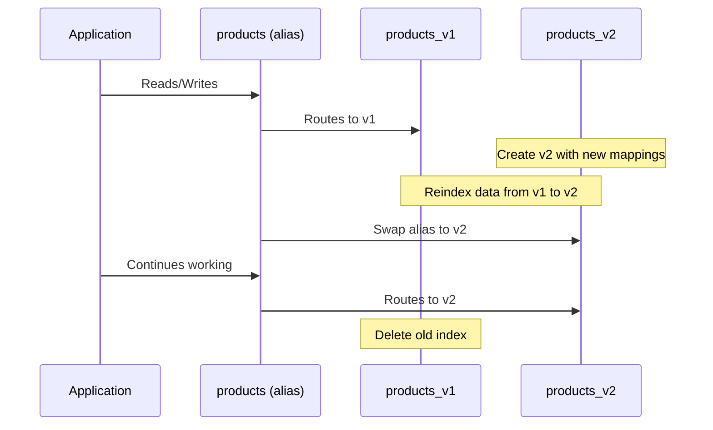

# How to Implement Index Management in Elasticsearch

Author: [nawazdhandala](https://www.github.com/nawazdhandala)

Tags: Elasticsearch, Index Management, Search, DevOps, Database Administration

Description: Learn how to effectively manage Elasticsearch indices including creation, configuration, aliases, reindexing, and maintenance operations for optimal search performance.

---

> Index management is fundamental to running Elasticsearch effectively. Poor index management leads to wasted storage, slow queries, and operational headaches. This guide covers everything you need to know about managing indices in production.

Whether you're dealing with time-series data, search applications, or log analytics, understanding index management patterns will help you build systems that scale.

---

## Prerequisites

Before starting, ensure you have:
- Elasticsearch 8.x running and accessible
- curl or Kibana Dev Tools for API calls
- Basic familiarity with REST APIs

---

## Creating Indices

The most basic operation is creating an index with explicit settings and mappings.

```bash
# Create an index with custom settings
curl -X PUT "localhost:9200/products" -H 'Content-Type: application/json' -d'
{
  "settings": {
    "number_of_shards": 3,
    "number_of_replicas": 1,
    "refresh_interval": "5s",
    "analysis": {
      "analyzer": {
        "product_analyzer": {
          "type": "custom",
          "tokenizer": "standard",
          "filter": ["lowercase", "asciifolding"]
        }
      }
    }
  },
  "mappings": {
    "properties": {
      "name": {
        "type": "text",
        "analyzer": "product_analyzer"
      },
      "description": {
        "type": "text"
      },
      "price": {
        "type": "float"
      },
      "category": {
        "type": "keyword"
      },
      "created_at": {
        "type": "date"
      },
      "in_stock": {
        "type": "boolean"
      }
    }
  }
}'
```

---

## Working with Index Aliases

Aliases provide a layer of indirection that makes index management much easier. You can swap underlying indices without changing application code.

```bash
# Create an alias pointing to an index
curl -X POST "localhost:9200/_aliases" -H 'Content-Type: application/json' -d'
{
  "actions": [
    {
      "add": {
        "index": "products_v1",
        "alias": "products"
      }
    }
  ]
}'

# Create a write alias for indexing
# Only one index can have is_write_index: true
curl -X POST "localhost:9200/_aliases" -H 'Content-Type: application/json' -d'
{
  "actions": [
    {
      "add": {
        "index": "products_v1",
        "alias": "products_write",
        "is_write_index": true
      }
    }
  ]
}'

# Create a filtered alias for specific data subsets
curl -X POST "localhost:9200/_aliases" -H 'Content-Type: application/json' -d'
{
  "actions": [
    {
      "add": {
        "index": "products_v1",
        "alias": "electronics",
        "filter": {
          "term": {
            "category": "electronics"
          }
        }
      }
    }
  ]
}'
```

---

## Zero-Downtime Index Migrations

When you need to change mappings or settings, use the reindex API with alias swapping for zero-downtime migrations.



Here's the code to perform a zero-downtime migration:

```bash
# Step 1: Create the new index with updated mappings
curl -X PUT "localhost:9200/products_v2" -H 'Content-Type: application/json' -d'
{
  "settings": {
    "number_of_shards": 3,
    "number_of_replicas": 1,
    "refresh_interval": "-1"
  },
  "mappings": {
    "properties": {
      "name": {
        "type": "text",
        "fields": {
          "keyword": {
            "type": "keyword"
          }
        }
      },
      "description": {
        "type": "text"
      },
      "price": {
        "type": "float"
      },
      "category": {
        "type": "keyword"
      },
      "created_at": {
        "type": "date"
      },
      "in_stock": {
        "type": "boolean"
      },
      "tags": {
        "type": "keyword"
      }
    }
  }
}'

# Step 2: Reindex data from old to new index
curl -X POST "localhost:9200/_reindex?wait_for_completion=false" -H 'Content-Type: application/json' -d'
{
  "source": {
    "index": "products_v1"
  },
  "dest": {
    "index": "products_v2"
  }
}'

# Step 3: Monitor reindex progress
curl -X GET "localhost:9200/_tasks?actions=*reindex&detailed=true"

# Step 4: After reindex completes, restore refresh interval
curl -X PUT "localhost:9200/products_v2/_settings" -H 'Content-Type: application/json' -d'
{
  "refresh_interval": "5s"
}'

# Step 5: Atomically swap the alias
curl -X POST "localhost:9200/_aliases" -H 'Content-Type: application/json' -d'
{
  "actions": [
    {
      "remove": {
        "index": "products_v1",
        "alias": "products"
      }
    },
    {
      "add": {
        "index": "products_v2",
        "alias": "products"
      }
    }
  ]
}'

# Step 6: Delete old index after verifying everything works
curl -X DELETE "localhost:9200/products_v1"
```

---

## Index Settings Management

Adjust index settings for different operational needs.

```bash
# View current index settings
curl -X GET "localhost:9200/products/_settings?pretty"

# Update dynamic settings (no restart required)
curl -X PUT "localhost:9200/products/_settings" -H 'Content-Type: application/json' -d'
{
  "index": {
    "refresh_interval": "30s",
    "number_of_replicas": 2,
    "max_result_window": 50000
  }
}'

# Make an index read-only for archival
curl -X PUT "localhost:9200/products/_settings" -H 'Content-Type: application/json' -d'
{
  "index": {
    "blocks.write": true
  }
}'

# Remove the write block
curl -X PUT "localhost:9200/products/_settings" -H 'Content-Type: application/json' -d'
{
  "index": {
    "blocks.write": false
  }
}'
```

---

## Index Maintenance Operations

Regular maintenance keeps indices performing well.

### Force Merge

Force merge reduces segment count for better query performance. Only run on indices that are no longer being written to.

```bash
# Force merge to a single segment
# Warning: This is resource-intensive and blocks writes
curl -X POST "localhost:9200/products_archive/_forcemerge?max_num_segments=1"

# Force merge with async operation
curl -X POST "localhost:9200/products_archive/_forcemerge?max_num_segments=1&wait_for_completion=false"
```

### Refresh and Flush

Control when data becomes searchable and when it's persisted to disk.

```bash
# Manually refresh an index to make recent changes searchable
curl -X POST "localhost:9200/products/_refresh"

# Flush the index to persist translog to disk
curl -X POST "localhost:9200/products/_flush"

# Synced flush before planned maintenance (deprecated in 8.x, use flush)
curl -X POST "localhost:9200/products/_flush?wait_if_ongoing=true"
```

### Clear Cache

Clear caches when memory pressure is high or after bulk operations.

```bash
# Clear all caches for an index
curl -X POST "localhost:9200/products/_cache/clear"

# Clear specific cache types
curl -X POST "localhost:9200/products/_cache/clear?query=true"
curl -X POST "localhost:9200/products/_cache/clear?fielddata=true"
curl -X POST "localhost:9200/products/_cache/clear?request=true"
```

---

## Index Statistics and Monitoring

Monitor index health and performance metrics.

```bash
# Get index statistics
curl -X GET "localhost:9200/products/_stats?pretty"

# Get specific stats
curl -X GET "localhost:9200/products/_stats/docs,store,indexing,search?pretty"

# Check index segments
curl -X GET "localhost:9200/products/_segments?pretty"

# Get index recovery status
curl -X GET "localhost:9200/products/_recovery?pretty"

# View shard allocation
curl -X GET "localhost:9200/_cat/shards/products?v"
```

---

## Time-Based Index Patterns

For logs and metrics, use time-based indices with rollover for efficient management.

```bash
# Create an index template for time-based indices
curl -X PUT "localhost:9200/_index_template/logs_template" -H 'Content-Type: application/json' -d'
{
  "index_patterns": ["logs-*"],
  "template": {
    "settings": {
      "number_of_shards": 1,
      "number_of_replicas": 1
    },
    "mappings": {
      "properties": {
        "@timestamp": {
          "type": "date"
        },
        "message": {
          "type": "text"
        },
        "level": {
          "type": "keyword"
        },
        "service": {
          "type": "keyword"
        }
      }
    }
  }
}'

# Create initial index with rollover alias
curl -X PUT "localhost:9200/logs-000001" -H 'Content-Type: application/json' -d'
{
  "aliases": {
    "logs_write": {
      "is_write_index": true
    },
    "logs_read": {}
  }
}'

# Configure automatic rollover
curl -X PUT "localhost:9200/_ilm/policy/logs_policy" -H 'Content-Type: application/json' -d'
{
  "policy": {
    "phases": {
      "hot": {
        "actions": {
          "rollover": {
            "max_size": "50GB",
            "max_age": "1d"
          }
        }
      },
      "delete": {
        "min_age": "30d",
        "actions": {
          "delete": {}
        }
      }
    }
  }
}'
```

---

## Bulk Index Operations

When working with multiple indices, use bulk operations for efficiency.

```bash
# Close multiple indices
curl -X POST "localhost:9200/logs-2024.01.*/_close"

# Open indices
curl -X POST "localhost:9200/logs-2024.01.*/_open"

# Delete indices matching a pattern
curl -X DELETE "localhost:9200/logs-2024.01.*"

# Freeze indices for infrequent access (reduces memory usage)
curl -X POST "localhost:9200/logs-2024.01.01/_freeze"

# Unfreeze when needed
curl -X POST "localhost:9200/logs-2024.01.01/_unfreeze"
```

---

## Python Client for Index Management

Here's a Python helper class for common index management tasks:

```python
from elasticsearch import Elasticsearch
from datetime import datetime
import time

class IndexManager:
    def __init__(self, hosts=['localhost:9200']):
        # Initialize client with retry configuration
        self.es = Elasticsearch(
            hosts,
            retry_on_timeout=True,
            max_retries=3
        )

    def create_index_with_alias(self, index_name, alias_name, mappings, settings=None):
        """Create an index and assign an alias to it"""
        default_settings = {
            'number_of_shards': 3,
            'number_of_replicas': 1,
            'refresh_interval': '5s'
        }

        if settings:
            default_settings.update(settings)

        # Create the index
        self.es.indices.create(
            index=index_name,
            body={
                'settings': default_settings,
                'mappings': mappings
            }
        )

        # Add the alias
        self.es.indices.put_alias(
            index=index_name,
            name=alias_name
        )

        return True

    def reindex_with_zero_downtime(self, source_index, dest_index, alias_name, new_mappings):
        """Perform zero-downtime reindex with alias swap"""

        # Create destination index with new mappings
        # Disable refresh during reindex for speed
        self.es.indices.create(
            index=dest_index,
            body={
                'settings': {
                    'refresh_interval': '-1',
                    'number_of_replicas': 0
                },
                'mappings': new_mappings
            }
        )

        # Start async reindex
        task = self.es.reindex(
            body={
                'source': {'index': source_index},
                'dest': {'index': dest_index}
            },
            wait_for_completion=False
        )

        task_id = task['task']
        print(f"Reindex task started: {task_id}")

        # Wait for completion
        while True:
            status = self.es.tasks.get(task_id=task_id)
            if status['completed']:
                break

            completed = status['task']['status']['created']
            total = status['task']['status']['total']
            print(f"Progress: {completed}/{total}")
            time.sleep(5)

        # Restore settings
        self.es.indices.put_settings(
            index=dest_index,
            body={
                'refresh_interval': '5s',
                'number_of_replicas': 1
            }
        )

        # Atomic alias swap
        self.es.indices.update_aliases(
            body={
                'actions': [
                    {'remove': {'index': source_index, 'alias': alias_name}},
                    {'add': {'index': dest_index, 'alias': alias_name}}
                ]
            }
        )

        print(f"Migration complete. Alias '{alias_name}' now points to '{dest_index}'")
        return True

    def get_index_stats(self, index_pattern='*'):
        """Get statistics for indices matching pattern"""
        stats = self.es.indices.stats(index=index_pattern)

        result = []
        for index_name, index_stats in stats['indices'].items():
            result.append({
                'index': index_name,
                'docs': index_stats['primaries']['docs']['count'],
                'size_bytes': index_stats['primaries']['store']['size_in_bytes'],
                'size_human': self._human_size(index_stats['primaries']['store']['size_in_bytes'])
            })

        return sorted(result, key=lambda x: x['size_bytes'], reverse=True)

    def _human_size(self, bytes_size):
        """Convert bytes to human readable format"""
        for unit in ['B', 'KB', 'MB', 'GB', 'TB']:
            if bytes_size < 1024:
                return f"{bytes_size:.2f} {unit}"
            bytes_size /= 1024
        return f"{bytes_size:.2f} PB"


# Usage example
if __name__ == '__main__':
    manager = IndexManager()

    # Get stats for all indices
    stats = manager.get_index_stats()
    for s in stats[:10]:
        print(f"{s['index']}: {s['docs']} docs, {s['size_human']}")
```

---

## Best Practices

**Naming Conventions:**
- Use lowercase names with hyphens as separators
- Include version numbers for managed indices: `products_v1`, `products_v2`
- Use date patterns for time-series: `logs-2024.01.15`

**Shard Sizing:**
- Aim for shards between 10GB and 50GB
- Avoid too many small shards (overhead per shard is significant)
- Consider future growth when setting shard count

**Alias Usage:**
- Always use aliases for application access
- Never hardcode index names in application code
- Use filtered aliases for multi-tenant scenarios

**Maintenance Windows:**
- Schedule force merge operations during low-traffic periods
- Monitor cluster health during reindex operations
- Keep at least one replica during maintenance

---

## Conclusion

Effective index management is crucial for Elasticsearch performance and reliability. The key takeaways are:

- Use aliases to decouple applications from physical indices
- Plan for zero-downtime migrations using reindex and alias swapping
- Size shards appropriately and monitor growth
- Regular maintenance operations keep indices performing well

With these patterns in place, you can confidently manage indices at scale.

---

*Looking to monitor your Elasticsearch indices alongside your applications? [OneUptime](https://oneuptime.com) provides unified observability for your entire infrastructure.*
