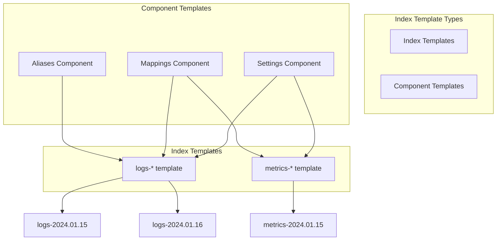

# How to Use Index Templates in Elasticsearch

Author: [nawazdhandala](https://www.github.com/nawazdhandala)

Tags: Elasticsearch, Index Templates, Automation, Index Management, DevOps

Description: Learn how to use Elasticsearch index templates to automatically apply settings, mappings, and aliases to new indices, with practical examples for time-series data and multi-tenant applications.

---

> Index templates let you define settings, mappings, and aliases that automatically apply to new indices matching a pattern. They're essential for managing time-series data, logs, and any scenario where indices are created dynamically. This guide shows you how to use templates effectively.

Instead of manually configuring each new index, templates ensure consistency and reduce operational overhead.

---

## Prerequisites

Before starting, ensure you have:
- Elasticsearch 8.x running
- Understanding of basic mappings and settings
- curl or Kibana Dev Tools

---

## Understanding Index Templates

There are two types of templates in modern Elasticsearch:



- **Component Templates**: Reusable building blocks containing settings, mappings, or aliases
- **Index Templates**: Combine component templates and define which indices they apply to

---

## Creating Component Templates

Start by creating reusable component templates:

```bash
# Settings component for hot data
curl -X PUT "localhost:9200/_component_template/hot_settings" -H 'Content-Type: application/json' -d'
{
  "template": {
    "settings": {
      "number_of_shards": 3,
      "number_of_replicas": 1,
      "refresh_interval": "5s",
      "index.routing.allocation.require.data": "hot"
    }
  }
}'

# Settings component for warm data
curl -X PUT "localhost:9200/_component_template/warm_settings" -H 'Content-Type: application/json' -d'
{
  "template": {
    "settings": {
      "number_of_shards": 1,
      "number_of_replicas": 1,
      "refresh_interval": "30s",
      "index.routing.allocation.require.data": "warm"
    }
  }
}'

# Common mappings for logs
curl -X PUT "localhost:9200/_component_template/log_mappings" -H 'Content-Type: application/json' -d'
{
  "template": {
    "mappings": {
      "properties": {
        "@timestamp": {
          "type": "date"
        },
        "message": {
          "type": "text"
        },
        "level": {
          "type": "keyword"
        },
        "service": {
          "type": "keyword"
        },
        "host": {
          "type": "keyword"
        },
        "trace_id": {
          "type": "keyword"
        },
        "span_id": {
          "type": "keyword"
        }
      }
    }
  }
}'

# Common mappings for metrics
curl -X PUT "localhost:9200/_component_template/metric_mappings" -H 'Content-Type: application/json' -d'
{
  "template": {
    "mappings": {
      "properties": {
        "@timestamp": {
          "type": "date"
        },
        "metric_name": {
          "type": "keyword"
        },
        "value": {
          "type": "double"
        },
        "tags": {
          "type": "object",
          "dynamic": true
        },
        "host": {
          "type": "keyword"
        },
        "service": {
          "type": "keyword"
        }
      }
    }
  }
}'

# Aliases component
curl -X PUT "localhost:9200/_component_template/log_aliases" -H 'Content-Type: application/json' -d'
{
  "template": {
    "aliases": {
      "logs": {},
      "all_logs": {}
    }
  }
}'
```

---

## Creating Index Templates

Combine component templates into index templates:

```bash
# Logs index template
curl -X PUT "localhost:9200/_index_template/logs_template" -H 'Content-Type: application/json' -d'
{
  "index_patterns": ["logs-*"],
  "priority": 100,
  "composed_of": ["hot_settings", "log_mappings", "log_aliases"],
  "template": {
    "settings": {
      "index.lifecycle.name": "logs_policy",
      "index.lifecycle.rollover_alias": "logs_write"
    }
  },
  "_meta": {
    "description": "Template for application logs",
    "version": "1.0.0"
  }
}'

# Metrics index template
curl -X PUT "localhost:9200/_index_template/metrics_template" -H 'Content-Type: application/json' -d'
{
  "index_patterns": ["metrics-*"],
  "priority": 100,
  "composed_of": ["hot_settings", "metric_mappings"],
  "template": {
    "aliases": {
      "metrics": {}
    }
  },
  "_meta": {
    "description": "Template for system metrics",
    "version": "1.0.0"
  }
}'
```

---

## Template Priority and Matching

When multiple templates match an index name, priority determines which one applies:

```bash
# General template with lower priority
curl -X PUT "localhost:9200/_index_template/general_logs" -H 'Content-Type: application/json' -d'
{
  "index_patterns": ["logs-*"],
  "priority": 50,
  "template": {
    "settings": {
      "number_of_shards": 1,
      "number_of_replicas": 0
    }
  }
}'

# Specific template with higher priority
curl -X PUT "localhost:9200/_index_template/production_logs" -H 'Content-Type: application/json' -d'
{
  "index_patterns": ["logs-prod-*"],
  "priority": 200,
  "template": {
    "settings": {
      "number_of_shards": 5,
      "number_of_replicas": 2
    }
  }
}'

# Now logs-prod-api will use production_logs (priority 200)
# And logs-dev-api will use general_logs (priority 50)
```

---

## Data Streams with Index Templates

Data streams are the modern way to handle time-series data:

```bash
# Component template for data stream mappings
curl -X PUT "localhost:9200/_component_template/datastream_mappings" -H 'Content-Type: application/json' -d'
{
  "template": {
    "mappings": {
      "properties": {
        "@timestamp": {
          "type": "date"
        },
        "message": {
          "type": "text"
        },
        "log.level": {
          "type": "keyword"
        },
        "host.name": {
          "type": "keyword"
        },
        "service.name": {
          "type": "keyword"
        },
        "error.message": {
          "type": "text"
        }
      }
    }
  }
}'

# Index template for data stream
curl -X PUT "localhost:9200/_index_template/app_logs_stream" -H 'Content-Type: application/json' -d'
{
  "index_patterns": ["app-logs-*"],
  "data_stream": {},
  "priority": 200,
  "composed_of": ["datastream_mappings"],
  "template": {
    "settings": {
      "number_of_shards": 1,
      "number_of_replicas": 1
    }
  }
}'

# Create the data stream by indexing data
curl -X POST "localhost:9200/app-logs-production/_doc" -H 'Content-Type: application/json' -d'
{
  "@timestamp": "2024-01-15T10:30:00Z",
  "message": "Application started successfully",
  "log.level": "INFO",
  "host.name": "server-01",
  "service.name": "api-gateway"
}'

# View data stream info
curl -X GET "localhost:9200/_data_stream/app-logs-production?pretty"
```

---

## Dynamic Templates within Index Templates

Control how unmapped fields are handled:

```bash
curl -X PUT "localhost:9200/_index_template/dynamic_logs" -H 'Content-Type: application/json' -d'
{
  "index_patterns": ["dynamic-logs-*"],
  "priority": 100,
  "template": {
    "mappings": {
      "dynamic_templates": [
        {
          "strings_as_keywords": {
            "match_mapping_type": "string",
            "mapping": {
              "type": "keyword",
              "ignore_above": 256
            }
          }
        },
        {
          "message_fields": {
            "match": "*_message",
            "match_mapping_type": "string",
            "mapping": {
              "type": "text",
              "analyzer": "standard"
            }
          }
        },
        {
          "date_fields": {
            "match": "*_at",
            "mapping": {
              "type": "date",
              "format": "strict_date_optional_time||epoch_millis"
            }
          }
        },
        {
          "numeric_labels": {
            "path_match": "labels.*",
            "match_mapping_type": "long",
            "mapping": {
              "type": "long"
            }
          }
        }
      ],
      "properties": {
        "@timestamp": {
          "type": "date"
        }
      }
    }
  }
}'
```

---

## Multi-Tenant Index Templates

Configure templates for multi-tenant applications:

```bash
# Base tenant component
curl -X PUT "localhost:9200/_component_template/tenant_base" -H 'Content-Type: application/json' -d'
{
  "template": {
    "mappings": {
      "properties": {
        "tenant_id": {
          "type": "keyword"
        },
        "created_at": {
          "type": "date"
        },
        "updated_at": {
          "type": "date"
        }
      }
    }
  }
}'

# Per-tenant template with dynamic tenant alias
curl -X PUT "localhost:9200/_index_template/tenant_data" -H 'Content-Type: application/json' -d'
{
  "index_patterns": ["tenant-*-data"],
  "priority": 100,
  "composed_of": ["tenant_base"],
  "template": {
    "settings": {
      "number_of_shards": 1,
      "number_of_replicas": 1
    },
    "mappings": {
      "properties": {
        "name": {
          "type": "text",
          "fields": {
            "keyword": {
              "type": "keyword"
            }
          }
        },
        "data": {
          "type": "object",
          "dynamic": true
        }
      }
    }
  }
}'

# Create tenant-specific index
curl -X PUT "localhost:9200/tenant-acme-data" -H 'Content-Type: application/json' -d'
{
  "aliases": {
    "tenant-acme": {
      "filter": {
        "term": {
          "tenant_id": "acme"
        }
      }
    }
  }
}'
```

---

## Managing Index Templates

Common operations for template management:

```bash
# List all index templates
curl -X GET "localhost:9200/_index_template?pretty"

# Get specific template
curl -X GET "localhost:9200/_index_template/logs_template?pretty"

# List all component templates
curl -X GET "localhost:9200/_component_template?pretty"

# Simulate template application to see what settings would be applied
curl -X POST "localhost:9200/_index_template/_simulate/logs_template?pretty"

# Simulate for a specific index name
curl -X POST "localhost:9200/_index_template/_simulate_index/logs-2024.01.15?pretty"

# Delete index template
curl -X DELETE "localhost:9200/_index_template/old_template"

# Delete component template
curl -X DELETE "localhost:9200/_component_template/old_component"
```

---

## Python Template Manager

Here's a complete template management utility:

```python
from elasticsearch import Elasticsearch
from typing import List, Dict, Any, Optional
import json

class TemplateManager:
    def __init__(self, hosts: List[str]):
        self.es = Elasticsearch(hosts)

    def create_component_template(
        self,
        name: str,
        template: Dict[str, Any],
        version: int = None,
        meta: Dict[str, Any] = None
    ) -> bool:
        """Create or update a component template"""

        body = {"template": template}

        if version:
            body["version"] = version
        if meta:
            body["_meta"] = meta

        self.es.cluster.put_component_template(name=name, body=body)
        return True

    def create_index_template(
        self,
        name: str,
        index_patterns: List[str],
        priority: int = 100,
        composed_of: List[str] = None,
        template: Dict[str, Any] = None,
        data_stream: bool = False,
        meta: Dict[str, Any] = None
    ) -> bool:
        """Create or update an index template"""

        body = {
            "index_patterns": index_patterns,
            "priority": priority
        }

        if composed_of:
            body["composed_of"] = composed_of
        if template:
            body["template"] = template
        if data_stream:
            body["data_stream"] = {}
        if meta:
            body["_meta"] = meta

        self.es.indices.put_index_template(name=name, body=body)
        return True

    def simulate_template(
        self,
        index_name: str
    ) -> Dict[str, Any]:
        """Simulate what template would apply to an index"""

        return self.es.indices.simulate_index_template(name=index_name)

    def list_templates(self) -> Dict[str, List[str]]:
        """List all templates"""

        index_templates = self.es.indices.get_index_template()
        component_templates = self.es.cluster.get_component_template()

        return {
            "index_templates": [t["name"] for t in index_templates.get("index_templates", [])],
            "component_templates": list(component_templates.get("component_templates", {}).keys())
        }

    def export_templates(self, output_file: str) -> bool:
        """Export all templates to a file"""

        index_templates = self.es.indices.get_index_template()
        component_templates = self.es.cluster.get_component_template()

        export_data = {
            "index_templates": index_templates.get("index_templates", []),
            "component_templates": component_templates.get("component_templates", [])
        }

        with open(output_file, "w") as f:
            json.dump(export_data, f, indent=2)

        return True

    def import_templates(self, input_file: str) -> Dict[str, int]:
        """Import templates from a file"""

        with open(input_file, "r") as f:
            data = json.load(f)

        counts = {"component_templates": 0, "index_templates": 0}

        # Import component templates first (dependencies)
        for ct in data.get("component_templates", []):
            name = ct["name"]
            body = {
                "template": ct["component_template"]["template"]
            }
            if "_meta" in ct["component_template"]:
                body["_meta"] = ct["component_template"]["_meta"]

            self.es.cluster.put_component_template(name=name, body=body)
            counts["component_templates"] += 1

        # Import index templates
        for it in data.get("index_templates", []):
            name = it["name"]
            template = it["index_template"]

            body = {
                "index_patterns": template["index_patterns"],
                "priority": template.get("priority", 100)
            }

            if "composed_of" in template:
                body["composed_of"] = template["composed_of"]
            if "template" in template:
                body["template"] = template["template"]
            if "data_stream" in template:
                body["data_stream"] = template["data_stream"]
            if "_meta" in template:
                body["_meta"] = template["_meta"]

            self.es.indices.put_index_template(name=name, body=body)
            counts["index_templates"] += 1

        return counts

    def delete_template(
        self,
        name: str,
        template_type: str = "index"
    ) -> bool:
        """Delete a template"""

        if template_type == "index":
            self.es.indices.delete_index_template(name=name)
        else:
            self.es.cluster.delete_component_template(name=name)

        return True

    def setup_logging_templates(self) -> Dict[str, bool]:
        """Set up a complete logging template structure"""

        results = {}

        # Settings component
        results["settings"] = self.create_component_template(
            name="log_settings",
            template={
                "settings": {
                    "number_of_shards": 1,
                    "number_of_replicas": 1,
                    "refresh_interval": "5s"
                }
            }
        )

        # Mappings component
        results["mappings"] = self.create_component_template(
            name="log_mappings",
            template={
                "mappings": {
                    "properties": {
                        "@timestamp": {"type": "date"},
                        "message": {"type": "text"},
                        "level": {"type": "keyword"},
                        "logger": {"type": "keyword"},
                        "service": {"type": "keyword"},
                        "environment": {"type": "keyword"},
                        "trace_id": {"type": "keyword"},
                        "error": {
                            "properties": {
                                "message": {"type": "text"},
                                "stack_trace": {"type": "text"},
                                "type": {"type": "keyword"}
                            }
                        }
                    }
                }
            }
        )

        # Index template
        results["template"] = self.create_index_template(
            name="application_logs",
            index_patterns=["logs-*"],
            priority=100,
            composed_of=["log_settings", "log_mappings"],
            meta={
                "description": "Template for application logs",
                "managed_by": "template_manager"
            }
        )

        return results


# Usage example
if __name__ == "__main__":
    manager = TemplateManager(["localhost:9200"])

    # Set up logging templates
    print("Setting up logging templates...")
    results = manager.setup_logging_templates()
    for name, success in results.items():
        status = "OK" if success else "FAILED"
        print(f"  {name}: {status}")

    # List all templates
    print("\nCurrent templates:")
    templates = manager.list_templates()
    print(f"  Index templates: {templates['index_templates']}")
    print(f"  Component templates: {templates['component_templates']}")

    # Simulate template for an index
    print("\nSimulating template for logs-2024.01.15:")
    simulation = manager.simulate_template("logs-2024.01.15")
    print(f"  Would apply: {simulation.get('template', {}).keys()}")

    # Export templates
    print("\nExporting templates to templates_backup.json...")
    manager.export_templates("templates_backup.json")
    print("  Done!")
```

---

## Best Practices

**Template Organization:**
- Use component templates for shared configurations
- Name templates descriptively (e.g., `logs-production`, not `template1`)
- Document templates with `_meta` field

**Priority Management:**
- Use consistent priority ranges (e.g., 0-99 for defaults, 100-199 for standard, 200+ for specific)
- Test priority resolution with `_simulate_index`

**Versioning:**
- Include version numbers in `_meta`
- Export templates to version control
- Test template changes in staging first

**Data Streams:**
- Use data streams for append-only time-series data
- Prefer data streams over manual rollover management

---

## Conclusion

Index templates are essential for managing Elasticsearch at scale. They ensure consistency, reduce manual configuration, and enable automation. Key takeaways:

- Component templates provide reusable building blocks
- Index templates combine components and match patterns
- Priority determines which template applies when multiple match
- Data streams simplify time-series data management

With well-designed templates, you can confidently create new indices knowing they'll have the right settings, mappings, and aliases automatically applied.

---

*Need to monitor your Elasticsearch template configurations? [OneUptime](https://oneuptime.com) provides infrastructure monitoring and alerting for your entire stack.*
