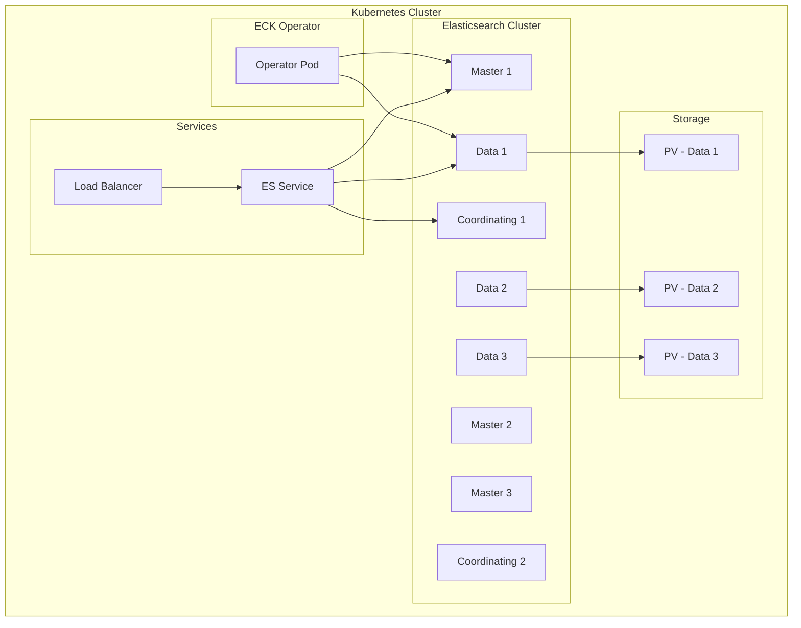

# How to Deploy Elasticsearch on Kubernetes

Author: [nawazdhandala](https://www.github.com/nawazdhandala)

Tags: Elasticsearch, Kubernetes, ECK, Deployment, Cloud Native, Containers

Description: A practical guide to deploying Elasticsearch on Kubernetes using the Elastic Cloud on Kubernetes (ECK) operator, covering installation, configuration, scaling, and production best practices.

---

> Running Elasticsearch on Kubernetes combines the power of distributed search with container orchestration. The Elastic Cloud on Kubernetes (ECK) operator simplifies deployment and management, handling complex operational tasks automatically. This guide shows you how to deploy production-ready Elasticsearch on Kubernetes.

ECK manages the complete lifecycle of Elasticsearch clusters including deployment, upgrades, scaling, and configuration changes.

---

## Prerequisites

Before starting, ensure you have:
- Kubernetes cluster (1.25+) with sufficient resources
- kubectl configured and working
- Helm 3.x installed (optional)
- Storage class with dynamic provisioning

---

## Architecture Overview



---

## Step 1: Install ECK Operator

Install the ECK operator using kubectl:

```bash
# Install ECK Custom Resource Definitions
kubectl create -f https://download.elastic.co/downloads/eck/2.11.0/crds.yaml

# Install ECK operator with RBAC
kubectl apply -f https://download.elastic.co/downloads/eck/2.11.0/operator.yaml

# Verify operator is running
kubectl -n elastic-system get pods

# Check operator logs
kubectl -n elastic-system logs -f statefulset.apps/elastic-operator
```

Alternatively, use Helm:

```bash
# Add Elastic Helm repository
helm repo add elastic https://helm.elastic.co
helm repo update

# Install ECK operator
helm install elastic-operator elastic/eck-operator \
  -n elastic-system \
  --create-namespace \
  --set webhook.enabled=true
```

---

## Step 2: Deploy a Basic Elasticsearch Cluster

Create a simple single-node cluster for development:

```yaml
# elasticsearch-dev.yaml
apiVersion: elasticsearch.k8s.elastic.co/v1
kind: Elasticsearch
metadata:
  name: elasticsearch-dev
  namespace: elastic
spec:
  version: 8.12.0
  nodeSets:
  - name: default
    count: 1
    config:
      node.store.allow_mmap: false
    podTemplate:
      spec:
        containers:
        - name: elasticsearch
          resources:
            requests:
              memory: 2Gi
              cpu: 1
            limits:
              memory: 2Gi
              cpu: 2
    volumeClaimTemplates:
    - metadata:
        name: elasticsearch-data
      spec:
        accessModes:
        - ReadWriteOnce
        resources:
          requests:
            storage: 10Gi
        storageClassName: standard
```

Apply the configuration:

```bash
# Create namespace
kubectl create namespace elastic

# Deploy Elasticsearch
kubectl apply -f elasticsearch-dev.yaml

# Watch deployment progress
kubectl -n elastic get elasticsearch -w

# Get cluster health
kubectl -n elastic get elasticsearch elasticsearch-dev -o jsonpath='{.status.health}'
```

---

## Step 3: Production Cluster Configuration

Deploy a production-ready cluster with dedicated node roles:

```yaml
# elasticsearch-prod.yaml
apiVersion: elasticsearch.k8s.elastic.co/v1
kind: Elasticsearch
metadata:
  name: elasticsearch-prod
  namespace: elastic
spec:
  version: 8.12.0
  http:
    tls:
      selfSignedCertificate:
        disabled: false
  nodeSets:
  # Master nodes - manage cluster state
  - name: master
    count: 3
    config:
      node.roles: ["master"]
      cluster.routing.allocation.awareness.attributes: zone
    podTemplate:
      spec:
        affinity:
          podAntiAffinity:
            requiredDuringSchedulingIgnoredDuringExecution:
            - labelSelector:
                matchLabels:
                  elasticsearch.k8s.elastic.co/cluster-name: elasticsearch-prod
                  elasticsearch.k8s.elastic.co/statefulset-name: elasticsearch-prod-es-master
              topologyKey: topology.kubernetes.io/zone
        containers:
        - name: elasticsearch
          resources:
            requests:
              memory: 4Gi
              cpu: 1
            limits:
              memory: 4Gi
              cpu: 2
          env:
          - name: ES_JAVA_OPTS
            value: "-Xms2g -Xmx2g"
        initContainers:
        - name: sysctl
          securityContext:
            privileged: true
            runAsUser: 0
          command: ['sh', '-c', 'sysctl -w vm.max_map_count=262144']
    volumeClaimTemplates:
    - metadata:
        name: elasticsearch-data
      spec:
        accessModes:
        - ReadWriteOnce
        resources:
          requests:
            storage: 10Gi
        storageClassName: fast-ssd

  # Data nodes - store and query data
  - name: data
    count: 3
    config:
      node.roles: ["data", "ingest"]
      cluster.routing.allocation.awareness.attributes: zone
    podTemplate:
      spec:
        affinity:
          podAntiAffinity:
            preferredDuringSchedulingIgnoredDuringExecution:
            - weight: 100
              podAffinityTerm:
                labelSelector:
                  matchLabels:
                    elasticsearch.k8s.elastic.co/cluster-name: elasticsearch-prod
                    elasticsearch.k8s.elastic.co/statefulset-name: elasticsearch-prod-es-data
                topologyKey: topology.kubernetes.io/zone
        containers:
        - name: elasticsearch
          resources:
            requests:
              memory: 16Gi
              cpu: 4
            limits:
              memory: 16Gi
              cpu: 8
          env:
          - name: ES_JAVA_OPTS
            value: "-Xms8g -Xmx8g"
        initContainers:
        - name: sysctl
          securityContext:
            privileged: true
            runAsUser: 0
          command: ['sh', '-c', 'sysctl -w vm.max_map_count=262144']
    volumeClaimTemplates:
    - metadata:
        name: elasticsearch-data
      spec:
        accessModes:
        - ReadWriteOnce
        resources:
          requests:
            storage: 500Gi
        storageClassName: fast-ssd

  # Coordinating nodes - handle client requests
  - name: coordinating
    count: 2
    config:
      node.roles: []
    podTemplate:
      spec:
        containers:
        - name: elasticsearch
          resources:
            requests:
              memory: 4Gi
              cpu: 2
            limits:
              memory: 4Gi
              cpu: 4
          env:
          - name: ES_JAVA_OPTS
            value: "-Xms2g -Xmx2g"
        initContainers:
        - name: sysctl
          securityContext:
            privileged: true
            runAsUser: 0
          command: ['sh', '-c', 'sysctl -w vm.max_map_count=262144']
    volumeClaimTemplates:
    - metadata:
        name: elasticsearch-data
      spec:
        accessModes:
        - ReadWriteOnce
        resources:
          requests:
            storage: 10Gi
        storageClassName: standard
```

---

## Step 4: Accessing Elasticsearch

### Get Credentials

```bash
# Get the elastic user password
kubectl -n elastic get secret elasticsearch-prod-es-elastic-user -o jsonpath='{.data.elastic}' | base64 -d

# Get the CA certificate
kubectl -n elastic get secret elasticsearch-prod-es-http-certs-public -o jsonpath='{.data.tls\.crt}' | base64 -d > ca.crt
```

### Port Forward for Local Access

```bash
# Forward the Elasticsearch HTTP port
kubectl -n elastic port-forward svc/elasticsearch-prod-es-http 9200:9200

# Test connection (in another terminal)
curl -k -u elastic:$(kubectl -n elastic get secret elasticsearch-prod-es-elastic-user -o jsonpath='{.data.elastic}' | base64 -d) https://localhost:9200
```

### Create a LoadBalancer Service

```yaml
# elasticsearch-lb.yaml
apiVersion: v1
kind: Service
metadata:
  name: elasticsearch-lb
  namespace: elastic
spec:
  type: LoadBalancer
  selector:
    elasticsearch.k8s.elastic.co/cluster-name: elasticsearch-prod
    elasticsearch.k8s.elastic.co/node-master: "false"
  ports:
  - port: 9200
    targetPort: 9200
```

---

## Step 5: Scaling the Cluster

### Horizontal Scaling

```bash
# Edit the Elasticsearch resource
kubectl -n elastic edit elasticsearch elasticsearch-prod

# Or patch to scale data nodes
kubectl -n elastic patch elasticsearch elasticsearch-prod --type='merge' -p '
{
  "spec": {
    "nodeSets": [
      {
        "name": "data",
        "count": 5
      }
    ]
  }
}'
```

### Vertical Scaling

```yaml
# Update resources in the nodeSets
apiVersion: elasticsearch.k8s.elastic.co/v1
kind: Elasticsearch
metadata:
  name: elasticsearch-prod
  namespace: elastic
spec:
  nodeSets:
  - name: data
    count: 3
    podTemplate:
      spec:
        containers:
        - name: elasticsearch
          resources:
            requests:
              memory: 32Gi  # Increased from 16Gi
              cpu: 8        # Increased from 4
            limits:
              memory: 32Gi
              cpu: 16
          env:
          - name: ES_JAVA_OPTS
            value: "-Xms16g -Xmx16g"  # Half of memory
```

---

## Step 6: Configure Snapshots with S3

```yaml
# elasticsearch-with-snapshots.yaml
apiVersion: elasticsearch.k8s.elastic.co/v1
kind: Elasticsearch
metadata:
  name: elasticsearch-prod
  namespace: elastic
spec:
  version: 8.12.0
  secureSettings:
  - secretName: s3-credentials
  nodeSets:
  - name: data
    count: 3
    config:
      node.roles: ["data", "ingest"]
    podTemplate:
      spec:
        containers:
        - name: elasticsearch
          resources:
            requests:
              memory: 16Gi
              cpu: 4
            limits:
              memory: 16Gi
              cpu: 8
---
# Create secret with S3 credentials
apiVersion: v1
kind: Secret
metadata:
  name: s3-credentials
  namespace: elastic
type: Opaque
stringData:
  s3.client.default.access_key: "YOUR_ACCESS_KEY"
  s3.client.default.secret_key: "YOUR_SECRET_KEY"
```

Register the snapshot repository:

```bash
# Create S3 repository
curl -k -u elastic:$ES_PASSWORD -X PUT "https://localhost:9200/_snapshot/s3_backup" -H 'Content-Type: application/json' -d'
{
  "type": "s3",
  "settings": {
    "bucket": "my-elasticsearch-backups",
    "region": "us-east-1",
    "base_path": "production"
  }
}'
```

---

## Step 7: Monitoring with Prometheus

```yaml
# Enable metrics endpoint
apiVersion: elasticsearch.k8s.elastic.co/v1
kind: Elasticsearch
metadata:
  name: elasticsearch-prod
  namespace: elastic
spec:
  version: 8.12.0
  monitoring:
    metrics:
      elasticsearchRefs:
      - name: elasticsearch-prod
    logs:
      elasticsearchRefs:
      - name: elasticsearch-prod
  nodeSets:
  - name: data
    count: 3
    podTemplate:
      metadata:
        annotations:
          prometheus.io/scrape: "true"
          prometheus.io/port: "9114"
      spec:
        containers:
        - name: elasticsearch
          # ... resources
        - name: exporter
          image: quay.io/prometheuscommunity/elasticsearch-exporter:v1.6.0
          args:
          - --es.uri=https://localhost:9200
          - --es.all
          - --es.ssl-skip-verify
          ports:
          - containerPort: 9114
            name: metrics
          env:
          - name: ES_USERNAME
            value: elastic
          - name: ES_PASSWORD
            valueFrom:
              secretKeyRef:
                name: elasticsearch-prod-es-elastic-user
                key: elastic
```

---

## Python Kubernetes Client for ECK

Here's a utility for managing ECK deployments:

```python
from kubernetes import client, config
from kubernetes.client.rest import ApiException
import yaml
import time
from typing import Dict, Any, Optional
import base64

class ECKManager:
    def __init__(self, kubeconfig_path: str = None):
        if kubeconfig_path:
            config.load_kube_config(config_file=kubeconfig_path)
        else:
            try:
                config.load_incluster_config()
            except:
                config.load_kube_config()

        self.custom_api = client.CustomObjectsApi()
        self.core_api = client.CoreV1Api()

    def create_elasticsearch(
        self,
        name: str,
        namespace: str,
        version: str = "8.12.0",
        master_count: int = 3,
        data_count: int = 3,
        data_storage: str = "100Gi",
        data_memory: str = "8Gi",
        storage_class: str = "standard"
    ) -> Dict[str, Any]:
        """Create an Elasticsearch cluster"""

        # Calculate heap size (half of memory)
        memory_gb = int(data_memory.replace("Gi", ""))
        heap_size = memory_gb // 2

        spec = {
            "apiVersion": "elasticsearch.k8s.elastic.co/v1",
            "kind": "Elasticsearch",
            "metadata": {
                "name": name,
                "namespace": namespace
            },
            "spec": {
                "version": version,
                "nodeSets": [
                    {
                        "name": "master",
                        "count": master_count,
                        "config": {
                            "node.roles": ["master"]
                        },
                        "podTemplate": {
                            "spec": {
                                "containers": [{
                                    "name": "elasticsearch",
                                    "resources": {
                                        "requests": {"memory": "4Gi", "cpu": "1"},
                                        "limits": {"memory": "4Gi", "cpu": "2"}
                                    },
                                    "env": [{
                                        "name": "ES_JAVA_OPTS",
                                        "value": "-Xms2g -Xmx2g"
                                    }]
                                }],
                                "initContainers": [{
                                    "name": "sysctl",
                                    "securityContext": {
                                        "privileged": True,
                                        "runAsUser": 0
                                    },
                                    "command": ["sh", "-c", "sysctl -w vm.max_map_count=262144"]
                                }]
                            }
                        },
                        "volumeClaimTemplates": [{
                            "metadata": {"name": "elasticsearch-data"},
                            "spec": {
                                "accessModes": ["ReadWriteOnce"],
                                "resources": {"requests": {"storage": "10Gi"}},
                                "storageClassName": storage_class
                            }
                        }]
                    },
                    {
                        "name": "data",
                        "count": data_count,
                        "config": {
                            "node.roles": ["data", "ingest"]
                        },
                        "podTemplate": {
                            "spec": {
                                "containers": [{
                                    "name": "elasticsearch",
                                    "resources": {
                                        "requests": {"memory": data_memory, "cpu": "4"},
                                        "limits": {"memory": data_memory, "cpu": "8"}
                                    },
                                    "env": [{
                                        "name": "ES_JAVA_OPTS",
                                        "value": f"-Xms{heap_size}g -Xmx{heap_size}g"
                                    }]
                                }],
                                "initContainers": [{
                                    "name": "sysctl",
                                    "securityContext": {
                                        "privileged": True,
                                        "runAsUser": 0
                                    },
                                    "command": ["sh", "-c", "sysctl -w vm.max_map_count=262144"]
                                }]
                            }
                        },
                        "volumeClaimTemplates": [{
                            "metadata": {"name": "elasticsearch-data"},
                            "spec": {
                                "accessModes": ["ReadWriteOnce"],
                                "resources": {"requests": {"storage": data_storage}},
                                "storageClassName": storage_class
                            }
                        }]
                    }
                ]
            }
        }

        return self.custom_api.create_namespaced_custom_object(
            group="elasticsearch.k8s.elastic.co",
            version="v1",
            namespace=namespace,
            plural="elasticsearches",
            body=spec
        )

    def get_elasticsearch(
        self,
        name: str,
        namespace: str
    ) -> Dict[str, Any]:
        """Get Elasticsearch cluster status"""

        return self.custom_api.get_namespaced_custom_object(
            group="elasticsearch.k8s.elastic.co",
            version="v1",
            namespace=namespace,
            plural="elasticsearches",
            name=name
        )

    def get_cluster_health(
        self,
        name: str,
        namespace: str
    ) -> str:
        """Get cluster health status"""

        es = self.get_elasticsearch(name, namespace)
        return es.get("status", {}).get("health", "unknown")

    def wait_for_green(
        self,
        name: str,
        namespace: str,
        timeout_minutes: int = 15
    ) -> bool:
        """Wait for cluster to become green"""

        start_time = time.time()
        timeout_seconds = timeout_minutes * 60

        while time.time() - start_time < timeout_seconds:
            health = self.get_cluster_health(name, namespace)
            print(f"Cluster health: {health}")

            if health == "green":
                return True

            time.sleep(30)

        return False

    def scale_data_nodes(
        self,
        name: str,
        namespace: str,
        count: int
    ) -> Dict[str, Any]:
        """Scale the number of data nodes"""

        patch = {
            "spec": {
                "nodeSets": [
                    {"name": "data", "count": count}
                ]
            }
        }

        return self.custom_api.patch_namespaced_custom_object(
            group="elasticsearch.k8s.elastic.co",
            version="v1",
            namespace=namespace,
            plural="elasticsearches",
            name=name,
            body=patch
        )

    def get_password(
        self,
        name: str,
        namespace: str
    ) -> str:
        """Get the elastic user password"""

        secret_name = f"{name}-es-elastic-user"
        secret = self.core_api.read_namespaced_secret(secret_name, namespace)
        return base64.b64decode(secret.data["elastic"]).decode()

    def delete_elasticsearch(
        self,
        name: str,
        namespace: str
    ) -> None:
        """Delete an Elasticsearch cluster"""

        self.custom_api.delete_namespaced_custom_object(
            group="elasticsearch.k8s.elastic.co",
            version="v1",
            namespace=namespace,
            plural="elasticsearches",
            name=name
        )

    def list_clusters(
        self,
        namespace: str = None
    ) -> list:
        """List all Elasticsearch clusters"""

        if namespace:
            result = self.custom_api.list_namespaced_custom_object(
                group="elasticsearch.k8s.elastic.co",
                version="v1",
                namespace=namespace,
                plural="elasticsearches"
            )
        else:
            result = self.custom_api.list_cluster_custom_object(
                group="elasticsearch.k8s.elastic.co",
                version="v1",
                plural="elasticsearches"
            )

        clusters = []
        for item in result.get("items", []):
            clusters.append({
                "name": item["metadata"]["name"],
                "namespace": item["metadata"]["namespace"],
                "version": item["spec"]["version"],
                "health": item.get("status", {}).get("health", "unknown"),
                "phase": item.get("status", {}).get("phase", "unknown")
            })

        return clusters


# Usage example
if __name__ == "__main__":
    manager = ECKManager()

    # Create a new cluster
    print("Creating Elasticsearch cluster...")
    manager.create_elasticsearch(
        name="my-cluster",
        namespace="elastic",
        version="8.12.0",
        master_count=3,
        data_count=3,
        data_storage="100Gi",
        data_memory="16Gi",
        storage_class="fast-ssd"
    )

    # Wait for cluster to be ready
    print("Waiting for cluster to be green...")
    if manager.wait_for_green("my-cluster", "elastic"):
        print("Cluster is ready!")

        # Get password
        password = manager.get_password("my-cluster", "elastic")
        print(f"Elastic user password: {password}")

    # List all clusters
    print("\nAll clusters:")
    for cluster in manager.list_clusters():
        print(f"  {cluster['namespace']}/{cluster['name']}: {cluster['health']}")
```

---

## Best Practices

**Resource Planning:**
- Allocate heap to half of container memory
- Use node anti-affinity for high availability
- Size persistent volumes with growth in mind

**High Availability:**
- Deploy across multiple availability zones
- Use dedicated master nodes (minimum 3)
- Configure pod disruption budgets

**Security:**
- Keep TLS enabled (ECK default)
- Rotate certificates before expiry
- Use network policies to restrict access

**Operations:**
- Monitor with Prometheus/Grafana
- Set up automated snapshots
- Test disaster recovery procedures

---

## Conclusion

ECK simplifies Elasticsearch deployment on Kubernetes significantly. Key takeaways:

- ECK handles complex lifecycle management automatically
- Separate node roles for production deployments
- Use persistent volumes with appropriate storage classes
- Monitor cluster health and automate snapshots

With ECK, you can run production Elasticsearch clusters on Kubernetes with confidence.

---

*Need to monitor your Kubernetes-based Elasticsearch clusters? [OneUptime](https://oneuptime.com) provides unified observability for cloud-native infrastructure.*
