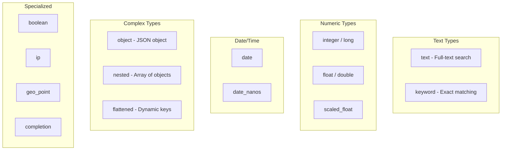

# How to Configure Mappings in Elasticsearch

Author: [nawazdhandala](https://www.github.com/nawazdhandala)

Tags: Elasticsearch, Mappings, Schema, Field Types, Index Configuration, Data Modeling

Description: Learn how to design and configure Elasticsearch mappings for optimal search and storage, covering field types, multi-fields, dynamic mappings, and schema evolution strategies.

---

> Mappings in Elasticsearch define how documents and their fields are stored and indexed. Getting mappings right is crucial because changing them after data is indexed often requires reindexing. This guide covers everything you need to know about designing effective mappings.

Think of mappings as your schema definition. Unlike traditional databases, Elasticsearch can infer mappings automatically, but explicit mappings give you control over how your data behaves.

---

## Prerequisites

Before starting, ensure you have:
- Elasticsearch 8.x running
- Basic understanding of JSON document structure
- curl or Kibana Dev Tools

---

## Core Field Types

Elasticsearch supports many field types. Here are the ones you'll use most often:



---

## Creating an Index with Explicit Mappings

Here's a comprehensive example covering common field types:

```bash
# Create an index with explicit mappings
curl -X PUT "localhost:9200/products" -H 'Content-Type: application/json' -d'
{
  "settings": {
    "number_of_shards": 3,
    "number_of_replicas": 1
  },
  "mappings": {
    "properties": {
      "product_id": {
        "type": "keyword"
      },
      "name": {
        "type": "text",
        "fields": {
          "keyword": {
            "type": "keyword",
            "ignore_above": 256
          }
        }
      },
      "description": {
        "type": "text",
        "analyzer": "english"
      },
      "price": {
        "type": "scaled_float",
        "scaling_factor": 100
      },
      "quantity": {
        "type": "integer"
      },
      "rating": {
        "type": "float"
      },
      "is_active": {
        "type": "boolean"
      },
      "category": {
        "type": "keyword"
      },
      "tags": {
        "type": "keyword"
      },
      "created_at": {
        "type": "date",
        "format": "strict_date_optional_time||epoch_millis"
      },
      "updated_at": {
        "type": "date"
      },
      "metadata": {
        "type": "object",
        "properties": {
          "sku": { "type": "keyword" },
          "weight": { "type": "float" },
          "dimensions": {
            "type": "object",
            "properties": {
              "width": { "type": "float" },
              "height": { "type": "float" },
              "depth": { "type": "float" }
            }
          }
        }
      },
      "location": {
        "type": "geo_point"
      }
    }
  }
}'
```

---

## Text vs Keyword Fields

Understanding the difference between text and keyword is fundamental:

```bash
# text field - analyzed for full-text search
# "Quick Brown Fox" becomes tokens: [quick, brown, fox]
{
  "description": {
    "type": "text",
    "analyzer": "standard"
  }
}

# keyword field - not analyzed, for exact matching
# "Quick Brown Fox" stays as single term: [Quick Brown Fox]
{
  "status": {
    "type": "keyword"
  }
}

# Multi-field - supports both use cases
{
  "name": {
    "type": "text",
    "fields": {
      "keyword": {
        "type": "keyword",
        "ignore_above": 256
      },
      "autocomplete": {
        "type": "text",
        "analyzer": "autocomplete_analyzer"
      }
    }
  }
}
```

Query examples showing the difference:

```bash
# Full-text search on text field
curl -X GET "localhost:9200/products/_search?pretty" -H 'Content-Type: application/json' -d'
{
  "query": {
    "match": {
      "name": "brown fox"
    }
  }
}'

# Exact match on keyword field (or multi-field)
curl -X GET "localhost:9200/products/_search?pretty" -H 'Content-Type: application/json' -d'
{
  "query": {
    "term": {
      "name.keyword": "Quick Brown Fox"
    }
  }
}'

# Aggregation on keyword field
curl -X GET "localhost:9200/products/_search?pretty" -H 'Content-Type: application/json' -d'
{
  "aggs": {
    "popular_names": {
      "terms": {
        "field": "name.keyword",
        "size": 10
      }
    }
  }
}'
```

---

## Numeric Field Types

Choose the right numeric type for your data:

```bash
# Integer types - use smallest that fits your data
{
  "quantity": {
    "type": "integer"
  },
  "view_count": {
    "type": "long"
  }
}

# Floating point types
{
  "rating": {
    "type": "float"
  },
  "latitude": {
    "type": "double"
  }
}

# Scaled float - stores as long, saves space for prices
# 19.99 stored as 1999 with scaling_factor: 100
{
  "price": {
    "type": "scaled_float",
    "scaling_factor": 100
  }
}
```

---

## Date Fields

Configure date formats to match your data:

```bash
# Basic date field with default format
{
  "created_at": {
    "type": "date"
  }
}

# Multiple format support
{
  "timestamp": {
    "type": "date",
    "format": "strict_date_optional_time||epoch_millis||yyyy-MM-dd HH:mm:ss"
  }
}

# Date with nanosecond precision
{
  "precise_timestamp": {
    "type": "date_nanos"
  }
}
```

Supported date values:

```bash
# All these work with default date format
{"created_at": "2024-01-15"}
{"created_at": "2024-01-15T10:30:00Z"}
{"created_at": "2024-01-15T10:30:00.000Z"}
{"created_at": 1705315800000}  # epoch milliseconds
```

---

## Object and Nested Types

For structured data within documents:

```bash
# Object type - flattened internally
# Good for single objects, queries match across all objects
{
  "address": {
    "type": "object",
    "properties": {
      "street": { "type": "text" },
      "city": { "type": "keyword" },
      "zip": { "type": "keyword" }
    }
  }
}

# Nested type - maintains array element boundaries
# Required when you need to query within array elements
{
  "reviews": {
    "type": "nested",
    "properties": {
      "author": { "type": "keyword" },
      "rating": { "type": "integer" },
      "comment": { "type": "text" },
      "date": { "type": "date" }
    }
  }
}
```

The critical difference with arrays:

```bash
# With object type, this query might match incorrectly
# Doc has reviews: [{author: "Alice", rating: 5}, {author: "Bob", rating: 2}]
# Query for "Alice AND rating: 2" would MATCH (wrong!)
{
  "query": {
    "bool": {
      "must": [
        { "term": { "reviews.author": "Alice" } },
        { "term": { "reviews.rating": 2 } }
      ]
    }
  }
}

# With nested type, use nested query for correct behavior
{
  "query": {
    "nested": {
      "path": "reviews",
      "query": {
        "bool": {
          "must": [
            { "term": { "reviews.author": "Alice" } },
            { "term": { "reviews.rating": 2 } }
          ]
        }
      }
    }
  }
}
```

---

## Dynamic Mapping Control

Control how Elasticsearch handles unmapped fields:

```bash
# Strict - reject documents with unknown fields
curl -X PUT "localhost:9200/strict_index" -H 'Content-Type: application/json' -d'
{
  "mappings": {
    "dynamic": "strict",
    "properties": {
      "name": { "type": "text" },
      "email": { "type": "keyword" }
    }
  }
}'

# Runtime - map unknown fields at query time only
curl -X PUT "localhost:9200/runtime_index" -H 'Content-Type: application/json' -d'
{
  "mappings": {
    "dynamic": "runtime",
    "properties": {
      "name": { "type": "text" }
    }
  }
}'

# False - ignore unknown fields (don't index them)
curl -X PUT "localhost:9200/ignore_index" -H 'Content-Type: application/json' -d'
{
  "mappings": {
    "dynamic": false,
    "properties": {
      "name": { "type": "text" }
    }
  }
}'
```

---

## Dynamic Templates

Define rules for automatically mapping new fields:

```bash
curl -X PUT "localhost:9200/logs" -H 'Content-Type: application/json' -d'
{
  "mappings": {
    "dynamic_templates": [
      {
        "strings_as_keywords": {
          "match_mapping_type": "string",
          "mapping": {
            "type": "keyword"
          }
        }
      },
      {
        "longs_as_integers": {
          "match_mapping_type": "long",
          "mapping": {
            "type": "integer"
          }
        }
      },
      {
        "message_fields": {
          "match": "*_message",
          "mapping": {
            "type": "text",
            "analyzer": "english"
          }
        }
      },
      {
        "timestamp_fields": {
          "match": "*_at",
          "mapping": {
            "type": "date",
            "format": "strict_date_optional_time||epoch_millis"
          }
        }
      },
      {
        "ip_fields": {
          "match": "*_ip",
          "mapping": {
            "type": "ip"
          }
        }
      }
    ],
    "properties": {
      "@timestamp": { "type": "date" },
      "level": { "type": "keyword" }
    }
  }
}'
```

---

## Field Parameters

Important parameters you can set on fields:

```bash
{
  "properties": {
    "internal_id": {
      "type": "keyword",
      "index": false,
      "doc_values": false
    },
    "name": {
      "type": "text",
      "norms": false,
      "index_options": "docs"
    },
    "description": {
      "type": "text",
      "store": true
    },
    "category": {
      "type": "keyword",
      "null_value": "uncategorized"
    },
    "tags": {
      "type": "keyword",
      "ignore_above": 100
    },
    "source": {
      "type": "keyword",
      "normalizer": "lowercase"
    },
    "priority": {
      "type": "integer",
      "coerce": true
    }
  }
}
```

Parameter explanations:
- **index**: Set to false if you don't need to search on this field
- **doc_values**: Set to false if you don't need sorting/aggregations
- **norms**: Disable for fields where you don't need scoring
- **store**: Store field separately for retrieval without _source
- **null_value**: Value to index when field is null
- **ignore_above**: Skip indexing strings longer than this
- **normalizer**: Apply normalization to keyword fields
- **coerce**: Convert strings to numbers automatically

---

## Runtime Fields

Add computed fields without reindexing:

```bash
# Add runtime field to existing index
curl -X PUT "localhost:9200/products/_mapping" -H 'Content-Type: application/json' -d'
{
  "runtime": {
    "price_with_tax": {
      "type": "double",
      "script": {
        "source": "emit(doc[\"price\"].value * 1.1)"
      }
    },
    "full_name": {
      "type": "keyword",
      "script": {
        "source": "emit(doc[\"first_name\"].value + \" \" + doc[\"last_name\"].value)"
      }
    },
    "day_of_week": {
      "type": "keyword",
      "script": {
        "source": "emit(doc[\"created_at\"].value.dayOfWeekEnum.getDisplayName(TextStyle.FULL, Locale.ROOT))"
      }
    }
  }
}'

# Query using runtime fields
curl -X GET "localhost:9200/products/_search?pretty" -H 'Content-Type: application/json' -d'
{
  "query": {
    "range": {
      "price_with_tax": {
        "gte": 100,
        "lte": 200
      }
    }
  },
  "fields": ["name", "price", "price_with_tax"]
}'

# Define runtime field in search request only
curl -X GET "localhost:9200/products/_search?pretty" -H 'Content-Type: application/json' -d'
{
  "runtime_mappings": {
    "discount_price": {
      "type": "double",
      "script": {
        "source": "emit(doc[\"price\"].value * 0.9)"
      }
    }
  },
  "query": {
    "match_all": {}
  },
  "fields": ["name", "price", "discount_price"]
}'
```

---

## Mapping Best Practices

### 1. Plan Your Mappings Upfront

```bash
# Good: Explicit mapping with thought-out field types
{
  "mappings": {
    "properties": {
      "user_id": { "type": "keyword" },
      "email": { "type": "keyword" },
      "name": {
        "type": "text",
        "fields": {
          "keyword": { "type": "keyword" }
        }
      },
      "age": { "type": "short" },
      "balance": {
        "type": "scaled_float",
        "scaling_factor": 100
      }
    }
  }
}
```

### 2. Use Appropriate Text Analyzers

```bash
# Configure language-specific analyzers
{
  "settings": {
    "analysis": {
      "analyzer": {
        "content_english": {
          "type": "english"
        },
        "content_french": {
          "type": "french"
        }
      }
    }
  },
  "mappings": {
    "properties": {
      "content_en": {
        "type": "text",
        "analyzer": "content_english"
      },
      "content_fr": {
        "type": "text",
        "analyzer": "content_french"
      }
    }
  }
}
```

### 3. Disable Features You Don't Need

```bash
# Optimize for specific use cases
{
  "properties": {
    "log_message": {
      "type": "text",
      "norms": false,
      "index_options": "freqs"
    },
    "internal_reference": {
      "type": "keyword",
      "index": false,
      "doc_values": false
    }
  }
}
```

---

## Python Mapping Helper

A helper class for managing mappings:

```python
from elasticsearch import Elasticsearch
from typing import Dict, Any, List, Optional

class MappingManager:
    def __init__(self, hosts: List[str]):
        self.es = Elasticsearch(hosts)

    def create_index_with_mapping(
        self,
        index_name: str,
        mapping: Dict[str, Any],
        settings: Optional[Dict[str, Any]] = None
    ) -> bool:
        """Create an index with explicit mapping"""

        body = {
            "mappings": mapping
        }

        if settings:
            body["settings"] = settings

        self.es.indices.create(index=index_name, body=body)
        return True

    def get_mapping(self, index_name: str) -> Dict[str, Any]:
        """Retrieve current mapping for an index"""
        return self.es.indices.get_mapping(index=index_name)

    def add_field(
        self,
        index_name: str,
        field_name: str,
        field_config: Dict[str, Any]
    ) -> bool:
        """Add a new field to existing mapping"""

        self.es.indices.put_mapping(
            index=index_name,
            body={
                "properties": {
                    field_name: field_config
                }
            }
        )
        return True

    def add_runtime_field(
        self,
        index_name: str,
        field_name: str,
        field_type: str,
        script: str
    ) -> bool:
        """Add a runtime field to existing mapping"""

        self.es.indices.put_mapping(
            index=index_name,
            body={
                "runtime": {
                    field_name: {
                        "type": field_type,
                        "script": {
                            "source": script
                        }
                    }
                }
            }
        )
        return True

    def compare_mappings(
        self,
        index1: str,
        index2: str
    ) -> Dict[str, Any]:
        """Compare mappings between two indices"""

        mapping1 = self.get_mapping(index1)[index1]["mappings"]
        mapping2 = self.get_mapping(index2)[index2]["mappings"]

        props1 = set(mapping1.get("properties", {}).keys())
        props2 = set(mapping2.get("properties", {}).keys())

        return {
            "only_in_first": list(props1 - props2),
            "only_in_second": list(props2 - props1),
            "in_both": list(props1 & props2)
        }

    def generate_mapping_from_sample(
        self,
        sample_doc: Dict[str, Any]
    ) -> Dict[str, Any]:
        """Generate mapping suggestion from sample document"""

        def infer_type(value):
            if isinstance(value, bool):
                return {"type": "boolean"}
            elif isinstance(value, int):
                return {"type": "long"}
            elif isinstance(value, float):
                return {"type": "double"}
            elif isinstance(value, str):
                # Check if it looks like a date
                if len(value) == 10 and value[4] == '-' and value[7] == '-':
                    return {"type": "date"}
                # Check if it's a short string (likely keyword)
                if len(value) < 50:
                    return {
                        "type": "text",
                        "fields": {
                            "keyword": {"type": "keyword"}
                        }
                    }
                return {"type": "text"}
            elif isinstance(value, dict):
                return {
                    "type": "object",
                    "properties": {
                        k: infer_type(v)
                        for k, v in value.items()
                    }
                }
            elif isinstance(value, list) and value:
                # Infer from first element
                return infer_type(value[0])
            return {"type": "keyword"}

        properties = {}
        for key, value in sample_doc.items():
            properties[key] = infer_type(value)

        return {"properties": properties}


# Usage example
if __name__ == "__main__":
    manager = MappingManager(["localhost:9200"])

    # Create index with mapping
    product_mapping = {
        "properties": {
            "name": {
                "type": "text",
                "fields": {
                    "keyword": {"type": "keyword"}
                }
            },
            "price": {
                "type": "scaled_float",
                "scaling_factor": 100
            },
            "category": {"type": "keyword"},
            "created_at": {"type": "date"}
        }
    }

    manager.create_index_with_mapping("products_v1", product_mapping)

    # Add a new field later
    manager.add_field("products_v1", "brand", {"type": "keyword"})

    # Add runtime field
    manager.add_runtime_field(
        "products_v1",
        "price_with_tax",
        "double",
        "emit(doc['price'].value * 1.1)"
    )

    # Generate mapping from sample
    sample = {
        "id": "abc123",
        "title": "Sample Product",
        "price": 29.99,
        "active": True,
        "tags": ["electronics", "sale"]
    }

    suggested_mapping = manager.generate_mapping_from_sample(sample)
    print("Suggested mapping:", suggested_mapping)
```

---

## Conclusion

Well-designed mappings are the foundation of a performant Elasticsearch deployment. Key takeaways:

- Plan mappings before indexing data since changes require reindexing
- Use text for full-text search, keyword for exact matching and aggregations
- Multi-fields let you use the same data in different ways
- Nested types preserve array element boundaries for correct querying
- Runtime fields add flexibility without reindexing
- Disable features you don't need to save resources

Take the time to design your mappings carefully. It's much easier than reindexing millions of documents later.

---

*Need to track schema changes across your Elasticsearch clusters? [OneUptime](https://oneuptime.com) provides comprehensive monitoring for your search infrastructure.*
