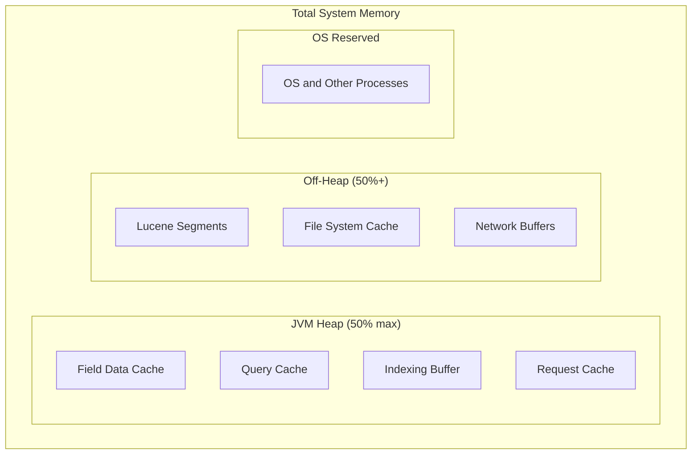

# How to Configure Memory Settings in Elasticsearch

Author: [nawazdhandala](https://www.github.com/nawazdhandala)

Tags: Elasticsearch, Memory, JVM, Performance, Heap, Configuration

Description: Learn how to optimize Elasticsearch memory settings for production, covering heap sizing, memory lock configuration, field data cache, query cache, and troubleshooting memory issues.

---

> Memory configuration is one of the most critical aspects of Elasticsearch performance. Incorrect settings lead to slow queries, out-of-memory crashes, and poor resource utilization. This guide shows you how to configure memory settings for optimal performance.

Elasticsearch uses memory in two main ways: JVM heap for Java objects and Lucene, and off-heap memory for file system caches. Getting the balance right is essential.

---

## Prerequisites

Before starting, ensure you have:
- Elasticsearch 8.x installed
- Administrative access to server
- Understanding of your workload characteristics

---

## Memory Architecture Overview



---

## Heap Size Configuration

### The 50% Rule

Elasticsearch heap should be set to no more than 50% of available RAM, leaving the rest for the OS and Lucene file caches.

```bash
# /etc/elasticsearch/jvm.options.d/heap.options

# Set initial and maximum heap to the same value
# This prevents expensive heap resizing
-Xms16g
-Xmx16g
```

### The 31GB Limit

Never set heap above 31GB. Beyond this threshold, JVM cannot use compressed ordinary object pointers (compressed oops), significantly increasing memory usage.

```bash
# Good: Under 31GB threshold
-Xms30g
-Xmx30g

# Bad: Over 31GB, loses compressed oops benefit
-Xms32g
-Xmx32g
```

### Heap Sizing by Server RAM

| Server RAM | Recommended Heap | For Lucene Cache |
|------------|-----------------|------------------|
| 8 GB       | 4 GB            | 4 GB             |
| 16 GB      | 8 GB            | 8 GB             |
| 32 GB      | 16 GB           | 16 GB            |
| 64 GB      | 31 GB           | 33 GB            |
| 128 GB     | 31 GB           | 97 GB            |

---

## Configuring Heap via Environment Variables

```bash
# Option 1: Using jvm.options.d file (recommended)
# /etc/elasticsearch/jvm.options.d/heap.options
-Xms16g
-Xmx16g

# Option 2: Using ES_JAVA_OPTS environment variable
export ES_JAVA_OPTS="-Xms16g -Xmx16g"

# Option 3: In systemd service file
# /etc/systemd/system/elasticsearch.service.d/override.conf
[Service]
Environment="ES_JAVA_OPTS=-Xms16g -Xmx16g"
```

---

## Memory Lock Configuration

Prevent the JVM from being swapped to disk, which causes severe performance degradation.

### Enable Memory Lock

```yaml
# /etc/elasticsearch/elasticsearch.yml
bootstrap.memory_lock: true
```

### Configure System Limits

```bash
# /etc/security/limits.conf
elasticsearch soft memlock unlimited
elasticsearch hard memlock unlimited

# For systemd
# /etc/systemd/system/elasticsearch.service.d/override.conf
[Service]
LimitMEMLOCK=infinity
```

### Verify Memory Lock

```bash
# Check if memory lock is enabled
curl -X GET "localhost:9200/_nodes?filter_path=**.mlockall"

# Expected response
# {
#   "nodes": {
#     "node_id": {
#       "process": {
#         "mlockall": true
#       }
#     }
#   }
# }
```

---

## Disable Swap

Swapping is devastating for Elasticsearch performance. Disable it entirely.

```bash
# Temporary (until reboot)
sudo swapoff -a

# Permanent - edit /etc/fstab and comment out swap lines
# Also set vm.swappiness
echo "vm.swappiness=1" | sudo tee -a /etc/sysctl.conf
sudo sysctl -p

# Alternative: Configure Elasticsearch to fail if swap is detected
# elasticsearch.yml
bootstrap.memory_lock: true
```

---

## Field Data Cache

Field data cache stores field values for sorting and aggregations on text fields. It can consume significant heap.

```yaml
# /etc/elasticsearch/elasticsearch.yml

# Limit field data cache size (default is unbounded)
indices.fielddata.cache.size: 20%

# Enable circuit breaker for field data
indices.breaker.fielddata.limit: 40%
indices.breaker.fielddata.overhead: 1.03
```

Monitor field data usage:

```bash
# Check field data cache size
curl -X GET "localhost:9200/_nodes/stats/indices/fielddata?pretty"

# Check field data by index
curl -X GET "localhost:9200/_stats/fielddata?pretty"

# Clear field data cache (use with caution)
curl -X POST "localhost:9200/_cache/clear?fielddata=true"
```

---

## Query Cache

The query cache stores query results for frequently executed queries.

```yaml
# /etc/elasticsearch/elasticsearch.yml

# Enable query cache (default is true)
index.queries.cache.enabled: true

# Set query cache size
indices.queries.cache.size: 10%
```

Monitor query cache:

```bash
# Check query cache stats
curl -X GET "localhost:9200/_nodes/stats/indices/query_cache?pretty"

# Per-index query cache stats
curl -X GET "localhost:9200/_stats/query_cache?pretty"
```

---

## Request Cache

The request cache stores complete search responses for aggregation-heavy requests.

```yaml
# /etc/elasticsearch/elasticsearch.yml

# Request cache size
indices.requests.cache.size: 2%
```

Control request cache per request:

```bash
# Disable request cache for a specific query
curl -X GET "localhost:9200/logs/_search?request_cache=false" -H 'Content-Type: application/json' -d'
{
  "query": { "match_all": {} }
}'
```

---

## Indexing Buffer

The indexing buffer holds documents before they're written to segments.

```yaml
# /etc/elasticsearch/elasticsearch.yml

# Total indexing buffer size
indices.memory.index_buffer_size: 10%

# Or set absolute value
# indices.memory.index_buffer_size: 512mb

# Minimum per shard
indices.memory.min_index_buffer_size: 48mb

# Maximum per shard
indices.memory.max_index_buffer_size: 512mb
```

---

## Circuit Breakers

Circuit breakers prevent operations from consuming too much memory.

```yaml
# /etc/elasticsearch/elasticsearch.yml

# Parent circuit breaker - total limit
indices.breaker.total.limit: 70%
indices.breaker.total.use_real_memory: true

# Field data circuit breaker
indices.breaker.fielddata.limit: 40%
indices.breaker.fielddata.overhead: 1.03

# Request circuit breaker - for aggregations
indices.breaker.request.limit: 40%
indices.breaker.request.overhead: 1

# In-flight requests circuit breaker
network.breaker.inflight_requests.limit: 100%
network.breaker.inflight_requests.overhead: 2
```

Monitor circuit breakers:

```bash
# Check circuit breaker stats
curl -X GET "localhost:9200/_nodes/stats/breaker?pretty"

# Example response shows tripped counts
# {
#   "nodes": {
#     "node_id": {
#       "breakers": {
#         "fielddata": {
#           "limit_size_in_bytes": 6871947673,
#           "estimated_size_in_bytes": 0,
#           "tripped": 0
#         },
#         ...
#       }
#     }
#   }
# }
```

---

## Garbage Collection Configuration

Configure GC for optimal performance:

```bash
# /etc/elasticsearch/jvm.options.d/gc.options

# Use G1 GC (default in ES 8.x)
-XX:+UseG1GC

# G1 GC settings
-XX:G1HeapRegionSize=16m
-XX:InitiatingHeapOccupancyPercent=30
-XX:G1ReservePercent=25

# GC logging (useful for troubleshooting)
-Xlog:gc*,gc+age=trace,safepoint:file=/var/log/elasticsearch/gc.log:utctime,pid,tags:filecount=32,filesize=64m
```

---

## Python Memory Monitor

Here's a utility to monitor Elasticsearch memory:

```python
from elasticsearch import Elasticsearch
from typing import List, Dict, Any
from dataclasses import dataclass
import time

@dataclass
class MemoryStats:
    node_name: str
    heap_used_gb: float
    heap_max_gb: float
    heap_percent: int
    field_data_gb: float
    query_cache_gb: float
    request_cache_gb: float
    segments_memory_gb: float
    circuit_breakers_tripped: Dict[str, int]

class MemoryMonitor:
    def __init__(self, hosts: List[str], **kwargs):
        self.es = Elasticsearch(hosts, **kwargs)

    def get_memory_stats(self) -> List[MemoryStats]:
        """Get memory statistics for all nodes"""

        stats = self.es.nodes.stats(metric=["jvm", "indices", "breaker"])
        results = []

        for node_id, node_data in stats["nodes"].items():
            jvm = node_data["jvm"]["mem"]
            indices = node_data["indices"]
            breakers = node_data["breakers"]

            # Convert bytes to GB
            def to_gb(bytes_val):
                return bytes_val / (1024 ** 3)

            results.append(MemoryStats(
                node_name=node_data["name"],
                heap_used_gb=to_gb(jvm["heap_used_in_bytes"]),
                heap_max_gb=to_gb(jvm["heap_max_in_bytes"]),
                heap_percent=jvm["heap_used_percent"],
                field_data_gb=to_gb(indices["fielddata"]["memory_size_in_bytes"]),
                query_cache_gb=to_gb(indices["query_cache"]["memory_size_in_bytes"]),
                request_cache_gb=to_gb(indices["request_cache"]["memory_size_in_bytes"]),
                segments_memory_gb=to_gb(indices["segments"]["memory_in_bytes"]),
                circuit_breakers_tripped={
                    name: data["tripped"]
                    for name, data in breakers.items()
                }
            ))

        return results

    def get_gc_stats(self) -> Dict[str, Dict[str, Any]]:
        """Get garbage collection statistics"""

        stats = self.es.nodes.stats(metric=["jvm"])
        results = {}

        for node_id, node_data in stats["nodes"].items():
            gc = node_data["jvm"]["gc"]["collectors"]
            results[node_data["name"]] = {
                collector: {
                    "collection_count": data["collection_count"],
                    "collection_time_ms": data["collection_time_in_millis"]
                }
                for collector, data in gc.items()
            }

        return results

    def check_heap_pressure(self, threshold: int = 75) -> List[str]:
        """Check for nodes with high heap pressure"""

        warnings = []
        for stat in self.get_memory_stats():
            if stat.heap_percent >= threshold:
                warnings.append(
                    f"{stat.node_name}: {stat.heap_percent}% heap used "
                    f"({stat.heap_used_gb:.1f}/{stat.heap_max_gb:.1f} GB)"
                )

        return warnings

    def check_circuit_breakers(self) -> List[str]:
        """Check for tripped circuit breakers"""

        warnings = []
        for stat in self.get_memory_stats():
            for breaker, tripped in stat.circuit_breakers_tripped.items():
                if tripped > 0:
                    warnings.append(
                        f"{stat.node_name}: {breaker} breaker tripped {tripped} times"
                    )

        return warnings

    def get_field_data_by_field(self) -> Dict[str, int]:
        """Get field data usage by field name"""

        stats = self.es.nodes.stats(metric=["indices"], index_metric=["fielddata"])
        field_usage = {}

        for node_id, node_data in stats["nodes"].items():
            fields = node_data["indices"]["fielddata"].get("fields", {})
            for field_name, data in fields.items():
                if field_name not in field_usage:
                    field_usage[field_name] = 0
                field_usage[field_name] += data["memory_size_in_bytes"]

        # Sort by usage
        return dict(sorted(
            field_usage.items(),
            key=lambda x: x[1],
            reverse=True
        ))

    def print_memory_report(self) -> None:
        """Print a comprehensive memory report"""

        print("=" * 60)
        print("ELASTICSEARCH MEMORY REPORT")
        print("=" * 60)

        for stat in self.get_memory_stats():
            print(f"\nNode: {stat.node_name}")
            print("-" * 40)
            print(f"  Heap: {stat.heap_used_gb:.2f} / {stat.heap_max_gb:.2f} GB ({stat.heap_percent}%)")
            print(f"  Field Data: {stat.field_data_gb:.3f} GB")
            print(f"  Query Cache: {stat.query_cache_gb:.3f} GB")
            print(f"  Request Cache: {stat.request_cache_gb:.3f} GB")
            print(f"  Segments Memory: {stat.segments_memory_gb:.3f} GB")

            tripped = [f"{k}: {v}" for k, v in stat.circuit_breakers_tripped.items() if v > 0]
            if tripped:
                print(f"  Circuit Breakers Tripped: {', '.join(tripped)}")

        # Warnings
        warnings = self.check_heap_pressure() + self.check_circuit_breakers()
        if warnings:
            print("\n" + "=" * 60)
            print("WARNINGS")
            print("=" * 60)
            for warning in warnings:
                print(f"  ! {warning}")

    def watch_memory(
        self,
        interval_seconds: int = 30,
        heap_threshold: int = 80
    ) -> None:
        """Continuously monitor memory and alert on issues"""

        print("Starting memory watch (Ctrl+C to stop)...")

        while True:
            try:
                warnings = self.check_heap_pressure(threshold=heap_threshold)
                warnings += self.check_circuit_breakers()

                if warnings:
                    print(f"\n[{time.strftime('%Y-%m-%d %H:%M:%S')}] ALERTS:")
                    for warning in warnings:
                        print(f"  ! {warning}")
                else:
                    stats = self.get_memory_stats()
                    heap_info = [f"{s.node_name}: {s.heap_percent}%" for s in stats]
                    print(f"[{time.strftime('%H:%M:%S')}] Heap: {', '.join(heap_info)}")

                time.sleep(interval_seconds)

            except KeyboardInterrupt:
                print("\nStopped watching.")
                break


# Usage example
if __name__ == "__main__":
    monitor = MemoryMonitor(["http://localhost:9200"])

    # Print comprehensive report
    monitor.print_memory_report()

    # Check for issues
    print("\nChecking for memory issues...")

    heap_warnings = monitor.check_heap_pressure(threshold=70)
    if heap_warnings:
        print("High heap pressure detected:")
        for w in heap_warnings:
            print(f"  {w}")

    breaker_warnings = monitor.check_circuit_breakers()
    if breaker_warnings:
        print("Circuit breaker issues:")
        for w in breaker_warnings:
            print(f"  {w}")

    # Show top field data consumers
    print("\nTop field data consumers:")
    field_data = monitor.get_field_data_by_field()
    for field, bytes_used in list(field_data.items())[:10]:
        mb = bytes_used / (1024 ** 2)
        print(f"  {field}: {mb:.2f} MB")

    # Start continuous monitoring
    # monitor.watch_memory(interval_seconds=30, heap_threshold=80)
```

---

## Troubleshooting Memory Issues

### High Heap Usage

```bash
# 1. Check what's consuming heap
curl -X GET "localhost:9200/_nodes/stats/indices?pretty"

# 2. Check for large field data
curl -X GET "localhost:9200/_nodes/stats/indices/fielddata?fields=*&pretty"

# 3. Clear caches if needed
curl -X POST "localhost:9200/_cache/clear"
```

### Out of Memory Errors

```bash
# 1. Check GC logs
tail -f /var/log/elasticsearch/gc.log

# 2. Generate heap dump on OOM (add to jvm.options)
-XX:+HeapDumpOnOutOfMemoryError
-XX:HeapDumpPath=/var/lib/elasticsearch/heapdump.hprof

# 3. Analyze with tools like Eclipse MAT
```

### Circuit Breaker Trips

```bash
# Check which breaker is tripping
curl -X GET "localhost:9200/_nodes/stats/breaker?pretty"

# Increase limits if needed (elasticsearch.yml)
indices.breaker.total.limit: 80%
indices.breaker.fielddata.limit: 50%
```

---

## Best Practices

**Heap Sizing:**
- Never exceed 50% of available RAM
- Never exceed 31GB
- Set Xms equal to Xmx

**Memory Lock:**
- Always enable memory lock in production
- Disable swap entirely

**Monitoring:**
- Watch heap usage continuously
- Alert on > 75% heap utilization
- Track circuit breaker trips

**Field Data:**
- Use doc_values instead of field data when possible
- Set limits on field data cache
- Avoid text field aggregations

---

## Conclusion

Memory configuration directly impacts Elasticsearch performance and stability. Key takeaways:

- Set heap to 50% of RAM, max 31GB
- Enable memory lock and disable swap
- Configure circuit breakers appropriately
- Monitor memory usage continuously

With proper memory settings, your Elasticsearch cluster will run reliably under load.

---

*Need to monitor your Elasticsearch memory usage? [OneUptime](https://oneuptime.com) provides real-time infrastructure monitoring and alerting.*
