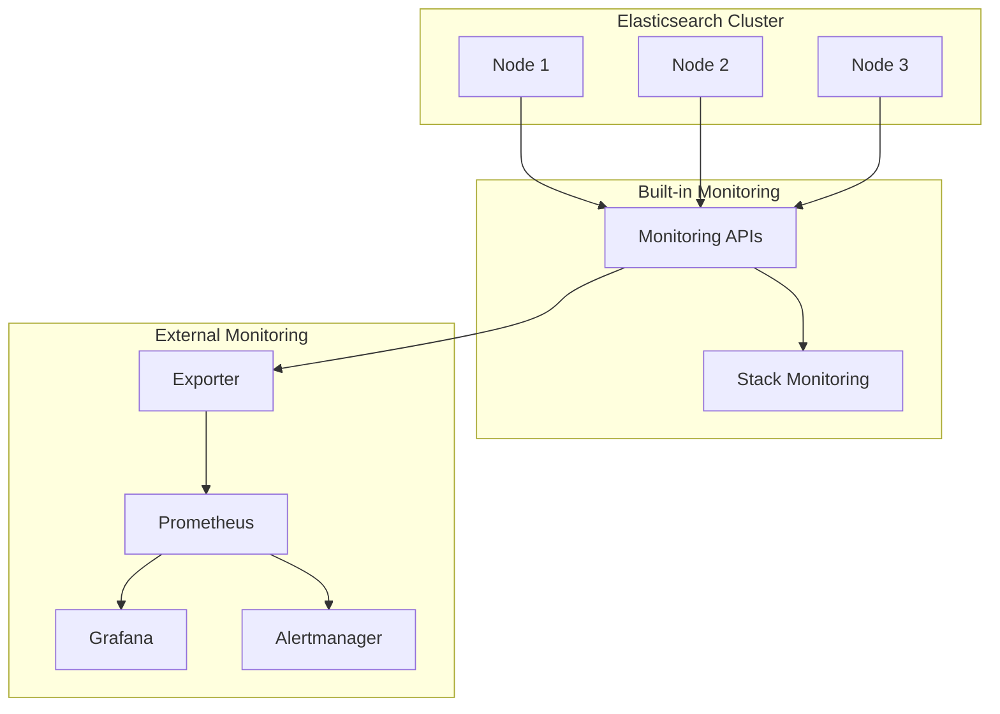

# How to Configure Monitoring in Elasticsearch

Author: [nawazdhandala](https://www.github.com/nawazdhandala)

Tags: Elasticsearch, Monitoring, Observability, Metrics, Performance, Operations

Description: Learn how to set up comprehensive monitoring for Elasticsearch clusters, covering built-in monitoring, Prometheus integration, key metrics to track, and alerting strategies for production environments.

---

> Monitoring is essential for running Elasticsearch in production. Without visibility into cluster health, resource usage, and query performance, problems can escalate before you know they exist. This guide shows you how to implement effective monitoring for Elasticsearch.

We'll cover built-in monitoring features, integration with external tools like Prometheus, and the key metrics you should track.

---

## Prerequisites

Before starting, ensure you have:
- Elasticsearch 8.x running
- Access to cluster APIs
- Prometheus and Grafana (for external monitoring)

---

## Monitoring Architecture Overview



---

## Built-in Monitoring APIs

### Cluster Health API

```bash
# Quick cluster health check
curl -X GET "localhost:9200/_cluster/health?pretty"

# Expected response
# {
#   "cluster_name": "production",
#   "status": "green",
#   "timed_out": false,
#   "number_of_nodes": 9,
#   "number_of_data_nodes": 6,
#   "active_primary_shards": 150,
#   "active_shards": 300,
#   "relocating_shards": 0,
#   "initializing_shards": 0,
#   "unassigned_shards": 0,
#   "delayed_unassigned_shards": 0,
#   "number_of_pending_tasks": 0,
#   "number_of_in_flight_fetch": 0,
#   "task_max_waiting_in_queue_millis": 0,
#   "active_shards_percent_as_number": 100.0
# }

# Health at index level
curl -X GET "localhost:9200/_cluster/health?level=indices&pretty"

# Health at shard level
curl -X GET "localhost:9200/_cluster/health?level=shards&pretty"

# Wait for specific health status
curl -X GET "localhost:9200/_cluster/health?wait_for_status=green&timeout=30s"
```

### Node Stats API

```bash
# All node statistics
curl -X GET "localhost:9200/_nodes/stats?pretty"

# Specific metrics
curl -X GET "localhost:9200/_nodes/stats/jvm,os,process?pretty"

# Stats for specific node
curl -X GET "localhost:9200/_nodes/node_name/stats?pretty"

# JVM memory stats
curl -X GET "localhost:9200/_nodes/stats/jvm?pretty"

# Thread pool stats
curl -X GET "localhost:9200/_nodes/stats/thread_pool?pretty"

# File system stats
curl -X GET "localhost:9200/_nodes/stats/fs?pretty"
```

### Index Stats API

```bash
# All index statistics
curl -X GET "localhost:9200/_stats?pretty"

# Stats for specific index
curl -X GET "localhost:9200/logs/_stats?pretty"

# Specific metric categories
curl -X GET "localhost:9200/_stats/docs,store,indexing,search?pretty"

# Per-shard stats
curl -X GET "localhost:9200/_stats?level=shards&pretty"
```

### Cat APIs for Quick Inspection

```bash
# Cluster health overview
curl -X GET "localhost:9200/_cat/health?v"

# Node information
curl -X GET "localhost:9200/_cat/nodes?v&h=name,ip,heap.percent,ram.percent,cpu,load_1m,node.role"

# Index information
curl -X GET "localhost:9200/_cat/indices?v&s=store.size:desc"

# Shard allocation
curl -X GET "localhost:9200/_cat/shards?v&s=store:desc"

# Thread pools
curl -X GET "localhost:9200/_cat/thread_pool?v&h=node_name,name,active,queue,rejected"

# Pending tasks
curl -X GET "localhost:9200/_cat/pending_tasks?v"

# Recovery progress
curl -X GET "localhost:9200/_cat/recovery?v&active_only=true"
```

---

## Key Metrics to Monitor

### Cluster Health Metrics

| Metric | Warning Threshold | Critical Threshold |
|--------|------------------|-------------------|
| Cluster Status | Yellow | Red |
| Unassigned Shards | > 0 | > 0 for > 5min |
| Pending Tasks | > 100 | > 500 |
| Relocating Shards | > 10 | > 50 |

### Node Health Metrics

| Metric | Warning Threshold | Critical Threshold |
|--------|------------------|-------------------|
| Heap Used % | > 75% | > 85% |
| CPU Usage % | > 80% | > 95% |
| Disk Used % | > 80% | > 90% |
| GC Time % | > 5% | > 10% |

### Search Performance Metrics

| Metric | Warning Threshold | Critical Threshold |
|--------|------------------|-------------------|
| Query Latency (p99) | > 500ms | > 2000ms |
| Search Rate Drop | > 30% | > 50% |
| Rejected Searches | > 0 | > 100/min |

---

## Prometheus Exporter Setup

### Install Elasticsearch Exporter

```bash
# Download the exporter
wget https://github.com/prometheus-community/elasticsearch_exporter/releases/download/v1.6.0/elasticsearch_exporter-1.6.0.linux-amd64.tar.gz
tar xzf elasticsearch_exporter-1.6.0.linux-amd64.tar.gz
cd elasticsearch_exporter-1.6.0.linux-amd64

# Run with authentication
./elasticsearch_exporter \
  --es.uri=https://localhost:9200 \
  --es.all \
  --es.indices \
  --es.indices_settings \
  --es.shards \
  --es.snapshots \
  --es.cluster_settings \
  --es.ssl-skip-verify \
  --es.ca=/path/to/ca.crt \
  --web.listen-address=:9114
```

### Systemd Service

```ini
# /etc/systemd/system/elasticsearch-exporter.service
[Unit]
Description=Elasticsearch Exporter
After=network.target

[Service]
Type=simple
User=prometheus
Environment="ES_USERNAME=elastic"
Environment="ES_PASSWORD=your_password"
ExecStart=/opt/elasticsearch_exporter/elasticsearch_exporter \
  --es.uri=https://localhost:9200 \
  --es.all \
  --es.indices \
  --es.ssl-skip-verify
Restart=always

[Install]
WantedBy=multi-user.target
```

### Prometheus Configuration

```yaml
# prometheus.yml
scrape_configs:
  - job_name: 'elasticsearch'
    static_configs:
      - targets: ['localhost:9114']
    scrape_interval: 15s
    metrics_path: /metrics
```

---

## Grafana Dashboard Queries

### Cluster Health Panel

```promql
# Cluster status (1=green, 2=yellow, 3=red)
elasticsearch_cluster_health_status{color="green"} * 1 +
elasticsearch_cluster_health_status{color="yellow"} * 2 +
elasticsearch_cluster_health_status{color="red"} * 3

# Active shards percentage
elasticsearch_cluster_health_active_shards_percent

# Unassigned shards
elasticsearch_cluster_health_unassigned_shards
```

### JVM Memory Panel

```promql
# Heap usage percentage
elasticsearch_jvm_memory_used_bytes{area="heap"} /
elasticsearch_jvm_memory_max_bytes{area="heap"} * 100

# Non-heap usage
elasticsearch_jvm_memory_used_bytes{area="non-heap"}

# GC collection rate
rate(elasticsearch_jvm_gc_collection_seconds_count[5m])

# GC time percentage
rate(elasticsearch_jvm_gc_collection_seconds_sum[5m]) * 100
```

### Search Performance Panel

```promql
# Search rate
rate(elasticsearch_indices_search_query_total[5m])

# Search latency (average)
rate(elasticsearch_indices_search_query_time_seconds_total[5m]) /
rate(elasticsearch_indices_search_query_total[5m])

# Rejected searches
rate(elasticsearch_thread_pool_rejected_count{name="search"}[5m])
```

### Indexing Performance Panel

```promql
# Indexing rate
rate(elasticsearch_indices_indexing_index_total[5m])

# Indexing latency
rate(elasticsearch_indices_indexing_index_time_seconds_total[5m]) /
rate(elasticsearch_indices_indexing_index_total[5m])

# Bulk rejections
rate(elasticsearch_thread_pool_rejected_count{name="bulk"}[5m])
```

---

## Python Monitoring Service

Here's a comprehensive monitoring service:

```python
from elasticsearch import Elasticsearch
from typing import List, Dict, Any, Optional
from dataclasses import dataclass
from datetime import datetime
import time

@dataclass
class ClusterHealth:
    status: str
    number_of_nodes: int
    active_shards: int
    unassigned_shards: int
    relocating_shards: int
    pending_tasks: int

@dataclass
class NodeHealth:
    name: str
    heap_percent: int
    cpu_percent: int
    disk_percent: int
    load_1m: float
    roles: List[str]

@dataclass
class IndexHealth:
    name: str
    status: str
    primary_shards: int
    replica_shards: int
    docs_count: int
    store_size_bytes: int

class ElasticsearchMonitor:
    def __init__(self, hosts: List[str], **kwargs):
        self.es = Elasticsearch(hosts, **kwargs)

    def get_cluster_health(self) -> ClusterHealth:
        """Get cluster health status"""

        health = self.es.cluster.health()

        return ClusterHealth(
            status=health["status"],
            number_of_nodes=health["number_of_nodes"],
            active_shards=health["active_shards"],
            unassigned_shards=health["unassigned_shards"],
            relocating_shards=health["relocating_shards"],
            pending_tasks=health["number_of_pending_tasks"]
        )

    def get_node_health(self) -> List[NodeHealth]:
        """Get health status for all nodes"""

        stats = self.es.nodes.stats(metric=["jvm", "os", "fs"])
        info = self.es.nodes.info()
        results = []

        for node_id, node_stats in stats["nodes"].items():
            node_info = info["nodes"].get(node_id, {})

            # Calculate disk usage
            fs = node_stats.get("fs", {}).get("total", {})
            disk_total = fs.get("total_in_bytes", 1)
            disk_free = fs.get("free_in_bytes", 0)
            disk_percent = int((1 - disk_free / disk_total) * 100)

            results.append(NodeHealth(
                name=node_stats["name"],
                heap_percent=node_stats["jvm"]["mem"]["heap_used_percent"],
                cpu_percent=node_stats["os"]["cpu"]["percent"],
                disk_percent=disk_percent,
                load_1m=node_stats["os"]["cpu"].get("load_average", {}).get("1m", 0),
                roles=node_info.get("roles", [])
            ))

        return results

    def get_index_health(self, pattern: str = "*") -> List[IndexHealth]:
        """Get health status for indices"""

        indices = self.es.cat.indices(index=pattern, format="json")
        results = []

        for idx in indices:
            results.append(IndexHealth(
                name=idx["index"],
                status=idx["health"],
                primary_shards=int(idx["pri"]),
                replica_shards=int(idx["rep"]),
                docs_count=int(idx.get("docs.count", 0) or 0),
                store_size_bytes=self._parse_size(idx.get("store.size", "0"))
            ))

        return sorted(results, key=lambda x: x.store_size_bytes, reverse=True)

    def _parse_size(self, size_str: str) -> int:
        """Parse size string to bytes"""

        if not size_str:
            return 0

        multipliers = {
            "b": 1,
            "kb": 1024,
            "mb": 1024 ** 2,
            "gb": 1024 ** 3,
            "tb": 1024 ** 4
        }

        size_str = size_str.lower()
        for suffix, multiplier in multipliers.items():
            if size_str.endswith(suffix):
                return int(float(size_str[:-len(suffix)]) * multiplier)

        return int(float(size_str))

    def get_search_stats(self) -> Dict[str, Any]:
        """Get search performance statistics"""

        stats = self.es.indices.stats(metric=["search"])
        total = stats["_all"]["total"]["search"]

        return {
            "query_total": total["query_total"],
            "query_time_ms": total["query_time_in_millis"],
            "query_current": total["query_current"],
            "fetch_total": total["fetch_total"],
            "fetch_time_ms": total["fetch_time_in_millis"],
            "scroll_total": total["scroll_total"],
            "scroll_time_ms": total["scroll_time_in_millis"]
        }

    def get_indexing_stats(self) -> Dict[str, Any]:
        """Get indexing performance statistics"""

        stats = self.es.indices.stats(metric=["indexing"])
        total = stats["_all"]["total"]["indexing"]

        return {
            "index_total": total["index_total"],
            "index_time_ms": total["index_time_in_millis"],
            "index_current": total["index_current"],
            "delete_total": total["delete_total"],
            "delete_time_ms": total["delete_time_in_millis"]
        }

    def get_thread_pool_stats(self) -> Dict[str, Dict[str, int]]:
        """Get thread pool statistics"""

        stats = self.es.nodes.stats(metric=["thread_pool"])
        pool_stats = {}

        for node_id, node_data in stats["nodes"].items():
            for pool_name, pool_data in node_data["thread_pool"].items():
                if pool_name not in pool_stats:
                    pool_stats[pool_name] = {
                        "active": 0,
                        "queue": 0,
                        "rejected": 0,
                        "completed": 0
                    }

                pool_stats[pool_name]["active"] += pool_data.get("active", 0)
                pool_stats[pool_name]["queue"] += pool_data.get("queue", 0)
                pool_stats[pool_name]["rejected"] += pool_data.get("rejected", 0)
                pool_stats[pool_name]["completed"] += pool_data.get("completed", 0)

        return pool_stats

    def check_cluster_issues(self) -> List[str]:
        """Check for common cluster issues"""

        issues = []
        health = self.get_cluster_health()

        # Cluster status
        if health.status == "red":
            issues.append("CRITICAL: Cluster status is RED - data loss possible")
        elif health.status == "yellow":
            issues.append("WARNING: Cluster status is YELLOW - replicas not assigned")

        # Unassigned shards
        if health.unassigned_shards > 0:
            issues.append(f"WARNING: {health.unassigned_shards} unassigned shards")

        # Relocating shards
        if health.relocating_shards > 20:
            issues.append(f"INFO: {health.relocating_shards} shards relocating")

        # Pending tasks
        if health.pending_tasks > 100:
            issues.append(f"WARNING: {health.pending_tasks} pending tasks")

        # Node health
        for node in self.get_node_health():
            if node.heap_percent > 85:
                issues.append(f"CRITICAL: {node.name} heap at {node.heap_percent}%")
            elif node.heap_percent > 75:
                issues.append(f"WARNING: {node.name} heap at {node.heap_percent}%")

            if node.disk_percent > 90:
                issues.append(f"CRITICAL: {node.name} disk at {node.disk_percent}%")
            elif node.disk_percent > 80:
                issues.append(f"WARNING: {node.name} disk at {node.disk_percent}%")

            if node.cpu_percent > 95:
                issues.append(f"WARNING: {node.name} CPU at {node.cpu_percent}%")

        # Thread pool rejections
        pools = self.get_thread_pool_stats()
        for pool_name, pool_data in pools.items():
            if pool_data["rejected"] > 0 and pool_name in ["search", "write", "bulk"]:
                issues.append(f"WARNING: {pool_name} thread pool has {pool_data['rejected']} rejections")

        return issues

    def print_status_report(self) -> None:
        """Print a comprehensive status report"""

        print("=" * 70)
        print(f"ELASTICSEARCH STATUS REPORT - {datetime.now().isoformat()}")
        print("=" * 70)

        # Cluster Health
        health = self.get_cluster_health()
        status_color = {"green": "OK", "yellow": "WARN", "red": "CRITICAL"}
        print(f"\nCluster Status: {status_color.get(health.status, health.status)}")
        print(f"  Nodes: {health.number_of_nodes}")
        print(f"  Active Shards: {health.active_shards}")
        print(f"  Unassigned Shards: {health.unassigned_shards}")
        print(f"  Relocating Shards: {health.relocating_shards}")
        print(f"  Pending Tasks: {health.pending_tasks}")

        # Node Health
        print("\nNode Health:")
        print("-" * 70)
        print(f"{'Name':<20} {'Heap%':<8} {'CPU%':<8} {'Disk%':<8} {'Load':<8} {'Roles'}")
        print("-" * 70)

        for node in self.get_node_health():
            roles = ",".join([r[0] for r in node.roles[:3]])
            print(f"{node.name:<20} {node.heap_percent:<8} {node.cpu_percent:<8} {node.disk_percent:<8} {node.load_1m:<8.2f} {roles}")

        # Top Indices
        print("\nTop 10 Indices by Size:")
        print("-" * 70)

        for idx in self.get_index_health()[:10]:
            size_gb = idx.store_size_bytes / (1024 ** 3)
            print(f"  {idx.name}: {size_gb:.2f} GB ({idx.docs_count:,} docs) - {idx.status}")

        # Issues
        issues = self.check_cluster_issues()
        if issues:
            print("\n" + "=" * 70)
            print("ISSUES DETECTED:")
            print("=" * 70)
            for issue in issues:
                print(f"  {issue}")

    def watch(
        self,
        interval_seconds: int = 30,
        alert_callback: callable = None
    ) -> None:
        """Continuously monitor and alert on issues"""

        print(f"Starting continuous monitoring (interval: {interval_seconds}s)")
        print("Press Ctrl+C to stop\n")

        while True:
            try:
                issues = self.check_cluster_issues()
                health = self.get_cluster_health()

                timestamp = datetime.now().strftime("%H:%M:%S")
                print(f"[{timestamp}] Status: {health.status.upper()} | "
                      f"Nodes: {health.number_of_nodes} | "
                      f"Shards: {health.active_shards} active, "
                      f"{health.unassigned_shards} unassigned")

                if issues:
                    print("  Issues:")
                    for issue in issues:
                        print(f"    - {issue}")

                    if alert_callback:
                        alert_callback(issues)

                time.sleep(interval_seconds)

            except KeyboardInterrupt:
                print("\nStopped monitoring.")
                break
            except Exception as e:
                print(f"Error: {e}")
                time.sleep(interval_seconds)


# Usage example
if __name__ == "__main__":
    monitor = ElasticsearchMonitor(["http://localhost:9200"])

    # Print full status report
    monitor.print_status_report()

    # Check for issues
    print("\nChecking for issues...")
    issues = monitor.check_cluster_issues()

    if issues:
        print("Issues found:")
        for issue in issues:
            print(f"  - {issue}")
    else:
        print("No issues detected!")

    # Start continuous monitoring
    # monitor.watch(interval_seconds=30)
```

---

## Alerting Rules

### Prometheus Alerting Rules

```yaml
# elasticsearch_alerts.yml
groups:
  - name: elasticsearch
    rules:
      - alert: ElasticsearchClusterRed
        expr: elasticsearch_cluster_health_status{color="red"} == 1
        for: 1m
        labels:
          severity: critical
        annotations:
          summary: "Elasticsearch cluster is RED"
          description: "Cluster {{ $labels.cluster }} status is RED - potential data loss"

      - alert: ElasticsearchClusterYellow
        expr: elasticsearch_cluster_health_status{color="yellow"} == 1
        for: 5m
        labels:
          severity: warning
        annotations:
          summary: "Elasticsearch cluster is YELLOW"
          description: "Cluster {{ $labels.cluster }} has unassigned replica shards"

      - alert: ElasticsearchHeapHigh
        expr: elasticsearch_jvm_memory_used_bytes{area="heap"} / elasticsearch_jvm_memory_max_bytes{area="heap"} > 0.85
        for: 5m
        labels:
          severity: warning
        annotations:
          summary: "Elasticsearch heap usage high"
          description: "Node {{ $labels.name }} heap usage is above 85%"

      - alert: ElasticsearchDiskHigh
        expr: (1 - elasticsearch_filesystem_data_free_bytes / elasticsearch_filesystem_data_size_bytes) > 0.85
        for: 5m
        labels:
          severity: warning
        annotations:
          summary: "Elasticsearch disk usage high"
          description: "Node {{ $labels.name }} disk usage is above 85%"

      - alert: ElasticsearchSearchRejections
        expr: rate(elasticsearch_thread_pool_rejected_count{name="search"}[5m]) > 0
        for: 1m
        labels:
          severity: warning
        annotations:
          summary: "Elasticsearch search rejections"
          description: "Node {{ $labels.name }} is rejecting search requests"
```

---

## Best Practices

**Monitoring Frequency:**
- Cluster health: Every 10-30 seconds
- Node stats: Every 30-60 seconds
- Index stats: Every 1-5 minutes

**Alert Thresholds:**
- Set thresholds based on your baseline
- Use trending alerts for gradual degradation
- Avoid alert fatigue with proper severity levels

**Retention:**
- Keep detailed metrics for 7-30 days
- Aggregate older metrics for long-term trends

**Dashboards:**
- Create overview and drill-down dashboards
- Include both real-time and historical views

---

## Conclusion

Effective monitoring is the foundation of reliable Elasticsearch operations. Key takeaways:

- Use built-in APIs for quick health checks
- Deploy Prometheus exporter for metrics collection
- Set up alerts for critical thresholds
- Monitor cluster, node, and index health

With comprehensive monitoring, you can identify and resolve issues before they impact users.

---

*Want unified monitoring for your entire infrastructure? [OneUptime](https://oneuptime.com) provides end-to-end observability including Elasticsearch monitoring.*
