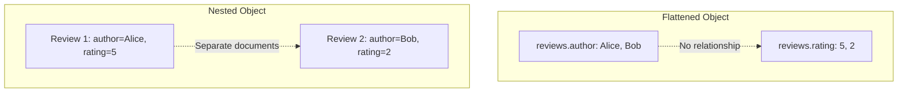

# How to Implement Nested Objects in Elasticsearch

Author: [nawazdhandala](https://www.github.com/nawazdhandala)

Tags: Elasticsearch, Nested Objects, Data Modeling, Complex Queries, Mappings

Description: Learn how to use nested objects in Elasticsearch for querying arrays of objects while maintaining field relationships, with practical examples covering nested mappings, queries, and aggregations.

---

> Elasticsearch flattens arrays of objects by default, which can lead to incorrect query results when you need to match multiple fields within the same array element. Nested objects solve this by maintaining the relationship between fields in array elements. This guide shows you when and how to use nested types effectively.

Understanding nested objects is crucial for modeling data like orders with line items, products with reviews, or any document containing arrays of related objects.

---

## Prerequisites

Before starting, ensure you have:
- Elasticsearch 8.x running
- Understanding of basic mappings
- curl or Kibana Dev Tools

---

## The Problem with Object Arrays

First, let's understand why nested types exist.

```bash
# Create index with regular object array
curl -X PUT "localhost:9200/products_flat" -H 'Content-Type: application/json' -d'
{
  "mappings": {
    "properties": {
      "name": { "type": "text" },
      "reviews": {
        "properties": {
          "author": { "type": "keyword" },
          "rating": { "type": "integer" },
          "comment": { "type": "text" }
        }
      }
    }
  }
}'

# Index a product with reviews
curl -X POST "localhost:9200/products_flat/_doc" -H 'Content-Type: application/json' -d'
{
  "name": "Awesome Laptop",
  "reviews": [
    { "author": "Alice", "rating": 5, "comment": "Love it!" },
    { "author": "Bob", "rating": 2, "comment": "Not great" }
  ]
}'

# Refresh index
curl -X POST "localhost:9200/products_flat/_refresh"
```

Now the problematic query:

```bash
# Find products where Alice gave a rating of 2
# This INCORRECTLY returns our document!
curl -X GET "localhost:9200/products_flat/_search?pretty" -H 'Content-Type: application/json' -d'
{
  "query": {
    "bool": {
      "must": [
        { "term": { "reviews.author": "Alice" } },
        { "term": { "reviews.rating": 2 } }
      ]
    }
  }
}'
```

This returns the document even though Alice rated 5, not 2. Elasticsearch flattens the array into:
- `reviews.author`: ["Alice", "Bob"]
- `reviews.rating`: [5, 2]

The field relationships are lost.

---

## Nested Objects Solution



### Create Index with Nested Type

```bash
# Create index with nested reviews
curl -X PUT "localhost:9200/products_nested" -H 'Content-Type: application/json' -d'
{
  "mappings": {
    "properties": {
      "name": { "type": "text" },
      "reviews": {
        "type": "nested",
        "properties": {
          "author": { "type": "keyword" },
          "rating": { "type": "integer" },
          "comment": { "type": "text" },
          "date": { "type": "date" }
        }
      }
    }
  }
}'

# Index a product with reviews
curl -X POST "localhost:9200/products_nested/_doc/1" -H 'Content-Type: application/json' -d'
{
  "name": "Awesome Laptop",
  "reviews": [
    { "author": "Alice", "rating": 5, "comment": "Love it!", "date": "2024-01-10" },
    { "author": "Bob", "rating": 2, "comment": "Not great", "date": "2024-01-15" }
  ]
}'

curl -X POST "localhost:9200/products_nested/_refresh"
```

---

## Nested Queries

Use nested queries to query within array elements:

```bash
# Find products where Alice gave a rating of 2 - correctly returns no results
curl -X GET "localhost:9200/products_nested/_search?pretty" -H 'Content-Type: application/json' -d'
{
  "query": {
    "nested": {
      "path": "reviews",
      "query": {
        "bool": {
          "must": [
            { "term": { "reviews.author": "Alice" } },
            { "term": { "reviews.rating": 2 } }
          ]
        }
      }
    }
  }
}'

# Find products where Alice gave a rating of 5 - returns our document
curl -X GET "localhost:9200/products_nested/_search?pretty" -H 'Content-Type: application/json' -d'
{
  "query": {
    "nested": {
      "path": "reviews",
      "query": {
        "bool": {
          "must": [
            { "term": { "reviews.author": "Alice" } },
            { "term": { "reviews.rating": 5 } }
          ]
        }
      }
    }
  }
}'
```

---

## Advanced Nested Queries

### Scoring with Nested Objects

```bash
# Score based on matching reviews
curl -X GET "localhost:9200/products_nested/_search?pretty" -H 'Content-Type: application/json' -d'
{
  "query": {
    "nested": {
      "path": "reviews",
      "query": {
        "bool": {
          "must": [
            { "range": { "reviews.rating": { "gte": 4 } } }
          ]
        }
      },
      "score_mode": "avg"
    }
  }
}'
```

Score modes:
- **avg**: Average of all matching nested documents
- **max**: Maximum score of matching nested documents
- **min**: Minimum score of matching nested documents
- **sum**: Sum of all matching nested document scores
- **none**: No scoring, just filtering

### Multiple Nested Conditions

```bash
# Products with at least one 5-star review AND at least one review mentioning "love"
curl -X GET "localhost:9200/products_nested/_search?pretty" -H 'Content-Type: application/json' -d'
{
  "query": {
    "bool": {
      "must": [
        {
          "nested": {
            "path": "reviews",
            "query": {
              "term": { "reviews.rating": 5 }
            }
          }
        },
        {
          "nested": {
            "path": "reviews",
            "query": {
              "match": { "reviews.comment": "love" }
            }
          }
        }
      ]
    }
  }
}'
```

### Inner Hits - Get Matching Nested Documents

```bash
# Get the matching reviews
curl -X GET "localhost:9200/products_nested/_search?pretty" -H 'Content-Type: application/json' -d'
{
  "query": {
    "nested": {
      "path": "reviews",
      "query": {
        "range": { "reviews.rating": { "gte": 4 } }
      },
      "inner_hits": {
        "name": "high_rated_reviews",
        "size": 5,
        "sort": [{ "reviews.rating": "desc" }],
        "_source": ["reviews.author", "reviews.rating"]
      }
    }
  }
}'
```

---

## Nested Aggregations

Aggregations on nested fields require the nested aggregation wrapper:

```bash
# Average rating across all reviews
curl -X GET "localhost:9200/products_nested/_search?pretty" -H 'Content-Type: application/json' -d'
{
  "size": 0,
  "aggs": {
    "reviews": {
      "nested": {
        "path": "reviews"
      },
      "aggs": {
        "avg_rating": {
          "avg": { "field": "reviews.rating" }
        }
      }
    }
  }
}'

# Rating distribution
curl -X GET "localhost:9200/products_nested/_search?pretty" -H 'Content-Type: application/json' -d'
{
  "size": 0,
  "aggs": {
    "reviews": {
      "nested": {
        "path": "reviews"
      },
      "aggs": {
        "rating_histogram": {
          "histogram": {
            "field": "reviews.rating",
            "interval": 1
          }
        }
      }
    }
  }
}'

# Reviews by author with stats
curl -X GET "localhost:9200/products_nested/_search?pretty" -H 'Content-Type: application/json' -d'
{
  "size": 0,
  "aggs": {
    "reviews": {
      "nested": {
        "path": "reviews"
      },
      "aggs": {
        "by_author": {
          "terms": {
            "field": "reviews.author",
            "size": 10
          },
          "aggs": {
            "avg_rating": {
              "avg": { "field": "reviews.rating" }
            },
            "rating_range": {
              "stats": { "field": "reviews.rating" }
            }
          }
        }
      }
    }
  }
}'
```

### Reverse Nested Aggregation

Go back to the parent level from within a nested aggregation:

```bash
# Products per rating
curl -X GET "localhost:9200/products_nested/_search?pretty" -H 'Content-Type: application/json' -d'
{
  "size": 0,
  "aggs": {
    "reviews": {
      "nested": {
        "path": "reviews"
      },
      "aggs": {
        "by_rating": {
          "terms": {
            "field": "reviews.rating"
          },
          "aggs": {
            "back_to_product": {
              "reverse_nested": {},
              "aggs": {
                "unique_products": {
                  "cardinality": {
                    "field": "_id"
                  }
                }
              }
            }
          }
        }
      }
    }
  }
}'
```

---

## Complex Example: E-commerce Orders

```bash
# Create orders index with nested line items
curl -X PUT "localhost:9200/orders" -H 'Content-Type: application/json' -d'
{
  "mappings": {
    "properties": {
      "order_id": { "type": "keyword" },
      "customer": {
        "properties": {
          "id": { "type": "keyword" },
          "name": { "type": "text" }
        }
      },
      "order_date": { "type": "date" },
      "status": { "type": "keyword" },
      "items": {
        "type": "nested",
        "properties": {
          "product_id": { "type": "keyword" },
          "product_name": { "type": "text" },
          "category": { "type": "keyword" },
          "quantity": { "type": "integer" },
          "unit_price": { "type": "float" },
          "total_price": { "type": "float" }
        }
      },
      "order_total": { "type": "float" }
    }
  }
}'

# Index sample orders
curl -X POST "localhost:9200/orders/_bulk" -H 'Content-Type: application/json' -d'
{"index": {"_id": "1"}}
{"order_id": "ORD-001", "customer": {"id": "C001", "name": "John Doe"}, "order_date": "2024-01-15", "status": "shipped", "items": [{"product_id": "P001", "product_name": "iPhone 15", "category": "Electronics", "quantity": 1, "unit_price": 999, "total_price": 999}, {"product_id": "P002", "product_name": "AirPods Pro", "category": "Electronics", "quantity": 2, "unit_price": 249, "total_price": 498}], "order_total": 1497}
{"index": {"_id": "2"}}
{"order_id": "ORD-002", "customer": {"id": "C002", "name": "Jane Smith"}, "order_date": "2024-01-16", "status": "delivered", "items": [{"product_id": "P003", "product_name": "MacBook Pro", "category": "Electronics", "quantity": 1, "unit_price": 2499, "total_price": 2499}, {"product_id": "P004", "product_name": "USB-C Cable", "category": "Accessories", "quantity": 3, "unit_price": 19, "total_price": 57}], "order_total": 2556}
'
```

Query examples:

```bash
# Find orders containing Electronics items over $500
curl -X GET "localhost:9200/orders/_search?pretty" -H 'Content-Type: application/json' -d'
{
  "query": {
    "nested": {
      "path": "items",
      "query": {
        "bool": {
          "must": [
            { "term": { "items.category": "Electronics" } },
            { "range": { "items.total_price": { "gt": 500 } } }
          ]
        }
      },
      "inner_hits": {
        "name": "matching_items",
        "_source": ["items.product_name", "items.total_price"]
      }
    }
  }
}'

# Revenue by category from line items
curl -X GET "localhost:9200/orders/_search?pretty" -H 'Content-Type: application/json' -d'
{
  "size": 0,
  "aggs": {
    "items": {
      "nested": {
        "path": "items"
      },
      "aggs": {
        "by_category": {
          "terms": {
            "field": "items.category"
          },
          "aggs": {
            "revenue": {
              "sum": { "field": "items.total_price" }
            },
            "units_sold": {
              "sum": { "field": "items.quantity" }
            }
          }
        }
      }
    }
  }
}'
```

---

## Python Nested Query Builder

Here's a helper for working with nested objects:

```python
from elasticsearch import Elasticsearch
from typing import List, Dict, Any, Optional
from dataclasses import dataclass

@dataclass
class NestedQuery:
    path: str
    query: Dict[str, Any]
    score_mode: str = "avg"
    inner_hits: Optional[Dict[str, Any]] = None

class NestedQueryBuilder:
    def __init__(self, hosts: List[str]):
        self.es = Elasticsearch(hosts)

    def create_nested_index(
        self,
        index_name: str,
        nested_field: str,
        nested_properties: Dict[str, Any],
        other_properties: Dict[str, Any] = None
    ) -> bool:
        """Create an index with a nested field"""

        properties = other_properties or {}
        properties[nested_field] = {
            "type": "nested",
            "properties": nested_properties
        }

        self.es.indices.create(
            index=index_name,
            body={
                "mappings": {
                    "properties": properties
                }
            }
        )
        return True

    def nested_query(
        self,
        path: str,
        query: Dict[str, Any],
        score_mode: str = "avg",
        inner_hits: bool = False,
        inner_hits_size: int = 3
    ) -> Dict[str, Any]:
        """Build a nested query"""

        result = {
            "nested": {
                "path": path,
                "query": query,
                "score_mode": score_mode
            }
        }

        if inner_hits:
            result["nested"]["inner_hits"] = {
                "size": inner_hits_size
            }

        return result

    def nested_bool_query(
        self,
        path: str,
        must: List[Dict[str, Any]] = None,
        should: List[Dict[str, Any]] = None,
        must_not: List[Dict[str, Any]] = None,
        filter_: List[Dict[str, Any]] = None,
        **kwargs
    ) -> Dict[str, Any]:
        """Build a nested bool query"""

        bool_query = {}
        if must:
            bool_query["must"] = must
        if should:
            bool_query["should"] = should
        if must_not:
            bool_query["must_not"] = must_not
        if filter_:
            bool_query["filter"] = filter_

        return self.nested_query(path, {"bool": bool_query}, **kwargs)

    def nested_aggregation(
        self,
        path: str,
        aggs: Dict[str, Any]
    ) -> Dict[str, Any]:
        """Build a nested aggregation"""

        return {
            "nested": {
                "path": path
            },
            "aggs": aggs
        }

    def reverse_nested_aggregation(
        self,
        aggs: Dict[str, Any]
    ) -> Dict[str, Any]:
        """Build a reverse nested aggregation"""

        return {
            "reverse_nested": {},
            "aggs": aggs
        }

    def search_with_nested(
        self,
        index: str,
        nested_queries: List[NestedQuery],
        additional_query: Dict[str, Any] = None,
        nested_aggs: Dict[str, Dict[str, Any]] = None,
        size: int = 10
    ) -> Dict[str, Any]:
        """Execute a search with nested queries and aggregations"""

        # Build query
        must_clauses = []

        for nq in nested_queries:
            nested = {
                "nested": {
                    "path": nq.path,
                    "query": nq.query,
                    "score_mode": nq.score_mode
                }
            }
            if nq.inner_hits:
                nested["nested"]["inner_hits"] = nq.inner_hits

            must_clauses.append(nested)

        if additional_query:
            must_clauses.append(additional_query)

        body = {
            "query": {
                "bool": {
                    "must": must_clauses
                }
            } if must_clauses else {"match_all": {}},
            "size": size
        }

        # Add aggregations
        if nested_aggs:
            body["aggs"] = {}
            for name, config in nested_aggs.items():
                body["aggs"][name] = self.nested_aggregation(
                    config["path"],
                    config["aggs"]
                )

        return self.es.search(index=index, body=body)


class OrderRepository:
    """Example repository using nested queries"""

    def __init__(self, hosts: List[str]):
        self.es = Elasticsearch(hosts)
        self.index = "orders"
        self.builder = NestedQueryBuilder(hosts)

    def find_orders_with_product(
        self,
        product_id: str,
        min_quantity: int = 1
    ) -> List[Dict[str, Any]]:
        """Find orders containing a specific product"""

        response = self.builder.search_with_nested(
            index=self.index,
            nested_queries=[
                NestedQuery(
                    path="items",
                    query={
                        "bool": {
                            "must": [
                                {"term": {"items.product_id": product_id}},
                                {"range": {"items.quantity": {"gte": min_quantity}}}
                            ]
                        }
                    },
                    inner_hits={"size": 1, "_source": ["items.product_name", "items.quantity"]}
                )
            ]
        )

        return [hit["_source"] for hit in response["hits"]["hits"]]

    def find_orders_by_category_and_price(
        self,
        category: str,
        min_price: float
    ) -> List[Dict[str, Any]]:
        """Find orders with items in category above price"""

        response = self.builder.search_with_nested(
            index=self.index,
            nested_queries=[
                NestedQuery(
                    path="items",
                    query={
                        "bool": {
                            "must": [
                                {"term": {"items.category": category}},
                                {"range": {"items.total_price": {"gte": min_price}}}
                            ]
                        }
                    },
                    inner_hits={"size": 5}
                )
            ]
        )

        return [hit["_source"] for hit in response["hits"]["hits"]]

    def get_revenue_by_category(self) -> Dict[str, float]:
        """Get total revenue by product category"""

        response = self.es.search(
            index=self.index,
            body={
                "size": 0,
                "aggs": {
                    "items": {
                        "nested": {
                            "path": "items"
                        },
                        "aggs": {
                            "by_category": {
                                "terms": {
                                    "field": "items.category",
                                    "size": 50
                                },
                                "aggs": {
                                    "revenue": {
                                        "sum": {"field": "items.total_price"}
                                    }
                                }
                            }
                        }
                    }
                }
            }
        )

        return {
            bucket["key"]: bucket["revenue"]["value"]
            for bucket in response["aggregations"]["items"]["by_category"]["buckets"]
        }

    def get_customer_category_spending(
        self,
        customer_id: str
    ) -> Dict[str, float]:
        """Get spending by category for a specific customer"""

        response = self.es.search(
            index=self.index,
            body={
                "size": 0,
                "query": {
                    "term": {"customer.id": customer_id}
                },
                "aggs": {
                    "items": {
                        "nested": {
                            "path": "items"
                        },
                        "aggs": {
                            "by_category": {
                                "terms": {
                                    "field": "items.category"
                                },
                                "aggs": {
                                    "spent": {
                                        "sum": {"field": "items.total_price"}
                                    }
                                }
                            }
                        }
                    }
                }
            }
        )

        return {
            bucket["key"]: bucket["spent"]["value"]
            for bucket in response["aggregations"]["items"]["by_category"]["buckets"]
        }


# Usage example
if __name__ == "__main__":
    repo = OrderRepository(["http://localhost:9200"])

    # Find orders with specific product
    orders = repo.find_orders_with_product("P001")
    print(f"Orders with product P001: {len(orders)}")

    # Find high-value electronics orders
    orders = repo.find_orders_by_category_and_price("Electronics", 500)
    print(f"High-value electronics orders: {len(orders)}")

    # Revenue by category
    revenue = repo.get_revenue_by_category()
    print("\nRevenue by category:")
    for category, amount in revenue.items():
        print(f"  {category}: ${amount:.2f}")
```

---

## Performance Considerations

**Nested Document Limits:**
```yaml
# elasticsearch.yml - increase if needed
index.mapping.nested_fields.limit: 50
index.mapping.nested_objects.limit: 10000
```

**Query Performance:**
- Each nested document is indexed separately
- More nested documents = larger index
- Deep nesting increases query complexity

**When to Use Nested:**
- When you need to query field combinations within array elements
- When array element boundaries matter
- Limited number of nested objects (< 100 per document)

**When to Avoid Nested:**
- Simple arrays of values
- When you don't query within array elements
- Very large arrays (consider parent-child instead)

---

## Conclusion

Nested objects solve the array-of-objects query problem in Elasticsearch. Key takeaways:

- Use nested type when field relationships within array elements matter
- Always use nested queries to query nested fields
- Use inner_hits to get matching nested documents
- Wrap aggregations with nested aggregation for nested fields

Understanding when and how to use nested objects will help you model complex data correctly.

---

*Need to monitor your Elasticsearch queries? [OneUptime](https://oneuptime.com) provides comprehensive observability for your search infrastructure.*
