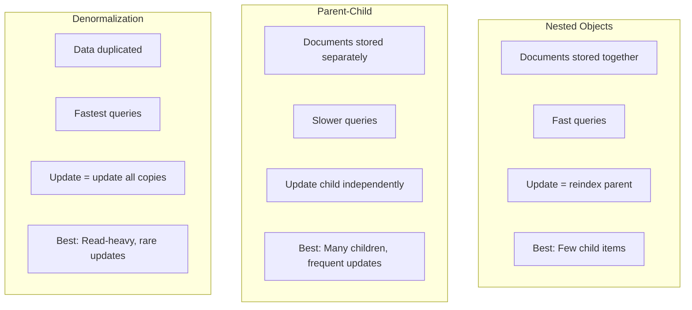

# How to Implement Parent-Child Relationships in Elasticsearch

Author: [nawazdhandala](https://www.github.com/nawazdhandala)

Tags: Elasticsearch, Parent-Child, Join Field, Data Modeling, Relationships

Description: Learn how to model parent-child relationships in Elasticsearch using join fields, with practical examples covering one-to-many relationships, querying related documents, and when to use this pattern over alternatives.

---

> Parent-child relationships in Elasticsearch allow you to associate documents of different types while keeping them independently updateable. Unlike nested objects which are stored together, parent-child documents are separate but linked. This guide shows you how to implement and query parent-child relationships effectively.

This pattern is useful when you have frequent updates to child documents or when child documents can have many items that would make nested objects impractical.

---

## Prerequisites

Before starting, ensure you have:
- Elasticsearch 8.x running
- Understanding of mappings and queries
- curl or Kibana Dev Tools

---

## When to Use Parent-Child vs Nested vs Denormalization



Use parent-child when:
- Child documents are updated frequently
- You have many children per parent (100s+)
- Children need to be searched independently
- You can accept slower query performance

---

## Defining Join Fields

Create an index with a join field to establish the relationship:

```bash
# Create index with join field for blog posts and comments
curl -X PUT "localhost:9200/blog" -H 'Content-Type: application/json' -d'
{
  "mappings": {
    "properties": {
      "blog_relation": {
        "type": "join",
        "relations": {
          "post": "comment"
        }
      },
      "title": { "type": "text" },
      "content": { "type": "text" },
      "author": { "type": "keyword" },
      "created_at": { "type": "date" },
      "tags": { "type": "keyword" },
      "text": { "type": "text" }
    }
  }
}'
```

### Multi-Level Relationships

```bash
# Create index with multi-level hierarchy
curl -X PUT "localhost:9200/company" -H 'Content-Type: application/json' -d'
{
  "settings": {
    "number_of_shards": 1
  },
  "mappings": {
    "properties": {
      "company_relation": {
        "type": "join",
        "relations": {
          "company": "department",
          "department": "employee"
        }
      },
      "name": { "type": "text", "fields": { "keyword": { "type": "keyword" } } },
      "description": { "type": "text" },
      "budget": { "type": "float" },
      "role": { "type": "keyword" },
      "salary": { "type": "float" },
      "hire_date": { "type": "date" }
    }
  }
}'
```

---

## Indexing Parent and Child Documents

### Index Parent Documents

```bash
# Index a blog post (parent)
curl -X PUT "localhost:9200/blog/_doc/post1?routing=post1" -H 'Content-Type: application/json' -d'
{
  "blog_relation": {
    "name": "post"
  },
  "title": "Introduction to Elasticsearch",
  "content": "Elasticsearch is a distributed search and analytics engine...",
  "author": "john_doe",
  "created_at": "2024-01-15",
  "tags": ["elasticsearch", "search", "tutorial"]
}'

# Index another post
curl -X PUT "localhost:9200/blog/_doc/post2?routing=post2" -H 'Content-Type: application/json' -d'
{
  "blog_relation": {
    "name": "post"
  },
  "title": "Advanced Query DSL",
  "content": "Query DSL is the powerful query language of Elasticsearch...",
  "author": "jane_smith",
  "created_at": "2024-01-20",
  "tags": ["elasticsearch", "query-dsl", "advanced"]
}'
```

### Index Child Documents

```bash
# Index comments (children) - must use same routing as parent!
curl -X PUT "localhost:9200/blog/_doc/comment1?routing=post1" -H 'Content-Type: application/json' -d'
{
  "blog_relation": {
    "name": "comment",
    "parent": "post1"
  },
  "author": "alice",
  "text": "Great introduction! Very helpful.",
  "created_at": "2024-01-16"
}'

curl -X PUT "localhost:9200/blog/_doc/comment2?routing=post1" -H 'Content-Type: application/json' -d'
{
  "blog_relation": {
    "name": "comment",
    "parent": "post1"
  },
  "author": "bob",
  "text": "Could you cover aggregations next?",
  "created_at": "2024-01-17"
}'

curl -X PUT "localhost:9200/blog/_doc/comment3?routing=post1" -H 'Content-Type: application/json' -d'
{
  "blog_relation": {
    "name": "comment",
    "parent": "post1"
  },
  "author": "charlie",
  "text": "Bookmarked for later!",
  "created_at": "2024-01-18"
}'

curl -X PUT "localhost:9200/blog/_doc/comment4?routing=post2" -H 'Content-Type: application/json' -d'
{
  "blog_relation": {
    "name": "comment",
    "parent": "post2"
  },
  "author": "alice",
  "text": "The bool query examples are excellent.",
  "created_at": "2024-01-21"
}'

# Refresh to make documents searchable
curl -X POST "localhost:9200/blog/_refresh"
```

---

## Querying Parent-Child Relationships

### Has Child Query - Find Parents by Child Criteria

```bash
# Find posts that have comments from alice
curl -X GET "localhost:9200/blog/_search?pretty" -H 'Content-Type: application/json' -d'
{
  "query": {
    "has_child": {
      "type": "comment",
      "query": {
        "term": { "author": "alice" }
      }
    }
  }
}'

# Find posts with at least 2 comments
curl -X GET "localhost:9200/blog/_search?pretty" -H 'Content-Type: application/json' -d'
{
  "query": {
    "has_child": {
      "type": "comment",
      "query": { "match_all": {} },
      "min_children": 2
    }
  }
}'

# Find posts with comments mentioning "aggregations"
curl -X GET "localhost:9200/blog/_search?pretty" -H 'Content-Type: application/json' -d'
{
  "query": {
    "has_child": {
      "type": "comment",
      "query": {
        "match": { "text": "aggregations" }
      },
      "score_mode": "max"
    }
  }
}'
```

Score modes for has_child:
- **none**: Don't include child scores (fastest)
- **avg**: Average of matching children
- **max**: Maximum child score
- **min**: Minimum child score
- **sum**: Sum of all child scores

### Has Parent Query - Find Children by Parent Criteria

```bash
# Find comments on posts by john_doe
curl -X GET "localhost:9200/blog/_search?pretty" -H 'Content-Type: application/json' -d'
{
  "query": {
    "has_parent": {
      "parent_type": "post",
      "query": {
        "term": { "author": "john_doe" }
      }
    }
  }
}'

# Find comments on posts tagged with "tutorial"
curl -X GET "localhost:9200/blog/_search?pretty" -H 'Content-Type: application/json' -d'
{
  "query": {
    "has_parent": {
      "parent_type": "post",
      "query": {
        "term": { "tags": "tutorial" }
      },
      "score": true
    }
  }
}'
```

### Parent ID Query - Find Children of Specific Parent

```bash
# Find all comments for post1
curl -X GET "localhost:9200/blog/_search?pretty" -H 'Content-Type: application/json' -d'
{
  "query": {
    "parent_id": {
      "type": "comment",
      "id": "post1"
    }
  }
}'
```

---

## Inner Hits - Get Related Documents

```bash
# Get posts with their matching comments
curl -X GET "localhost:9200/blog/_search?pretty" -H 'Content-Type: application/json' -d'
{
  "query": {
    "has_child": {
      "type": "comment",
      "query": {
        "match": { "text": "great" }
      },
      "inner_hits": {
        "name": "matching_comments",
        "size": 5,
        "sort": [{ "created_at": "desc" }]
      }
    }
  }
}'

# Get comments with their parent post info
curl -X GET "localhost:9200/blog/_search?pretty" -H 'Content-Type: application/json' -d'
{
  "query": {
    "has_parent": {
      "parent_type": "post",
      "query": {
        "term": { "tags": "elasticsearch" }
      },
      "inner_hits": {
        "name": "parent_post",
        "_source": ["title", "author"]
      }
    }
  }
}'
```

---

## Aggregations with Parent-Child

```bash
# Count comments per post
curl -X GET "localhost:9200/blog/_search?pretty" -H 'Content-Type: application/json' -d'
{
  "size": 0,
  "aggs": {
    "posts": {
      "filter": {
        "term": { "blog_relation": "post" }
      },
      "aggs": {
        "by_post": {
          "terms": {
            "field": "_id"
          },
          "aggs": {
            "comments": {
              "children": {
                "type": "comment"
              },
              "aggs": {
                "comment_count": {
                  "value_count": { "field": "_id" }
                }
              }
            }
          }
        }
      }
    }
  }
}'

# Parent aggregation - aggregate on parent fields from child context
curl -X GET "localhost:9200/blog/_search?pretty" -H 'Content-Type: application/json' -d'
{
  "size": 0,
  "query": {
    "term": { "blog_relation": "comment" }
  },
  "aggs": {
    "to_post": {
      "parent": {
        "type": "post"
      },
      "aggs": {
        "by_author": {
          "terms": { "field": "author" }
        }
      }
    }
  }
}'
```

---

## Complex Example: E-commerce with Products and Reviews

```bash
# Create index for products and reviews
curl -X PUT "localhost:9200/ecommerce" -H 'Content-Type: application/json' -d'
{
  "settings": {
    "number_of_shards": 3
  },
  "mappings": {
    "properties": {
      "relation_type": {
        "type": "join",
        "relations": {
          "product": "review"
        }
      },
      "name": {
        "type": "text",
        "fields": { "keyword": { "type": "keyword" } }
      },
      "category": { "type": "keyword" },
      "price": { "type": "float" },
      "in_stock": { "type": "boolean" },
      "reviewer": { "type": "keyword" },
      "rating": { "type": "integer" },
      "comment": { "type": "text" },
      "verified_purchase": { "type": "boolean" },
      "review_date": { "type": "date" }
    }
  }
}'

# Index products
curl -X POST "localhost:9200/ecommerce/_bulk?routing=P001" -H 'Content-Type: application/json' -d'
{"index": {"_id": "P001"}}
{"relation_type": "product", "name": "iPhone 15 Pro", "category": "Electronics", "price": 999.99, "in_stock": true}
'

curl -X POST "localhost:9200/ecommerce/_bulk?routing=P002" -H 'Content-Type: application/json' -d'
{"index": {"_id": "P002"}}
{"relation_type": "product", "name": "MacBook Pro 16", "category": "Electronics", "price": 2499.99, "in_stock": true}
'

# Index reviews
curl -X POST "localhost:9200/ecommerce/_bulk?routing=P001" -H 'Content-Type: application/json' -d'
{"index": {"_id": "R001", "routing": "P001"}}
{"relation_type": {"name": "review", "parent": "P001"}, "reviewer": "alice", "rating": 5, "comment": "Amazing phone, love the camera!", "verified_purchase": true, "review_date": "2024-01-10"}
{"index": {"_id": "R002", "routing": "P001"}}
{"relation_type": {"name": "review", "parent": "P001"}, "reviewer": "bob", "rating": 4, "comment": "Great device but expensive", "verified_purchase": true, "review_date": "2024-01-12"}
{"index": {"_id": "R003", "routing": "P001"}}
{"relation_type": {"name": "review", "parent": "P001"}, "reviewer": "charlie", "rating": 3, "comment": "Battery could be better", "verified_purchase": false, "review_date": "2024-01-15"}
'

curl -X POST "localhost:9200/ecommerce/_bulk?routing=P002" -H 'Content-Type: application/json' -d'
{"index": {"_id": "R004", "routing": "P002"}}
{"relation_type": {"name": "review", "parent": "P002"}, "reviewer": "alice", "rating": 5, "comment": "Perfect for development work", "verified_purchase": true, "review_date": "2024-01-11"}
{"index": {"_id": "R005", "routing": "P002"}}
{"relation_type": {"name": "review", "parent": "P002"}, "reviewer": "dave", "rating": 5, "comment": "Best laptop I have ever owned", "verified_purchase": true, "review_date": "2024-01-14"}
'

curl -X POST "localhost:9200/ecommerce/_refresh"
```

### Complex Queries

```bash
# Find products with average rating > 4 from verified purchases
curl -X GET "localhost:9200/ecommerce/_search?pretty" -H 'Content-Type: application/json' -d'
{
  "query": {
    "has_child": {
      "type": "review",
      "query": {
        "bool": {
          "must": [
            { "range": { "rating": { "gte": 4 } } },
            { "term": { "verified_purchase": true } }
          ]
        }
      },
      "min_children": 2,
      "score_mode": "avg"
    }
  }
}'

# Find products in Electronics with reviews mentioning "camera"
curl -X GET "localhost:9200/ecommerce/_search?pretty" -H 'Content-Type: application/json' -d'
{
  "query": {
    "bool": {
      "must": [
        { "term": { "category": "Electronics" } },
        { "term": { "in_stock": true } },
        {
          "has_child": {
            "type": "review",
            "query": {
              "match": { "comment": "camera" }
            },
            "inner_hits": {
              "size": 3
            }
          }
        }
      ]
    }
  }
}'
```

---

## Python Parent-Child Service

```python
from elasticsearch import Elasticsearch
from typing import List, Dict, Any, Optional
from dataclasses import dataclass
from datetime import datetime

@dataclass
class Product:
    id: str
    name: str
    category: str
    price: float
    in_stock: bool

@dataclass
class Review:
    id: str
    product_id: str
    reviewer: str
    rating: int
    comment: str
    verified_purchase: bool
    review_date: datetime

class ParentChildService:
    def __init__(self, hosts: List[str]):
        self.es = Elasticsearch(hosts)
        self.index = "ecommerce"

    def create_index(self) -> bool:
        """Create the parent-child index"""

        if self.es.indices.exists(index=self.index):
            return False

        self.es.indices.create(
            index=self.index,
            body={
                "mappings": {
                    "properties": {
                        "relation_type": {
                            "type": "join",
                            "relations": {
                                "product": "review"
                            }
                        },
                        "name": {
                            "type": "text",
                            "fields": {"keyword": {"type": "keyword"}}
                        },
                        "category": {"type": "keyword"},
                        "price": {"type": "float"},
                        "in_stock": {"type": "boolean"},
                        "reviewer": {"type": "keyword"},
                        "rating": {"type": "integer"},
                        "comment": {"type": "text"},
                        "verified_purchase": {"type": "boolean"},
                        "review_date": {"type": "date"}
                    }
                }
            }
        )
        return True

    def index_product(self, product: Product) -> bool:
        """Index a product (parent document)"""

        self.es.index(
            index=self.index,
            id=product.id,
            routing=product.id,
            body={
                "relation_type": "product",
                "name": product.name,
                "category": product.category,
                "price": product.price,
                "in_stock": product.in_stock
            }
        )
        return True

    def index_review(self, review: Review) -> bool:
        """Index a review (child document)"""

        self.es.index(
            index=self.index,
            id=review.id,
            routing=review.product_id,  # Must route to parent
            body={
                "relation_type": {
                    "name": "review",
                    "parent": review.product_id
                },
                "reviewer": review.reviewer,
                "rating": review.rating,
                "comment": review.comment,
                "verified_purchase": review.verified_purchase,
                "review_date": review.review_date.isoformat()
            }
        )
        return True

    def get_product_with_reviews(
        self,
        product_id: str
    ) -> Dict[str, Any]:
        """Get a product with all its reviews"""

        # Get product
        product = self.es.get(
            index=self.index,
            id=product_id,
            routing=product_id
        )

        # Get reviews
        reviews = self.es.search(
            index=self.index,
            body={
                "query": {
                    "parent_id": {
                        "type": "review",
                        "id": product_id
                    }
                },
                "sort": [{"review_date": "desc"}]
            }
        )

        return {
            "product": product["_source"],
            "reviews": [hit["_source"] for hit in reviews["hits"]["hits"]]
        }

    def find_products_with_high_ratings(
        self,
        min_rating: int = 4,
        min_reviews: int = 1
    ) -> List[Dict[str, Any]]:
        """Find products with high average ratings"""

        response = self.es.search(
            index=self.index,
            body={
                "query": {
                    "has_child": {
                        "type": "review",
                        "query": {
                            "range": {"rating": {"gte": min_rating}}
                        },
                        "min_children": min_reviews,
                        "score_mode": "avg",
                        "inner_hits": {
                            "size": 3,
                            "sort": [{"rating": "desc"}],
                            "_source": ["reviewer", "rating", "comment"]
                        }
                    }
                }
            }
        )

        results = []
        for hit in response["hits"]["hits"]:
            product = hit["_source"]
            product["top_reviews"] = [
                inner_hit["_source"]
                for inner_hit in hit["inner_hits"]["review"]["hits"]["hits"]
            ]
            results.append(product)

        return results

    def find_reviewed_by_user(
        self,
        reviewer: str
    ) -> List[Dict[str, Any]]:
        """Find all products reviewed by a specific user"""

        response = self.es.search(
            index=self.index,
            body={
                "query": {
                    "has_child": {
                        "type": "review",
                        "query": {
                            "term": {"reviewer": reviewer}
                        },
                        "inner_hits": {
                            "_source": ["rating", "comment", "review_date"]
                        }
                    }
                }
            }
        )

        results = []
        for hit in response["hits"]["hits"]:
            product = hit["_source"]
            product["user_review"] = hit["inner_hits"]["review"]["hits"]["hits"][0]["_source"]
            results.append(product)

        return results

    def get_category_stats(self) -> Dict[str, Dict[str, Any]]:
        """Get review statistics by category"""

        response = self.es.search(
            index=self.index,
            body={
                "size": 0,
                "query": {
                    "term": {"relation_type": "product"}
                },
                "aggs": {
                    "by_category": {
                        "terms": {"field": "category"},
                        "aggs": {
                            "reviews": {
                                "children": {"type": "review"},
                                "aggs": {
                                    "avg_rating": {"avg": {"field": "rating"}},
                                    "rating_distribution": {
                                        "terms": {"field": "rating"}
                                    },
                                    "verified_count": {
                                        "filter": {"term": {"verified_purchase": True}}
                                    }
                                }
                            }
                        }
                    }
                }
            }
        )

        stats = {}
        for bucket in response["aggregations"]["by_category"]["buckets"]:
            reviews = bucket["reviews"]
            stats[bucket["key"]] = {
                "product_count": bucket["doc_count"],
                "review_count": reviews["doc_count"],
                "avg_rating": reviews["avg_rating"]["value"],
                "verified_reviews": reviews["verified_count"]["doc_count"],
                "rating_distribution": {
                    r["key"]: r["doc_count"]
                    for r in reviews["rating_distribution"]["buckets"]
                }
            }

        return stats

    def update_review(
        self,
        review_id: str,
        product_id: str,
        rating: int = None,
        comment: str = None
    ) -> bool:
        """Update a review - independent of parent"""

        update_doc = {}
        if rating is not None:
            update_doc["rating"] = rating
        if comment is not None:
            update_doc["comment"] = comment

        if update_doc:
            self.es.update(
                index=self.index,
                id=review_id,
                routing=product_id,
                body={"doc": update_doc}
            )

        return True

    def delete_review(
        self,
        review_id: str,
        product_id: str
    ) -> bool:
        """Delete a review - independent of parent"""

        self.es.delete(
            index=self.index,
            id=review_id,
            routing=product_id
        )
        return True


# Usage example
if __name__ == "__main__":
    service = ParentChildService(["http://localhost:9200"])

    # Create index
    service.create_index()

    # Index products
    products = [
        Product("P001", "iPhone 15 Pro", "Electronics", 999.99, True),
        Product("P002", "MacBook Pro 16", "Electronics", 2499.99, True),
        Product("P003", "AirPods Pro", "Electronics", 249.99, True)
    ]

    for product in products:
        service.index_product(product)
        print(f"Indexed product: {product.name}")

    # Index reviews
    reviews = [
        Review("R001", "P001", "alice", 5, "Amazing phone!", True, datetime(2024, 1, 10)),
        Review("R002", "P001", "bob", 4, "Great but expensive", True, datetime(2024, 1, 12)),
        Review("R003", "P002", "alice", 5, "Perfect for work", True, datetime(2024, 1, 11)),
        Review("R004", "P002", "charlie", 5, "Best laptop ever", True, datetime(2024, 1, 14))
    ]

    for review in reviews:
        service.index_review(review)
        print(f"Indexed review by {review.reviewer} for {review.product_id}")

    # Refresh
    service.es.indices.refresh(index=service.index)

    # Get product with reviews
    print("\nProduct with reviews:")
    result = service.get_product_with_reviews("P001")
    print(f"  {result['product']['name']}")
    for review in result['reviews']:
        print(f"    - {review['reviewer']}: {review['rating']} stars")

    # Find high-rated products
    print("\nHigh-rated products:")
    for product in service.find_products_with_high_ratings(min_rating=4, min_reviews=1):
        print(f"  {product['name']}: {len(product.get('top_reviews', []))} reviews")

    # Category stats
    print("\nCategory statistics:")
    for category, stats in service.get_category_stats().items():
        print(f"  {category}:")
        print(f"    Products: {stats['product_count']}")
        print(f"    Reviews: {stats['review_count']}")
        print(f"    Avg Rating: {stats['avg_rating']:.1f}")
```

---

## Performance Considerations

**Routing:**
- Always use routing for parent-child queries
- Child documents must be routed to same shard as parent

**Query Performance:**
- has_child and has_parent queries are expensive
- Consider caching frequently used queries
- Limit inner_hits size

**Index Size:**
- Each child is a separate document
- More flexible but more overhead than nested

**When to Avoid:**
- Very frequent queries on relationships
- Need for real-time aggregations
- Simple one-to-few relationships (use nested instead)

---

## Best Practices

**Design:**
- Plan routing strategy carefully
- Keep join depth shallow (2-3 levels max)
- Consider query patterns when choosing parent-child vs nested

**Indexing:**
- Always specify routing for child documents
- Batch child document updates when possible

**Querying:**
- Use score_mode: none when scoring isn't needed
- Limit inner_hits to reduce response size
- Cache frequently used has_child/has_parent queries

---

## Conclusion

Parent-child relationships in Elasticsearch provide flexibility for modeling hierarchical data with independent document updates. Key takeaways:

- Use join fields to define parent-child relationships
- Always route child documents to the parent's shard
- has_child finds parents based on child criteria
- has_parent finds children based on parent criteria
- Consider performance trade-offs vs nested objects

Choose parent-child when you need independent updates to related documents, but be aware of the query performance implications.

---

*Need to monitor your Elasticsearch data models? [OneUptime](https://oneuptime.com) provides comprehensive observability for your search infrastructure.*
