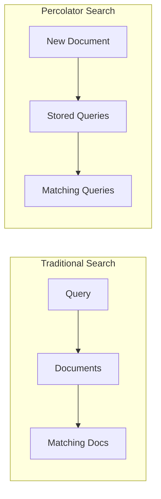

# How to Implement Percolator Queries in Elasticsearch

Author: [nawazdhandala](https://www.github.com/nawazdhandala)

Tags: Elasticsearch, Percolator, Real-time Alerts, Pattern Matching, Query Matching

Description: Learn how to use Elasticsearch percolator queries to match documents against stored queries, enabling real-time alerting, content classification, and prospective search applications.

---

> Percolator queries flip the traditional search paradigm. Instead of searching for documents matching a query, you search for queries matching a document. This is powerful for real-time alerting, content classification, and prospective search where users want to be notified when new content matches their interests.

This guide shows you how to implement percolator queries for practical use cases.

---

## Prerequisites

Before starting, ensure you have:
- Elasticsearch 8.x running
- Understanding of Query DSL
- curl or Kibana Dev Tools

---

## How Percolator Works



In traditional search, you have a query and find matching documents. With percolator, you have a document and find matching queries.

---

## Setting Up a Percolator Index

Create an index with a percolator field:

```bash
# Create an index for storing alerts/queries
curl -X PUT "localhost:9200/alerts" -H 'Content-Type: application/json' -d'
{
  "mappings": {
    "properties": {
      "query": {
        "type": "percolator"
      },
      "alert_name": {
        "type": "keyword"
      },
      "user_id": {
        "type": "keyword"
      },
      "channel": {
        "type": "keyword"
      },
      "priority": {
        "type": "keyword"
      },
      "created_at": {
        "type": "date"
      },
      "title": {
        "type": "text"
      },
      "body": {
        "type": "text"
      },
      "tags": {
        "type": "keyword"
      },
      "source": {
        "type": "keyword"
      },
      "severity": {
        "type": "keyword"
      }
    }
  }
}'
```

---

## Storing Queries

Store queries that will be matched against incoming documents:

```bash
# Alert for error logs
curl -X PUT "localhost:9200/alerts/_doc/error_alert" -H 'Content-Type: application/json' -d'
{
  "query": {
    "bool": {
      "must": [
        { "match": { "body": "error" } }
      ],
      "filter": [
        { "term": { "severity": "critical" } }
      ]
    }
  },
  "alert_name": "Critical Error Alert",
  "user_id": "admin",
  "channel": "slack",
  "priority": "high"
}'

# Alert for security events
curl -X PUT "localhost:9200/alerts/_doc/security_alert" -H 'Content-Type: application/json' -d'
{
  "query": {
    "bool": {
      "should": [
        { "match": { "body": "unauthorized access" } },
        { "match": { "body": "authentication failed" } },
        { "match": { "body": "permission denied" } }
      ],
      "minimum_should_match": 1
    }
  },
  "alert_name": "Security Alert",
  "user_id": "security-team",
  "channel": "pagerduty",
  "priority": "critical"
}'

# Alert for specific service
curl -X PUT "localhost:9200/alerts/_doc/payment_alert" -H 'Content-Type: application/json' -d'
{
  "query": {
    "bool": {
      "must": [
        { "term": { "source": "payment-service" } }
      ],
      "should": [
        { "match": { "body": "transaction failed" } },
        { "match": { "body": "timeout" } },
        { "match": { "body": "declined" } }
      ],
      "minimum_should_match": 1
    }
  },
  "alert_name": "Payment Service Alert",
  "user_id": "payments-team",
  "channel": "email",
  "priority": "high"
}'

# Alert with tags filter
curl -X PUT "localhost:9200/alerts/_doc/database_alert" -H 'Content-Type: application/json' -d'
{
  "query": {
    "bool": {
      "must": [
        { "terms": { "tags": ["database", "mysql", "postgresql"] } },
        { "range": { "response_time": { "gt": 5000 } } }
      ]
    }
  },
  "alert_name": "Slow Database Query",
  "user_id": "dba-team",
  "channel": "slack",
  "priority": "medium"
}'
```

---

## Percolating Documents

Find which queries match a document:

```bash
# Percolate a log document
curl -X GET "localhost:9200/alerts/_search?pretty" -H 'Content-Type: application/json' -d'
{
  "query": {
    "percolate": {
      "field": "query",
      "document": {
        "title": "Application Error",
        "body": "Critical error occurred in payment-service: transaction failed due to timeout",
        "source": "payment-service",
        "severity": "critical",
        "tags": ["error", "payment"],
        "response_time": 15000
      }
    }
  }
}'

# The response includes all matching queries:
# {
#   "hits": {
#     "hits": [
#       { "_id": "error_alert", ... },
#       { "_id": "payment_alert", ... }
#     ]
#   }
# }
```

---

## Percolating Multiple Documents

Check multiple documents at once:

```bash
# Percolate multiple documents
curl -X GET "localhost:9200/alerts/_search?pretty" -H 'Content-Type: application/json' -d'
{
  "query": {
    "percolate": {
      "field": "query",
      "documents": [
        {
          "title": "Security Event",
          "body": "Unauthorized access attempt detected from IP 192.168.1.100",
          "source": "firewall",
          "severity": "critical",
          "tags": ["security"]
        },
        {
          "title": "Info",
          "body": "User login successful",
          "source": "auth-service",
          "severity": "info",
          "tags": ["auth"]
        },
        {
          "title": "Database Alert",
          "body": "Slow query detected in users table",
          "source": "mysql",
          "severity": "warning",
          "tags": ["database", "mysql"],
          "response_time": 8000
        }
      ]
    }
  }
}'
```

---

## Content Classification Example

Use percolator for automatic content classification:

```bash
# Create classification index
curl -X PUT "localhost:9200/classifiers" -H 'Content-Type: application/json' -d'
{
  "mappings": {
    "properties": {
      "query": {
        "type": "percolator"
      },
      "category": {
        "type": "keyword"
      },
      "subcategory": {
        "type": "keyword"
      },
      "confidence": {
        "type": "float"
      },
      "title": {
        "type": "text"
      },
      "content": {
        "type": "text"
      }
    }
  }
}'

# Store classification rules
curl -X POST "localhost:9200/classifiers/_bulk" -H 'Content-Type: application/json' -d'
{"index": {"_id": "tech_ai"}}
{"query": {"bool": {"should": [{"match": {"content": "machine learning"}}, {"match": {"content": "artificial intelligence"}}, {"match": {"content": "neural network"}}, {"match": {"content": "deep learning"}}], "minimum_should_match": 1}}, "category": "Technology", "subcategory": "AI/ML", "confidence": 0.9}
{"index": {"_id": "tech_cloud"}}
{"query": {"bool": {"should": [{"match": {"content": "kubernetes"}}, {"match": {"content": "docker"}}, {"match": {"content": "cloud computing"}}, {"match": {"content": "AWS"}}, {"match": {"content": "Azure"}}], "minimum_should_match": 1}}, "category": "Technology", "subcategory": "Cloud", "confidence": 0.85}
{"index": {"_id": "finance_crypto"}}
{"query": {"bool": {"should": [{"match": {"content": "bitcoin"}}, {"match": {"content": "cryptocurrency"}}, {"match": {"content": "blockchain"}}, {"match": {"content": "ethereum"}}], "minimum_should_match": 1}}, "category": "Finance", "subcategory": "Cryptocurrency", "confidence": 0.9}
{"index": {"_id": "sports_football"}}
{"query": {"bool": {"should": [{"match": {"content": "football"}}, {"match": {"content": "NFL"}}, {"match": {"content": "touchdown"}}, {"match": {"content": "quarterback"}}], "minimum_should_match": 1}}, "category": "Sports", "subcategory": "Football", "confidence": 0.85}
'

# Classify an article
curl -X GET "localhost:9200/classifiers/_search?pretty" -H 'Content-Type: application/json' -d'
{
  "query": {
    "percolate": {
      "field": "query",
      "document": {
        "title": "New Breakthrough in AI Research",
        "content": "Researchers have developed a new neural network architecture that significantly improves deep learning performance for natural language processing tasks."
      }
    }
  },
  "_source": ["category", "subcategory", "confidence"]
}'
```

---

## Real-Time Alert System

Build a complete alert system:

```bash
# Create alerts index with detailed schema
curl -X PUT "localhost:9200/alert_rules" -H 'Content-Type: application/json' -d'
{
  "settings": {
    "number_of_shards": 3,
    "number_of_replicas": 1
  },
  "mappings": {
    "properties": {
      "query": {
        "type": "percolator"
      },
      "rule_name": {
        "type": "keyword"
      },
      "description": {
        "type": "text"
      },
      "owner": {
        "type": "keyword"
      },
      "notification_channels": {
        "type": "keyword"
      },
      "severity": {
        "type": "keyword"
      },
      "enabled": {
        "type": "boolean"
      },
      "cooldown_minutes": {
        "type": "integer"
      },
      "last_triggered": {
        "type": "date"
      },
      "message": {
        "type": "text"
      },
      "level": {
        "type": "keyword"
      },
      "service": {
        "type": "keyword"
      },
      "environment": {
        "type": "keyword"
      },
      "host": {
        "type": "keyword"
      },
      "error_rate": {
        "type": "float"
      },
      "latency_ms": {
        "type": "integer"
      }
    }
  }
}'

# Add alert rules
curl -X POST "localhost:9200/alert_rules/_bulk" -H 'Content-Type: application/json' -d'
{"index": {"_id": "high_error_rate"}}
{"query": {"bool": {"must": [{"range": {"error_rate": {"gt": 0.05}}}, {"term": {"environment": "production"}}]}}, "rule_name": "High Error Rate", "description": "Triggers when error rate exceeds 5% in production", "owner": "platform-team", "notification_channels": ["slack", "pagerduty"], "severity": "critical", "enabled": true, "cooldown_minutes": 15}
{"index": {"_id": "high_latency"}}
{"query": {"bool": {"must": [{"range": {"latency_ms": {"gt": 2000}}}, {"term": {"environment": "production"}}]}}, "rule_name": "High Latency", "description": "Triggers when latency exceeds 2 seconds", "owner": "platform-team", "notification_channels": ["slack"], "severity": "warning", "enabled": true, "cooldown_minutes": 10}
{"index": {"_id": "oom_error"}}
{"query": {"bool": {"must": [{"match": {"message": "OutOfMemoryError"}}, {"term": {"level": "ERROR"}}]}}, "rule_name": "Out of Memory", "description": "Triggers on OOM errors", "owner": "platform-team", "notification_channels": ["pagerduty", "email"], "severity": "critical", "enabled": true, "cooldown_minutes": 5}
'

# Check incoming log event against rules
curl -X GET "localhost:9200/alert_rules/_search?pretty" -H 'Content-Type: application/json' -d'
{
  "query": {
    "bool": {
      "must": [
        {
          "percolate": {
            "field": "query",
            "document": {
              "message": "java.lang.OutOfMemoryError: Java heap space",
              "level": "ERROR",
              "service": "api-gateway",
              "environment": "production",
              "host": "server-01",
              "error_rate": 0.08,
              "latency_ms": 3500
            }
          }
        },
        {
          "term": {
            "enabled": true
          }
        }
      ]
    }
  },
  "_source": ["rule_name", "severity", "notification_channels", "cooldown_minutes"]
}'
```

---

## Python Percolator Service

Here's a complete Python service for percolator-based alerting:

```python
from elasticsearch import Elasticsearch
from typing import List, Dict, Any, Optional
from dataclasses import dataclass
from datetime import datetime, timedelta
import json

@dataclass
class AlertRule:
    rule_id: str
    rule_name: str
    query: Dict[str, Any]
    severity: str
    notification_channels: List[str]
    cooldown_minutes: int
    enabled: bool = True

@dataclass
class TriggeredAlert:
    rule_id: str
    rule_name: str
    severity: str
    notification_channels: List[str]
    document: Dict[str, Any]
    triggered_at: datetime

class PercolatorAlertService:
    def __init__(self, hosts: List[str], index_name: str = "alert_rules"):
        self.es = Elasticsearch(hosts)
        self.index = index_name
        self._ensure_index()

    def _ensure_index(self):
        """Create index if it doesn't exist"""

        if not self.es.indices.exists(index=self.index):
            self.es.indices.create(
                index=self.index,
                body={
                    "mappings": {
                        "properties": {
                            "query": {"type": "percolator"},
                            "rule_name": {"type": "keyword"},
                            "description": {"type": "text"},
                            "owner": {"type": "keyword"},
                            "notification_channels": {"type": "keyword"},
                            "severity": {"type": "keyword"},
                            "enabled": {"type": "boolean"},
                            "cooldown_minutes": {"type": "integer"},
                            "last_triggered": {"type": "date"},
                            # Document fields for percolation
                            "message": {"type": "text"},
                            "level": {"type": "keyword"},
                            "service": {"type": "keyword"},
                            "environment": {"type": "keyword"},
                            "error_rate": {"type": "float"},
                            "latency_ms": {"type": "integer"},
                            "host": {"type": "keyword"}
                        }
                    }
                }
            )

    def add_rule(self, rule: AlertRule) -> bool:
        """Add or update an alert rule"""

        doc = {
            "query": rule.query,
            "rule_name": rule.rule_name,
            "severity": rule.severity,
            "notification_channels": rule.notification_channels,
            "cooldown_minutes": rule.cooldown_minutes,
            "enabled": rule.enabled
        }

        self.es.index(index=self.index, id=rule.rule_id, body=doc)
        return True

    def delete_rule(self, rule_id: str) -> bool:
        """Delete an alert rule"""
        self.es.delete(index=self.index, id=rule_id)
        return True

    def enable_rule(self, rule_id: str) -> bool:
        """Enable an alert rule"""
        self.es.update(
            index=self.index,
            id=rule_id,
            body={"doc": {"enabled": True}}
        )
        return True

    def disable_rule(self, rule_id: str) -> bool:
        """Disable an alert rule"""
        self.es.update(
            index=self.index,
            id=rule_id,
            body={"doc": {"enabled": False}}
        )
        return True

    def check_document(
        self,
        document: Dict[str, Any],
        only_enabled: bool = True
    ) -> List[TriggeredAlert]:
        """Check a document against all alert rules"""

        query = {
            "bool": {
                "must": [
                    {
                        "percolate": {
                            "field": "query",
                            "document": document
                        }
                    }
                ]
            }
        }

        if only_enabled:
            query["bool"]["must"].append({"term": {"enabled": True}})

        response = self.es.search(
            index=self.index,
            body={
                "query": query,
                "_source": [
                    "rule_name", "severity", "notification_channels",
                    "cooldown_minutes", "last_triggered"
                ],
                "size": 100
            }
        )

        triggered = []
        now = datetime.utcnow()

        for hit in response["hits"]["hits"]:
            source = hit["_source"]

            # Check cooldown
            last_triggered = source.get("last_triggered")
            if last_triggered:
                last_time = datetime.fromisoformat(
                    last_triggered.replace("Z", "+00:00")
                ).replace(tzinfo=None)
                cooldown = timedelta(minutes=source.get("cooldown_minutes", 0))

                if now - last_time < cooldown:
                    continue  # Still in cooldown

            # Update last triggered time
            self.es.update(
                index=self.index,
                id=hit["_id"],
                body={"doc": {"last_triggered": now.isoformat()}}
            )

            triggered.append(TriggeredAlert(
                rule_id=hit["_id"],
                rule_name=source["rule_name"],
                severity=source["severity"],
                notification_channels=source["notification_channels"],
                document=document,
                triggered_at=now
            ))

        return triggered

    def check_documents_batch(
        self,
        documents: List[Dict[str, Any]]
    ) -> Dict[int, List[TriggeredAlert]]:
        """Check multiple documents in a single request"""

        response = self.es.search(
            index=self.index,
            body={
                "query": {
                    "bool": {
                        "must": [
                            {
                                "percolate": {
                                    "field": "query",
                                    "documents": documents
                                }
                            },
                            {"term": {"enabled": True}}
                        ]
                    }
                },
                "_source": ["rule_name", "severity", "notification_channels"],
                "size": 1000
            }
        )

        # Group results by document index
        results = {i: [] for i in range(len(documents))}

        for hit in response["hits"]["hits"]:
            # The _percolator_document_slot field tells us which document matched
            doc_slot = hit.get("fields", {}).get("_percolator_document_slot", [0])[0]

            results[doc_slot].append(TriggeredAlert(
                rule_id=hit["_id"],
                rule_name=hit["_source"]["rule_name"],
                severity=hit["_source"]["severity"],
                notification_channels=hit["_source"]["notification_channels"],
                document=documents[doc_slot],
                triggered_at=datetime.utcnow()
            ))

        return results

    def list_rules(
        self,
        only_enabled: bool = False
    ) -> List[Dict[str, Any]]:
        """List all alert rules"""

        query = {"match_all": {}}
        if only_enabled:
            query = {"term": {"enabled": True}}

        response = self.es.search(
            index=self.index,
            body={
                "query": query,
                "size": 1000,
                "_source": [
                    "rule_name", "severity", "enabled",
                    "notification_channels", "cooldown_minutes"
                ]
            }
        )

        return [
            {
                "rule_id": hit["_id"],
                **hit["_source"]
            }
            for hit in response["hits"]["hits"]
        ]

    def get_rule_stats(self) -> Dict[str, Any]:
        """Get statistics about alert rules"""

        response = self.es.search(
            index=self.index,
            body={
                "size": 0,
                "aggs": {
                    "by_severity": {
                        "terms": {"field": "severity"}
                    },
                    "by_enabled": {
                        "terms": {"field": "enabled"}
                    },
                    "by_channel": {
                        "terms": {"field": "notification_channels"}
                    }
                }
            }
        )

        aggs = response["aggregations"]

        return {
            "total_rules": response["hits"]["total"]["value"],
            "by_severity": {
                b["key"]: b["doc_count"]
                for b in aggs["by_severity"]["buckets"]
            },
            "enabled": sum(
                b["doc_count"]
                for b in aggs["by_enabled"]["buckets"]
                if b["key"] == 1
            ),
            "disabled": sum(
                b["doc_count"]
                for b in aggs["by_enabled"]["buckets"]
                if b["key"] == 0
            ),
            "by_channel": {
                b["key"]: b["doc_count"]
                for b in aggs["by_channel"]["buckets"]
            }
        }


# Usage example
if __name__ == "__main__":
    service = PercolatorAlertService(["http://localhost:9200"])

    # Add some alert rules
    rules = [
        AlertRule(
            rule_id="high_error_rate",
            rule_name="High Error Rate",
            query={
                "bool": {
                    "must": [
                        {"range": {"error_rate": {"gt": 0.05}}},
                        {"term": {"environment": "production"}}
                    ]
                }
            },
            severity="critical",
            notification_channels=["slack", "pagerduty"],
            cooldown_minutes=15
        ),
        AlertRule(
            rule_id="oom_errors",
            rule_name="Out of Memory Errors",
            query={
                "match": {"message": "OutOfMemoryError"}
            },
            severity="critical",
            notification_channels=["pagerduty"],
            cooldown_minutes=5
        )
    ]

    print("Adding alert rules...")
    for rule in rules:
        service.add_rule(rule)
        print(f"  Added: {rule.rule_name}")

    # Check a log event
    print("\nChecking log event...")
    log_event = {
        "message": "java.lang.OutOfMemoryError: Java heap space",
        "level": "ERROR",
        "service": "api-gateway",
        "environment": "production",
        "error_rate": 0.08,
        "latency_ms": 2500,
        "host": "server-01"
    }

    alerts = service.check_document(log_event)
    print(f"Triggered {len(alerts)} alerts:")
    for alert in alerts:
        print(f"  [{alert.severity}] {alert.rule_name}")
        print(f"    Channels: {', '.join(alert.notification_channels)}")

    # Get rule stats
    print("\nRule Statistics:")
    stats = service.get_rule_stats()
    print(f"  Total rules: {stats['total_rules']}")
    print(f"  Enabled: {stats['enabled']}")
    print(f"  By severity: {stats['by_severity']}")
```

---

## Best Practices

**Query Design:**
- Keep percolator queries efficient
- Avoid expensive operations like wildcards and regex
- Use filters where possible for better performance

**Index Design:**
- Include all fields that queries might reference in the mapping
- Consider using separate indices for different query types

**Performance:**
- Batch document checks when possible
- Monitor percolator query cache size
- Consider query complexity when scaling

**Maintenance:**
- Regularly audit and clean up unused queries
- Implement cooldown periods to prevent alert storms
- Version your query definitions

---

## Conclusion

Percolator queries enable powerful prospective search patterns. Key takeaways:

- Percolator reverses the traditional search model
- Store queries as documents with a percolator field
- Match incoming documents against stored queries
- Perfect for alerting, classification, and notification systems

With percolator queries, you can build sophisticated real-time systems that react immediately to new data matching predefined patterns.

---

*Need to monitor your alerting system? [OneUptime](https://oneuptime.com) provides comprehensive observability for your entire infrastructure.*
