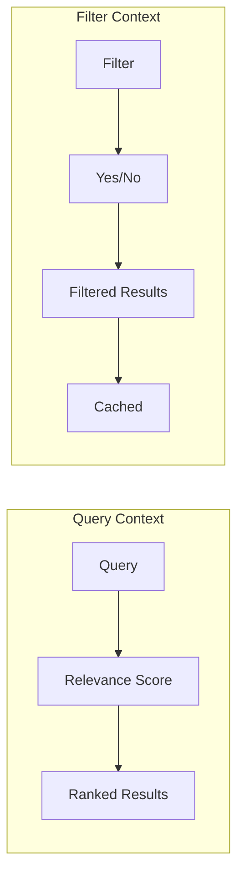

# How to Write Query DSL in Elasticsearch

Author: [nawazdhandala](https://www.github.com/nawazdhandala)

Tags: Elasticsearch, Query DSL, Search, Full-Text Search, Filters, Boolean Queries

Description: A comprehensive guide to Elasticsearch Query DSL covering match queries, bool queries, filters, term queries, range queries, and advanced query composition for building powerful search functionality.

---

> Elasticsearch Query DSL (Domain Specific Language) is a flexible, JSON-based query language that lets you build complex search queries. Understanding Query DSL is essential for anyone building search functionality or analyzing data in Elasticsearch.

This guide covers the query types you'll use most often, along with practical examples you can adapt for your applications.

---

## Prerequisites

Before we begin, ensure you have:
- Elasticsearch 8.x running
- Some sample data indexed
- curl or Kibana Dev Tools available

Let's create sample data to work with:

```bash
# Create a sample index with products
curl -X POST "localhost:9200/products/_bulk" -H 'Content-Type: application/json' -d'
{"index": {"_id": "1"}}
{"name": "iPhone 15 Pro", "description": "Latest Apple smartphone with A17 chip", "price": 999, "category": "electronics", "brand": "Apple", "rating": 4.8, "in_stock": true, "created_at": "2024-09-22"}
{"index": {"_id": "2"}}
{"name": "Samsung Galaxy S24", "description": "Android smartphone with advanced AI features", "price": 899, "category": "electronics", "brand": "Samsung", "rating": 4.6, "in_stock": true, "created_at": "2024-01-17"}
{"index": {"_id": "3"}}
{"name": "Sony WH-1000XM5", "description": "Premium noise cancelling wireless headphones", "price": 349, "category": "audio", "brand": "Sony", "rating": 4.7, "in_stock": false, "created_at": "2023-05-12"}
{"index": {"_id": "4"}}
{"name": "MacBook Pro 16", "description": "Apple laptop with M3 Max chip for professionals", "price": 3499, "category": "computers", "brand": "Apple", "rating": 4.9, "in_stock": true, "created_at": "2023-11-07"}
{"index": {"_id": "5"}}
{"name": "Dell XPS 15", "description": "Windows laptop with Intel Core i9", "price": 1799, "category": "computers", "brand": "Dell", "rating": 4.5, "in_stock": true, "created_at": "2024-03-15"}
'
```

---

## Query vs Filter Context

Understanding the difference between query and filter context is fundamental to writing efficient queries.



- **Query context**: Calculates relevance scores. Use for full-text search.
- **Filter context**: Binary yes/no matching. Use for exact matching, ranges, and existence checks. Filters are cached and faster.

---

## Match Queries

The match query is your go-to for full-text search. It analyzes the input text and finds documents containing those terms.

```bash
# Basic match query - finds documents containing "smartphone"
curl -X GET "localhost:9200/products/_search?pretty" -H 'Content-Type: application/json' -d'
{
  "query": {
    "match": {
      "description": "smartphone"
    }
  }
}'

# Match with operator - all terms must match
curl -X GET "localhost:9200/products/_search?pretty" -H 'Content-Type: application/json' -d'
{
  "query": {
    "match": {
      "description": {
        "query": "Apple smartphone",
        "operator": "and"
      }
    }
  }
}'

# Match with minimum_should_match - at least 2 terms must match
curl -X GET "localhost:9200/products/_search?pretty" -H 'Content-Type: application/json' -d'
{
  "query": {
    "match": {
      "description": {
        "query": "advanced smartphone AI features",
        "minimum_should_match": 2
      }
    }
  }
}'

# Match phrase - terms must appear in order
curl -X GET "localhost:9200/products/_search?pretty" -H 'Content-Type: application/json' -d'
{
  "query": {
    "match_phrase": {
      "description": "noise cancelling"
    }
  }
}'

# Match phrase with slop - allows terms to be N positions apart
curl -X GET "localhost:9200/products/_search?pretty" -H 'Content-Type: application/json' -d'
{
  "query": {
    "match_phrase": {
      "description": {
        "query": "wireless headphones",
        "slop": 2
      }
    }
  }
}'
```

---

## Multi-Match Queries

Search across multiple fields with a single query.

```bash
# Search name and description fields
curl -X GET "localhost:9200/products/_search?pretty" -H 'Content-Type: application/json' -d'
{
  "query": {
    "multi_match": {
      "query": "Apple professional",
      "fields": ["name", "description"]
    }
  }
}'

# Boost certain fields - name matches are 3x more important
curl -X GET "localhost:9200/products/_search?pretty" -H 'Content-Type: application/json' -d'
{
  "query": {
    "multi_match": {
      "query": "laptop",
      "fields": ["name^3", "description"]
    }
  }
}'

# Best fields - use score from best matching field
curl -X GET "localhost:9200/products/_search?pretty" -H 'Content-Type: application/json' -d'
{
  "query": {
    "multi_match": {
      "query": "iPhone smartphone",
      "fields": ["name", "description"],
      "type": "best_fields",
      "tie_breaker": 0.3
    }
  }
}'

# Cross fields - terms can match across different fields
curl -X GET "localhost:9200/products/_search?pretty" -H 'Content-Type: application/json' -d'
{
  "query": {
    "multi_match": {
      "query": "Apple chip",
      "fields": ["name", "description"],
      "type": "cross_fields",
      "operator": "and"
    }
  }
}'
```

---

## Term-Level Queries

Term queries are for exact matching on keyword fields. They do not analyze the input.

```bash
# Exact match on keyword field
curl -X GET "localhost:9200/products/_search?pretty" -H 'Content-Type: application/json' -d'
{
  "query": {
    "term": {
      "category": "electronics"
    }
  }
}'

# Match multiple values
curl -X GET "localhost:9200/products/_search?pretty" -H 'Content-Type: application/json' -d'
{
  "query": {
    "terms": {
      "brand": ["Apple", "Samsung"]
    }
  }
}'

# Check if field exists
curl -X GET "localhost:9200/products/_search?pretty" -H 'Content-Type: application/json' -d'
{
  "query": {
    "exists": {
      "field": "rating"
    }
  }
}'

# Prefix query for autocomplete-style matching
curl -X GET "localhost:9200/products/_search?pretty" -H 'Content-Type: application/json' -d'
{
  "query": {
    "prefix": {
      "name": {
        "value": "Mac"
      }
    }
  }
}'

# Wildcard query - use sparingly as it can be slow
curl -X GET "localhost:9200/products/_search?pretty" -H 'Content-Type: application/json' -d'
{
  "query": {
    "wildcard": {
      "name": {
        "value": "*Pro*"
      }
    }
  }
}'
```

---

## Range Queries

Query for values within a specified range.

```bash
# Price range
curl -X GET "localhost:9200/products/_search?pretty" -H 'Content-Type: application/json' -d'
{
  "query": {
    "range": {
      "price": {
        "gte": 500,
        "lte": 1000
      }
    }
  }
}'

# Date range - last 6 months
curl -X GET "localhost:9200/products/_search?pretty" -H 'Content-Type: application/json' -d'
{
  "query": {
    "range": {
      "created_at": {
        "gte": "now-6M",
        "lte": "now"
      }
    }
  }
}'

# Date range with specific dates
curl -X GET "localhost:9200/products/_search?pretty" -H 'Content-Type: application/json' -d'
{
  "query": {
    "range": {
      "created_at": {
        "gte": "2024-01-01",
        "lt": "2024-07-01",
        "format": "yyyy-MM-dd"
      }
    }
  }
}'

# Rating above threshold
curl -X GET "localhost:9200/products/_search?pretty" -H 'Content-Type: application/json' -d'
{
  "query": {
    "range": {
      "rating": {
        "gt": 4.5
      }
    }
  }
}'
```

---

## Bool Queries

Bool queries combine multiple queries with AND, OR, and NOT logic. This is where Query DSL becomes truly powerful.

```bash
# Must + Filter: Find Apple products in stock
curl -X GET "localhost:9200/products/_search?pretty" -H 'Content-Type: application/json' -d'
{
  "query": {
    "bool": {
      "must": [
        { "match": { "brand": "Apple" } }
      ],
      "filter": [
        { "term": { "in_stock": true } }
      ]
    }
  }
}'

# Complex bool query with multiple clauses
curl -X GET "localhost:9200/products/_search?pretty" -H 'Content-Type: application/json' -d'
{
  "query": {
    "bool": {
      "must": [
        {
          "multi_match": {
            "query": "laptop",
            "fields": ["name", "description"]
          }
        }
      ],
      "filter": [
        { "range": { "price": { "lte": 2000 } } },
        { "term": { "in_stock": true } }
      ],
      "should": [
        { "term": { "brand": "Apple" } },
        { "range": { "rating": { "gte": 4.5 } } }
      ],
      "minimum_should_match": 1,
      "must_not": [
        { "term": { "category": "accessories" } }
      ]
    }
  }
}'
```

Here's what each clause does:

- **must**: All conditions must match. Affects relevance score.
- **filter**: All conditions must match. No scoring, results are cached.
- **should**: At least minimum_should_match conditions should match. Boosts score.
- **must_not**: None of these conditions should match. No scoring.

---

## Nested Bool Queries

Build complex logic by nesting bool queries.

```bash
# (Apple OR Samsung) AND (price < 1000 OR rating > 4.7)
curl -X GET "localhost:9200/products/_search?pretty" -H 'Content-Type: application/json' -d'
{
  "query": {
    "bool": {
      "must": [
        {
          "bool": {
            "should": [
              { "term": { "brand": "Apple" } },
              { "term": { "brand": "Samsung" } }
            ]
          }
        },
        {
          "bool": {
            "should": [
              { "range": { "price": { "lt": 1000 } } },
              { "range": { "rating": { "gt": 4.7 } } }
            ]
          }
        }
      ],
      "filter": [
        { "term": { "in_stock": true } }
      ]
    }
  }
}'
```

---

## Boosting and Scoring

Control how relevance scores are calculated.

```bash
# Boosting query - positively boost or negatively boost
curl -X GET "localhost:9200/products/_search?pretty" -H 'Content-Type: application/json' -d'
{
  "query": {
    "boosting": {
      "positive": {
        "match": { "description": "smartphone" }
      },
      "negative": {
        "term": { "in_stock": false }
      },
      "negative_boost": 0.5
    }
  }
}'

# Function score for custom scoring
curl -X GET "localhost:9200/products/_search?pretty" -H 'Content-Type: application/json' -d'
{
  "query": {
    "function_score": {
      "query": {
        "match": { "description": "laptop" }
      },
      "functions": [
        {
          "filter": { "term": { "brand": "Apple" } },
          "weight": 2
        },
        {
          "field_value_factor": {
            "field": "rating",
            "factor": 1.2,
            "modifier": "sqrt",
            "missing": 1
          }
        }
      ],
      "score_mode": "multiply",
      "boost_mode": "multiply"
    }
  }
}'

# Constant score - bypass scoring for filter-like behavior
curl -X GET "localhost:9200/products/_search?pretty" -H 'Content-Type: application/json' -d'
{
  "query": {
    "constant_score": {
      "filter": {
        "term": { "category": "electronics" }
      },
      "boost": 1.0
    }
  }
}'
```

---

## Query String Queries

For user-facing search boxes where users can enter complex queries.

```bash
# Simple query string
curl -X GET "localhost:9200/products/_search?pretty" -H 'Content-Type: application/json' -d'
{
  "query": {
    "query_string": {
      "query": "Apple AND (smartphone OR laptop)",
      "default_field": "description"
    }
  }
}'

# Simple query string - safer for user input
curl -X GET "localhost:9200/products/_search?pretty" -H 'Content-Type: application/json' -d'
{
  "query": {
    "simple_query_string": {
      "query": "Apple +smartphone -accessory",
      "fields": ["name", "description"],
      "default_operator": "AND"
    }
  }
}'
```

---

## Pagination and Sorting

Control result ordering and pagination.

```bash
# Sort by price descending with pagination
curl -X GET "localhost:9200/products/_search?pretty" -H 'Content-Type: application/json' -d'
{
  "query": {
    "match_all": {}
  },
  "sort": [
    { "price": "desc" },
    { "_score": "desc" }
  ],
  "from": 0,
  "size": 10
}'

# Sort with missing values handling
curl -X GET "localhost:9200/products/_search?pretty" -H 'Content-Type: application/json' -d'
{
  "query": {
    "match_all": {}
  },
  "sort": [
    {
      "rating": {
        "order": "desc",
        "missing": "_last"
      }
    }
  ]
}'

# Source filtering - only return specific fields
curl -X GET "localhost:9200/products/_search?pretty" -H 'Content-Type: application/json' -d'
{
  "query": {
    "match_all": {}
  },
  "_source": ["name", "price", "rating"],
  "size": 5
}'
```

---

## Python Query Builder

Here's a helper class to build queries programmatically:

```python
from elasticsearch import Elasticsearch
from typing import List, Dict, Any, Optional

class QueryBuilder:
    def __init__(self):
        # Start with empty bool query structure
        self.query = {
            "bool": {
                "must": [],
                "filter": [],
                "should": [],
                "must_not": []
            }
        }
        self.sort = []
        self.source = None
        self.size = 10
        self.from_ = 0

    def must_match(self, field: str, value: str, operator: str = "or"):
        """Add a must match clause"""
        self.query["bool"]["must"].append({
            "match": {
                field: {
                    "query": value,
                    "operator": operator
                }
            }
        })
        return self

    def filter_term(self, field: str, value: Any):
        """Add a term filter"""
        self.query["bool"]["filter"].append({
            "term": {field: value}
        })
        return self

    def filter_terms(self, field: str, values: List[Any]):
        """Add a terms filter for multiple values"""
        self.query["bool"]["filter"].append({
            "terms": {field: values}
        })
        return self

    def filter_range(self, field: str, gte=None, lte=None, gt=None, lt=None):
        """Add a range filter"""
        range_params = {}
        if gte is not None:
            range_params["gte"] = gte
        if lte is not None:
            range_params["lte"] = lte
        if gt is not None:
            range_params["gt"] = gt
        if lt is not None:
            range_params["lt"] = lt

        self.query["bool"]["filter"].append({
            "range": {field: range_params}
        })
        return self

    def should_term(self, field: str, value: Any, boost: float = 1.0):
        """Add a should term for optional boosting"""
        self.query["bool"]["should"].append({
            "term": {
                field: {
                    "value": value,
                    "boost": boost
                }
            }
        })
        return self

    def must_not_term(self, field: str, value: Any):
        """Exclude documents matching this term"""
        self.query["bool"]["must_not"].append({
            "term": {field: value}
        })
        return self

    def order_by(self, field: str, order: str = "asc", missing: str = "_last"):
        """Add sort clause"""
        self.sort.append({
            field: {
                "order": order,
                "missing": missing
            }
        })
        return self

    def select_fields(self, fields: List[str]):
        """Limit which fields are returned"""
        self.source = fields
        return self

    def paginate(self, page: int = 1, per_page: int = 10):
        """Set pagination parameters"""
        self.size = per_page
        self.from_ = (page - 1) * per_page
        return self

    def build(self) -> Dict:
        """Build the final query body"""
        body = {
            "query": self._clean_query(),
            "size": self.size,
            "from": self.from_
        }

        if self.sort:
            body["sort"] = self.sort

        if self.source:
            body["_source"] = self.source

        return body

    def _clean_query(self) -> Dict:
        """Remove empty clauses from bool query"""
        cleaned = {"bool": {}}
        for key in ["must", "filter", "should", "must_not"]:
            if self.query["bool"][key]:
                cleaned["bool"][key] = self.query["bool"][key]

        # If bool is empty, return match_all
        if not cleaned["bool"]:
            return {"match_all": {}}

        return cleaned


# Usage example
def search_products(es: Elasticsearch, search_term: str, category: str = None,
                    min_price: float = None, max_price: float = None,
                    in_stock_only: bool = False, page: int = 1):

    builder = QueryBuilder()

    # Full-text search on name and description
    if search_term:
        builder.must_match("name", search_term)

    # Category filter
    if category:
        builder.filter_term("category", category)

    # Price range filter
    if min_price or max_price:
        builder.filter_range("price", gte=min_price, lte=max_price)

    # Stock filter
    if in_stock_only:
        builder.filter_term("in_stock", True)

    # Boost high-rated products
    builder.should_term("rating", 4.5, boost=1.5)

    # Sort by relevance, then rating
    builder.order_by("_score", "desc")
    builder.order_by("rating", "desc")

    # Return only needed fields
    builder.select_fields(["name", "price", "rating", "category"])

    # Pagination
    builder.paginate(page=page, per_page=20)

    # Execute query
    query_body = builder.build()
    return es.search(index="products", body=query_body)


# Run a search
if __name__ == "__main__":
    es = Elasticsearch(["localhost:9200"])

    results = search_products(
        es,
        search_term="laptop",
        min_price=1000,
        max_price=4000,
        in_stock_only=True
    )

    for hit in results["hits"]["hits"]:
        print(f"{hit['_source']['name']}: ${hit['_source']['price']}")
```

---

## Best Practices

**Use filters for exact matches:**
Filters are cached and don't calculate scores, making them faster for exact value matching.

**Avoid wildcard queries on large datasets:**
Leading wildcards (`*term`) are especially expensive as they scan the entire index.

**Be specific with multi_match:**
Specify the type (best_fields, cross_fields, etc.) based on your use case.

**Use minimum_should_match wisely:**
It helps balance precision and recall in search results.

**Profile slow queries:**
Use the Profile API to understand query execution:

```bash
curl -X GET "localhost:9200/products/_search?pretty" -H 'Content-Type: application/json' -d'
{
  "profile": true,
  "query": {
    "match": { "description": "smartphone" }
  }
}'
```

---

## Conclusion

Elasticsearch Query DSL provides the flexibility to build anything from simple keyword searches to complex, multi-faceted queries. The key points to remember are:

- Use query context for full-text search, filter context for exact matching
- Bool queries let you combine multiple conditions with AND/OR/NOT logic
- Boost important fields and results to improve relevance
- Always use filters where possible for better performance

With these patterns, you can build search experiences that users will find intuitive and fast.

---

*Need to monitor your Elasticsearch queries and performance? [OneUptime](https://oneuptime.com) provides end-to-end observability for your search infrastructure.*
