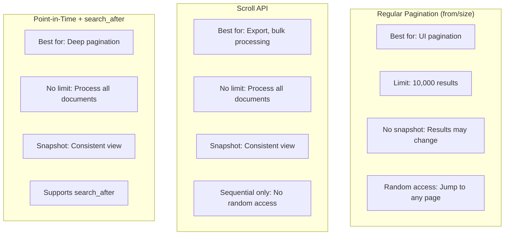

# How to Implement Scroll API in Elasticsearch

Author: [nawazdhandala](https://www.github.com/nawazdhandala)

Tags: Elasticsearch, Scroll API, Pagination, Data Export, Bulk Operations

Description: Learn how to use the Elasticsearch Scroll API for efficiently processing large result sets, with practical examples covering scroll context management, point-in-time searches, and best practices for bulk data operations.

---

> The Scroll API is designed for processing large numbers of documents that don't fit in a single response. Unlike regular pagination with from/size, scrolling maintains a consistent view of the data and can efficiently iterate through millions of documents. This guide shows you when and how to use scrolling effectively.

While the newer Point-in-Time (PIT) API is preferred for new applications, understanding the Scroll API remains important for maintaining existing systems.

---

## Prerequisites

Before starting, ensure you have:
- Elasticsearch 8.x running
- Index with significant data volume
- curl or Kibana Dev Tools

---

## When to Use Scroll vs Regular Pagination



Use Scroll API when:
- Exporting large datasets
- Reindexing data
- Bulk processing all matching documents
- You need more than 10,000 results

---

## Basic Scroll Implementation

### Initiating a Scroll

```bash
# Start a scroll request with 1 minute timeout
curl -X POST "localhost:9200/logs/_search?scroll=1m" -H 'Content-Type: application/json' -d'
{
  "size": 1000,
  "query": {
    "range": {
      "@timestamp": {
        "gte": "2024-01-01",
        "lt": "2024-02-01"
      }
    }
  },
  "sort": [
    { "@timestamp": "asc" }
  ]
}'

# Response includes:
# {
#   "_scroll_id": "FGluY2x1ZGVfY29udGV4dF91dWlkDXF...",
#   "hits": {
#     "total": { "value": 500000, "relation": "eq" },
#     "hits": [ ... first 1000 documents ... ]
#   }
# }
```

### Continuing the Scroll

```bash
# Use the scroll_id to get next batch
# The scroll parameter refreshes the timeout
curl -X POST "localhost:9200/_search/scroll" -H 'Content-Type: application/json' -d'
{
  "scroll": "1m",
  "scroll_id": "FGluY2x1ZGVfY29udGV4dF91dWlkDXF..."
}'
```

### Clearing the Scroll

```bash
# Clear a specific scroll context
curl -X DELETE "localhost:9200/_search/scroll" -H 'Content-Type: application/json' -d'
{
  "scroll_id": "FGluY2x1ZGVfY29udGV4dF91dWlkDXF..."
}'

# Clear all scroll contexts (use with caution)
curl -X DELETE "localhost:9200/_search/scroll/_all"
```

---

## Complete Scroll Example with Bash

```bash
#!/bin/bash

ES_HOST="localhost:9200"
INDEX="logs"
SCROLL_TIME="5m"
BATCH_SIZE=1000
OUTPUT_FILE="export.json"

# Initial scroll request
RESPONSE=$(curl -s -X POST "$ES_HOST/$INDEX/_search?scroll=$SCROLL_TIME" \
  -H 'Content-Type: application/json' \
  -d '{
    "size": '"$BATCH_SIZE"',
    "query": { "match_all": {} },
    "_source": ["@timestamp", "message", "level"]
  }')

# Extract scroll_id and total
SCROLL_ID=$(echo "$RESPONSE" | jq -r '._scroll_id')
TOTAL=$(echo "$RESPONSE" | jq -r '.hits.total.value')
HITS=$(echo "$RESPONSE" | jq -r '.hits.hits | length')

echo "Total documents to process: $TOTAL"
echo "First batch: $HITS documents"

# Write first batch
echo "$RESPONSE" | jq -c '.hits.hits[]._source' >> "$OUTPUT_FILE"

PROCESSED=$HITS

# Continue scrolling until no more results
while [ "$HITS" -gt 0 ]; do
  RESPONSE=$(curl -s -X POST "$ES_HOST/_search/scroll" \
    -H 'Content-Type: application/json' \
    -d '{
      "scroll": "'"$SCROLL_TIME"'",
      "scroll_id": "'"$SCROLL_ID"'"
    }')

  SCROLL_ID=$(echo "$RESPONSE" | jq -r '._scroll_id')
  HITS=$(echo "$RESPONSE" | jq -r '.hits.hits | length')

  if [ "$HITS" -gt 0 ]; then
    echo "$RESPONSE" | jq -c '.hits.hits[]._source' >> "$OUTPUT_FILE"
    PROCESSED=$((PROCESSED + HITS))
    echo "Processed: $PROCESSED / $TOTAL"
  fi
done

# Clear the scroll context
curl -s -X DELETE "$ES_HOST/_search/scroll" \
  -H 'Content-Type: application/json' \
  -d '{"scroll_id": "'"$SCROLL_ID"'"}'

echo "Export complete. Total processed: $PROCESSED"
```

---

## Point-in-Time (PIT) API - The Modern Alternative

PIT provides similar functionality with better resource management:

```bash
# Open a PIT
curl -X POST "localhost:9200/logs/_pit?keep_alive=5m"
# Response: { "id": "46ToAwMDaWR5..." }

# Search with PIT and search_after
curl -X GET "localhost:9200/_search" -H 'Content-Type: application/json' -d'
{
  "size": 1000,
  "query": {
    "match_all": {}
  },
  "pit": {
    "id": "46ToAwMDaWR5...",
    "keep_alive": "5m"
  },
  "sort": [
    { "@timestamp": "asc" },
    { "_id": "asc" }
  ]
}'

# For next page, use search_after with last document's sort values
curl -X GET "localhost:9200/_search" -H 'Content-Type: application/json' -d'
{
  "size": 1000,
  "query": {
    "match_all": {}
  },
  "pit": {
    "id": "46ToAwMDaWR5...",
    "keep_alive": "5m"
  },
  "sort": [
    { "@timestamp": "asc" },
    { "_id": "asc" }
  ],
  "search_after": ["2024-01-15T10:30:00.000Z", "abc123"]
}'

# Close the PIT
curl -X DELETE "localhost:9200/_pit" -H 'Content-Type: application/json' -d'
{
  "id": "46ToAwMDaWR5..."
}'
```

---

## Python Scroll Implementation

Here's a complete Python implementation with both Scroll and PIT APIs:

```python
from elasticsearch import Elasticsearch
from typing import Iterator, Dict, Any, List, Optional, Callable
from dataclasses import dataclass
import time
import json

@dataclass
class ScrollConfig:
    scroll_timeout: str = "5m"
    batch_size: int = 1000
    max_retries: int = 3
    retry_delay: float = 1.0

class ScrollProcessor:
    def __init__(self, hosts: List[str], **kwargs):
        self.es = Elasticsearch(hosts, **kwargs)

    def scroll_search(
        self,
        index: str,
        query: Dict[str, Any] = None,
        source: List[str] = None,
        config: ScrollConfig = None
    ) -> Iterator[Dict[str, Any]]:
        """
        Iterate through all documents matching a query using scroll API.

        Yields one document at a time for memory efficiency.
        """

        if config is None:
            config = ScrollConfig()

        if query is None:
            query = {"match_all": {}}

        # Initial search request
        body = {
            "query": query,
            "size": config.batch_size
        }

        if source:
            body["_source"] = source

        response = self.es.search(
            index=index,
            body=body,
            scroll=config.scroll_timeout
        )

        scroll_id = response["_scroll_id"]
        hits = response["hits"]["hits"]
        total = response["hits"]["total"]["value"]

        print(f"Starting scroll: {total} total documents")

        try:
            while hits:
                for hit in hits:
                    yield hit["_source"]

                # Get next batch
                response = self._scroll_with_retry(
                    scroll_id,
                    config
                )

                scroll_id = response["_scroll_id"]
                hits = response["hits"]["hits"]

        finally:
            # Always clean up scroll context
            self._clear_scroll(scroll_id)

    def _scroll_with_retry(
        self,
        scroll_id: str,
        config: ScrollConfig
    ) -> Dict[str, Any]:
        """Scroll with retry logic"""

        for attempt in range(config.max_retries):
            try:
                return self.es.scroll(
                    scroll_id=scroll_id,
                    scroll=config.scroll_timeout
                )
            except Exception as e:
                if attempt == config.max_retries - 1:
                    raise
                print(f"Scroll failed, retrying: {e}")
                time.sleep(config.retry_delay * (attempt + 1))

    def _clear_scroll(self, scroll_id: str) -> None:
        """Clear scroll context"""
        try:
            self.es.clear_scroll(scroll_id=scroll_id)
        except Exception as e:
            print(f"Warning: Failed to clear scroll: {e}")

    def export_to_file(
        self,
        index: str,
        output_file: str,
        query: Dict[str, Any] = None,
        source: List[str] = None,
        format: str = "jsonl"
    ) -> int:
        """
        Export query results to a file.

        Args:
            index: Index name
            output_file: Output file path
            query: Elasticsearch query
            source: Fields to include
            format: Output format (jsonl or json)

        Returns:
            Number of documents exported
        """

        count = 0

        with open(output_file, "w") as f:
            if format == "json":
                f.write("[\n")

            for doc in self.scroll_search(index, query, source):
                if format == "jsonl":
                    f.write(json.dumps(doc) + "\n")
                else:
                    if count > 0:
                        f.write(",\n")
                    f.write(json.dumps(doc))

                count += 1

                if count % 10000 == 0:
                    print(f"Exported {count} documents...")

            if format == "json":
                f.write("\n]")

        print(f"Export complete: {count} documents")
        return count

    def process_all(
        self,
        index: str,
        processor: Callable[[Dict[str, Any]], None],
        query: Dict[str, Any] = None,
        batch_callback: Callable[[int], None] = None
    ) -> int:
        """
        Process all matching documents with a callback function.

        Args:
            index: Index name
            processor: Function to call for each document
            query: Elasticsearch query
            batch_callback: Optional callback after each batch

        Returns:
            Number of documents processed
        """

        count = 0

        for doc in self.scroll_search(index, query):
            processor(doc)
            count += 1

            if batch_callback and count % 1000 == 0:
                batch_callback(count)

        return count

    def reindex_with_transform(
        self,
        source_index: str,
        dest_index: str,
        transform: Callable[[Dict[str, Any]], Dict[str, Any]],
        query: Dict[str, Any] = None,
        batch_size: int = 500
    ) -> int:
        """
        Reindex documents with a transformation function.

        Args:
            source_index: Source index
            dest_index: Destination index
            transform: Function to transform each document
            query: Query to filter source documents
            batch_size: Bulk indexing batch size

        Returns:
            Number of documents reindexed
        """

        count = 0
        batch = []

        for doc in self.scroll_search(source_index, query):
            transformed = transform(doc)
            if transformed:
                batch.append({"index": {"_index": dest_index}})
                batch.append(transformed)

            if len(batch) >= batch_size * 2:
                self.es.bulk(body=batch)
                count += len(batch) // 2
                batch = []

                if count % 10000 == 0:
                    print(f"Reindexed {count} documents...")

        # Final batch
        if batch:
            self.es.bulk(body=batch)
            count += len(batch) // 2

        print(f"Reindex complete: {count} documents")
        return count


class PITProcessor:
    """Point-in-Time based processor (preferred for new applications)"""

    def __init__(self, hosts: List[str], **kwargs):
        self.es = Elasticsearch(hosts, **kwargs)

    def search_with_pit(
        self,
        index: str,
        query: Dict[str, Any] = None,
        source: List[str] = None,
        sort: List[Dict[str, Any]] = None,
        batch_size: int = 1000,
        keep_alive: str = "5m"
    ) -> Iterator[Dict[str, Any]]:
        """
        Iterate through documents using Point-in-Time API.
        """

        if query is None:
            query = {"match_all": {}}

        if sort is None:
            sort = [{"_id": "asc"}]

        # Open PIT
        pit_response = self.es.open_point_in_time(
            index=index,
            keep_alive=keep_alive
        )
        pit_id = pit_response["id"]

        try:
            search_after = None

            while True:
                body = {
                    "query": query,
                    "size": batch_size,
                    "pit": {
                        "id": pit_id,
                        "keep_alive": keep_alive
                    },
                    "sort": sort
                }

                if source:
                    body["_source"] = source

                if search_after:
                    body["search_after"] = search_after

                response = self.es.search(body=body)

                hits = response["hits"]["hits"]
                if not hits:
                    break

                for hit in hits:
                    yield hit["_source"]

                # Get sort values from last hit for next page
                search_after = hits[-1]["sort"]

                # Update PIT ID (may change)
                pit_id = response.get("pit_id", pit_id)

        finally:
            # Close PIT
            try:
                self.es.close_point_in_time(body={"id": pit_id})
            except Exception as e:
                print(f"Warning: Failed to close PIT: {e}")


# Usage examples
if __name__ == "__main__":
    # Scroll API example
    processor = ScrollProcessor(["http://localhost:9200"])

    # Export to file
    processor.export_to_file(
        index="logs",
        output_file="logs_export.jsonl",
        query={
            "range": {
                "@timestamp": {
                    "gte": "2024-01-01",
                    "lt": "2024-02-01"
                }
            }
        },
        source=["@timestamp", "message", "level"]
    )

    # Process all documents
    def process_log(doc):
        # Your processing logic here
        if doc.get("level") == "ERROR":
            print(f"Error: {doc.get('message')}")

    processor.process_all(
        index="logs",
        processor=process_log,
        query={"term": {"level": "ERROR"}},
        batch_callback=lambda count: print(f"Processed {count}...")
    )

    # Reindex with transformation
    def transform_doc(doc):
        doc["processed_at"] = "2024-01-15T10:00:00Z"
        doc["message_length"] = len(doc.get("message", ""))
        return doc

    processor.reindex_with_transform(
        source_index="logs",
        dest_index="logs_processed",
        transform=transform_doc
    )

    # PIT API example (preferred)
    pit_processor = PITProcessor(["http://localhost:9200"])

    count = 0
    for doc in pit_processor.search_with_pit(
        index="logs",
        query={"match_all": {}},
        sort=[{"@timestamp": "asc"}, {"_id": "asc"}]
    ):
        count += 1
        if count % 10000 == 0:
            print(f"Processed {count} documents with PIT")
```

---

## Parallel Scrolling with Slices

For faster processing, use sliced scrolls:

```bash
# Slice 0 of 5
curl -X POST "localhost:9200/logs/_search?scroll=1m" -H 'Content-Type: application/json' -d'
{
  "slice": {
    "id": 0,
    "max": 5
  },
  "query": { "match_all": {} },
  "size": 1000
}'

# Slice 1 of 5 (run in parallel)
curl -X POST "localhost:9200/logs/_search?scroll=1m" -H 'Content-Type: application/json' -d'
{
  "slice": {
    "id": 1,
    "max": 5
  },
  "query": { "match_all": {} },
  "size": 1000
}'
# ... repeat for slices 2, 3, 4
```

Python implementation for parallel sliced scrolling:

```python
from concurrent.futures import ThreadPoolExecutor, as_completed
from typing import List, Dict, Any
import threading

class ParallelScrollProcessor:
    def __init__(self, hosts: List[str], **kwargs):
        self.hosts = hosts
        self.kwargs = kwargs
        self.lock = threading.Lock()
        self.total_processed = 0

    def parallel_scroll(
        self,
        index: str,
        query: Dict[str, Any] = None,
        num_slices: int = 5,
        processor: callable = None
    ) -> int:
        """Process documents in parallel using sliced scrolls"""

        with ThreadPoolExecutor(max_workers=num_slices) as executor:
            futures = []

            for slice_id in range(num_slices):
                future = executor.submit(
                    self._process_slice,
                    index,
                    query,
                    slice_id,
                    num_slices,
                    processor
                )
                futures.append(future)

            for future in as_completed(futures):
                count = future.result()
                with self.lock:
                    self.total_processed += count

        return self.total_processed

    def _process_slice(
        self,
        index: str,
        query: Dict[str, Any],
        slice_id: int,
        max_slices: int,
        processor: callable
    ) -> int:
        """Process a single slice"""

        es = Elasticsearch(self.hosts, **self.kwargs)

        body = {
            "slice": {
                "id": slice_id,
                "max": max_slices
            },
            "query": query or {"match_all": {}},
            "size": 1000
        }

        response = es.search(index=index, body=body, scroll="5m")
        scroll_id = response["_scroll_id"]
        hits = response["hits"]["hits"]
        count = 0

        try:
            while hits:
                for hit in hits:
                    if processor:
                        processor(hit["_source"])
                    count += 1

                response = es.scroll(scroll_id=scroll_id, scroll="5m")
                scroll_id = response["_scroll_id"]
                hits = response["hits"]["hits"]

        finally:
            es.clear_scroll(scroll_id=scroll_id)

        print(f"Slice {slice_id} processed {count} documents")
        return count
```

---

## Best Practices

**Scroll Timeout:**
- Set timeout based on processing time between scrolls
- Too short: Context expires mid-process
- Too long: Wastes cluster resources

**Batch Size:**
- 1000-5000 is typically optimal
- Larger batches = fewer requests but more memory
- Smaller batches = more requests but lower memory

**Resource Management:**
- Always clear scroll contexts when done
- Monitor scroll context count in cluster stats
- Set `search.max_open_scroll_context` appropriately

**Error Handling:**
- Implement retry logic for transient failures
- Handle scroll context expiration gracefully
- Log progress for long-running operations

**Prefer PIT for New Code:**
- Point-in-Time API is more efficient
- Better handles concurrent changes
- Supports search_after for flexible pagination

---

## Conclusion

The Scroll API is essential for processing large datasets in Elasticsearch. Key takeaways:

- Use scroll for exporting, reindexing, and bulk operations
- Always clear scroll contexts to free resources
- Consider PIT with search_after for new applications
- Use sliced scrolling for parallel processing

With these patterns, you can efficiently process millions of documents without memory issues.

---

*Need to monitor your data processing jobs? [OneUptime](https://oneuptime.com) provides observability for batch operations and infrastructure.*
