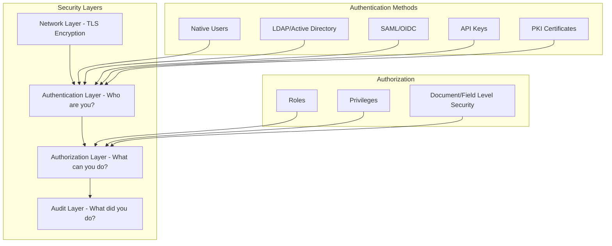

# How to Configure Security in Elasticsearch

Author: [nawazdhandala](https://www.github.com/nawazdhandala)

Tags: Elasticsearch, Security, Authentication, Authorization, TLS, RBAC

Description: A comprehensive guide to securing Elasticsearch clusters, covering authentication, role-based access control, TLS encryption, API keys, and security best practices for production deployments.

---

> Security is not optional for production Elasticsearch clusters. An unsecured cluster exposes your data to anyone who can reach it. This guide covers the essential security configurations to protect your Elasticsearch deployment from unauthorized access.

Elasticsearch 8.x enables security by default, but understanding how to configure it properly is crucial for production environments.

---

## Prerequisites

Before starting, ensure you have:
- Elasticsearch 8.x installed
- Administrative access to cluster nodes
- Understanding of TLS/SSL certificates
- curl or Kibana Dev Tools

---

## Security Architecture Overview

Elasticsearch security operates at multiple layers:



---

## Enabling Security (If Not Already Enabled)

Elasticsearch 8.x has security enabled by default. If you're upgrading from an older version or have disabled it:

```yaml
# /etc/elasticsearch/elasticsearch.yml

# Enable security features
xpack.security.enabled: true

# Enable TLS for transport layer (node-to-node communication)
xpack.security.transport.ssl.enabled: true
xpack.security.transport.ssl.verification_mode: certificate
xpack.security.transport.ssl.keystore.path: elastic-certificates.p12
xpack.security.transport.ssl.truststore.path: elastic-certificates.p12

# Enable TLS for HTTP layer (client communication)
xpack.security.http.ssl.enabled: true
xpack.security.http.ssl.keystore.path: http.p12
```

---

## Generating TLS Certificates

Create certificates for secure communication:

```bash
# Generate a certificate authority
cd /usr/share/elasticsearch
sudo bin/elasticsearch-certutil ca --out /etc/elasticsearch/certs/elastic-stack-ca.p12 --pass ""

# Generate node certificates
sudo bin/elasticsearch-certutil cert \
  --ca /etc/elasticsearch/certs/elastic-stack-ca.p12 \
  --ca-pass "" \
  --out /etc/elasticsearch/certs/elastic-certificates.p12 \
  --pass ""

# Generate HTTP certificates for client connections
sudo bin/elasticsearch-certutil http

# Follow the prompts:
# - Generate CSR? No
# - Use existing CA? Yes, point to elastic-stack-ca.p12
# - Generate certificate per node? Yes for production
# - Set hostnames and IPs for each node

# Set permissions
sudo chown -R elasticsearch:elasticsearch /etc/elasticsearch/certs/
sudo chmod 640 /etc/elasticsearch/certs/*

# Copy certificates to all nodes
# Use scp or your configuration management tool
```

---

## Setting Up Built-in Users

Reset passwords for built-in users after enabling security:

```bash
# Interactive password setup for all built-in users
sudo /usr/share/elasticsearch/bin/elasticsearch-setup-passwords interactive

# Or auto-generate passwords
sudo /usr/share/elasticsearch/bin/elasticsearch-setup-passwords auto

# Reset a specific user's password
curl -X POST "https://localhost:9200/_security/user/elastic/_password" \
  -H 'Content-Type: application/json' \
  -u elastic:current_password \
  -d '{"password": "new_secure_password"}'
```

---

## Creating Custom Roles

Define roles with specific privileges:

```bash
# Read-only role for logs indices
curl -X PUT "https://localhost:9200/_security/role/logs_reader" \
  -H 'Content-Type: application/json' \
  -u elastic:password \
  -d '{
    "cluster": ["monitor"],
    "indices": [
      {
        "names": ["logs-*"],
        "privileges": ["read", "view_index_metadata"],
        "field_security": {
          "grant": ["*"],
          "except": ["password", "credit_card"]
        }
      }
    ]
  }'

# Writer role for application indices
curl -X PUT "https://localhost:9200/_security/role/app_writer" \
  -H 'Content-Type: application/json' \
  -u elastic:password \
  -d '{
    "cluster": ["monitor"],
    "indices": [
      {
        "names": ["app-*"],
        "privileges": ["create_index", "index", "read", "write", "delete"]
      }
    ]
  }'

# Admin role for specific index pattern
curl -X PUT "https://localhost:9200/_security/role/index_admin" \
  -H 'Content-Type: application/json' \
  -u elastic:password \
  -d '{
    "cluster": ["manage_index_templates", "monitor"],
    "indices": [
      {
        "names": ["*"],
        "privileges": ["all"]
      }
    ]
  }'

# Role with document-level security
curl -X PUT "https://localhost:9200/_security/role/tenant_a_user" \
  -H 'Content-Type: application/json' \
  -u elastic:password \
  -d '{
    "cluster": [],
    "indices": [
      {
        "names": ["orders-*"],
        "privileges": ["read"],
        "query": {
          "term": {
            "tenant_id": "tenant_a"
          }
        }
      }
    ]
  }'
```

---

## Creating Users

Create users and assign roles:

```bash
# Create a user with multiple roles
curl -X PUT "https://localhost:9200/_security/user/app_service" \
  -H 'Content-Type: application/json' \
  -u elastic:password \
  -d '{
    "password": "secure_service_password",
    "roles": ["app_writer", "logs_reader"],
    "full_name": "Application Service Account",
    "email": "app-service@example.com",
    "metadata": {
      "team": "backend",
      "environment": "production"
    }
  }'

# Create a read-only user
curl -X PUT "https://localhost:9200/_security/user/analyst" \
  -H 'Content-Type: application/json' \
  -u elastic:password \
  -d '{
    "password": "analyst_password",
    "roles": ["logs_reader"],
    "full_name": "Data Analyst"
  }'

# List all users
curl -X GET "https://localhost:9200/_security/user?pretty" \
  -u elastic:password

# Get specific user
curl -X GET "https://localhost:9200/_security/user/app_service?pretty" \
  -u elastic:password

# Disable a user
curl -X PUT "https://localhost:9200/_security/user/old_user/_disable" \
  -u elastic:password

# Enable a user
curl -X PUT "https://localhost:9200/_security/user/old_user/_enable" \
  -u elastic:password
```

---

## API Keys for Service Authentication

API keys are preferred over passwords for service-to-service communication:

```bash
# Create an API key with specific privileges
curl -X POST "https://localhost:9200/_security/api_key" \
  -H 'Content-Type: application/json' \
  -u elastic:password \
  -d '{
    "name": "indexing-service-key",
    "expiration": "30d",
    "role_descriptors": {
      "indexing_role": {
        "cluster": ["monitor"],
        "indices": [
          {
            "names": ["logs-*", "metrics-*"],
            "privileges": ["create_index", "index", "create"]
          }
        ]
      }
    },
    "metadata": {
      "application": "log-shipper",
      "environment": "production"
    }
  }'

# Response contains the key - store it securely!
# {
#   "id": "VuaCfGcBCdbkQm-e5aOx",
#   "name": "indexing-service-key",
#   "api_key": "ui2lp2axTNmsyakw9tvNnw",
#   "encoded": "VnVhQ2ZHY0JDZGJrUW0tZTVhT3g6dWkybHAyYXhUTm1zeWFrdzl0dk5udw=="
# }

# Use the API key in requests
# Method 1: Base64 encoded in Authorization header
curl -X GET "https://localhost:9200/_cluster/health" \
  -H "Authorization: ApiKey VnVhQ2ZHY0JDZGJrUW0tZTVhT3g6dWkybHAyYXhUTm1zeWFrdzl0dk5udw=="

# Method 2: Using id and api_key separately
curl -X GET "https://localhost:9200/_cluster/health" \
  -H "Authorization: ApiKey $(echo -n 'VuaCfGcBCdbkQm-e5aOx:ui2lp2axTNmsyakw9tvNnw' | base64)"

# List API keys
curl -X GET "https://localhost:9200/_security/api_key?pretty" \
  -u elastic:password

# Invalidate an API key
curl -X DELETE "https://localhost:9200/_security/api_key" \
  -H 'Content-Type: application/json' \
  -u elastic:password \
  -d '{
    "ids": ["VuaCfGcBCdbkQm-e5aOx"]
  }'
```

---

## Field and Document Level Security

Restrict access to specific fields or documents:

```bash
# Role with field-level security - hide sensitive fields
curl -X PUT "https://localhost:9200/_security/role/limited_reader" \
  -H 'Content-Type: application/json' \
  -u elastic:password \
  -d '{
    "indices": [
      {
        "names": ["customers-*"],
        "privileges": ["read"],
        "field_security": {
          "grant": ["name", "email", "created_at"],
          "except": []
        }
      }
    ]
  }'

# Role with document-level security - filter by field value
curl -X PUT "https://localhost:9200/_security/role/region_us_user" \
  -H 'Content-Type: application/json' \
  -u elastic:password \
  -d '{
    "indices": [
      {
        "names": ["sales-*"],
        "privileges": ["read"],
        "query": {
          "bool": {
            "must": [
              { "term": { "region": "US" } }
            ]
          }
        }
      }
    ]
  }'

# Combined field and document security
curl -X PUT "https://localhost:9200/_security/role/restricted_analyst" \
  -H 'Content-Type: application/json' \
  -u elastic:password \
  -d '{
    "indices": [
      {
        "names": ["transactions-*"],
        "privileges": ["read"],
        "field_security": {
          "grant": ["transaction_id", "amount", "date", "category"],
          "except": ["customer_ssn", "credit_card_number"]
        },
        "query": {
          "range": {
            "date": {
              "gte": "now-90d"
            }
          }
        }
      }
    ]
  }'
```

---

## Audit Logging

Enable audit logging to track security events:

```yaml
# /etc/elasticsearch/elasticsearch.yml

xpack.security.audit.enabled: true

# Log to file
xpack.security.audit.outputs: [ logfile ]

# Configure what to log
xpack.security.audit.logfile.events.include:
  - access_denied
  - access_granted
  - anonymous_access_denied
  - authentication_failed
  - connection_denied
  - tampered_request
  - run_as_denied
  - run_as_granted

# Exclude noisy events
xpack.security.audit.logfile.events.exclude:
  - connection_granted

# Include request body for specific events
xpack.security.audit.logfile.events.emit_request_body: true
```

---

## Python Security Manager

A complete security management utility:

```python
from elasticsearch import Elasticsearch
from typing import List, Dict, Any, Optional
import base64
import secrets

class SecurityManager:
    def __init__(
        self,
        hosts: List[str],
        username: str = "elastic",
        password: str = None,
        api_key: str = None,
        ca_certs: str = None
    ):
        auth_params = {}

        if api_key:
            auth_params["api_key"] = api_key
        elif password:
            auth_params["basic_auth"] = (username, password)

        if ca_certs:
            auth_params["ca_certs"] = ca_certs

        self.es = Elasticsearch(hosts, **auth_params)

    def create_role(
        self,
        role_name: str,
        cluster_privileges: List[str] = None,
        index_privileges: List[Dict[str, Any]] = None,
        run_as: List[str] = None
    ) -> bool:
        """Create a new role"""

        body = {}

        if cluster_privileges:
            body["cluster"] = cluster_privileges

        if index_privileges:
            body["indices"] = index_privileges

        if run_as:
            body["run_as"] = run_as

        self.es.security.put_role(name=role_name, body=body)
        return True

    def create_user(
        self,
        username: str,
        password: str,
        roles: List[str],
        full_name: str = None,
        email: str = None,
        metadata: Dict[str, Any] = None
    ) -> bool:
        """Create a new user"""

        body = {
            "password": password,
            "roles": roles
        }

        if full_name:
            body["full_name"] = full_name
        if email:
            body["email"] = email
        if metadata:
            body["metadata"] = metadata

        self.es.security.put_user(username=username, body=body)
        return True

    def create_api_key(
        self,
        name: str,
        role_descriptors: Dict[str, Any] = None,
        expiration: str = "30d",
        metadata: Dict[str, Any] = None
    ) -> Dict[str, str]:
        """Create an API key and return credentials"""

        body = {
            "name": name,
            "expiration": expiration
        }

        if role_descriptors:
            body["role_descriptors"] = role_descriptors
        if metadata:
            body["metadata"] = metadata

        response = self.es.security.create_api_key(body=body)

        # Return the key in various formats
        key_id = response["id"]
        api_key = response["api_key"]
        encoded = base64.b64encode(f"{key_id}:{api_key}".encode()).decode()

        return {
            "id": key_id,
            "api_key": api_key,
            "encoded": encoded,
            "name": name
        }

    def invalidate_api_key(self, key_id: str = None, name: str = None) -> int:
        """Invalidate API keys by ID or name"""

        body = {}
        if key_id:
            body["ids"] = [key_id]
        if name:
            body["name"] = name

        response = self.es.security.invalidate_api_key(body=body)
        return response.get("invalidated_api_keys", 0)

    def list_users(self) -> List[Dict[str, Any]]:
        """List all users"""

        response = self.es.security.get_user()
        users = []

        for username, data in response.items():
            users.append({
                "username": username,
                "roles": data.get("roles", []),
                "full_name": data.get("full_name"),
                "email": data.get("email"),
                "enabled": data.get("enabled", True)
            })

        return users

    def list_roles(self) -> List[Dict[str, Any]]:
        """List all roles"""

        response = self.es.security.get_role()
        roles = []

        for role_name, data in response.items():
            roles.append({
                "name": role_name,
                "cluster": data.get("cluster", []),
                "indices": len(data.get("indices", [])),
                "run_as": data.get("run_as", [])
            })

        return roles

    def check_privileges(
        self,
        cluster_privileges: List[str] = None,
        index_privileges: List[Dict[str, Any]] = None
    ) -> Dict[str, Any]:
        """Check if current user has specified privileges"""

        body = {}
        if cluster_privileges:
            body["cluster"] = cluster_privileges
        if index_privileges:
            body["index"] = index_privileges

        return self.es.security.has_privileges(body=body)

    def setup_standard_roles(self) -> Dict[str, bool]:
        """Set up common role patterns"""

        results = {}

        # Read-only monitoring role
        results["monitor"] = self.create_role(
            role_name="monitoring_reader",
            cluster_privileges=["monitor"],
            index_privileges=[{
                "names": ["*"],
                "privileges": ["monitor"]
            }]
        )

        # Log writer role
        results["log_writer"] = self.create_role(
            role_name="log_writer",
            cluster_privileges=["monitor"],
            index_privileges=[{
                "names": ["logs-*", "metrics-*"],
                "privileges": ["create_index", "index", "create"]
            }]
        )

        # Log reader role
        results["log_reader"] = self.create_role(
            role_name="log_reader",
            cluster_privileges=["monitor"],
            index_privileges=[{
                "names": ["logs-*"],
                "privileges": ["read", "view_index_metadata"]
            }]
        )

        # Application admin role
        results["app_admin"] = self.create_role(
            role_name="application_admin",
            cluster_privileges=["monitor", "manage_index_templates"],
            index_privileges=[{
                "names": ["app-*"],
                "privileges": ["all"]
            }]
        )

        return results

    def generate_secure_password(self, length: int = 24) -> str:
        """Generate a secure random password"""
        alphabet = "abcdefghijklmnopqrstuvwxyzABCDEFGHIJKLMNOPQRSTUVWXYZ0123456789!@#$%^&*"
        return ''.join(secrets.choice(alphabet) for _ in range(length))


# Usage example
if __name__ == "__main__":
    # Initialize with basic auth
    manager = SecurityManager(
        hosts=["https://localhost:9200"],
        username="elastic",
        password="your_elastic_password",
        ca_certs="/path/to/ca.crt"
    )

    # Set up standard roles
    print("Setting up standard roles...")
    results = manager.setup_standard_roles()
    for role, success in results.items():
        print(f"  {role}: {'OK' if success else 'FAILED'}")

    # Create a service account with API key
    print("\nCreating service account...")
    api_key = manager.create_api_key(
        name="log-shipper-key",
        role_descriptors={
            "log_writer": {
                "cluster": ["monitor"],
                "indices": [{
                    "names": ["logs-*"],
                    "privileges": ["create_index", "index"]
                }]
            }
        },
        expiration="90d",
        metadata={"application": "log-shipper"}
    )

    print(f"  API Key ID: {api_key['id']}")
    print(f"  Encoded key: {api_key['encoded']}")
    print("  Store this key securely - it cannot be retrieved later!")

    # List users
    print("\nCurrent users:")
    for user in manager.list_users():
        status = "enabled" if user["enabled"] else "disabled"
        print(f"  {user['username']}: {user['roles']} ({status})")

    # Check current user privileges
    print("\nChecking current privileges...")
    privs = manager.check_privileges(
        cluster_privileges=["manage", "monitor"],
        index_privileges=[{
            "names": ["logs-*"],
            "privileges": ["read", "write"]
        }]
    )
    print(f"  Has manage: {privs.get('cluster', {}).get('manage', False)}")
    print(f"  Has monitor: {privs.get('cluster', {}).get('monitor', False)}")
```

---

## Security Checklist

**Authentication:**
- [ ] All built-in user passwords changed from defaults
- [ ] Service accounts use API keys, not passwords
- [ ] API keys have appropriate expiration times
- [ ] Unused users are disabled or deleted

**Authorization:**
- [ ] Principle of least privilege applied to all roles
- [ ] No unnecessary use of superuser role
- [ ] Document-level security for multi-tenant data
- [ ] Field-level security for sensitive data

**Encryption:**
- [ ] TLS enabled for transport layer
- [ ] TLS enabled for HTTP layer
- [ ] Certificates rotated regularly
- [ ] Strong cipher suites configured

**Auditing:**
- [ ] Audit logging enabled
- [ ] Failed authentication attempts logged
- [ ] Access denied events logged
- [ ] Audit logs shipped to secure storage

---

## Conclusion

Securing Elasticsearch requires a layered approach covering authentication, authorization, encryption, and auditing. Key takeaways:

- Always enable TLS for both transport and HTTP layers
- Use API keys for service authentication instead of passwords
- Apply principle of least privilege when creating roles
- Enable audit logging for security visibility

Security is not a one-time setup. Regularly review and update your security configurations as your requirements evolve.

---

*Need to monitor security events across your infrastructure? [OneUptime](https://oneuptime.com) provides comprehensive observability and alerting for your entire stack.*
