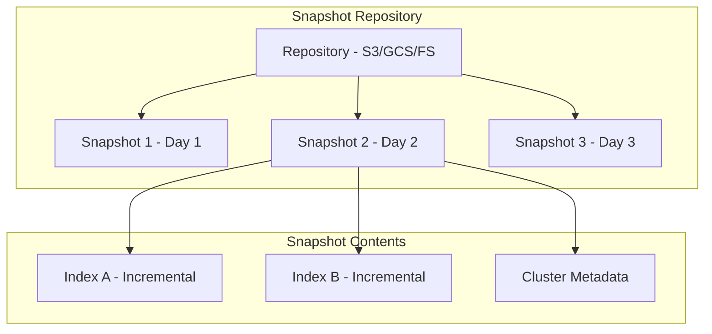

# How to Configure Snapshot and Restore in Elasticsearch

Author: [nawazdhandala](https://www.github.com/nawazdhandala)

Tags: Elasticsearch, Snapshot, Restore, Backup, Disaster Recovery, Data Protection

Description: Learn how to configure Elasticsearch snapshot and restore for data protection, covering repository setup, snapshot policies, restoration procedures, and disaster recovery strategies.

---

> Snapshots are the foundation of data protection in Elasticsearch. They provide point-in-time backups of your indices that can be used for disaster recovery, data migration, and long-term archival. This guide shows you how to implement a robust snapshot strategy.

Unlike filesystem backups, Elasticsearch snapshots are incremental and consistent, making them the only supported method for backing up Elasticsearch data.

---

## Prerequisites

Before starting, ensure you have:
- Elasticsearch 8.x running
- Access to shared storage (S3, GCS, Azure Blob, or shared filesystem)
- Appropriate permissions to create repositories

---

## Understanding Snapshots



Snapshots are:
- **Incremental**: Only changed data is stored after the first snapshot
- **Consistent**: Point-in-time snapshot across all shards
- **Restorable**: Can restore to the same or different clusters

---

## Setting Up Snapshot Repositories

### S3 Repository

```bash
# First, install the S3 repository plugin on all nodes
# sudo bin/elasticsearch-plugin install repository-s3

# Add S3 credentials to keystore on all nodes
bin/elasticsearch-keystore add s3.client.default.access_key
bin/elasticsearch-keystore add s3.client.default.secret_key

# Create S3 repository
curl -X PUT "localhost:9200/_snapshot/s3_backup" -H 'Content-Type: application/json' -d'
{
  "type": "s3",
  "settings": {
    "bucket": "my-elasticsearch-backups",
    "region": "us-east-1",
    "base_path": "production/snapshots",
    "compress": true,
    "server_side_encryption": true,
    "storage_class": "standard_ia"
  }
}'
```

### Google Cloud Storage Repository

```bash
# Install GCS plugin
# sudo bin/elasticsearch-plugin install repository-gcs

# Add service account credentials
bin/elasticsearch-keystore add-file gcs.client.default.credentials_file /path/to/service-account.json

# Create GCS repository
curl -X PUT "localhost:9200/_snapshot/gcs_backup" -H 'Content-Type: application/json' -d'
{
  "type": "gcs",
  "settings": {
    "bucket": "my-elasticsearch-backups",
    "base_path": "production/snapshots",
    "compress": true
  }
}'
```

### Azure Blob Storage Repository

```bash
# Install Azure plugin
# sudo bin/elasticsearch-plugin install repository-azure

# Add Azure credentials to keystore
bin/elasticsearch-keystore add azure.client.default.account
bin/elasticsearch-keystore add azure.client.default.key

# Create Azure repository
curl -X PUT "localhost:9200/_snapshot/azure_backup" -H 'Content-Type: application/json' -d'
{
  "type": "azure",
  "settings": {
    "container": "elasticsearch-snapshots",
    "base_path": "production/snapshots",
    "compress": true
  }
}'
```

### Shared Filesystem Repository

```bash
# Add path to elasticsearch.yml on all nodes
# path.repo: ["/mnt/backups/elasticsearch"]

# Create filesystem repository
curl -X PUT "localhost:9200/_snapshot/fs_backup" -H 'Content-Type: application/json' -d'
{
  "type": "fs",
  "settings": {
    "location": "/mnt/backups/elasticsearch/snapshots",
    "compress": true,
    "max_snapshot_bytes_per_sec": "200mb",
    "max_restore_bytes_per_sec": "200mb"
  }
}'
```

---

## Verifying Repository Setup

```bash
# Verify repository is accessible from all nodes
curl -X POST "localhost:9200/_snapshot/s3_backup/_verify?pretty"

# List all repositories
curl -X GET "localhost:9200/_snapshot?pretty"

# Get repository details
curl -X GET "localhost:9200/_snapshot/s3_backup?pretty"
```

---

## Creating Snapshots

### Manual Snapshots

```bash
# Snapshot all indices
curl -X PUT "localhost:9200/_snapshot/s3_backup/snapshot_$(date +%Y%m%d_%H%M%S)?wait_for_completion=false" \
  -H 'Content-Type: application/json' -d'
{
  "indices": "*",
  "ignore_unavailable": true,
  "include_global_state": true
}'

# Snapshot specific indices
curl -X PUT "localhost:9200/_snapshot/s3_backup/logs_snapshot_20240115?wait_for_completion=false" \
  -H 'Content-Type: application/json' -d'
{
  "indices": "logs-*",
  "ignore_unavailable": true,
  "include_global_state": false,
  "metadata": {
    "taken_by": "admin",
    "reason": "Daily backup"
  }
}'

# Check snapshot progress
curl -X GET "localhost:9200/_snapshot/s3_backup/logs_snapshot_20240115/_status?pretty"

# Wait for snapshot completion
curl -X GET "localhost:9200/_snapshot/s3_backup/logs_snapshot_20240115?wait_for_completion=true&pretty"
```

---

## Snapshot Lifecycle Management (SLM)

Automate snapshots with SLM policies:

```bash
# Create SLM policy for daily snapshots
curl -X PUT "localhost:9200/_slm/policy/daily_snapshots" -H 'Content-Type: application/json' -d'
{
  "schedule": "0 30 1 * * ?",
  "name": "<daily-snap-{now/d}>",
  "repository": "s3_backup",
  "config": {
    "indices": ["*"],
    "ignore_unavailable": true,
    "include_global_state": false
  },
  "retention": {
    "expire_after": "30d",
    "min_count": 5,
    "max_count": 50
  }
}'

# Create SLM policy for hourly log snapshots
curl -X PUT "localhost:9200/_slm/policy/hourly_logs" -H 'Content-Type: application/json' -d'
{
  "schedule": "0 0 * * * ?",
  "name": "<hourly-logs-{now/H}>",
  "repository": "s3_backup",
  "config": {
    "indices": ["logs-*"],
    "ignore_unavailable": true,
    "include_global_state": false,
    "partial": true
  },
  "retention": {
    "expire_after": "7d",
    "min_count": 24,
    "max_count": 168
  }
}'

# Create weekly full backup policy
curl -X PUT "localhost:9200/_slm/policy/weekly_full" -H 'Content-Type: application/json' -d'
{
  "schedule": "0 0 2 ? * SUN",
  "name": "<weekly-full-{now/w}>",
  "repository": "s3_backup",
  "config": {
    "indices": ["*"],
    "ignore_unavailable": true,
    "include_global_state": true
  },
  "retention": {
    "expire_after": "90d",
    "min_count": 4,
    "max_count": 12
  }
}'

# List all SLM policies
curl -X GET "localhost:9200/_slm/policy?pretty"

# Execute a policy immediately
curl -X POST "localhost:9200/_slm/policy/daily_snapshots/_execute?pretty"

# Get SLM status
curl -X GET "localhost:9200/_slm/status?pretty"

# Get policy statistics
curl -X GET "localhost:9200/_slm/stats?pretty"
```

---

## Listing and Managing Snapshots

```bash
# List all snapshots in a repository
curl -X GET "localhost:9200/_snapshot/s3_backup/*?pretty"

# Get specific snapshot details
curl -X GET "localhost:9200/_snapshot/s3_backup/daily-snap-2024.01.15?pretty"

# List snapshots with detailed info
curl -X GET "localhost:9200/_snapshot/s3_backup/*?verbose=true&pretty"

# Delete a specific snapshot
curl -X DELETE "localhost:9200/_snapshot/s3_backup/old_snapshot_20231201"

# Delete multiple snapshots
curl -X DELETE "localhost:9200/_snapshot/s3_backup/old_snapshot_*"
```

---

## Restoring Snapshots

### Basic Restore

```bash
# Restore all indices from a snapshot
curl -X POST "localhost:9200/_snapshot/s3_backup/daily-snap-2024.01.15/_restore?wait_for_completion=false" \
  -H 'Content-Type: application/json' -d'
{
  "indices": "*",
  "ignore_unavailable": true,
  "include_global_state": false
}'

# Check restore progress
curl -X GET "localhost:9200/_recovery?pretty"
```

### Restore Specific Indices

```bash
# Restore specific indices
curl -X POST "localhost:9200/_snapshot/s3_backup/daily-snap-2024.01.15/_restore" \
  -H 'Content-Type: application/json' -d'
{
  "indices": "logs-2024.01.15,metrics-2024.01.15",
  "ignore_unavailable": true,
  "include_global_state": false
}'
```

### Restore with Rename

```bash
# Restore indices with new names (useful for testing)
curl -X POST "localhost:9200/_snapshot/s3_backup/daily-snap-2024.01.15/_restore" \
  -H 'Content-Type: application/json' -d'
{
  "indices": "logs-*",
  "ignore_unavailable": true,
  "include_global_state": false,
  "rename_pattern": "logs-(.+)",
  "rename_replacement": "restored_logs-$1"
}'
```

### Restore with Modified Settings

```bash
# Restore with different index settings
curl -X POST "localhost:9200/_snapshot/s3_backup/daily-snap-2024.01.15/_restore" \
  -H 'Content-Type: application/json' -d'
{
  "indices": "logs-2024.01.15",
  "ignore_unavailable": true,
  "include_global_state": false,
  "index_settings": {
    "index.number_of_replicas": 0
  },
  "ignore_index_settings": [
    "index.refresh_interval"
  ]
}'
```

---

## Disaster Recovery Procedures

### Full Cluster Recovery

```bash
# 1. Stop all indexing to the cluster

# 2. Close all indices that will be restored
curl -X POST "localhost:9200/_all/_close"

# 3. Restore from latest snapshot
curl -X POST "localhost:9200/_snapshot/s3_backup/latest_snapshot/_restore?wait_for_completion=true" \
  -H 'Content-Type: application/json' -d'
{
  "indices": "*",
  "ignore_unavailable": true,
  "include_global_state": true
}'

# 4. Verify cluster health
curl -X GET "localhost:9200/_cluster/health?wait_for_status=green&timeout=5m"

# 5. Resume indexing
```

### Point-in-Time Recovery

```bash
# Find snapshots around the target time
curl -X GET "localhost:9200/_snapshot/s3_backup/*?verbose=true&pretty" | grep -A 5 "2024.01.15"

# Restore specific snapshot
curl -X POST "localhost:9200/_snapshot/s3_backup/hourly-logs-2024.01.15-14/_restore" \
  -H 'Content-Type: application/json' -d'
{
  "indices": "logs-*",
  "rename_pattern": "logs-(.+)",
  "rename_replacement": "recovered_logs-$1"
}'
```

---

## Python Snapshot Manager

Here's a complete snapshot management utility:

```python
from elasticsearch import Elasticsearch
from typing import List, Dict, Any, Optional
from dataclasses import dataclass
from datetime import datetime, timedelta
import time

@dataclass
class SnapshotInfo:
    name: str
    state: str
    start_time: datetime
    end_time: Optional[datetime]
    duration_seconds: Optional[int]
    indices: List[str]
    shards_total: int
    shards_successful: int
    shards_failed: int

class SnapshotManager:
    def __init__(self, hosts: List[str], **kwargs):
        self.es = Elasticsearch(hosts, **kwargs)

    def create_s3_repository(
        self,
        repo_name: str,
        bucket: str,
        region: str = "us-east-1",
        base_path: str = "snapshots"
    ) -> bool:
        """Create an S3 snapshot repository"""

        self.es.snapshot.create_repository(
            repository=repo_name,
            body={
                "type": "s3",
                "settings": {
                    "bucket": bucket,
                    "region": region,
                    "base_path": base_path,
                    "compress": True,
                    "server_side_encryption": True
                }
            }
        )
        return True

    def create_fs_repository(
        self,
        repo_name: str,
        location: str
    ) -> bool:
        """Create a filesystem snapshot repository"""

        self.es.snapshot.create_repository(
            repository=repo_name,
            body={
                "type": "fs",
                "settings": {
                    "location": location,
                    "compress": True
                }
            }
        )
        return True

    def verify_repository(self, repo_name: str) -> bool:
        """Verify repository is accessible from all nodes"""

        try:
            self.es.snapshot.verify_repository(repository=repo_name)
            return True
        except Exception as e:
            print(f"Repository verification failed: {e}")
            return False

    def create_snapshot(
        self,
        repo_name: str,
        snapshot_name: str,
        indices: str = "*",
        include_global_state: bool = False,
        wait_for_completion: bool = False,
        metadata: Dict[str, Any] = None
    ) -> Dict[str, Any]:
        """Create a snapshot"""

        body = {
            "indices": indices,
            "ignore_unavailable": True,
            "include_global_state": include_global_state
        }

        if metadata:
            body["metadata"] = metadata

        response = self.es.snapshot.create(
            repository=repo_name,
            snapshot=snapshot_name,
            body=body,
            wait_for_completion=wait_for_completion
        )

        return response

    def get_snapshot_status(
        self,
        repo_name: str,
        snapshot_name: str
    ) -> Dict[str, Any]:
        """Get snapshot status"""

        return self.es.snapshot.status(
            repository=repo_name,
            snapshot=snapshot_name
        )

    def wait_for_snapshot(
        self,
        repo_name: str,
        snapshot_name: str,
        timeout_minutes: int = 60,
        poll_interval: int = 10
    ) -> bool:
        """Wait for snapshot to complete"""

        start_time = time.time()
        timeout_seconds = timeout_minutes * 60

        while time.time() - start_time < timeout_seconds:
            try:
                snapshot = self.es.snapshot.get(
                    repository=repo_name,
                    snapshot=snapshot_name
                )

                state = snapshot["snapshots"][0]["state"]

                if state == "SUCCESS":
                    return True
                elif state in ["FAILED", "PARTIAL"]:
                    print(f"Snapshot ended with state: {state}")
                    return False

                print(f"Snapshot state: {state}, waiting...")
                time.sleep(poll_interval)

            except Exception as e:
                print(f"Error checking snapshot: {e}")
                time.sleep(poll_interval)

        print("Timeout waiting for snapshot")
        return False

    def list_snapshots(
        self,
        repo_name: str,
        pattern: str = "*"
    ) -> List[SnapshotInfo]:
        """List snapshots in a repository"""

        response = self.es.snapshot.get(
            repository=repo_name,
            snapshot=pattern,
            verbose=True
        )

        snapshots = []
        for snap in response.get("snapshots", []):
            start_time = datetime.fromisoformat(
                snap["start_time"].replace("Z", "+00:00")
            ).replace(tzinfo=None)

            end_time = None
            duration = None
            if "end_time" in snap:
                end_time = datetime.fromisoformat(
                    snap["end_time"].replace("Z", "+00:00")
                ).replace(tzinfo=None)
                duration = int((end_time - start_time).total_seconds())

            snapshots.append(SnapshotInfo(
                name=snap["snapshot"],
                state=snap["state"],
                start_time=start_time,
                end_time=end_time,
                duration_seconds=duration,
                indices=snap.get("indices", []),
                shards_total=snap.get("shards", {}).get("total", 0),
                shards_successful=snap.get("shards", {}).get("successful", 0),
                shards_failed=snap.get("shards", {}).get("failed", 0)
            ))

        return sorted(snapshots, key=lambda s: s.start_time, reverse=True)

    def delete_snapshot(
        self,
        repo_name: str,
        snapshot_name: str
    ) -> bool:
        """Delete a snapshot"""

        self.es.snapshot.delete(
            repository=repo_name,
            snapshot=snapshot_name
        )
        return True

    def delete_old_snapshots(
        self,
        repo_name: str,
        older_than_days: int,
        keep_minimum: int = 5
    ) -> int:
        """Delete snapshots older than specified days"""

        snapshots = self.list_snapshots(repo_name)
        cutoff_date = datetime.utcnow() - timedelta(days=older_than_days)

        # Sort by date and keep minimum
        snapshots_to_keep = snapshots[:keep_minimum]
        candidates_for_deletion = snapshots[keep_minimum:]

        deleted_count = 0
        for snap in candidates_for_deletion:
            if snap.start_time < cutoff_date and snap.state == "SUCCESS":
                try:
                    self.delete_snapshot(repo_name, snap.name)
                    deleted_count += 1
                    print(f"Deleted snapshot: {snap.name}")
                except Exception as e:
                    print(f"Failed to delete {snap.name}: {e}")

        return deleted_count

    def restore_snapshot(
        self,
        repo_name: str,
        snapshot_name: str,
        indices: str = "*",
        rename_pattern: str = None,
        rename_replacement: str = None,
        wait_for_completion: bool = True
    ) -> Dict[str, Any]:
        """Restore a snapshot"""

        body = {
            "indices": indices,
            "ignore_unavailable": True,
            "include_global_state": False
        }

        if rename_pattern and rename_replacement:
            body["rename_pattern"] = rename_pattern
            body["rename_replacement"] = rename_replacement

        response = self.es.snapshot.restore(
            repository=repo_name,
            snapshot=snapshot_name,
            body=body,
            wait_for_completion=wait_for_completion
        )

        return response

    def create_slm_policy(
        self,
        policy_name: str,
        repo_name: str,
        schedule: str,
        snapshot_name_pattern: str,
        indices: str = "*",
        expire_after: str = "30d",
        min_count: int = 5,
        max_count: int = 50
    ) -> bool:
        """Create an SLM policy"""

        self.es.slm.put_lifecycle(
            policy_id=policy_name,
            body={
                "schedule": schedule,
                "name": snapshot_name_pattern,
                "repository": repo_name,
                "config": {
                    "indices": [indices],
                    "ignore_unavailable": True,
                    "include_global_state": False
                },
                "retention": {
                    "expire_after": expire_after,
                    "min_count": min_count,
                    "max_count": max_count
                }
            }
        )
        return True

    def get_backup_report(self, repo_name: str) -> Dict[str, Any]:
        """Generate a backup report"""

        snapshots = self.list_snapshots(repo_name)

        if not snapshots:
            return {"error": "No snapshots found"}

        latest = snapshots[0]
        successful = [s for s in snapshots if s.state == "SUCCESS"]
        failed = [s for s in snapshots if s.state == "FAILED"]

        # Calculate total size (approximate from index count)
        total_indices = sum(len(s.indices) for s in successful)

        # Calculate average duration
        durations = [s.duration_seconds for s in successful if s.duration_seconds]
        avg_duration = sum(durations) / len(durations) if durations else 0

        return {
            "repository": repo_name,
            "total_snapshots": len(snapshots),
            "successful_snapshots": len(successful),
            "failed_snapshots": len(failed),
            "latest_snapshot": {
                "name": latest.name,
                "state": latest.state,
                "time": latest.start_time.isoformat(),
                "indices_count": len(latest.indices)
            },
            "oldest_snapshot": {
                "name": snapshots[-1].name,
                "time": snapshots[-1].start_time.isoformat()
            },
            "average_duration_seconds": int(avg_duration),
            "total_indices_backed_up": total_indices
        }


# Usage example
if __name__ == "__main__":
    manager = SnapshotManager(["http://localhost:9200"])

    # Create repository
    print("Creating S3 repository...")
    manager.create_s3_repository(
        repo_name="backups",
        bucket="my-elasticsearch-backups",
        region="us-east-1",
        base_path="production"
    )

    # Verify repository
    print("Verifying repository...")
    if manager.verify_repository("backups"):
        print("  Repository verified successfully")

    # Create a snapshot
    print("\nCreating snapshot...")
    snapshot_name = f"manual-{datetime.utcnow().strftime('%Y%m%d-%H%M%S')}"
    manager.create_snapshot(
        repo_name="backups",
        snapshot_name=snapshot_name,
        indices="*",
        metadata={"taken_by": "admin", "reason": "Manual backup"}
    )

    # Wait for completion
    print("Waiting for snapshot to complete...")
    if manager.wait_for_snapshot("backups", snapshot_name):
        print("  Snapshot completed successfully")

    # List snapshots
    print("\nRecent snapshots:")
    for snap in manager.list_snapshots("backups")[:5]:
        duration = f"{snap.duration_seconds}s" if snap.duration_seconds else "in progress"
        print(f"  {snap.name}: {snap.state} ({duration})")

    # Generate backup report
    print("\nBackup Report:")
    report = manager.get_backup_report("backups")
    print(f"  Total snapshots: {report['total_snapshots']}")
    print(f"  Successful: {report['successful_snapshots']}")
    print(f"  Latest: {report['latest_snapshot']['name']}")
```

---

## Best Practices

**Repository Setup:**
- Use cloud storage (S3, GCS, Azure) for production
- Enable server-side encryption
- Use separate repositories for different retention policies

**Snapshot Strategy:**
- Take frequent snapshots of hot data
- Include global state in full backups only
- Test restores regularly

**Retention:**
- Use SLM for automated retention
- Keep minimum snapshots even after expiration
- Document your retention policy

**Monitoring:**
- Alert on snapshot failures
- Monitor snapshot duration trends
- Track storage usage

---

## Conclusion

Snapshot and restore is the cornerstone of Elasticsearch data protection. Key takeaways:

- Use cloud storage repositories for production deployments
- Automate snapshots with SLM policies
- Test restore procedures regularly
- Monitor snapshot health and storage usage

With a solid snapshot strategy, you can confidently recover from any data loss scenario.

---

*Need to monitor your Elasticsearch backups? [OneUptime](https://oneuptime.com) provides alerting and observability for your entire backup infrastructure.*
