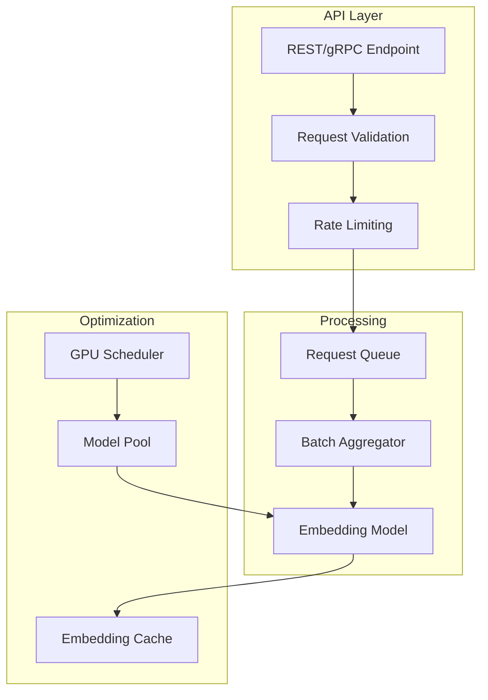

# How to Configure Embedding Services

Author: [nawazdhandala](https://www.github.com/nawazdhandala)

Tags: MLOps, Embeddings, NLP, Vector Search, OpenAI, Sentence Transformers, AI

Description: Learn how to configure and deploy embedding services for converting text into vectors, covering model selection, batching strategies, caching, and production deployment patterns.

---

Embedding services convert text into dense vector representations that capture semantic meaning. These vectors power similarity search, clustering, and RAG systems. This guide covers building production-ready embedding services with proper batching, caching, and monitoring.

## Embedding Service Architecture



## OpenAI Embeddings Client

```python
# embeddings/openai_client.py
from openai import OpenAI
from typing import List, Dict, Any, Optional
import hashlib
import json
from dataclasses import dataclass
import time
from functools import lru_cache

@dataclass
class EmbeddingResult:
    text: str
    embedding: List[float]
    model: str
    usage_tokens: int

class OpenAIEmbeddingClient:
    """
    OpenAI embeddings client with batching and caching.

    Handles rate limiting and optimizes API usage.
    """

    def __init__(
        self,
        api_key: str = None,
        model: str = "text-embedding-3-small",
        max_batch_size: int = 100,
        cache_enabled: bool = True
    ):
        self.client = OpenAI(api_key=api_key)
        self.model = model
        self.max_batch_size = max_batch_size
        self.cache_enabled = cache_enabled
        self._cache: Dict[str, List[float]] = {}

    def _get_cache_key(self, text: str) -> str:
        """Generate cache key for text."""
        return hashlib.md5(f"{self.model}:{text}".encode()).hexdigest()

    def embed_single(self, text: str) -> EmbeddingResult:
        """Embed a single text."""
        results = self.embed_batch([text])
        return results[0]

    def embed_batch(self, texts: List[str]) -> List[EmbeddingResult]:
        """
        Embed a batch of texts.

        Handles caching and batching automatically.
        """
        results = [None] * len(texts)
        texts_to_embed = []
        indices_to_embed = []

        # Check cache first
        if self.cache_enabled:
            for i, text in enumerate(texts):
                cache_key = self._get_cache_key(text)
                if cache_key in self._cache:
                    results[i] = EmbeddingResult(
                        text=text,
                        embedding=self._cache[cache_key],
                        model=self.model,
                        usage_tokens=0  # Cached, no tokens used
                    )
                else:
                    texts_to_embed.append(text)
                    indices_to_embed.append(i)
        else:
            texts_to_embed = texts
            indices_to_embed = list(range(len(texts)))

        # Embed uncached texts in batches
        total_tokens = 0
        for batch_start in range(0, len(texts_to_embed), self.max_batch_size):
            batch_texts = texts_to_embed[batch_start:batch_start + self.max_batch_size]
            batch_indices = indices_to_embed[batch_start:batch_start + self.max_batch_size]

            response = self.client.embeddings.create(
                model=self.model,
                input=batch_texts
            )

            total_tokens += response.usage.total_tokens

            for j, embedding_data in enumerate(response.data):
                original_index = batch_indices[j]
                text = batch_texts[j]
                embedding = embedding_data.embedding

                # Cache the result
                if self.cache_enabled:
                    cache_key = self._get_cache_key(text)
                    self._cache[cache_key] = embedding

                results[original_index] = EmbeddingResult(
                    text=text,
                    embedding=embedding,
                    model=self.model,
                    usage_tokens=0  # Distributed later
                )

        # Distribute token usage across results
        if texts_to_embed:
            tokens_per_text = total_tokens // len(texts_to_embed)
            for i in indices_to_embed:
                results[i].usage_tokens = tokens_per_text

        return results

    def get_dimension(self) -> int:
        """Get embedding dimension for current model."""
        dimensions = {
            "text-embedding-3-small": 1536,
            "text-embedding-3-large": 3072,
            "text-embedding-ada-002": 1536
        }
        return dimensions.get(self.model, 1536)
```

## Local Embedding Service with Sentence Transformers

```python
# embeddings/local_service.py
from sentence_transformers import SentenceTransformer
from typing import List, Optional
import torch
import numpy as np
from dataclasses import dataclass
from concurrent.futures import ThreadPoolExecutor
import threading

@dataclass
class LocalEmbeddingConfig:
    model_name: str = "all-MiniLM-L6-v2"
    device: str = "cuda" if torch.cuda.is_available() else "cpu"
    max_seq_length: int = 512
    batch_size: int = 32
    normalize: bool = True

class LocalEmbeddingService:
    """
    Local embedding service using Sentence Transformers.

    Runs models locally without external API calls.
    """

    def __init__(self, config: LocalEmbeddingConfig = None):
        self.config = config or LocalEmbeddingConfig()

        # Load model
        self.model = SentenceTransformer(self.config.model_name)
        self.model.max_seq_length = self.config.max_seq_length

        # Move to device
        if self.config.device == "cuda" and torch.cuda.is_available():
            self.model = self.model.to("cuda")

        self._lock = threading.Lock()

    def embed(self, texts: List[str]) -> np.ndarray:
        """
        Generate embeddings for texts.

        Returns numpy array of shape (len(texts), dimension).
        """
        with self._lock:
            embeddings = self.model.encode(
                texts,
                batch_size=self.config.batch_size,
                normalize_embeddings=self.config.normalize,
                show_progress_bar=False
            )

        return embeddings

    def embed_single(self, text: str) -> List[float]:
        """Embed a single text."""
        embedding = self.embed([text])[0]
        return embedding.tolist()

    @property
    def dimension(self) -> int:
        """Get embedding dimension."""
        return self.model.get_sentence_embedding_dimension()

# Model pool for concurrent requests
class EmbeddingModelPool:
    """
    Pool of embedding models for concurrent processing.

    Distributes load across multiple model instances.
    """

    def __init__(
        self,
        model_name: str = "all-MiniLM-L6-v2",
        pool_size: int = 4
    ):
        self.pool_size = pool_size
        self.models: List[LocalEmbeddingService] = []
        self.current_index = 0
        self._lock = threading.Lock()

        # Initialize model pool
        for i in range(pool_size):
            config = LocalEmbeddingConfig(
                model_name=model_name,
                device=f"cuda:{i % torch.cuda.device_count()}" if torch.cuda.is_available() else "cpu"
            )
            self.models.append(LocalEmbeddingService(config))

    def get_model(self) -> LocalEmbeddingService:
        """Get next model from pool (round-robin)."""
        with self._lock:
            model = self.models[self.current_index]
            self.current_index = (self.current_index + 1) % self.pool_size
            return model

    def embed_parallel(self, texts: List[str]) -> np.ndarray:
        """
        Embed texts using all models in parallel.
        """
        # Split texts across models
        chunk_size = len(texts) // self.pool_size + 1
        chunks = [
            texts[i:i + chunk_size]
            for i in range(0, len(texts), chunk_size)
        ]

        results = [None] * len(chunks)

        def embed_chunk(idx, chunk, model):
            results[idx] = model.embed(chunk)

        with ThreadPoolExecutor(max_workers=self.pool_size) as executor:
            futures = []
            for i, chunk in enumerate(chunks):
                if chunk:
                    model = self.models[i % self.pool_size]
                    futures.append(
                        executor.submit(embed_chunk, i, chunk, model)
                    )

            # Wait for all to complete
            for future in futures:
                future.result()

        # Concatenate results
        return np.vstack([r for r in results if r is not None])
```

## Embedding Cache Service

```python
# embeddings/cache.py
import redis
import numpy as np
import hashlib
import json
from typing import Optional, List, Dict
import struct

class EmbeddingCache:
    """
    Redis-based embedding cache.

    Stores embeddings efficiently using binary format.
    """

    def __init__(
        self,
        redis_url: str = "redis://localhost:6379",
        prefix: str = "emb",
        ttl_seconds: int = 86400 * 7  # 7 days
    ):
        self.redis = redis.from_url(redis_url)
        self.prefix = prefix
        self.ttl = ttl_seconds

    def _make_key(self, text: str, model: str) -> str:
        """Generate cache key."""
        content = f"{model}:{text}"
        hash_val = hashlib.sha256(content.encode()).hexdigest()[:16]
        return f"{self.prefix}:{hash_val}"

    def _serialize_embedding(self, embedding: List[float]) -> bytes:
        """Serialize embedding to bytes."""
        return struct.pack(f'{len(embedding)}f', *embedding)

    def _deserialize_embedding(self, data: bytes) -> List[float]:
        """Deserialize embedding from bytes."""
        n_floats = len(data) // 4
        return list(struct.unpack(f'{n_floats}f', data))

    def get(self, text: str, model: str) -> Optional[List[float]]:
        """Get embedding from cache."""
        key = self._make_key(text, model)
        data = self.redis.get(key)

        if data is None:
            return None

        return self._deserialize_embedding(data)

    def set(self, text: str, model: str, embedding: List[float]):
        """Store embedding in cache."""
        key = self._make_key(text, model)
        data = self._serialize_embedding(embedding)
        self.redis.setex(key, self.ttl, data)

    def get_batch(
        self,
        texts: List[str],
        model: str
    ) -> Dict[str, Optional[List[float]]]:
        """Get multiple embeddings from cache."""
        keys = [self._make_key(t, model) for t in texts]

        # Use pipeline for efficiency
        pipe = self.redis.pipeline()
        for key in keys:
            pipe.get(key)

        results = pipe.execute()

        return {
            text: self._deserialize_embedding(data) if data else None
            for text, data in zip(texts, results)
        }

    def set_batch(
        self,
        texts: List[str],
        model: str,
        embeddings: List[List[float]]
    ):
        """Store multiple embeddings in cache."""
        pipe = self.redis.pipeline()

        for text, embedding in zip(texts, embeddings):
            key = self._make_key(text, model)
            data = self._serialize_embedding(embedding)
            pipe.setex(key, self.ttl, data)

        pipe.execute()

    def get_stats(self) -> Dict:
        """Get cache statistics."""
        info = self.redis.info()
        keys = self.redis.keys(f"{self.prefix}:*")

        return {
            "total_keys": len(keys),
            "memory_used_mb": info.get("used_memory", 0) / 1024 / 1024,
            "hit_rate": info.get("keyspace_hits", 0) / (
                info.get("keyspace_hits", 0) + info.get("keyspace_misses", 1)
            )
        }
```

## Production Embedding API

```python
# embeddings/api.py
from fastapi import FastAPI, HTTPException, BackgroundTasks
from pydantic import BaseModel, Field
from typing import List, Optional
import time
from prometheus_client import Counter, Histogram, generate_latest

app = FastAPI(title="Embedding Service")

# Metrics
embed_requests = Counter(
    'embedding_requests_total',
    'Total embedding requests',
    ['model', 'status']
)

embed_latency = Histogram(
    'embedding_latency_seconds',
    'Embedding request latency',
    ['model'],
    buckets=[0.01, 0.05, 0.1, 0.25, 0.5, 1.0, 2.5, 5.0]
)

embed_tokens = Counter(
    'embedding_tokens_total',
    'Total tokens processed',
    ['model']
)

# Request/Response models
class EmbedRequest(BaseModel):
    texts: List[str] = Field(..., min_length=1, max_length=100)
    model: str = "text-embedding-3-small"

class EmbedResponse(BaseModel):
    embeddings: List[List[float]]
    model: str
    dimension: int
    usage: dict

# Initialize services
cache = EmbeddingCache()
openai_client = OpenAIEmbeddingClient()
local_service = LocalEmbeddingService()

@app.post("/embed", response_model=EmbedResponse)
async def embed(request: EmbedRequest):
    """Generate embeddings for texts."""
    start_time = time.time()

    try:
        # Check cache first
        cached_results = cache.get_batch(request.texts, request.model)

        texts_to_embed = []
        indices_to_embed = []
        embeddings = [None] * len(request.texts)

        for i, text in enumerate(request.texts):
            if cached_results.get(text) is not None:
                embeddings[i] = cached_results[text]
            else:
                texts_to_embed.append(text)
                indices_to_embed.append(i)

        # Embed uncached texts
        if texts_to_embed:
            if request.model.startswith("text-embedding"):
                # Use OpenAI
                results = openai_client.embed_batch(texts_to_embed)
                new_embeddings = [r.embedding for r in results]
                total_tokens = sum(r.usage_tokens for r in results)
            else:
                # Use local model
                new_embeddings = local_service.embed(texts_to_embed).tolist()
                total_tokens = 0

            # Update embeddings and cache
            for i, idx in enumerate(indices_to_embed):
                embeddings[idx] = new_embeddings[i]

            cache.set_batch(texts_to_embed, request.model, new_embeddings)
            embed_tokens.labels(model=request.model).inc(total_tokens)
        else:
            total_tokens = 0

        # Record metrics
        latency = time.time() - start_time
        embed_latency.labels(model=request.model).observe(latency)
        embed_requests.labels(model=request.model, status="success").inc()

        return EmbedResponse(
            embeddings=embeddings,
            model=request.model,
            dimension=len(embeddings[0]),
            usage={
                "total_tokens": total_tokens,
                "cached_count": len(request.texts) - len(texts_to_embed)
            }
        )

    except Exception as e:
        embed_requests.labels(model=request.model, status="error").inc()
        raise HTTPException(status_code=500, detail=str(e))

@app.get("/metrics")
async def metrics():
    """Prometheus metrics endpoint."""
    return generate_latest()

@app.get("/health")
async def health():
    """Health check endpoint."""
    return {"status": "healthy"}
```

## Batch Processing Pipeline

```python
# embeddings/batch_pipeline.py
import asyncio
from asyncio import Queue
from typing import List, Callable, Awaitable
from dataclasses import dataclass
import time

@dataclass
class BatchRequest:
    text: str
    future: asyncio.Future

class BatchingEmbeddingService:
    """
    Batching service that aggregates requests for efficiency.

    Collects individual requests and processes them in batches.
    """

    def __init__(
        self,
        embed_fn: Callable[[List[str]], Awaitable[List[List[float]]]],
        max_batch_size: int = 32,
        max_wait_ms: int = 50
    ):
        self.embed_fn = embed_fn
        self.max_batch_size = max_batch_size
        self.max_wait_ms = max_wait_ms
        self.queue: Queue = Queue()
        self._running = False

    async def start(self):
        """Start the batching loop."""
        self._running = True
        asyncio.create_task(self._batch_loop())

    async def stop(self):
        """Stop the batching loop."""
        self._running = False

    async def embed(self, text: str) -> List[float]:
        """
        Submit text for embedding.

        Returns when the batch containing this text is processed.
        """
        future = asyncio.get_event_loop().create_future()
        request = BatchRequest(text=text, future=future)
        await self.queue.put(request)
        return await future

    async def _batch_loop(self):
        """Main loop that collects and processes batches."""
        while self._running:
            batch: List[BatchRequest] = []
            start_time = time.time()

            # Collect requests for batch
            while len(batch) < self.max_batch_size:
                # Calculate remaining wait time
                elapsed_ms = (time.time() - start_time) * 1000
                remaining_ms = max(0, self.max_wait_ms - elapsed_ms)

                if remaining_ms == 0 and batch:
                    break

                try:
                    request = await asyncio.wait_for(
                        self.queue.get(),
                        timeout=remaining_ms / 1000 if remaining_ms > 0 else 0.001
                    )
                    batch.append(request)
                except asyncio.TimeoutError:
                    if batch:
                        break

            # Process batch
            if batch:
                try:
                    texts = [r.text for r in batch]
                    embeddings = await self.embed_fn(texts)

                    for request, embedding in zip(batch, embeddings):
                        request.future.set_result(embedding)

                except Exception as e:
                    for request in batch:
                        request.future.set_exception(e)

# Usage with FastAPI
batching_service = None

@app.on_event("startup")
async def startup():
    global batching_service

    async def embed_batch(texts: List[str]) -> List[List[float]]:
        results = openai_client.embed_batch(texts)
        return [r.embedding for r in results]

    batching_service = BatchingEmbeddingService(
        embed_fn=embed_batch,
        max_batch_size=32,
        max_wait_ms=50
    )
    await batching_service.start()

@app.post("/embed/single")
async def embed_single(text: str):
    """Embed single text (batched internally)."""
    embedding = await batching_service.embed(text)
    return {"embedding": embedding}
```

## Summary

| Provider | Model | Dimension | Speed | Cost |
|----------|-------|-----------|-------|------|
| **OpenAI** | text-embedding-3-small | 1536 | Fast | $0.02/1M |
| **OpenAI** | text-embedding-3-large | 3072 | Fast | $0.13/1M |
| **Local** | all-MiniLM-L6-v2 | 384 | Medium | Free |
| **Local** | all-mpnet-base-v2 | 768 | Medium | Free |
| **Cohere** | embed-english-v3.0 | 1024 | Fast | $0.10/1M |

Embedding services are critical infrastructure for semantic applications. Use caching to reduce costs and latency, batching to maximize throughput, and proper monitoring to ensure reliability. For development, local models provide cost-free experimentation, while production systems typically benefit from hosted APIs with higher quality embeddings.
