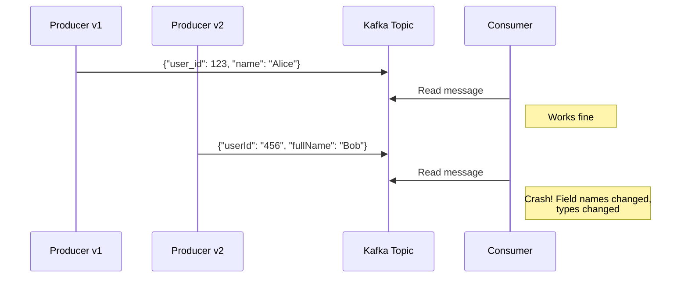

# How to Enforce Schemas with Schema Registry in Kafka

Author: [nawazdhandala](https://www.github.com/nawazdhandala)

Tags: Kafka, Schema Registry, Avro, Data Governance, Data Quality

Description: Learn how to use Confluent Schema Registry to enforce data contracts in Kafka, prevent breaking changes, and ensure data quality across producers and consumers with Avro, Protobuf, and JSON Schema.

---

Without schema enforcement, Kafka topics become data swamps. Producers send whatever they want, and consumers break when message formats change unexpectedly. Schema Registry solves this by providing a central repository for schemas and enforcing compatibility rules. This guide covers setting up Schema Registry and integrating it with your producers and consumers.

## Why Schema Registry?

Consider what happens without schema enforcement:



Schema Registry prevents this by validating messages against registered schemas before they reach Kafka.

## Setting Up Schema Registry

Deploy Schema Registry alongside your Kafka cluster. It stores schemas in an internal Kafka topic.

```bash
# Docker Compose example
docker run -d \
  --name schema-registry \
  -p 8081:8081 \
  -e SCHEMA_REGISTRY_HOST_NAME=schema-registry \
  -e SCHEMA_REGISTRY_KAFKASTORE_BOOTSTRAP_SERVERS=kafka1:9092,kafka2:9092 \
  -e SCHEMA_REGISTRY_LISTENERS=http://0.0.0.0:8081 \
  confluentinc/cp-schema-registry:7.5.0
```

For production, run multiple instances behind a load balancer:

```yaml
# docker-compose.yml
services:
  schema-registry-1:
    image: confluentinc/cp-schema-registry:7.5.0
    environment:
      SCHEMA_REGISTRY_HOST_NAME: schema-registry-1
      SCHEMA_REGISTRY_KAFKASTORE_BOOTSTRAP_SERVERS: kafka1:9092,kafka2:9092
      SCHEMA_REGISTRY_LISTENERS: http://0.0.0.0:8081
      SCHEMA_REGISTRY_MASTER_ELIGIBILITY: "true"
      SCHEMA_REGISTRY_SCHEMA_REGISTRY_GROUP_ID: schema-registry-cluster

  schema-registry-2:
    image: confluentinc/cp-schema-registry:7.5.0
    environment:
      SCHEMA_REGISTRY_HOST_NAME: schema-registry-2
      SCHEMA_REGISTRY_KAFKASTORE_BOOTSTRAP_SERVERS: kafka1:9092,kafka2:9092
      SCHEMA_REGISTRY_LISTENERS: http://0.0.0.0:8081
      SCHEMA_REGISTRY_MASTER_ELIGIBILITY: "true"
      SCHEMA_REGISTRY_SCHEMA_REGISTRY_GROUP_ID: schema-registry-cluster
```

## Defining Avro Schemas

Avro is the most popular format with Schema Registry due to its compact binary encoding and strong schema evolution support.

```json
{
  "type": "record",
  "name": "User",
  "namespace": "com.example.events",
  "fields": [
    {
      "name": "user_id",
      "type": "long",
      "doc": "Unique identifier for the user"
    },
    {
      "name": "email",
      "type": "string",
      "doc": "User email address"
    },
    {
      "name": "created_at",
      "type": {
        "type": "long",
        "logicalType": "timestamp-millis"
      },
      "doc": "Account creation timestamp"
    },
    {
      "name": "profile",
      "type": ["null", {
        "type": "record",
        "name": "Profile",
        "fields": [
          {"name": "first_name", "type": "string"},
          {"name": "last_name", "type": "string"},
          {"name": "age", "type": ["null", "int"], "default": null}
        ]
      }],
      "default": null,
      "doc": "Optional user profile"
    }
  ]
}
```

Save this as `user.avsc` and register it:

```bash
# Register a schema for the 'users' topic value
curl -X POST http://localhost:8081/subjects/users-value/versions \
  -H "Content-Type: application/vnd.schemaregistry.v1+json" \
  -d '{
    "schema": "{\"type\":\"record\",\"name\":\"User\",\"namespace\":\"com.example.events\",\"fields\":[{\"name\":\"user_id\",\"type\":\"long\"},{\"name\":\"email\",\"type\":\"string\"},{\"name\":\"created_at\",\"type\":{\"type\":\"long\",\"logicalType\":\"timestamp-millis\"}},{\"name\":\"profile\",\"type\":[\"null\",{\"type\":\"record\",\"name\":\"Profile\",\"fields\":[{\"name\":\"first_name\",\"type\":\"string\"},{\"name\":\"last_name\",\"type\":\"string\"},{\"name\":\"age\",\"type\":[\"null\",\"int\"],\"default\":null}]}],\"default\":null}]}"
  }'
```

## Java Producer with Schema Registry

Use the Avro serializer to automatically register and validate schemas:

```java
import io.confluent.kafka.serializers.KafkaAvroSerializer;
import io.confluent.kafka.serializers.KafkaAvroSerializerConfig;
import org.apache.avro.Schema;
import org.apache.avro.generic.GenericData;
import org.apache.avro.generic.GenericRecord;
import org.apache.kafka.clients.producer.*;
import java.util.Properties;

public class AvroProducerExample {

    public static void main(String[] args) throws Exception {
        Properties props = new Properties();
        props.put(ProducerConfig.BOOTSTRAP_SERVERS_CONFIG, "kafka:9092");

        // Use Avro serializers
        props.put(ProducerConfig.KEY_SERIALIZER_CLASS_CONFIG, KafkaAvroSerializer.class);
        props.put(ProducerConfig.VALUE_SERIALIZER_CLASS_CONFIG, KafkaAvroSerializer.class);

        // Schema Registry URL
        props.put(KafkaAvroSerializerConfig.SCHEMA_REGISTRY_URL_CONFIG, "http://schema-registry:8081");

        // Auto-register schemas (disable in production for tighter control)
        props.put(KafkaAvroSerializerConfig.AUTO_REGISTER_SCHEMAS, true);

        // Load schema from file
        Schema.Parser parser = new Schema.Parser();
        Schema userSchema = parser.parse(
            AvroProducerExample.class.getResourceAsStream("/avro/user.avsc")
        );

        try (KafkaProducer<String, GenericRecord> producer = new KafkaProducer<>(props)) {
            // Create a record matching the schema
            GenericRecord user = new GenericData.Record(userSchema);
            user.put("user_id", 12345L);
            user.put("email", "alice@example.com");
            user.put("created_at", System.currentTimeMillis());

            // Nested record for profile
            Schema profileSchema = userSchema.getField("profile").schema().getTypes().get(1);
            GenericRecord profile = new GenericData.Record(profileSchema);
            profile.put("first_name", "Alice");
            profile.put("last_name", "Smith");
            profile.put("age", 30);
            user.put("profile", profile);

            ProducerRecord<String, GenericRecord> record = new ProducerRecord<>(
                "users",
                String.valueOf(user.get("user_id")),
                user
            );

            producer.send(record, (metadata, exception) -> {
                if (exception != null) {
                    System.err.println("Failed to send: " + exception.getMessage());
                } else {
                    System.out.printf("Sent to partition %d at offset %d%n",
                        metadata.partition(), metadata.offset());
                }
            });
        }
    }
}
```

## Java Consumer with Schema Registry

The consumer uses the Avro deserializer to decode messages:

```java
import io.confluent.kafka.serializers.KafkaAvroDeserializer;
import io.confluent.kafka.serializers.KafkaAvroDeserializerConfig;
import org.apache.avro.generic.GenericRecord;
import org.apache.kafka.clients.consumer.*;
import java.time.Duration;
import java.util.Collections;
import java.util.Properties;

public class AvroConsumerExample {

    public static void main(String[] args) {
        Properties props = new Properties();
        props.put(ConsumerConfig.BOOTSTRAP_SERVERS_CONFIG, "kafka:9092");
        props.put(ConsumerConfig.GROUP_ID_CONFIG, "user-processor");

        // Use Avro deserializers
        props.put(ConsumerConfig.KEY_DESERIALIZER_CLASS_CONFIG, KafkaAvroDeserializer.class);
        props.put(ConsumerConfig.VALUE_DESERIALIZER_CLASS_CONFIG, KafkaAvroDeserializer.class);

        // Schema Registry URL
        props.put(KafkaAvroDeserializerConfig.SCHEMA_REGISTRY_URL_CONFIG, "http://schema-registry:8081");

        // Return GenericRecord (set to true for specific Avro classes)
        props.put(KafkaAvroDeserializerConfig.SPECIFIC_AVRO_READER_CONFIG, false);

        try (KafkaConsumer<String, GenericRecord> consumer = new KafkaConsumer<>(props)) {
            consumer.subscribe(Collections.singletonList("users"));

            while (true) {
                ConsumerRecords<String, GenericRecord> records = consumer.poll(Duration.ofMillis(100));

                for (ConsumerRecord<String, GenericRecord> record : records) {
                    GenericRecord user = record.value();

                    // Access fields safely
                    long userId = (long) user.get("user_id");
                    String email = user.get("email").toString();

                    // Handle optional fields
                    GenericRecord profile = (GenericRecord) user.get("profile");
                    if (profile != null) {
                        String firstName = profile.get("first_name").toString();
                        System.out.printf("User %d: %s <%s>%n", userId, firstName, email);
                    }
                }

                consumer.commitSync();
            }
        }
    }
}
```

## Schema Compatibility Modes

Schema Registry enforces compatibility rules to prevent breaking changes. Configure the compatibility level per subject:

```bash
# Set compatibility level for a subject
curl -X PUT http://localhost:8081/config/users-value \
  -H "Content-Type: application/vnd.schemaregistry.v1+json" \
  -d '{"compatibility": "BACKWARD"}'

# Get current compatibility level
curl http://localhost:8081/config/users-value
```

| Compatibility | Description | Safe Changes |
|---------------|-------------|--------------|
| `BACKWARD` | New schema can read old data | Add optional fields, remove fields |
| `FORWARD` | Old schema can read new data | Remove optional fields, add fields |
| `FULL` | Both backward and forward | Add/remove optional fields only |
| `NONE` | No compatibility checks | Any change (dangerous) |

For most use cases, `BACKWARD` is the right choice. It ensures new consumers can read messages written by old producers.

## Testing Schema Compatibility

Before deploying schema changes, test compatibility:

```bash
# Test if a new schema is compatible with existing versions
curl -X POST http://localhost:8081/compatibility/subjects/users-value/versions/latest \
  -H "Content-Type: application/vnd.schemaregistry.v1+json" \
  -d '{
    "schema": "{\"type\":\"record\",\"name\":\"User\",\"fields\":[{\"name\":\"user_id\",\"type\":\"long\"},{\"name\":\"email\",\"type\":\"string\"},{\"name\":\"phone\",\"type\":[\"null\",\"string\"],\"default\":null}]}"
  }'

# Response: {"is_compatible": true} or {"is_compatible": false}
```

## Schema Evolution Example

Here is a safe schema evolution that adds an optional field:

```json
{
  "type": "record",
  "name": "User",
  "namespace": "com.example.events",
  "fields": [
    {"name": "user_id", "type": "long"},
    {"name": "email", "type": "string"},
    {"name": "created_at", "type": {"type": "long", "logicalType": "timestamp-millis"}},
    {"name": "profile", "type": ["null", "Profile"], "default": null},
    {
      "name": "phone_number",
      "type": ["null", "string"],
      "default": null,
      "doc": "Added in v2 - optional phone number"
    }
  ]
}
```

This change is backward compatible because:
- Old consumers ignore the new field
- New consumers get `null` when reading old messages without the field

## Managing Schemas via REST API

```bash
# List all subjects
curl http://localhost:8081/subjects

# Get all versions for a subject
curl http://localhost:8081/subjects/users-value/versions

# Get a specific schema version
curl http://localhost:8081/subjects/users-value/versions/1

# Get the latest schema
curl http://localhost:8081/subjects/users-value/versions/latest

# Delete a specific version (soft delete)
curl -X DELETE http://localhost:8081/subjects/users-value/versions/1

# Permanently delete a subject
curl -X DELETE "http://localhost:8081/subjects/users-value?permanent=true"
```

## Using JSON Schema or Protobuf

Schema Registry also supports JSON Schema and Protocol Buffers:

```bash
# Register a JSON Schema
curl -X POST http://localhost:8081/subjects/orders-value/versions \
  -H "Content-Type: application/vnd.schemaregistry.v1+json" \
  -d '{
    "schemaType": "JSON",
    "schema": "{\"type\":\"object\",\"properties\":{\"order_id\":{\"type\":\"string\"},\"amount\":{\"type\":\"number\"}},\"required\":[\"order_id\",\"amount\"]}"
  }'

# Register a Protobuf schema
curl -X POST http://localhost:8081/subjects/events-value/versions \
  -H "Content-Type: application/vnd.schemaregistry.v1+json" \
  -d '{
    "schemaType": "PROTOBUF",
    "schema": "syntax = \"proto3\"; message Event { string id = 1; int64 timestamp = 2; }"
  }'
```

---

Schema Registry is essential for maintaining data quality in Kafka pipelines. Start with Avro and `BACKWARD` compatibility for the safest evolution path. Always test schema changes for compatibility before deploying, and disable auto-registration in production to maintain control over schema changes. With proper schema governance, your Kafka topics become reliable data contracts rather than unstructured message dumps.
