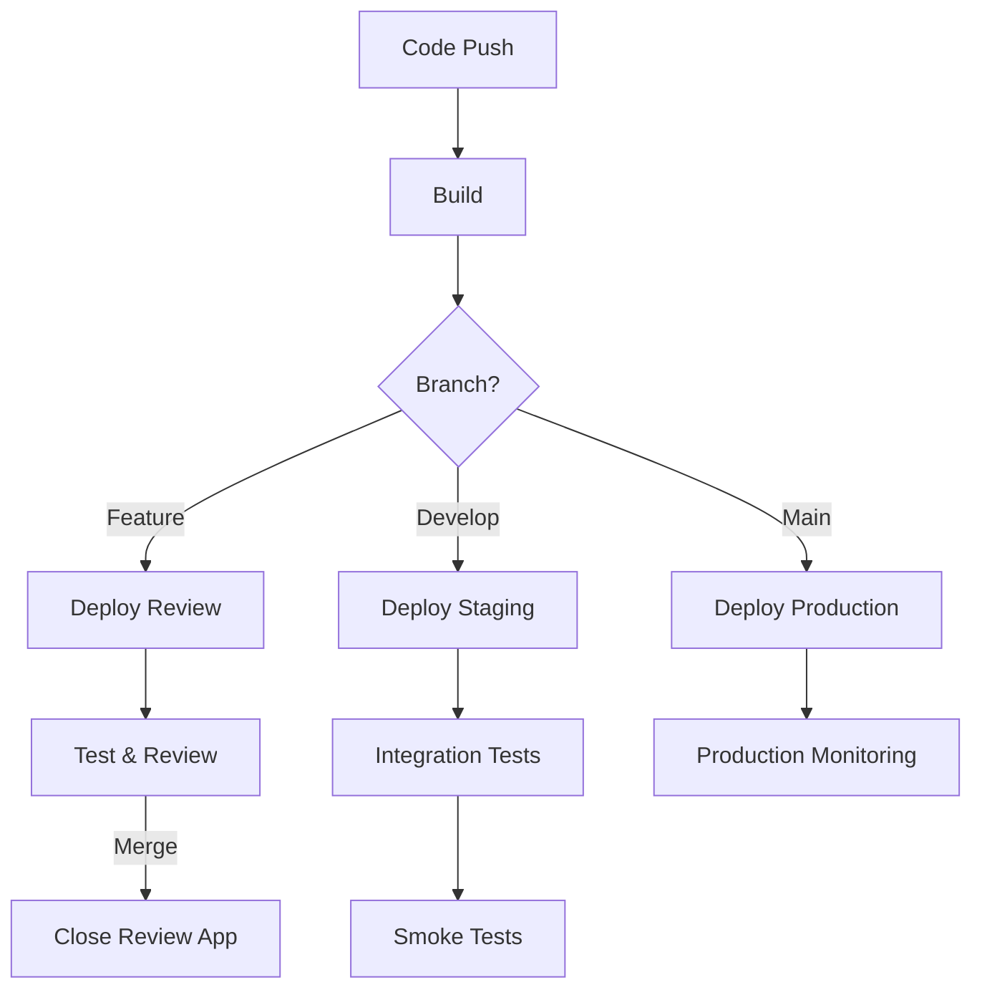

# How to Configure Environments and Deployments in GitLab CI

Author: [nawazdhandala](https://www.github.com/nawazdhandala)

Tags: GitLab CI, Environments, Deployments, DevOps, CI/CD

Description: Learn how to configure GitLab CI environments for staging, production, and review apps, with deployment tracking, rollbacks, and approval workflows.

---

GitLab environments give you visibility into what's deployed where. They track deployment history, provide quick access to running applications, and enable rollbacks when things go wrong. This guide covers everything from basic environment setup to advanced deployment strategies.

## Understanding GitLab Environments

An environment represents a deployment target like staging or production. When a job deploys to an environment, GitLab records the deployment and links it to the commit that was deployed.

Environments appear in your project's Operations menu, showing current deployments, history, and URLs for each target.

## Basic Environment Configuration

Define an environment in your deployment job.

```yaml
stages:
  - build
  - deploy

build:
  stage: build
  script:
    - npm ci
    - npm run build
  artifacts:
    paths:
      - dist/

deploy-staging:
  stage: deploy
  script:
    - ./deploy.sh staging
  environment:
    name: staging
    url: https://staging.example.com
  only:
    - develop
```

The `environment.name` creates or updates an environment in GitLab. The `url` appears as a link in the merge request and environments list.

## Environment Tiers

GitLab supports environment tiers that affect behavior and visibility.

```yaml
deploy-staging:
  environment:
    name: staging
    deployment_tier: staging
    url: https://staging.example.com

deploy-production:
  environment:
    name: production
    deployment_tier: production
    url: https://example.com
```

Available tiers include production, staging, testing, development, and other. Production environments get special treatment in the UI and can require additional protection.

## Dynamic Environments

Create environments dynamically based on branches.

```yaml
deploy-review:
  stage: deploy
  script:
    - ./deploy.sh review ${CI_COMMIT_REF_SLUG}
  environment:
    name: review/${CI_COMMIT_REF_SLUG}
    url: https://${CI_COMMIT_REF_SLUG}.review.example.com
    on_stop: stop-review
  rules:
    - if: $CI_MERGE_REQUEST_IID
```

This creates a separate environment for each merge request, like `review/feature-login` or `review/fix-bug-123`.

## Stopping Environments

Clean up dynamic environments when they're no longer needed.

```yaml
deploy-review:
  stage: deploy
  script:
    - ./deploy.sh create ${CI_COMMIT_REF_SLUG}
  environment:
    name: review/${CI_COMMIT_REF_SLUG}
    url: https://${CI_COMMIT_REF_SLUG}.review.example.com
    on_stop: stop-review
  rules:
    - if: $CI_MERGE_REQUEST_IID

stop-review:
  stage: deploy
  script:
    - ./deploy.sh delete ${CI_COMMIT_REF_SLUG}
  environment:
    name: review/${CI_COMMIT_REF_SLUG}
    action: stop
  rules:
    - if: $CI_MERGE_REQUEST_IID
      when: manual
  # Allow running even after branch is deleted
  variables:
    GIT_STRATEGY: none
```

The `on_stop` links the deploy job to its cleanup job. When the merge request is closed or merged, GitLab can automatically trigger the stop job.

## Manual Deployments with Approvals

Production deployments often need human approval.

```yaml
deploy-production:
  stage: deploy
  script:
    - ./deploy.sh production
  environment:
    name: production
    url: https://example.com
  # Require manual trigger
  when: manual
  # Only allow from protected branches
  only:
    - main
  # Prevent accidental parallel deployments
  resource_group: production
```

For more control, configure protected environments in GitLab settings. Navigate to Settings, then CI/CD, then Protected Environments. You can require approval from specific users or groups before deployment proceeds.

## Deployment Workflow

Here's a typical deployment flow through environments:



## Environment Variables

Set variables specific to each environment.

```yaml
variables:
  APP_NAME: "my-app"

deploy-staging:
  stage: deploy
  variables:
    DEPLOY_URL: "https://staging.example.com"
    DB_HOST: "staging-db.internal"
    LOG_LEVEL: "debug"
  script:
    - envsubst < config.template > config.json
    - ./deploy.sh staging
  environment:
    name: staging
    url: ${DEPLOY_URL}

deploy-production:
  stage: deploy
  variables:
    DEPLOY_URL: "https://example.com"
    DB_HOST: "prod-db.internal"
    LOG_LEVEL: "info"
  script:
    - envsubst < config.template > config.json
    - ./deploy.sh production
  environment:
    name: production
    url: ${DEPLOY_URL}
```

For sensitive values, use CI/CD variables scoped to specific environments. In Settings, then CI/CD, then Variables, select the environment when adding a variable.

## Deployment Freezes

Prevent deployments during critical periods.

```yaml
deploy-production:
  stage: deploy
  script:
    - ./deploy.sh production
  environment:
    name: production
    url: https://example.com
  rules:
    # Skip during deployment freeze
    - if: $CI_DEPLOY_FREEZE != null
      when: never
    - if: $CI_COMMIT_BRANCH == "main"
      when: manual
```

Configure deployment freezes in Settings, then CI/CD, then Deploy Freezes. Specify date ranges when deployments should be blocked.

## Rolling Back Deployments

GitLab tracks deployment history, making rollbacks straightforward.

From the Environments page, click the re-deploy button on any previous deployment. GitLab creates a new deployment using the exact same artifact from the original.

For programmatic rollbacks, use job artifacts.

```yaml
stages:
  - build
  - deploy

build:
  stage: build
  script:
    - npm run build
  artifacts:
    paths:
      - dist/
    # Keep artifacts longer for rollback capability
    expire_in: 30 days

deploy:
  stage: deploy
  script:
    # Tag this deployment
    - echo ${CI_COMMIT_SHA} > current_version.txt
    - ./deploy.sh production
  environment:
    name: production

# Manual rollback job
rollback:
  stage: deploy
  script:
    # Fetch artifact from a previous pipeline
    - 'curl --header "PRIVATE-TOKEN: ${GITLAB_TOKEN}" "${CI_API_V4_URL}/projects/${CI_PROJECT_ID}/jobs/artifacts/${ROLLBACK_TO}/download?job=build" -o artifact.zip'
    - unzip artifact.zip
    - ./deploy.sh production
  environment:
    name: production
  when: manual
  variables:
    ROLLBACK_TO: ""  # Set via trigger or manual input
```

## Kubernetes Deployments

When deploying to Kubernetes, use GitLab's native integration.

```yaml
deploy-staging:
  stage: deploy
  image:
    name: bitnami/kubectl:latest
    entrypoint: [""]
  script:
    # Use GitLab's Kubernetes agent
    - kubectl config use-context my-project:staging-agent
    - kubectl apply -f k8s/staging/
    - kubectl rollout status deployment/my-app -n staging
  environment:
    name: staging
    url: https://staging.example.com
    kubernetes:
      namespace: staging
```

The Kubernetes integration adds deployment status directly to merge requests and enables Auto DevOps features.

## Incremental Rollouts

Deploy to a percentage of users before full rollout.

```yaml
.deploy-template:
  script:
    - ./deploy.sh production --percentage ${ROLLOUT_PERCENTAGE}
  environment:
    name: production
    url: https://example.com
  resource_group: production

deploy-10-percent:
  extends: .deploy-template
  variables:
    ROLLOUT_PERCENTAGE: "10"
  when: manual

deploy-50-percent:
  extends: .deploy-template
  variables:
    ROLLOUT_PERCENTAGE: "50"
  needs:
    - deploy-10-percent
  when: manual

deploy-100-percent:
  extends: .deploy-template
  variables:
    ROLLOUT_PERCENTAGE: "100"
  needs:
    - deploy-50-percent
  when: manual
```

This creates a manual deployment pipeline where you progress through percentages.

## Monitoring Deployments

Track deployment health with external monitoring.

```yaml
deploy-production:
  stage: deploy
  script:
    - ./deploy.sh production
    # Wait for deployment to stabilize
    - sleep 60
    # Check health endpoint
    - curl -f https://example.com/health || exit 1
  environment:
    name: production
    url: https://example.com
  after_script:
    # Send deployment notification to monitoring
    - |
      curl -X POST "https://oneuptime.example.com/api/deployments" \
        -H "Authorization: Bearer ${ONEUPTIME_TOKEN}" \
        -H "Content-Type: application/json" \
        -d "{\"version\": \"${CI_COMMIT_SHA}\", \"environment\": \"production\"}"
```

Link deployments to monitoring tools so you can correlate releases with performance changes.

## Auto-Stop Environments

Automatically stop environments after a period of inactivity.

```yaml
deploy-review:
  stage: deploy
  script:
    - ./deploy.sh review ${CI_COMMIT_REF_SLUG}
  environment:
    name: review/${CI_COMMIT_REF_SLUG}
    url: https://${CI_COMMIT_REF_SLUG}.review.example.com
    on_stop: stop-review
    # Auto-stop after 1 week of inactivity
    auto_stop_in: 1 week
  rules:
    - if: $CI_MERGE_REQUEST_IID
```

The `auto_stop_in` setting schedules the stop job to run automatically, cleaning up forgotten review environments.

---

Environments transform GitLab from a CI tool into a complete deployment platform. Start with simple staging and production environments, then add dynamic review apps and approval workflows as your team grows. The deployment history alone makes debugging production issues significantly easier.
