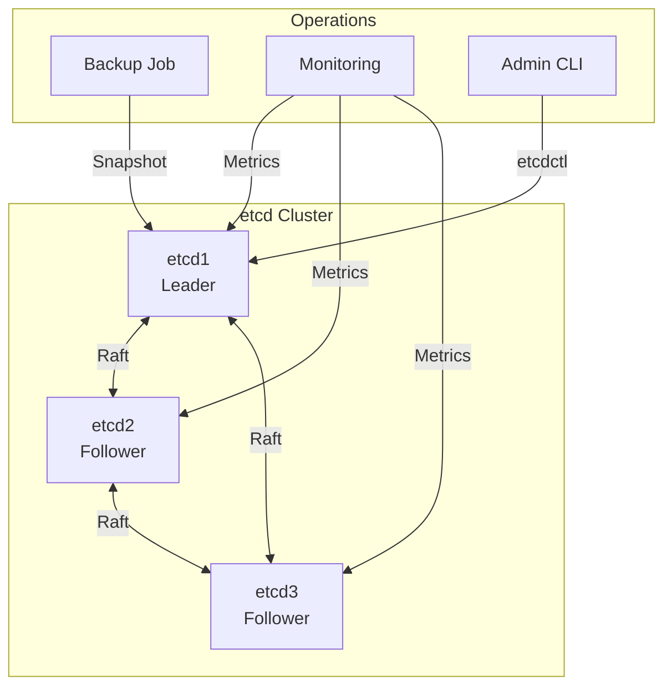

# How to Implement etcd Cluster Management

Author: [nawazdhandala](https://www.github.com/nawazdhandala)

Tags: etcd, Cluster Management, Distributed Systems, High Availability, Kubernetes, Operations

Description: Learn how to manage etcd clusters in production including member management, backup and restore, monitoring, and disaster recovery procedures.

---

> etcd is the backbone of Kubernetes and many distributed systems, making its operational management critical. A well-managed etcd cluster provides the reliability foundation that your applications depend on.

Production etcd clusters require careful attention to member health, disk performance, backup procedures, and capacity planning. This guide covers the essential operations for maintaining healthy etcd clusters.

---

## Prerequisites

Before we begin, ensure you have:
- Running etcd cluster (3 or 5 nodes)
- etcdctl installed and configured
- Understanding of Raft consensus basics

---

## Cluster Health Monitoring

### Basic Health Checks

```bash
# Set API version
export ETCDCTL_API=3

# Check cluster health
etcdctl endpoint health --endpoints=http://etcd1:2379,http://etcd2:2379,http://etcd3:2379

# Output
# http://etcd1:2379 is healthy: successfully committed proposal: took = 2.145795ms
# http://etcd2:2379 is healthy: successfully committed proposal: took = 2.345795ms
# http://etcd3:2379 is healthy: successfully committed proposal: took = 2.045795ms

# Detailed endpoint status
etcdctl endpoint status --endpoints=http://etcd1:2379,http://etcd2:2379,http://etcd3:2379 -w table

# Output
# +------------------+------------------+---------+---------+-----------+...
# |     ENDPOINT     |        ID        | VERSION | DB SIZE | IS LEADER |...
# +------------------+------------------+---------+---------+-----------+...
# | http://etcd1:2379| 8e9e05c52164694d | 3.5.12  |   20 kB |     true  |...
# | http://etcd2:2379| 91bc3c398fb3c146 | 3.5.12  |   20 kB |    false  |...
# | http://etcd3:2379| fd422379fda50e48 | 3.5.12  |   20 kB |    false  |...
# +------------------+------------------+---------+---------+-----------+...
```

### Member Management

```bash
# List all members
etcdctl member list -w table

# Output
# +------------------+---------+---------+------------------------+------------------------+------------+
# |        ID        | STATUS  |  NAME   |       PEER ADDRS       |      CLIENT ADDRS      | IS LEARNER |
# +------------------+---------+---------+------------------------+------------------------+------------+
# | 8e9e05c52164694d | started |  etcd1  | http://etcd1:2380      | http://etcd1:2379      |      false |
# | 91bc3c398fb3c146 | started |  etcd2  | http://etcd2:2380      | http://etcd2:2379      |      false |
# | fd422379fda50e48 | started |  etcd3  | http://etcd3:2380      | http://etcd3:2379      |      false |
# +------------------+---------+---------+------------------------+------------------------+------------+
```

---

## Cluster Architecture



---

## Adding Members

### Add a New Member

```bash
# Step 1: Add member to cluster (run on existing member)
etcdctl member add etcd4 --peer-urls=http://etcd4:2380

# Output
# Member 3a57933972cb5131 added to cluster 9577cad0ad08e
#
# ETCD_NAME="etcd4"
# ETCD_INITIAL_CLUSTER="etcd1=http://etcd1:2380,etcd2=http://etcd2:2380,etcd3=http://etcd3:2380,etcd4=http://etcd4:2380"
# ETCD_INITIAL_CLUSTER_STATE="existing"

# Step 2: Start the new member with the provided configuration
etcd --name etcd4 \
  --initial-cluster "etcd1=http://etcd1:2380,etcd2=http://etcd2:2380,etcd3=http://etcd3:2380,etcd4=http://etcd4:2380" \
  --initial-cluster-state existing \
  --initial-advertise-peer-urls http://etcd4:2380 \
  --listen-peer-urls http://0.0.0.0:2380 \
  --listen-client-urls http://0.0.0.0:2379 \
  --advertise-client-urls http://etcd4:2379 \
  --data-dir /var/lib/etcd

# Verify member joined
etcdctl member list
```

### Add a Learner (Non-Voting Member)

```bash
# Add as learner first (safer for large clusters)
etcdctl member add etcd4 --peer-urls=http://etcd4:2380 --learner

# Promote to voting member after it catches up
etcdctl member promote <member-id>
```

---

## Removing Members

```bash
# Get member ID
etcdctl member list

# Remove the member
etcdctl member remove 3a57933972cb5131

# Verify removal
etcdctl member list
```

---

## Backup and Restore

### Creating Snapshots

```bash
# Create snapshot from leader
etcdctl snapshot save /backup/etcd-$(date +%Y%m%d-%H%M%S).db \
  --endpoints=http://etcd1:2379

# Verify snapshot
etcdctl snapshot status /backup/etcd-20260125-120000.db -w table

# Output
# +---------+----------+------------+------------+
# |  HASH   | REVISION | TOTAL KEYS | TOTAL SIZE |
# +---------+----------+------------+------------+
# | 6c4c2c1 |    45678 |       1234 |     2.1 MB |
# +---------+----------+------------+------------+
```

### Automated Backup Script

```bash
#!/bin/bash
# /opt/scripts/etcd-backup.sh
# Automated etcd backup script

BACKUP_DIR="/backup/etcd"
RETENTION_DAYS=7
ETCD_ENDPOINTS="http://etcd1:2379,http://etcd2:2379,http://etcd3:2379"

# Create backup directory
mkdir -p "$BACKUP_DIR"

# Generate filename with timestamp
BACKUP_FILE="$BACKUP_DIR/etcd-$(date +%Y%m%d-%H%M%S).db"

# Create snapshot
echo "Creating etcd snapshot..."
ETCDCTL_API=3 etcdctl snapshot save "$BACKUP_FILE" \
  --endpoints="$ETCD_ENDPOINTS"

if [ $? -eq 0 ]; then
    echo "Backup successful: $BACKUP_FILE"

    # Verify backup
    ETCDCTL_API=3 etcdctl snapshot status "$BACKUP_FILE" -w table

    # Remove old backups
    find "$BACKUP_DIR" -name "etcd-*.db" -mtime +$RETENTION_DAYS -delete
    echo "Cleaned up backups older than $RETENTION_DAYS days"
else
    echo "Backup failed!"
    exit 1
fi
```

### Restoring from Snapshot

```bash
# Stop all etcd members first!
systemctl stop etcd

# On each node, restore from snapshot
# Node 1
etcdctl snapshot restore /backup/etcd-20260125-120000.db \
  --name etcd1 \
  --initial-cluster "etcd1=http://etcd1:2380,etcd2=http://etcd2:2380,etcd3=http://etcd3:2380" \
  --initial-cluster-token etcd-cluster-1 \
  --initial-advertise-peer-urls http://etcd1:2380 \
  --data-dir /var/lib/etcd-restore

# Move restored data to actual data directory
rm -rf /var/lib/etcd
mv /var/lib/etcd-restore /var/lib/etcd

# Repeat for other nodes with appropriate settings

# Start all members
systemctl start etcd
```

---

## Disaster Recovery

### Single Member Failure

```bash
# If one member fails, cluster continues (2 of 3)
# Replace failed member:

# 1. Remove failed member
etcdctl member remove <failed-member-id>

# 2. Add replacement member
etcdctl member add etcd-new --peer-urls=http://etcd-new:2380

# 3. Start new member with existing cluster state
```

### Majority Failure (Restore from Backup)

```bash
# When majority fails, restore from snapshot on all nodes

# 1. Stop all remaining etcd processes
# 2. Clear data directories on all nodes
# 3. Restore snapshot on each node (see restore steps above)
# 4. Start all nodes
```

### Force New Cluster (Emergency)

```bash
# ONLY use when no backup available and majority lost
# This can lead to data loss!

# On surviving member:
etcd --force-new-cluster \
  --data-dir /var/lib/etcd \
  --name etcd1 \
  --listen-peer-urls http://0.0.0.0:2380 \
  --listen-client-urls http://0.0.0.0:2379 \
  --advertise-client-urls http://etcd1:2379 \
  --initial-advertise-peer-urls http://etcd1:2380

# Then add new members normally
```

---

## Monitoring and Alerting

### Key Metrics

```bash
# Get metrics in Prometheus format
curl http://localhost:2379/metrics

# Important metrics to monitor:
# - etcd_server_has_leader: Should always be 1
# - etcd_server_leader_changes_seen_total: Leader changes
# - etcd_disk_wal_fsync_duration_seconds: Disk latency
# - etcd_network_peer_round_trip_time_seconds: Network latency
# - etcd_mvcc_db_total_size_in_bytes: Database size
# - etcd_server_proposals_failed_total: Failed proposals
```

### Prometheus Alerts

```yaml
# prometheus/alerts/etcd.yml
groups:
  - name: etcd
    rules:
      - alert: EtcdNoLeader
        expr: etcd_server_has_leader == 0
        for: 1m
        labels:
          severity: critical
        annotations:
          summary: "etcd cluster has no leader"
          description: "etcd cluster has no leader for more than 1 minute"

      - alert: EtcdHighDiskLatency
        expr: histogram_quantile(0.99, rate(etcd_disk_wal_fsync_duration_seconds_bucket[5m])) > 0.5
        for: 5m
        labels:
          severity: warning
        annotations:
          summary: "etcd disk latency is high"
          description: "99th percentile disk fsync latency is above 500ms"

      - alert: EtcdHighMemoryUsage
        expr: process_resident_memory_bytes{job="etcd"} > 2147483648
        for: 5m
        labels:
          severity: warning
        annotations:
          summary: "etcd memory usage is high"
          description: "etcd is using more than 2GB of memory"

      - alert: EtcdInsufficientMembers
        expr: count(etcd_server_has_leader == 1) < 3
        for: 5m
        labels:
          severity: critical
        annotations:
          summary: "etcd cluster has insufficient members"
          description: "etcd cluster has fewer than 3 healthy members"
```

---

## Compaction and Defragmentation

### Automatic Compaction

Configure automatic compaction in etcd:

```bash
etcd --auto-compaction-retention=1h \
     --auto-compaction-mode=periodic
```

### Manual Compaction

```bash
# Get current revision
etcdctl endpoint status -w json | jq '.[0].Status.header.revision'

# Compact to revision (removes old versions)
etcdctl compact 45000

# Check database size
etcdctl endpoint status -w table
```

### Defragmentation

```bash
# Defragment to reclaim disk space (run on each member)
etcdctl defrag --endpoints=http://etcd1:2379

# Check space before and after
etcdctl endpoint status -w table
```

---

## Performance Tuning

### Hardware Recommendations

| Cluster Size | vCPUs | Memory | Disk |
|--------------|-------|--------|------|
| Small        | 2     | 4 GB   | SSD 20GB |
| Medium       | 4     | 8 GB   | SSD 80GB |
| Large        | 8     | 16 GB  | SSD 200GB |

### Configuration Tuning

```bash
# Increase heartbeat interval for high-latency networks
etcd --heartbeat-interval=200 \
     --election-timeout=2000

# Increase snapshot threshold for write-heavy workloads
etcd --snapshot-count=50000

# Quota backend size (default 2GB)
etcd --quota-backend-bytes=8589934592
```

---

## Security Hardening

### Enable TLS

```bash
etcd --cert-file=/etc/etcd/certs/server.crt \
     --key-file=/etc/etcd/certs/server.key \
     --trusted-ca-file=/etc/etcd/certs/ca.crt \
     --peer-cert-file=/etc/etcd/certs/peer.crt \
     --peer-key-file=/etc/etcd/certs/peer.key \
     --peer-trusted-ca-file=/etc/etcd/certs/ca.crt \
     --peer-client-cert-auth \
     --client-cert-auth
```

### Client Authentication

```bash
# Use certificate authentication
etcdctl --endpoints=https://etcd1:2379 \
  --cert=/etc/etcd/certs/client.crt \
  --key=/etc/etcd/certs/client.key \
  --cacert=/etc/etcd/certs/ca.crt \
  endpoint health
```

---

## Best Practices

1. **Always run odd number** of members (3 or 5)
2. **Use SSDs** for storage (HDD is not recommended)
3. **Monitor disk latency** - etcd is sensitive to I/O
4. **Regular backups** with tested restore procedures
5. **Dedicated machines** - don't colocate with other services
6. **Network proximity** - keep members close together
7. **Enable auto-compaction** to prevent unbounded growth

---

## Conclusion

Proper etcd cluster management is essential for the reliability of systems that depend on it. Regular monitoring, backups, and tested recovery procedures ensure your cluster remains healthy and recoverable.

Key takeaways:
- Monitor cluster health and disk latency continuously
- Automate regular backups and test restores
- Follow proper procedures for adding/removing members
- Use TLS and authentication in production

With these practices in place, your etcd cluster will provide the reliable foundation your distributed systems require.

---

*Managing etcd in production? [OneUptime](https://oneuptime.com) provides comprehensive monitoring for etcd clusters and the applications that depend on them.*
