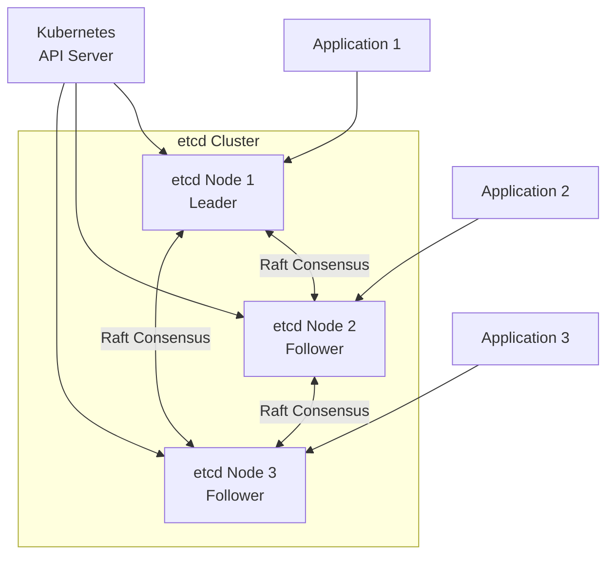

# How to Implement etcd for Distributed Configuration

Author: [nawazdhandala](https://www.github.com/nawazdhandala)

Tags: etcd, Distributed Systems, Configuration Management, Kubernetes, Key-Value Store, DevOps

Description: Learn how to set up and use etcd as a distributed key-value store for configuration management. This guide covers installation, clustering, and practical examples for storing and watching configuration data.

---

> etcd is a distributed, reliable key-value store used for the most critical data of a distributed system. It powers Kubernetes and many other systems that need consistent, highly available configuration storage.

etcd provides strong consistency guarantees using the Raft consensus protocol. Every write is replicated across the cluster before being acknowledged, ensuring your configuration data is never lost even when nodes fail.

---

## Prerequisites

Before we begin, ensure you have:
- Linux or macOS system
- Three servers for production cluster (one for development)
- Network connectivity between nodes
- Basic understanding of key-value stores

---

## Installing etcd

### Binary Installation

Download and install etcd from the official releases:

```bash
# Set version
ETCD_VERSION="v3.5.12"

# Download etcd
curl -L https://github.com/etcd-io/etcd/releases/download/${ETCD_VERSION}/etcd-${ETCD_VERSION}-linux-amd64.tar.gz -o etcd.tar.gz

# Extract archive
tar -xzf etcd.tar.gz

# Move binaries to system path
sudo mv etcd-${ETCD_VERSION}-linux-amd64/etcd /usr/local/bin/
sudo mv etcd-${ETCD_VERSION}-linux-amd64/etcdctl /usr/local/bin/

# Verify installation
etcd --version
etcdctl version
```

### Docker Installation

```bash
# Run single node etcd for development
docker run -d \
  --name etcd \
  -p 2379:2379 \
  -p 2380:2380 \
  quay.io/coreos/etcd:v3.5.12 \
  /usr/local/bin/etcd \
  --name node1 \
  --listen-client-urls http://0.0.0.0:2379 \
  --advertise-client-urls http://localhost:2379 \
  --listen-peer-urls http://0.0.0.0:2380 \
  --initial-advertise-peer-urls http://localhost:2380 \
  --initial-cluster node1=http://localhost:2380

# Verify it's running
docker exec etcd etcdctl endpoint health
```

---

## Single Node Configuration

Start a single-node etcd for development:

```bash
# Start etcd with basic configuration
etcd \
  --name node1 \
  --data-dir /var/lib/etcd \
  --listen-client-urls http://0.0.0.0:2379 \
  --advertise-client-urls http://localhost:2379 \
  --listen-peer-urls http://0.0.0.0:2380 \
  --initial-advertise-peer-urls http://localhost:2380 \
  --initial-cluster node1=http://localhost:2380 \
  --initial-cluster-state new
```

---

## Cluster Configuration

For production, run a three-node cluster. Configuration for each node:

### Node 1 Configuration

```bash
# /etc/etcd/etcd.conf.yml
# etcd Node 1 configuration

name: 'node1'
data-dir: /var/lib/etcd

# Client-facing URLs
listen-client-urls: 'https://0.0.0.0:2379'
advertise-client-urls: 'https://etcd1.example.com:2379'

# Peer URLs for cluster communication
listen-peer-urls: 'https://0.0.0.0:2380'
initial-advertise-peer-urls: 'https://etcd1.example.com:2380'

# Cluster configuration
initial-cluster: 'node1=https://etcd1.example.com:2380,node2=https://etcd2.example.com:2380,node3=https://etcd3.example.com:2380'
initial-cluster-state: 'new'
initial-cluster-token: 'etcd-cluster-token'

# TLS configuration
client-transport-security:
  cert-file: /etc/etcd/certs/server.crt
  key-file: /etc/etcd/certs/server.key
  trusted-ca-file: /etc/etcd/certs/ca.crt
  client-cert-auth: true

peer-transport-security:
  cert-file: /etc/etcd/certs/peer.crt
  key-file: /etc/etcd/certs/peer.key
  trusted-ca-file: /etc/etcd/certs/ca.crt
  client-cert-auth: true
```

### Starting the Cluster

Start each node with its configuration:

```bash
# On node1
etcd --config-file /etc/etcd/etcd.conf.yml

# On node2
etcd --config-file /etc/etcd/etcd.conf.yml

# On node3
etcd --config-file /etc/etcd/etcd.conf.yml
```

---

## Cluster Architecture



---

## etcdctl Basics

Use etcdctl to interact with etcd:

```bash
# Set API version (v3 is current)
export ETCDCTL_API=3

# Put a key-value pair
etcdctl put /config/database/host "db.example.com"
etcdctl put /config/database/port "5432"
etcdctl put /config/database/name "myapp"

# Get a single key
etcdctl get /config/database/host

# Get with prefix (all keys under /config/database)
etcdctl get /config/database --prefix

# Get only values (no keys)
etcdctl get /config/database --prefix --print-value-only

# Get all keys
etcdctl get "" --prefix --keys-only

# Delete a key
etcdctl del /config/database/host

# Delete with prefix
etcdctl del /config/database --prefix

# Watch a key for changes
etcdctl watch /config/database/host

# Watch with prefix
etcdctl watch /config --prefix
```

---

## Systemd Service

Create a systemd service for etcd:

```ini
# /etc/systemd/system/etcd.service
[Unit]
Description=etcd distributed key-value store
Documentation=https://etcd.io
After=network.target

[Service]
Type=notify
User=etcd
ExecStart=/usr/local/bin/etcd --config-file /etc/etcd/etcd.conf.yml
Restart=on-failure
RestartSec=5
LimitNOFILE=65536

[Install]
WantedBy=multi-user.target
```

Enable and start:

```bash
sudo systemctl daemon-reload
sudo systemctl enable etcd
sudo systemctl start etcd
```

---

## Go Client Example

```go
package main

import (
    "context"
    "fmt"
    "log"
    "time"

    clientv3 "go.etcd.io/etcd/client/v3"
)

// ConfigManager handles etcd operations for configuration
type ConfigManager struct {
    client *clientv3.Client
    prefix string
}

// NewConfigManager creates a new configuration manager
func NewConfigManager(endpoints []string, prefix string) (*ConfigManager, error) {
    client, err := clientv3.New(clientv3.Config{
        Endpoints:   endpoints,
        DialTimeout: 5 * time.Second,
    })
    if err != nil {
        return nil, err
    }

    return &ConfigManager{
        client: client,
        prefix: prefix,
    }, nil
}

// Get retrieves a configuration value
func (cm *ConfigManager) Get(ctx context.Context, key string) (string, error) {
    fullKey := cm.prefix + key

    resp, err := cm.client.Get(ctx, fullKey)
    if err != nil {
        return "", err
    }

    if len(resp.Kvs) == 0 {
        return "", fmt.Errorf("key not found: %s", key)
    }

    return string(resp.Kvs[0].Value), nil
}

// Set stores a configuration value
func (cm *ConfigManager) Set(ctx context.Context, key, value string) error {
    fullKey := cm.prefix + key
    _, err := cm.client.Put(ctx, fullKey, value)
    return err
}

// GetAll retrieves all configuration under the prefix
func (cm *ConfigManager) GetAll(ctx context.Context) (map[string]string, error) {
    resp, err := cm.client.Get(ctx, cm.prefix, clientv3.WithPrefix())
    if err != nil {
        return nil, err
    }

    result := make(map[string]string)
    for _, kv := range resp.Kvs {
        // Remove prefix from key
        key := string(kv.Key)[len(cm.prefix):]
        result[key] = string(kv.Value)
    }

    return result, nil
}

// Watch monitors configuration changes
func (cm *ConfigManager) Watch(ctx context.Context, key string, callback func(string, string)) {
    fullKey := cm.prefix + key

    watchChan := cm.client.Watch(ctx, fullKey, clientv3.WithPrefix())

    for watchResp := range watchChan {
        for _, event := range watchResp.Events {
            key := string(event.Kv.Key)[len(cm.prefix):]
            value := string(event.Kv.Value)
            callback(key, value)
        }
    }
}

// Close closes the etcd client connection
func (cm *ConfigManager) Close() error {
    return cm.client.Close()
}

func main() {
    ctx := context.Background()

    // Create configuration manager
    config, err := NewConfigManager(
        []string{"localhost:2379"},
        "/config/myapp/",
    )
    if err != nil {
        log.Fatal(err)
    }
    defer config.Close()

    // Store configuration
    config.Set(ctx, "database/host", "db.example.com")
    config.Set(ctx, "database/port", "5432")
    config.Set(ctx, "log_level", "info")

    // Retrieve configuration
    host, _ := config.Get(ctx, "database/host")
    fmt.Printf("Database host: %s\n", host)

    // Get all configuration
    allConfig, _ := config.GetAll(ctx)
    fmt.Printf("All config: %+v\n", allConfig)

    // Watch for changes in a goroutine
    go config.Watch(ctx, "", func(key, value string) {
        fmt.Printf("Config changed: %s = %s\n", key, value)
    })

    // Keep running to see watch events
    select {}
}
```

---

## Python Client Example

```python
import etcd3
from typing import Dict, Optional, Callable
import threading

class EtcdConfig:
    """
    Configuration manager using etcd for distributed storage.
    Supports get, set, and watch operations.
    """

    def __init__(self, host='localhost', port=2379, prefix='/config/'):
        self.client = etcd3.client(host=host, port=port)
        self.prefix = prefix

    def get(self, key: str) -> Optional[str]:
        """
        Retrieve a configuration value.
        Returns None if key doesn't exist.
        """
        full_key = f"{self.prefix}{key}"
        value, metadata = self.client.get(full_key)

        if value is None:
            return None

        return value.decode('utf-8')

    def set(self, key: str, value: str) -> None:
        """Store a configuration value."""
        full_key = f"{self.prefix}{key}"
        self.client.put(full_key, value)

    def delete(self, key: str) -> bool:
        """Delete a configuration key. Returns True if deleted."""
        full_key = f"{self.prefix}{key}"
        return self.client.delete(full_key)

    def get_all(self, sub_prefix: str = '') -> Dict[str, str]:
        """
        Get all configuration values under a prefix.
        Returns a dictionary of key-value pairs.
        """
        full_prefix = f"{self.prefix}{sub_prefix}"
        result = {}

        for value, metadata in self.client.get_prefix(full_prefix):
            # Remove the base prefix from the key
            key = metadata.key.decode('utf-8')
            key = key[len(self.prefix):]
            result[key] = value.decode('utf-8')

        return result

    def watch(self, key: str, callback: Callable[[str, str], None]) -> None:
        """
        Watch a key for changes.
        Callback receives (key, new_value) on each change.
        Runs in a background thread.
        """
        full_key = f"{self.prefix}{key}"

        def watch_thread():
            events_iterator, cancel = self.client.watch_prefix(full_key)
            for event in events_iterator:
                key = event.key.decode('utf-8')[len(self.prefix):]
                value = event.value.decode('utf-8') if event.value else None
                callback(key, value)

        thread = threading.Thread(target=watch_thread, daemon=True)
        thread.start()

    def transaction(self, key: str, expected: str, new_value: str) -> bool:
        """
        Atomic compare-and-swap operation.
        Updates key to new_value only if current value equals expected.
        Returns True if successful.
        """
        full_key = f"{self.prefix}{key}"

        success, _ = self.client.transaction(
            compare=[
                self.client.transactions.value(full_key) == expected.encode()
            ],
            success=[
                self.client.transactions.put(full_key, new_value)
            ],
            failure=[]
        )

        return success

    def close(self) -> None:
        """Close the etcd client connection."""
        self.client.close()


# Usage example
config = EtcdConfig(prefix='/myapp/config/')

# Store configuration
config.set('database/host', 'db.example.com')
config.set('database/port', '5432')
config.set('features/dark_mode', 'true')

# Retrieve configuration
db_host = config.get('database/host')
print(f"Database host: {db_host}")

# Get all database config
db_config = config.get_all('database/')
print(f"Database config: {db_config}")

# Watch for changes
def on_change(key, value):
    print(f"Configuration changed: {key} = {value}")

config.watch('', on_change)

# Atomic update
success = config.transaction(
    'features/dark_mode',
    expected='true',
    new_value='false'
)
print(f"Transaction success: {success}")

config.close()
```

---

## Cluster Health and Monitoring

```bash
# Check cluster health
etcdctl endpoint health --endpoints=etcd1:2379,etcd2:2379,etcd3:2379

# Check cluster status
etcdctl endpoint status --endpoints=etcd1:2379,etcd2:2379,etcd3:2379 -w table

# List cluster members
etcdctl member list -w table

# Get metrics (Prometheus format)
curl http://localhost:2379/metrics
```

---

## Backup and Restore

```bash
# Create a snapshot backup
etcdctl snapshot save /backup/etcd-backup.db

# Verify backup
etcdctl snapshot status /backup/etcd-backup.db -w table

# Restore from backup
etcdctl snapshot restore /backup/etcd-backup.db \
  --data-dir /var/lib/etcd-restored \
  --initial-cluster node1=http://localhost:2380 \
  --initial-cluster-token etcd-cluster-token \
  --initial-advertise-peer-urls http://localhost:2380
```

---

## Best Practices

1. **Always run odd numbers** of nodes (3 or 5) for proper quorum
2. **Enable TLS** for all client and peer communication
3. **Regular backups** with automated snapshot scheduling
4. **Monitor disk latency** as etcd is sensitive to I/O performance
5. **Set resource limits** to prevent memory exhaustion
6. **Use separate disks** for etcd data in production

---

## Conclusion

etcd provides a robust foundation for distributed configuration management with strong consistency guarantees. Its simple API and watch capability make it ideal for dynamic configuration that needs to propagate across your infrastructure.

Key takeaways:
- etcd uses Raft consensus for strong consistency
- Watches enable reactive configuration updates
- Transactions support atomic compare-and-swap operations
- Regular backups are essential for disaster recovery

Whether you're using etcd directly or through Kubernetes, understanding its fundamentals helps you build more reliable distributed systems.

---

*Need to monitor your etcd cluster health and performance? [OneUptime](https://oneuptime.com) provides comprehensive monitoring for distributed systems including etcd clusters.*
