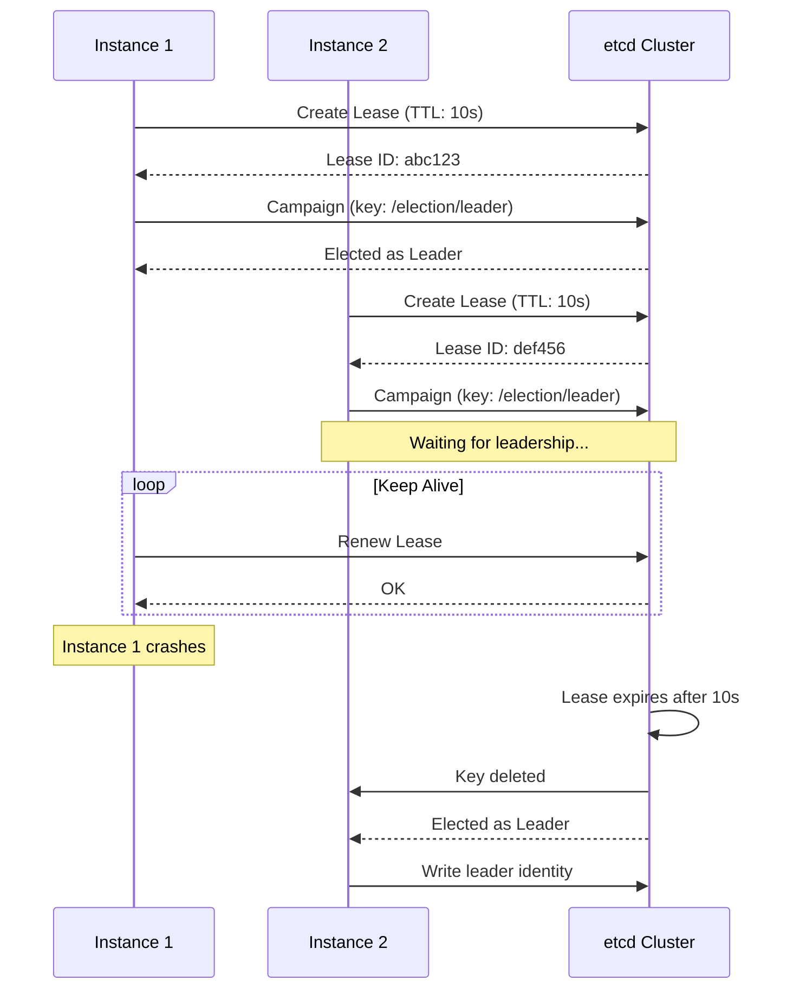

# How to Implement Leader Election with etcd

Author: [nawazdhandala](https://www.github.com/nawazdhandala)

Tags: etcd, Leader Election, Distributed Systems, High Availability, Coordination, Go

Description: Learn how to implement leader election using etcd for distributed applications. This guide covers lease-based election, handling leadership changes, and building fault-tolerant systems.

---

> Leader election is a fundamental pattern in distributed systems where multiple instances of a service need to coordinate so that only one performs certain tasks. etcd provides primitives that make implementing reliable leader election straightforward.

When you run multiple replicas of a service for high availability, some operations should only run on one instance at a time. Examples include scheduled jobs, database migrations, or cache warming. Leader election ensures exactly one instance handles these responsibilities.

---

## Prerequisites

Before we begin, ensure you have:
- etcd cluster running
- Go 1.19 or higher (examples are in Go)
- Basic understanding of distributed systems concepts

---

## Leader Election Concepts

etcd leader election uses three key primitives:

1. **Leases** - Time-bounded ownership tokens
2. **Keys** - Election namespace identifiers
3. **Campaigns** - Process of acquiring leadership

When a candidate wins the election, it creates a key with its identity and a lease. If the leader fails to renew its lease, the key is deleted and another candidate can win.

---

## Leader Election Flow



---

## Basic Go Implementation

```go
package main

import (
    "context"
    "fmt"
    "log"
    "os"
    "os/signal"
    "syscall"
    "time"

    clientv3 "go.etcd.io/etcd/client/v3"
    "go.etcd.io/etcd/client/v3/concurrency"
)

// LeaderElection manages leader election for a service
type LeaderElection struct {
    client     *clientv3.Client
    session    *concurrency.Session
    election   *concurrency.Election
    instanceID string
    isLeader   bool
}

// NewLeaderElection creates a new leader election instance
func NewLeaderElection(endpoints []string, electionKey string, instanceID string) (*LeaderElection, error) {
    // Create etcd client
    client, err := clientv3.New(clientv3.Config{
        Endpoints:   endpoints,
        DialTimeout: 5 * time.Second,
    })
    if err != nil {
        return nil, fmt.Errorf("failed to create etcd client: %w", err)
    }

    // Create session with TTL for lease
    // If this process crashes, the lease expires after TTL
    session, err := concurrency.NewSession(client, concurrency.WithTTL(10))
    if err != nil {
        client.Close()
        return nil, fmt.Errorf("failed to create session: %w", err)
    }

    // Create election on the specified key
    election := concurrency.NewElection(session, electionKey)

    return &LeaderElection{
        client:     client,
        session:    session,
        election:   election,
        instanceID: instanceID,
        isLeader:   false,
    }, nil
}

// Campaign attempts to become the leader
// Blocks until leadership is acquired or context is cancelled
func (le *LeaderElection) Campaign(ctx context.Context) error {
    log.Printf("[%s] Campaigning for leadership...", le.instanceID)

    // Campaign blocks until we become leader or context is cancelled
    err := le.election.Campaign(ctx, le.instanceID)
    if err != nil {
        return fmt.Errorf("campaign failed: %w", err)
    }

    le.isLeader = true
    log.Printf("[%s] Became leader!", le.instanceID)
    return nil
}

// Resign voluntarily gives up leadership
func (le *LeaderElection) Resign(ctx context.Context) error {
    if !le.isLeader {
        return nil
    }

    log.Printf("[%s] Resigning leadership...", le.instanceID)
    err := le.election.Resign(ctx)
    if err != nil {
        return fmt.Errorf("resign failed: %w", err)
    }

    le.isLeader = false
    return nil
}

// GetLeader returns the current leader's identity
func (le *LeaderElection) GetLeader(ctx context.Context) (string, error) {
    resp, err := le.election.Leader(ctx)
    if err != nil {
        return "", err
    }

    if len(resp.Kvs) == 0 {
        return "", fmt.Errorf("no leader elected")
    }

    return string(resp.Kvs[0].Value), nil
}

// IsLeader returns whether this instance is the leader
func (le *LeaderElection) IsLeader() bool {
    return le.isLeader
}

// Close releases resources
func (le *LeaderElection) Close() error {
    le.session.Close()
    return le.client.Close()
}

func main() {
    // Get instance ID from environment or generate one
    instanceID := os.Getenv("INSTANCE_ID")
    if instanceID == "" {
        instanceID = fmt.Sprintf("instance-%d", os.Getpid())
    }

    // Create leader election
    election, err := NewLeaderElection(
        []string{"localhost:2379"},
        "/services/scheduler/leader",
        instanceID,
    )
    if err != nil {
        log.Fatal(err)
    }
    defer election.Close()

    // Handle graceful shutdown
    ctx, cancel := context.WithCancel(context.Background())
    defer cancel()

    sigChan := make(chan os.Signal, 1)
    signal.Notify(sigChan, syscall.SIGINT, syscall.SIGTERM)

    go func() {
        <-sigChan
        log.Println("Shutting down...")
        election.Resign(context.Background())
        cancel()
    }()

    // Campaign for leadership
    if err := election.Campaign(ctx); err != nil {
        log.Printf("Campaign ended: %v", err)
        return
    }

    // Run leader tasks while we are the leader
    for {
        select {
        case <-ctx.Done():
            return
        default:
            if election.IsLeader() {
                runLeaderTasks()
            }
            time.Sleep(time.Second)
        }
    }
}

func runLeaderTasks() {
    log.Println("Running leader tasks...")
    // Your leader-only logic here
}
```

---

## Watching for Leadership Changes

```go
package main

import (
    "context"
    "log"

    clientv3 "go.etcd.io/etcd/client/v3"
    "go.etcd.io/etcd/client/v3/concurrency"
)

// WatchLeadership monitors leadership changes
func WatchLeadership(ctx context.Context, election *concurrency.Election, onChange func(leader string)) {
    // Get initial leader
    resp, err := election.Leader(ctx)
    if err == nil && len(resp.Kvs) > 0 {
        onChange(string(resp.Kvs[0].Value))
    }

    // Watch for changes
    watchChan := election.Observe(ctx)

    for {
        select {
        case <-ctx.Done():
            return
        case resp, ok := <-watchChan:
            if !ok {
                return
            }
            if len(resp.Kvs) > 0 {
                onChange(string(resp.Kvs[0].Value))
            }
        }
    }
}

// Example usage in a follower service
func runFollower(ctx context.Context, client *clientv3.Client) {
    session, _ := concurrency.NewSession(client)
    election := concurrency.NewElection(session, "/services/scheduler/leader")

    WatchLeadership(ctx, election, func(leader string) {
        log.Printf("Current leader is: %s", leader)
        // Update local state or reconnect to leader
    })
}
```

---

## Python Implementation

```python
import etcd3
import threading
import time
import logging
import signal
import sys

logging.basicConfig(level=logging.INFO)
logger = logging.getLogger(__name__)

class LeaderElection:
    """
    Leader election implementation using etcd.
    Uses leases to ensure leadership is released if process dies.
    """

    def __init__(self, etcd_host, etcd_port, election_key, instance_id, ttl=10):
        self.client = etcd3.client(host=etcd_host, port=etcd_port)
        self.election_key = election_key
        self.instance_id = instance_id
        self.ttl = ttl
        self.lease = None
        self.is_leader = False
        self._running = False
        self._lock = threading.Lock()

    def campaign(self):
        """
        Campaign for leadership.
        Creates a lease and attempts to acquire the election key.
        """
        # Create lease
        self.lease = self.client.lease(self.ttl)

        # Start lease keepalive in background
        self._running = True
        keepalive_thread = threading.Thread(target=self._keepalive, daemon=True)
        keepalive_thread.start()

        # Try to acquire leadership
        while self._running:
            try:
                # Use transaction for atomic check-and-set
                success, _ = self.client.transaction(
                    compare=[
                        self.client.transactions.create(self.election_key) == 0
                    ],
                    success=[
                        self.client.transactions.put(
                            self.election_key,
                            self.instance_id,
                            lease=self.lease
                        )
                    ],
                    failure=[]
                )

                if success:
                    with self._lock:
                        self.is_leader = True
                    logger.info(f"[{self.instance_id}] Became leader!")
                    return True

                # Wait and retry
                logger.info(f"[{self.instance_id}] Waiting for leadership...")
                time.sleep(1)

            except Exception as e:
                logger.error(f"Campaign error: {e}")
                time.sleep(1)

        return False

    def _keepalive(self):
        """Background thread to keep lease alive."""
        while self._running:
            try:
                if self.lease:
                    self.lease.refresh()
            except Exception as e:
                logger.error(f"Lease refresh failed: {e}")
                with self._lock:
                    self.is_leader = False
            time.sleep(self.ttl / 3)

    def resign(self):
        """Voluntarily give up leadership."""
        self._running = False

        if self.is_leader:
            logger.info(f"[{self.instance_id}] Resigning leadership...")
            try:
                self.client.delete(self.election_key)
            except Exception as e:
                logger.error(f"Resign error: {e}")

        if self.lease:
            try:
                self.lease.revoke()
            except Exception:
                pass

        with self._lock:
            self.is_leader = False

    def get_leader(self):
        """Get current leader's identity."""
        value, _ = self.client.get(self.election_key)
        if value:
            return value.decode('utf-8')
        return None


def main():
    import os

    instance_id = os.getenv('INSTANCE_ID', f'instance-{os.getpid()}')

    election = LeaderElection(
        etcd_host='localhost',
        etcd_port=2379,
        election_key='/services/scheduler/leader',
        instance_id=instance_id,
        ttl=10
    )

    # Handle shutdown
    def shutdown(sig, frame):
        logger.info("Shutting down...")
        election.resign()
        sys.exit(0)

    signal.signal(signal.SIGINT, shutdown)
    signal.signal(signal.SIGTERM, shutdown)

    # Campaign for leadership
    if election.campaign():
        # Run as leader
        while election.is_leader:
            logger.info("Running leader tasks...")
            time.sleep(5)


if __name__ == '__main__':
    main()
```

---

## Using etcd's Built-in Election

etcd provides a simpler API through concurrency primitives:

```go
package main

import (
    "context"
    "log"
    "time"

    clientv3 "go.etcd.io/etcd/client/v3"
    "go.etcd.io/etcd/client/v3/concurrency"
)

func simpleElection() {
    client, _ := clientv3.New(clientv3.Config{
        Endpoints: []string{"localhost:2379"},
    })
    defer client.Close()

    // Create session with 5 second TTL
    session, _ := concurrency.NewSession(client, concurrency.WithTTL(5))
    defer session.Close()

    // Create election
    e := concurrency.NewElection(session, "/my-election/")

    ctx := context.Background()

    // Campaign to become leader
    // This blocks until we win or context is cancelled
    if err := e.Campaign(ctx, "my-instance"); err != nil {
        log.Fatal(err)
    }

    log.Println("I am the leader now!")

    // Do leader work
    time.Sleep(30 * time.Second)

    // Resign when done
    e.Resign(ctx)
}
```

---

## High Availability Pattern

```go
package main

import (
    "context"
    "log"
    "sync"
)

type HAService struct {
    election   *LeaderElection
    leaderWork func(ctx context.Context)
    followerWork func(ctx context.Context, leader string)
    wg         sync.WaitGroup
}

func NewHAService(election *LeaderElection) *HAService {
    return &HAService{
        election: election,
    }
}

func (s *HAService) OnLeader(work func(ctx context.Context)) {
    s.leaderWork = work
}

func (s *HAService) OnFollower(work func(ctx context.Context, leader string)) {
    s.followerWork = work
}

func (s *HAService) Run(ctx context.Context) {
    for {
        select {
        case <-ctx.Done():
            return
        default:
        }

        // Try to become leader
        campaignCtx, cancel := context.WithCancel(ctx)
        err := s.election.Campaign(campaignCtx)

        if err != nil {
            // Campaign failed or cancelled, run as follower
            cancel()

            leader, _ := s.election.GetLeader(ctx)
            if s.followerWork != nil && leader != "" {
                s.followerWork(ctx, leader)
            }
            continue
        }

        // We are the leader
        if s.leaderWork != nil {
            s.leaderWork(campaignCtx)
        }

        cancel()
    }
}
```

---

## Best Practices

1. **Set appropriate TTL** - Balance between fast failover and network tolerance
2. **Handle leadership loss** - Stop leader tasks when lease expires
3. **Graceful resignation** - Resign before shutdown for faster failover
4. **Idempotent operations** - Leader tasks should handle restarts
5. **Monitor elections** - Track leadership changes and durations
6. **Test failure scenarios** - Validate behavior when leaders crash

---

## Conclusion

Leader election with etcd provides a reliable way to coordinate distributed services. The lease-based approach ensures that leadership is released when processes fail, enabling automatic failover.

Key takeaways:
- Use leases with appropriate TTL for automatic failover
- Campaign blocks until leadership is acquired
- Watch for leadership changes to update followers
- Always handle graceful shutdown with resignation

With leader election in place, you can build highly available services where critical tasks run on exactly one instance at a time.

---

*Building distributed systems with etcd? [OneUptime](https://oneuptime.com) provides monitoring and observability for your coordination infrastructure.*
