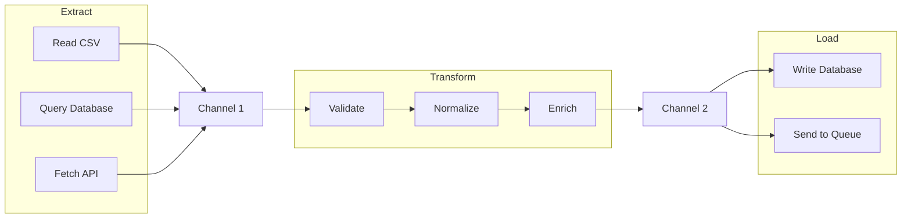

# How to Build ETL Pipelines with Channels in .NET

Author: [nawazdhandala](https://www.github.com/nawazdhandala)

Tags: .NET, Channels, ETL, Data Pipeline, Async Programming, C#, Parallel Processing

Description: Learn how to build efficient ETL pipelines in .NET using System.Threading.Channels for producer-consumer patterns, backpressure handling, and parallel data processing.

---

Extract, Transform, Load (ETL) pipelines are fundamental to data engineering. In .NET, System.Threading.Channels provides a high-performance, thread-safe mechanism for building these pipelines. Channels enable producer-consumer patterns where different stages of your pipeline can run concurrently while managing backpressure automatically.

## Why Channels for ETL?

Channels offer several advantages over traditional approaches like BlockingCollection or manual thread synchronization:

- Built-in backpressure handling prevents memory exhaustion
- Async/await support throughout the pipeline
- Bounded and unbounded capacity options
- Multiple producers and consumers supported
- High performance with minimal allocations



## Basic Channel Pipeline

### Simple Producer-Consumer

```csharp
// SimplePipeline.cs
public class SimplePipeline
{
    public async Task RunAsync(CancellationToken cancellationToken)
    {
        // Create a bounded channel with capacity of 100
        // When full, producers will wait asynchronously
        var channel = Channel.CreateBounded<DataRecord>(new BoundedChannelOptions(100)
        {
            FullMode = BoundedChannelFullMode.Wait,
            SingleReader = false,
            SingleWriter = false
        });

        // Start producer and consumer concurrently
        var producer = ProduceAsync(channel.Writer, cancellationToken);
        var consumer = ConsumeAsync(channel.Reader, cancellationToken);

        // Wait for producer to finish, then signal completion
        await producer;
        channel.Writer.Complete();

        // Wait for consumer to process remaining items
        await consumer;
    }

    private async Task ProduceAsync(
        ChannelWriter<DataRecord> writer,
        CancellationToken cancellationToken)
    {
        var records = await FetchRecordsFromSourceAsync();

        foreach (var record in records)
        {
            // WriteAsync will wait if channel is full
            await writer.WriteAsync(record, cancellationToken);
        }
    }

    private async Task ConsumeAsync(
        ChannelReader<DataRecord> reader,
        CancellationToken cancellationToken)
    {
        // ReadAllAsync handles channel completion automatically
        await foreach (var record in reader.ReadAllAsync(cancellationToken))
        {
            await ProcessRecordAsync(record);
        }
    }
}
```

## Multi-Stage Pipeline

Real ETL pipelines have multiple stages. Connect them with channels:

```csharp
// MultiStagePipeline.cs
public class MultiStagePipeline
{
    private readonly ILogger<MultiStagePipeline> _logger;

    public MultiStagePipeline(ILogger<MultiStagePipeline> logger)
    {
        _logger = logger;
    }

    public async Task RunAsync(CancellationToken cancellationToken)
    {
        // Create channels for each stage
        var extractChannel = Channel.CreateBounded<RawRecord>(new BoundedChannelOptions(1000)
        {
            FullMode = BoundedChannelFullMode.Wait
        });

        var transformChannel = Channel.CreateBounded<TransformedRecord>(new BoundedChannelOptions(500)
        {
            FullMode = BoundedChannelFullMode.Wait
        });

        var loadChannel = Channel.CreateBounded<LoadableRecord>(new BoundedChannelOptions(200)
        {
            FullMode = BoundedChannelFullMode.Wait
        });

        // Start all stages concurrently
        var extractTask = ExtractAsync(extractChannel.Writer, cancellationToken);

        var transformTask = TransformAsync(
            extractChannel.Reader,
            transformChannel.Writer,
            cancellationToken);

        var validateTask = ValidateAsync(
            transformChannel.Reader,
            loadChannel.Writer,
            cancellationToken);

        var loadTask = LoadAsync(loadChannel.Reader, cancellationToken);

        // Wait for extraction to complete
        await extractTask;
        extractChannel.Writer.Complete();

        // Wait for transformation to complete
        await transformTask;
        transformChannel.Writer.Complete();

        // Wait for validation to complete
        await validateTask;
        loadChannel.Writer.Complete();

        // Wait for loading to complete
        await loadTask;

        _logger.LogInformation("Pipeline completed successfully");
    }

    private async Task ExtractAsync(
        ChannelWriter<RawRecord> writer,
        CancellationToken cancellationToken)
    {
        _logger.LogInformation("Starting extraction");

        // Read from multiple sources concurrently
        var csvTask = ExtractFromCsvAsync(writer, cancellationToken);
        var dbTask = ExtractFromDatabaseAsync(writer, cancellationToken);
        var apiTask = ExtractFromApiAsync(writer, cancellationToken);

        await Task.WhenAll(csvTask, dbTask, apiTask);

        _logger.LogInformation("Extraction completed");
    }

    private async Task ExtractFromCsvAsync(
        ChannelWriter<RawRecord> writer,
        CancellationToken cancellationToken)
    {
        using var reader = new StreamReader("data.csv");
        using var csv = new CsvReader(reader, CultureInfo.InvariantCulture);

        await foreach (var record in csv.GetRecordsAsync<CsvRecord>(cancellationToken))
        {
            var rawRecord = new RawRecord
            {
                Source = "CSV",
                Data = record,
                ExtractedAt = DateTime.UtcNow
            };

            await writer.WriteAsync(rawRecord, cancellationToken);
        }
    }

    private async Task TransformAsync(
        ChannelReader<RawRecord> reader,
        ChannelWriter<TransformedRecord> writer,
        CancellationToken cancellationToken)
    {
        await foreach (var raw in reader.ReadAllAsync(cancellationToken))
        {
            try
            {
                var transformed = new TransformedRecord
                {
                    Id = raw.Data.Id,
                    NormalizedName = NormalizeName(raw.Data.Name),
                    ParsedDate = ParseDate(raw.Data.DateString),
                    CalculatedValue = CalculateValue(raw.Data),
                    Source = raw.Source
                };

                await writer.WriteAsync(transformed, cancellationToken);
            }
            catch (Exception ex)
            {
                _logger.LogWarning(ex, "Transform failed for record {Id}", raw.Data.Id);
                // Continue processing other records
            }
        }
    }

    private async Task ValidateAsync(
        ChannelReader<TransformedRecord> reader,
        ChannelWriter<LoadableRecord> writer,
        CancellationToken cancellationToken)
    {
        await foreach (var record in reader.ReadAllAsync(cancellationToken))
        {
            var errors = ValidateRecord(record);

            if (errors.Count == 0)
            {
                var loadable = new LoadableRecord
                {
                    Record = record,
                    ValidatedAt = DateTime.UtcNow
                };

                await writer.WriteAsync(loadable, cancellationToken);
            }
            else
            {
                _logger.LogWarning(
                    "Validation failed for record {Id}: {Errors}",
                    record.Id,
                    string.Join(", ", errors));
            }
        }
    }

    private async Task LoadAsync(
        ChannelReader<LoadableRecord> reader,
        CancellationToken cancellationToken)
    {
        var batch = new List<LoadableRecord>();
        const int batchSize = 100;

        await foreach (var record in reader.ReadAllAsync(cancellationToken))
        {
            batch.Add(record);

            if (batch.Count >= batchSize)
            {
                await LoadBatchAsync(batch, cancellationToken);
                batch.Clear();
            }
        }

        // Load remaining records
        if (batch.Count > 0)
        {
            await LoadBatchAsync(batch, cancellationToken);
        }
    }

    private async Task LoadBatchAsync(
        List<LoadableRecord> batch,
        CancellationToken cancellationToken)
    {
        using var connection = new NpgsqlConnection(_connectionString);
        await connection.OpenAsync(cancellationToken);

        using var transaction = await connection.BeginTransactionAsync(cancellationToken);

        try
        {
            foreach (var record in batch)
            {
                await InsertRecordAsync(connection, record, cancellationToken);
            }

            await transaction.CommitAsync(cancellationToken);
            _logger.LogInformation("Loaded batch of {Count} records", batch.Count);
        }
        catch
        {
            await transaction.RollbackAsync(cancellationToken);
            throw;
        }
    }
}
```

## Parallel Processing

Use multiple consumers for CPU-intensive or I/O-bound stages:

```csharp
// ParallelPipeline.cs
public class ParallelPipeline
{
    private readonly int _parallelism;

    public ParallelPipeline(int parallelism = 4)
    {
        _parallelism = parallelism;
    }

    public async Task RunAsync(CancellationToken cancellationToken)
    {
        var inputChannel = Channel.CreateBounded<InputRecord>(1000);
        var outputChannel = Channel.CreateBounded<OutputRecord>(1000);

        // Start producer
        var producerTask = ProduceAsync(inputChannel.Writer, cancellationToken);

        // Start multiple parallel workers
        var workerTasks = Enumerable
            .Range(0, _parallelism)
            .Select(i => ProcessAsync(
                inputChannel.Reader,
                outputChannel.Writer,
                $"Worker-{i}",
                cancellationToken))
            .ToList();

        // Start consumer
        var consumerTask = ConsumeAsync(outputChannel.Reader, cancellationToken);

        // Wait for producer
        await producerTask;
        inputChannel.Writer.Complete();

        // Wait for all workers
        await Task.WhenAll(workerTasks);
        outputChannel.Writer.Complete();

        // Wait for consumer
        await consumerTask;
    }

    private async Task ProcessAsync(
        ChannelReader<InputRecord> input,
        ChannelWriter<OutputRecord> output,
        string workerId,
        CancellationToken cancellationToken)
    {
        await foreach (var record in input.ReadAllAsync(cancellationToken))
        {
            try
            {
                // Simulate CPU-intensive work
                var result = await ProcessRecordAsync(record);

                var outputRecord = new OutputRecord
                {
                    OriginalId = record.Id,
                    ProcessedBy = workerId,
                    Result = result,
                    ProcessedAt = DateTime.UtcNow
                };

                await output.WriteAsync(outputRecord, cancellationToken);
            }
            catch (Exception ex)
            {
                // Log and continue
                Console.WriteLine($"[{workerId}] Error processing {record.Id}: {ex.Message}");
            }
        }
    }
}
```

## Error Handling and Dead Letter Queue

Implement robust error handling with a dead letter queue:

```csharp
// PipelineWithErrorHandling.cs
public class PipelineWithErrorHandling
{
    public async Task RunAsync(CancellationToken cancellationToken)
    {
        var inputChannel = Channel.CreateBounded<DataRecord>(1000);
        var outputChannel = Channel.CreateBounded<ProcessedRecord>(1000);
        var deadLetterChannel = Channel.CreateUnbounded<FailedRecord>();

        var tasks = new List<Task>
        {
            ExtractAsync(inputChannel.Writer, cancellationToken),
            TransformWithRetryAsync(
                inputChannel.Reader,
                outputChannel.Writer,
                deadLetterChannel.Writer,
                cancellationToken),
            LoadAsync(outputChannel.Reader, cancellationToken),
            HandleDeadLettersAsync(deadLetterChannel.Reader, cancellationToken)
        };

        // Start extraction
        await tasks[0];
        inputChannel.Writer.Complete();

        // Wait for processing
        await tasks[1];
        outputChannel.Writer.Complete();
        deadLetterChannel.Writer.Complete();

        // Wait for loading and error handling
        await Task.WhenAll(tasks.Skip(2));
    }

    private async Task TransformWithRetryAsync(
        ChannelReader<DataRecord> input,
        ChannelWriter<ProcessedRecord> output,
        ChannelWriter<FailedRecord> deadLetter,
        CancellationToken cancellationToken)
    {
        const int maxRetries = 3;

        await foreach (var record in input.ReadAllAsync(cancellationToken))
        {
            var attempts = 0;
            Exception lastException = null;

            while (attempts < maxRetries)
            {
                try
                {
                    var processed = await TransformAsync(record);
                    await output.WriteAsync(processed, cancellationToken);
                    break; // Success, move to next record
                }
                catch (TransientException ex)
                {
                    lastException = ex;
                    attempts++;

                    if (attempts < maxRetries)
                    {
                        // Exponential backoff
                        var delay = TimeSpan.FromSeconds(Math.Pow(2, attempts));
                        await Task.Delay(delay, cancellationToken);
                    }
                }
                catch (Exception ex)
                {
                    // Non-transient error, send to dead letter immediately
                    lastException = ex;
                    break;
                }
            }

            // All retries exhausted or non-transient error
            if (lastException != null)
            {
                var failed = new FailedRecord
                {
                    Original = record,
                    Error = lastException.Message,
                    StackTrace = lastException.StackTrace,
                    FailedAt = DateTime.UtcNow,
                    Attempts = attempts
                };

                await deadLetter.WriteAsync(failed, cancellationToken);
            }
        }
    }

    private async Task HandleDeadLettersAsync(
        ChannelReader<FailedRecord> reader,
        CancellationToken cancellationToken)
    {
        await foreach (var failed in reader.ReadAllAsync(cancellationToken))
        {
            // Log to monitoring system
            await LogFailureToMonitoringAsync(failed);

            // Store for later analysis
            await StoreFailedRecordAsync(failed);

            // Optionally alert on certain error types
            if (failed.Error.Contains("Critical"))
            {
                await SendAlertAsync(failed);
            }
        }
    }
}
```

## Metrics and Monitoring

Track pipeline throughput and latency:

```csharp
// MonitoredPipeline.cs
public class MonitoredPipeline
{
    private readonly Counter<long> _recordsProcessed;
    private readonly Histogram<double> _processingDuration;
    private readonly UpDownCounter<long> _queueDepth;

    public MonitoredPipeline(IMeterFactory meterFactory)
    {
        var meter = meterFactory.Create("ETL.Pipeline");

        _recordsProcessed = meter.CreateCounter<long>(
            "etl_records_processed",
            "records",
            "Total records processed");

        _processingDuration = meter.CreateHistogram<double>(
            "etl_processing_duration",
            "ms",
            "Time to process each record");

        _queueDepth = meter.CreateUpDownCounter<long>(
            "etl_queue_depth",
            "records",
            "Current queue depth");
    }

    public async Task ProcessAsync(
        ChannelReader<DataRecord> input,
        ChannelWriter<ProcessedRecord> output,
        CancellationToken cancellationToken)
    {
        await foreach (var record in input.ReadAllAsync(cancellationToken))
        {
            _queueDepth.Add(1, new KeyValuePair<string, object>("stage", "transform"));

            var stopwatch = Stopwatch.StartNew();

            try
            {
                var processed = await TransformAsync(record);
                await output.WriteAsync(processed, cancellationToken);

                _recordsProcessed.Add(1, new KeyValuePair<string, object>("status", "success"));
            }
            catch
            {
                _recordsProcessed.Add(1, new KeyValuePair<string, object>("status", "failed"));
                throw;
            }
            finally
            {
                stopwatch.Stop();
                _processingDuration.Record(stopwatch.ElapsedMilliseconds);
                _queueDepth.Add(-1, new KeyValuePair<string, object>("stage", "transform"));
            }
        }
    }
}
```

## Backpressure Strategies

Different backpressure strategies for different scenarios:

```csharp
// BackpressureStrategies.cs
public class BackpressureStrategies
{
    // Wait strategy: Producer waits when buffer is full
    public Channel<T> CreateWaitChannel<T>(int capacity)
    {
        return Channel.CreateBounded<T>(new BoundedChannelOptions(capacity)
        {
            FullMode = BoundedChannelFullMode.Wait
        });
    }

    // Drop oldest: Useful for real-time data where freshness matters
    public Channel<T> CreateDropOldestChannel<T>(int capacity)
    {
        return Channel.CreateBounded<T>(new BoundedChannelOptions(capacity)
        {
            FullMode = BoundedChannelFullMode.DropOldest
        });
    }

    // Drop newest: Useful when you want to process what you have
    public Channel<T> CreateDropNewestChannel<T>(int capacity)
    {
        return Channel.CreateBounded<T>(new BoundedChannelOptions(capacity)
        {
            FullMode = BoundedChannelFullMode.DropNewest
        });
    }

    // Drop write: Silently drops the item being written
    public Channel<T> CreateDropWriteChannel<T>(int capacity)
    {
        return Channel.CreateBounded<T>(new BoundedChannelOptions(capacity)
        {
            FullMode = BoundedChannelFullMode.DropWrite
        });
    }

    // Adaptive producer that slows down based on queue depth
    public async Task AdaptiveProducerAsync<T>(
        ChannelWriter<T> writer,
        IAsyncEnumerable<T> source,
        CancellationToken cancellationToken)
    {
        var consecutiveWaits = 0;

        await foreach (var item in source.WithCancellation(cancellationToken))
        {
            // Check if we can write immediately
            if (writer.TryWrite(item))
            {
                consecutiveWaits = 0;
                continue;
            }

            // Channel is full, track and wait
            consecutiveWaits++;

            // Add delay proportional to consecutive waits
            if (consecutiveWaits > 5)
            {
                var delay = TimeSpan.FromMilliseconds(Math.Min(100, consecutiveWaits * 10));
                await Task.Delay(delay, cancellationToken);
            }

            await writer.WriteAsync(item, cancellationToken);
        }
    }
}
```

## Testing Pipelines

Unit test pipeline components:

```csharp
// PipelineTests.cs
public class PipelineTests
{
    [Fact]
    public async Task TransformStage_ShouldProcessAllRecords()
    {
        // Arrange
        var inputChannel = Channel.CreateUnbounded<RawRecord>();
        var outputChannel = Channel.CreateUnbounded<TransformedRecord>();

        var records = Enumerable.Range(1, 100)
            .Select(i => new RawRecord { Id = i, Data = $"Data-{i}" })
            .ToList();

        // Write test data
        foreach (var record in records)
        {
            await inputChannel.Writer.WriteAsync(record);
        }
        inputChannel.Writer.Complete();

        // Act
        var pipeline = new MultiStagePipeline(NullLogger<MultiStagePipeline>.Instance);
        await pipeline.TransformAsync(
            inputChannel.Reader,
            outputChannel.Writer,
            CancellationToken.None);
        outputChannel.Writer.Complete();

        // Assert
        var results = await outputChannel.Reader.ReadAllAsync().ToListAsync();
        Assert.Equal(100, results.Count);
        Assert.All(results, r => Assert.NotNull(r.NormalizedName));
    }

    [Fact]
    public async Task Pipeline_ShouldHandleBackpressure()
    {
        // Arrange
        var channel = Channel.CreateBounded<int>(new BoundedChannelOptions(5)
        {
            FullMode = BoundedChannelFullMode.Wait
        });

        var writeCount = 0;
        var readCount = 0;

        // Act
        var producer = Task.Run(async () =>
        {
            for (int i = 0; i < 100; i++)
            {
                await channel.Writer.WriteAsync(i);
                Interlocked.Increment(ref writeCount);
            }
            channel.Writer.Complete();
        });

        var consumer = Task.Run(async () =>
        {
            await foreach (var item in channel.Reader.ReadAllAsync())
            {
                await Task.Delay(10); // Slow consumer
                Interlocked.Increment(ref readCount);
            }
        });

        await Task.WhenAll(producer, consumer);

        // Assert
        Assert.Equal(100, writeCount);
        Assert.Equal(100, readCount);
    }
}
```

## Summary

| Pattern | Use Case |
|---------|----------|
| **Single Channel** | Simple producer-consumer |
| **Multi-Stage** | Complex ETL with distinct phases |
| **Parallel Workers** | CPU or I/O-bound transformations |
| **Dead Letter Queue** | Error handling and retry |
| **Bounded Channels** | Memory management and backpressure |

Channels provide a clean abstraction for building data pipelines in .NET. They handle the complexity of thread synchronization, backpressure, and async coordination so you can focus on your business logic. Start with simple single-channel patterns and add complexity as needed. The key is to match your channel capacity and parallelism to the characteristics of each pipeline stage.
