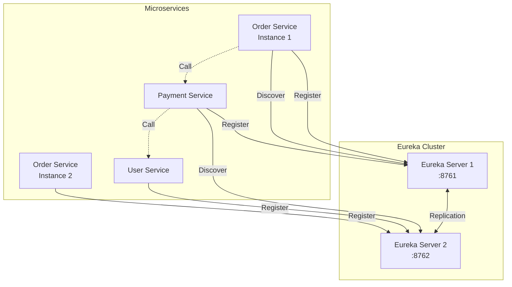

# How to Configure Eureka for Service Registry

Author: [nawazdhandala](https://www.github.com/nawazdhandala)

Tags: Eureka, Netflix, Service Registry, Spring Cloud, Microservices, Java, Service Discovery

Description: Learn how to set up Netflix Eureka as a service registry for your microservices architecture. This guide covers server configuration, client registration, and integration with Spring Boot applications.

---

> Netflix Eureka is a service registry that enables microservices to discover and communicate with each other without hardcoding hostnames and ports. It has become a standard choice for Java-based microservices, especially those using Spring Cloud.

Eureka follows a client-server model where services register themselves with a Eureka server and query the registry to find other services. The system is designed for resilience, continuing to work even when the registry server experiences issues.

---

## Prerequisites

Before we begin, ensure you have:
- Java 17 or higher
- Maven or Gradle
- Spring Boot knowledge
- Basic understanding of microservices

---

## Setting Up Eureka Server

### Maven Dependencies

Create a new Spring Boot project with Eureka Server dependency:

```xml
<!-- pom.xml -->
<parent>
    <groupId>org.springframework.boot</groupId>
    <artifactId>spring-boot-starter-parent</artifactId>
    <version>3.2.0</version>
</parent>

<dependencies>
    <!-- Eureka Server dependency -->
    <dependency>
        <groupId>org.springframework.cloud</groupId>
        <artifactId>spring-cloud-starter-netflix-eureka-server</artifactId>
    </dependency>

    <!-- Spring Boot Actuator for health endpoints -->
    <dependency>
        <groupId>org.springframework.boot</groupId>
        <artifactId>spring-boot-starter-actuator</artifactId>
    </dependency>
</dependencies>

<dependencyManagement>
    <dependencies>
        <dependency>
            <groupId>org.springframework.cloud</groupId>
            <artifactId>spring-cloud-dependencies</artifactId>
            <version>2023.0.0</version>
            <type>pom</type>
            <scope>import</scope>
        </dependency>
    </dependencies>
</dependencyManagement>
```

### Eureka Server Application

```java
package com.example.eurekaserver;

import org.springframework.boot.SpringApplication;
import org.springframework.boot.autoconfigure.SpringBootApplication;
import org.springframework.cloud.netflix.eureka.server.EnableEurekaServer;

/**
 * Eureka Server application that acts as a service registry.
 * All microservices register with this server for discovery.
 */
@SpringBootApplication
@EnableEurekaServer
public class EurekaServerApplication {

    public static void main(String[] args) {
        SpringApplication.run(EurekaServerApplication.class, args);
    }
}
```

### Server Configuration

```yaml
# application.yml for Eureka Server
server:
  port: 8761

spring:
  application:
    name: eureka-server

eureka:
  instance:
    hostname: localhost
  client:
    # Disable self-registration (this is the server)
    register-with-eureka: false
    # Disable fetching registry (this is the server)
    fetch-registry: false
    service-url:
      defaultZone: http://${eureka.instance.hostname}:${server.port}/eureka/
  server:
    # Wait time before server takes requests
    wait-time-in-ms-when-sync-empty: 5
    # Disable self-preservation for development
    enable-self-preservation: false
```

---

## Eureka Server Cluster (Production)

For production, run multiple Eureka servers that replicate with each other:

### Server 1 Configuration

```yaml
# application-server1.yml
server:
  port: 8761

spring:
  application:
    name: eureka-server
  profiles:
    active: server1

eureka:
  instance:
    hostname: eureka1.example.com
  client:
    register-with-eureka: true
    fetch-registry: true
    service-url:
      # Register with peer servers
      defaultZone: http://eureka2.example.com:8762/eureka/,http://eureka3.example.com:8763/eureka/
  server:
    enable-self-preservation: true
```

### Server 2 Configuration

```yaml
# application-server2.yml
server:
  port: 8762

spring:
  application:
    name: eureka-server
  profiles:
    active: server2

eureka:
  instance:
    hostname: eureka2.example.com
  client:
    register-with-eureka: true
    fetch-registry: true
    service-url:
      defaultZone: http://eureka1.example.com:8761/eureka/,http://eureka3.example.com:8763/eureka/
```

---

## Eureka Architecture



---

## Creating Eureka Clients

### Client Dependencies

```xml
<!-- pom.xml for Eureka Client -->
<dependencies>
    <!-- Eureka Client for service registration -->
    <dependency>
        <groupId>org.springframework.cloud</groupId>
        <artifactId>spring-cloud-starter-netflix-eureka-client</artifactId>
    </dependency>

    <!-- Web starter for REST endpoints -->
    <dependency>
        <groupId>org.springframework.boot</groupId>
        <artifactId>spring-boot-starter-web</artifactId>
    </dependency>

    <!-- Actuator for health endpoints -->
    <dependency>
        <groupId>org.springframework.boot</groupId>
        <artifactId>spring-boot-starter-actuator</artifactId>
    </dependency>
</dependencies>
```

### Order Service Client

```java
package com.example.orderservice;

import org.springframework.boot.SpringApplication;
import org.springframework.boot.autoconfigure.SpringBootApplication;
import org.springframework.cloud.client.discovery.EnableDiscoveryClient;

/**
 * Order Service that registers with Eureka and can discover other services.
 */
@SpringBootApplication
@EnableDiscoveryClient
public class OrderServiceApplication {

    public static void main(String[] args) {
        SpringApplication.run(OrderServiceApplication.class, args);
    }
}
```

### Client Configuration

```yaml
# application.yml for Order Service
server:
  port: 8081

spring:
  application:
    name: order-service

eureka:
  client:
    service-url:
      # Connect to Eureka servers
      defaultZone: http://localhost:8761/eureka/
    # How often to fetch registry updates
    registry-fetch-interval-seconds: 5
  instance:
    # Use IP address instead of hostname
    prefer-ip-address: true
    # Instance ID for uniqueness
    instance-id: ${spring.application.name}:${random.value}
    # Lease renewal interval
    lease-renewal-interval-in-seconds: 10
    # Lease expiration (how long server waits before removing)
    lease-expiration-duration-in-seconds: 30

# Health endpoint configuration
management:
  endpoints:
    web:
      exposure:
        include: health,info
  endpoint:
    health:
      show-details: always
```

---

## Service-to-Service Communication

### Using RestTemplate with Load Balancing

```java
package com.example.orderservice.config;

import org.springframework.cloud.client.loadbalancer.LoadBalanced;
import org.springframework.context.annotation.Bean;
import org.springframework.context.annotation.Configuration;
import org.springframework.web.client.RestTemplate;

@Configuration
public class RestTemplateConfig {

    /**
     * Creates a load-balanced RestTemplate that uses Eureka for service discovery.
     * Service names in URLs are resolved to actual host:port combinations.
     */
    @Bean
    @LoadBalanced
    public RestTemplate restTemplate() {
        return new RestTemplate();
    }
}
```

```java
package com.example.orderservice.service;

import org.springframework.stereotype.Service;
import org.springframework.web.client.RestTemplate;

@Service
public class PaymentServiceClient {

    private final RestTemplate restTemplate;

    public PaymentServiceClient(RestTemplate restTemplate) {
        this.restTemplate = restTemplate;
    }

    /**
     * Call payment service using service name from Eureka.
     * RestTemplate resolves 'payment-service' to actual host:port.
     */
    public PaymentResponse processPayment(PaymentRequest request) {
        // Use service name instead of hardcoded URL
        String url = "http://payment-service/api/payments";

        return restTemplate.postForObject(url, request, PaymentResponse.class);
    }

    /**
     * Get payment status by ID.
     */
    public PaymentStatus getPaymentStatus(String paymentId) {
        String url = "http://payment-service/api/payments/" + paymentId;

        return restTemplate.getForObject(url, PaymentStatus.class);
    }
}
```

### Using WebClient (Reactive)

```java
package com.example.orderservice.config;

import org.springframework.cloud.client.loadbalancer.LoadBalanced;
import org.springframework.context.annotation.Bean;
import org.springframework.context.annotation.Configuration;
import org.springframework.web.reactive.function.client.WebClient;

@Configuration
public class WebClientConfig {

    /**
     * Creates a load-balanced WebClient for reactive service calls.
     */
    @Bean
    @LoadBalanced
    public WebClient.Builder webClientBuilder() {
        return WebClient.builder();
    }
}
```

```java
package com.example.orderservice.service;

import org.springframework.stereotype.Service;
import org.springframework.web.reactive.function.client.WebClient;
import reactor.core.publisher.Mono;

@Service
public class UserServiceClient {

    private final WebClient webClient;

    public UserServiceClient(WebClient.Builder webClientBuilder) {
        // Build WebClient with base URL using service name
        this.webClient = webClientBuilder
            .baseUrl("http://user-service")
            .build();
    }

    /**
     * Get user details asynchronously.
     */
    public Mono<UserResponse> getUser(String userId) {
        return webClient.get()
            .uri("/api/users/{id}", userId)
            .retrieve()
            .bodyToMono(UserResponse.class);
    }

    /**
     * Validate user exists.
     */
    public Mono<Boolean> validateUser(String userId) {
        return webClient.get()
            .uri("/api/users/{id}/validate", userId)
            .retrieve()
            .bodyToMono(Boolean.class)
            .onErrorReturn(false);
    }
}
```

---

## Using DiscoveryClient Directly

```java
package com.example.orderservice.service;

import org.springframework.cloud.client.ServiceInstance;
import org.springframework.cloud.client.discovery.DiscoveryClient;
import org.springframework.stereotype.Service;

import java.util.List;

@Service
public class ServiceDiscoveryService {

    private final DiscoveryClient discoveryClient;

    public ServiceDiscoveryService(DiscoveryClient discoveryClient) {
        this.discoveryClient = discoveryClient;
    }

    /**
     * Get all registered service names.
     */
    public List<String> getAllServices() {
        return discoveryClient.getServices();
    }

    /**
     * Get all instances of a specific service.
     */
    public List<ServiceInstance> getServiceInstances(String serviceName) {
        return discoveryClient.getInstances(serviceName);
    }

    /**
     * Get a single instance for a service (simple round-robin).
     */
    public ServiceInstance getServiceInstance(String serviceName) {
        List<ServiceInstance> instances = discoveryClient.getInstances(serviceName);

        if (instances.isEmpty()) {
            throw new RuntimeException("No instances available for: " + serviceName);
        }

        // Simple selection - first available
        return instances.get(0);
    }

    /**
     * Build URL for a service endpoint.
     */
    public String buildServiceUrl(String serviceName, String path) {
        ServiceInstance instance = getServiceInstance(serviceName);
        return instance.getUri().toString() + path;
    }
}
```

---

## Custom Health Indicators

```java
package com.example.orderservice.health;

import org.springframework.boot.actuate.health.Health;
import org.springframework.boot.actuate.health.HealthIndicator;
import org.springframework.stereotype.Component;

/**
 * Custom health indicator for database connectivity.
 * Eureka uses health status to determine instance availability.
 */
@Component
public class DatabaseHealthIndicator implements HealthIndicator {

    private final DatabaseConnectionPool connectionPool;

    public DatabaseHealthIndicator(DatabaseConnectionPool connectionPool) {
        this.connectionPool = connectionPool;
    }

    @Override
    public Health health() {
        try {
            // Check database connectivity
            int activeConnections = connectionPool.getActiveConnections();
            int maxConnections = connectionPool.getMaxConnections();

            if (activeConnections >= maxConnections * 0.9) {
                // Warning state if near capacity
                return Health.up()
                    .withDetail("activeConnections", activeConnections)
                    .withDetail("maxConnections", maxConnections)
                    .withDetail("warning", "Near connection limit")
                    .build();
            }

            return Health.up()
                .withDetail("activeConnections", activeConnections)
                .withDetail("maxConnections", maxConnections)
                .build();

        } catch (Exception e) {
            return Health.down()
                .withDetail("error", e.getMessage())
                .build();
        }
    }
}
```

---

## Metadata and Custom Instance Info

```yaml
# application.yml with custom metadata
eureka:
  instance:
    metadata-map:
      # Custom metadata available for discovery
      version: "1.2.0"
      region: "us-east-1"
      team: "payments"
      weight: "100"
```

```java
package com.example.orderservice.service;

import org.springframework.cloud.client.ServiceInstance;
import org.springframework.cloud.client.discovery.DiscoveryClient;
import org.springframework.stereotype.Service;

import java.util.List;
import java.util.stream.Collectors;

@Service
public class MetadataAwareDiscovery {

    private final DiscoveryClient discoveryClient;

    public MetadataAwareDiscovery(DiscoveryClient discoveryClient) {
        this.discoveryClient = discoveryClient;
    }

    /**
     * Find service instances by version.
     */
    public List<ServiceInstance> findByVersion(String serviceName, String version) {
        return discoveryClient.getInstances(serviceName).stream()
            .filter(instance -> {
                String instanceVersion = instance.getMetadata().get("version");
                return version.equals(instanceVersion);
            })
            .collect(Collectors.toList());
    }

    /**
     * Find service instances in a specific region.
     */
    public List<ServiceInstance> findByRegion(String serviceName, String region) {
        return discoveryClient.getInstances(serviceName).stream()
            .filter(instance -> {
                String instanceRegion = instance.getMetadata().get("region");
                return region.equals(instanceRegion);
            })
            .collect(Collectors.toList());
    }
}
```

---

## Monitoring Eureka

Access the Eureka dashboard at `http://localhost:8761` to see:
- Registered instances
- Instance status (UP, DOWN, OUT_OF_SERVICE)
- Lease information
- Self-preservation mode status

### Prometheus Metrics

```yaml
# Enable Prometheus metrics
management:
  endpoints:
    web:
      exposure:
        include: prometheus,health,info
  metrics:
    export:
      prometheus:
        enabled: true
```

---

## Best Practices

1. **Run multiple Eureka servers** in production for high availability
2. **Enable self-preservation** to prevent mass unregistration during network issues
3. **Use health checks** to ensure only healthy instances receive traffic
4. **Configure appropriate lease intervals** based on your failover requirements
5. **Use metadata** for advanced routing and filtering
6. **Monitor Eureka dashboard** and set up alerts for instance count changes

---

## Conclusion

Netflix Eureka provides a battle-tested service registry for Java microservices. Its integration with Spring Cloud makes it straightforward to implement service discovery with minimal configuration.

Key takeaways:
- Eureka servers replicate for high availability
- Clients register automatically and renew leases periodically
- Load-balanced RestTemplate/WebClient handles service resolution
- Metadata enables advanced routing strategies

With Eureka in place, your microservices can discover each other dynamically, making your system more flexible and easier to scale.

---

*Building microservices with Eureka? [OneUptime](https://oneuptime.com) provides comprehensive monitoring for your service registry and all registered services.*
