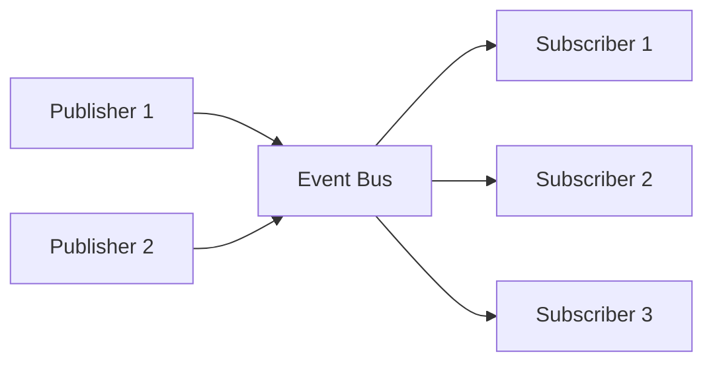

# How to Build an Event Bus with asyncio in Python

Author: [nawazdhandala](https://www.github.com/nawazdhandala)

Tags: Python, asyncio, Event Bus, Pub-Sub, Event-Driven Architecture, Concurrency, Design Patterns

Description: Learn how to build an async event bus in Python using asyncio. This guide covers event publishing, subscription management, error handling, and patterns for building decoupled event-driven systems.

---

> Tightly coupled components are hard to maintain. When your user service needs to notify the email service, analytics service, and audit service about a new signup, direct calls create a dependency nightmare. An event bus decouples these components by letting them communicate through events.

An event bus implements the publish-subscribe pattern. Publishers emit events without knowing who listens. Subscribers react to events without knowing who sent them. This separation makes systems easier to extend and test.

---

## Event Bus Architecture

Before diving into code, let's understand the components:



The event bus sits in the middle. Publishers send events to the bus. The bus routes events to interested subscribers. Publishers and subscribers never communicate directly.

---

## Basic Event Bus Implementation

Let's start with a minimal async event bus:

```python
# event_bus.py
import asyncio
from typing import Callable, Dict, List, Any, Coroutine
from dataclasses import dataclass, field
from datetime import datetime
import uuid
import logging

logger = logging.getLogger(__name__)


@dataclass
class Event:
    """Base class for all events"""
    event_type: str
    payload: Dict[str, Any]
    event_id: str = field(default_factory=lambda: str(uuid.uuid4()))
    timestamp: datetime = field(default_factory=datetime.utcnow)
    metadata: Dict[str, Any] = field(default_factory=dict)


# Type alias for event handlers
EventHandler = Callable[[Event], Coroutine[Any, Any, None]]


class EventBus:
    """Async event bus for publish-subscribe communication"""

    def __init__(self):
        # Map event types to list of handlers
        self._handlers: Dict[str, List[EventHandler]] = {}
        # Lock for thread-safe handler registration
        self._lock = asyncio.Lock()

    async def subscribe(self, event_type: str, handler: EventHandler) -> None:
        """Subscribe a handler to an event type"""
        async with self._lock:
            if event_type not in self._handlers:
                self._handlers[event_type] = []
            self._handlers[event_type].append(handler)
            logger.info(f"Handler subscribed to '{event_type}'")

    async def unsubscribe(self, event_type: str, handler: EventHandler) -> None:
        """Unsubscribe a handler from an event type"""
        async with self._lock:
            if event_type in self._handlers:
                self._handlers[event_type].remove(handler)
                logger.info(f"Handler unsubscribed from '{event_type}'")

    async def publish(self, event: Event) -> None:
        """Publish an event to all subscribed handlers"""
        handlers = self._handlers.get(event.event_type, [])

        if not handlers:
            logger.debug(f"No handlers for event type: {event.event_type}")
            return

        logger.info(f"Publishing event {event.event_id} ({event.event_type}) to {len(handlers)} handlers")

        # Run all handlers concurrently
        tasks = [handler(event) for handler in handlers]
        results = await asyncio.gather(*tasks, return_exceptions=True)

        # Log any errors
        for i, result in enumerate(results):
            if isinstance(result, Exception):
                logger.error(f"Handler error for event {event.event_id}: {result}")

    def publish_sync(self, event: Event) -> None:
        """Publish an event from synchronous code"""
        asyncio.create_task(self.publish(event))


# Singleton instance for application-wide event bus
_event_bus: EventBus = None


def get_event_bus() -> EventBus:
    """Get the global event bus instance"""
    global _event_bus
    if _event_bus is None:
        _event_bus = EventBus()
    return _event_bus
```

---

## Defining Event Types

Type safety helps catch errors early. Define your events as dataclasses:

```python
# events.py
from dataclasses import dataclass, field, asdict
from datetime import datetime
from typing import Optional, List
import uuid


@dataclass
class BaseEvent:
    """Base class with common event attributes"""
    event_id: str = field(default_factory=lambda: str(uuid.uuid4()))
    timestamp: datetime = field(default_factory=datetime.utcnow)

    def to_event(self) -> Event:
        """Convert to Event object for the bus"""
        return Event(
            event_type=self.__class__.__name__,
            payload=asdict(self),
            event_id=self.event_id,
            timestamp=self.timestamp
        )


@dataclass
class UserCreatedEvent(BaseEvent):
    """Emitted when a new user is created"""
    user_id: str = ""
    email: str = ""
    name: str = ""


@dataclass
class UserUpdatedEvent(BaseEvent):
    """Emitted when a user profile is updated"""
    user_id: str = ""
    changed_fields: List[str] = field(default_factory=list)


@dataclass
class OrderPlacedEvent(BaseEvent):
    """Emitted when an order is placed"""
    order_id: str = ""
    user_id: str = ""
    total_amount: float = 0.0
    items: List[dict] = field(default_factory=list)


@dataclass
class PaymentCompletedEvent(BaseEvent):
    """Emitted when payment is processed"""
    payment_id: str = ""
    order_id: str = ""
    amount: float = 0.0
    method: str = ""
```

---

## Creating Event Handlers

Handlers are async functions that process events. Group related handlers into service classes:

```python
# handlers.py
import logging
from typing import Dict, Any

logger = logging.getLogger(__name__)


class EmailService:
    """Handles email-related events"""

    async def on_user_created(self, event: Event) -> None:
        """Send welcome email when user is created"""
        payload = event.payload
        email = payload.get("email")
        name = payload.get("name")

        logger.info(f"Sending welcome email to {email}")
        # In reality, you would call your email API here
        await self._send_email(
            to=email,
            subject="Welcome!",
            body=f"Hello {name}, welcome to our platform!"
        )

    async def on_order_placed(self, event: Event) -> None:
        """Send order confirmation email"""
        payload = event.payload
        order_id = payload.get("order_id")
        user_id = payload.get("user_id")

        logger.info(f"Sending order confirmation for {order_id}")
        # Look up user email and send confirmation
        await self._send_order_confirmation(order_id, user_id)

    async def _send_email(self, to: str, subject: str, body: str) -> None:
        """Send an email (mock implementation)"""
        # Simulate async email sending
        await asyncio.sleep(0.1)
        logger.info(f"Email sent to {to}: {subject}")

    async def _send_order_confirmation(self, order_id: str, user_id: str) -> None:
        """Send order confirmation (mock implementation)"""
        await asyncio.sleep(0.1)
        logger.info(f"Order confirmation sent for {order_id}")


class AnalyticsService:
    """Handles analytics tracking events"""

    async def on_user_created(self, event: Event) -> None:
        """Track user signup in analytics"""
        payload = event.payload
        user_id = payload.get("user_id")

        logger.info(f"Tracking user signup: {user_id}")
        await self._track_event("user_signup", {"user_id": user_id})

    async def on_order_placed(self, event: Event) -> None:
        """Track order in analytics"""
        payload = event.payload

        logger.info(f"Tracking order: {payload.get('order_id')}")
        await self._track_event("order_placed", {
            "order_id": payload.get("order_id"),
            "amount": payload.get("total_amount"),
            "items_count": len(payload.get("items", []))
        })

    async def _track_event(self, event_name: str, properties: Dict[str, Any]) -> None:
        """Send event to analytics service (mock)"""
        await asyncio.sleep(0.05)
        logger.info(f"Analytics: {event_name} - {properties}")


class AuditService:
    """Handles audit logging for compliance"""

    async def on_any_event(self, event: Event) -> None:
        """Log all events for audit purposes"""
        logger.info(f"AUDIT: {event.event_type} - {event.event_id} at {event.timestamp}")
        await self._write_audit_log(event)

    async def _write_audit_log(self, event: Event) -> None:
        """Write to audit log (mock)"""
        await asyncio.sleep(0.01)
```

---

## Registering Handlers on Startup

Wire up your handlers when the application starts:

```python
# app_setup.py
import asyncio
from event_bus import get_event_bus
from handlers import EmailService, AnalyticsService, AuditService


async def setup_event_handlers() -> None:
    """Register all event handlers with the event bus"""
    bus = get_event_bus()

    # Initialize services
    email_service = EmailService()
    analytics_service = AnalyticsService()
    audit_service = AuditService()

    # Register handlers for UserCreatedEvent
    await bus.subscribe("UserCreatedEvent", email_service.on_user_created)
    await bus.subscribe("UserCreatedEvent", analytics_service.on_user_created)
    await bus.subscribe("UserCreatedEvent", audit_service.on_any_event)

    # Register handlers for OrderPlacedEvent
    await bus.subscribe("OrderPlacedEvent", email_service.on_order_placed)
    await bus.subscribe("OrderPlacedEvent", analytics_service.on_order_placed)
    await bus.subscribe("OrderPlacedEvent", audit_service.on_any_event)

    # Register handlers for PaymentCompletedEvent
    await bus.subscribe("PaymentCompletedEvent", audit_service.on_any_event)


async def main():
    # Setup handlers
    await setup_event_handlers()

    bus = get_event_bus()

    # Simulate user creation
    user_event = UserCreatedEvent(
        user_id="user-123",
        email="john@example.com",
        name="John Doe"
    )
    await bus.publish(user_event.to_event())

    # Simulate order placement
    order_event = OrderPlacedEvent(
        order_id="order-456",
        user_id="user-123",
        total_amount=99.99,
        items=[{"sku": "ITEM-1", "quantity": 2}]
    )
    await bus.publish(order_event.to_event())

    # Give handlers time to complete
    await asyncio.sleep(1)


if __name__ == "__main__":
    logging.basicConfig(level=logging.INFO)
    asyncio.run(main())
```

---

## Advanced Features: Retry and Dead Letter Queue

Production systems need retry logic and dead letter queues for failed events:

```python
# advanced_event_bus.py
import asyncio
from dataclasses import dataclass, field
from typing import Callable, Dict, List, Any, Coroutine, Optional
from datetime import datetime
import uuid
import logging

logger = logging.getLogger(__name__)


@dataclass
class EventEnvelope:
    """Wraps an event with delivery metadata"""
    event: Event
    attempt: int = 0
    max_attempts: int = 3
    last_error: Optional[str] = None
    first_attempt_at: datetime = field(default_factory=datetime.utcnow)


class AdvancedEventBus:
    """Event bus with retry logic and dead letter queue"""

    def __init__(
        self,
        max_retries: int = 3,
        retry_delay: float = 1.0,
        backoff_multiplier: float = 2.0
    ):
        self._handlers: Dict[str, List[EventHandler]] = {}
        self._lock = asyncio.Lock()
        self._dead_letter_queue: List[EventEnvelope] = []
        self._max_retries = max_retries
        self._retry_delay = retry_delay
        self._backoff_multiplier = backoff_multiplier

    async def subscribe(self, event_type: str, handler: EventHandler) -> None:
        """Subscribe a handler to an event type"""
        async with self._lock:
            if event_type not in self._handlers:
                self._handlers[event_type] = []
            self._handlers[event_type].append(handler)

    async def publish(self, event: Event) -> None:
        """Publish an event with retry support"""
        envelope = EventEnvelope(event=event, max_attempts=self._max_retries)
        await self._deliver(envelope)

    async def _deliver(self, envelope: EventEnvelope) -> None:
        """Attempt to deliver an event to all handlers"""
        handlers = self._handlers.get(envelope.event.event_type, [])

        for handler in handlers:
            await self._deliver_to_handler(envelope, handler)

    async def _deliver_to_handler(
        self,
        envelope: EventEnvelope,
        handler: EventHandler
    ) -> None:
        """Deliver event to a single handler with retry logic"""
        attempt = 0

        while attempt < envelope.max_attempts:
            try:
                await handler(envelope.event)
                return  # Success
            except Exception as e:
                attempt += 1
                envelope.attempt = attempt
                envelope.last_error = str(e)

                if attempt >= envelope.max_attempts:
                    # Move to dead letter queue
                    logger.error(
                        f"Event {envelope.event.event_id} failed after {attempt} attempts: {e}"
                    )
                    self._dead_letter_queue.append(envelope)
                else:
                    # Calculate delay with exponential backoff
                    delay = self._retry_delay * (self._backoff_multiplier ** (attempt - 1))
                    logger.warning(
                        f"Event {envelope.event.event_id} failed (attempt {attempt}), "
                        f"retrying in {delay}s: {e}"
                    )
                    await asyncio.sleep(delay)

    async def get_dead_letters(self) -> List[EventEnvelope]:
        """Get all events in the dead letter queue"""
        return self._dead_letter_queue.copy()

    async def retry_dead_letters(self) -> int:
        """Retry all events in the dead letter queue"""
        count = 0
        while self._dead_letter_queue:
            envelope = self._dead_letter_queue.pop(0)
            # Reset attempt count for retry
            envelope.attempt = 0
            await self._deliver(envelope)
            count += 1
        return count

    async def clear_dead_letters(self) -> int:
        """Clear the dead letter queue"""
        count = len(self._dead_letter_queue)
        self._dead_letter_queue.clear()
        return count
```

---

## Event Bus with Priority Queues

Sometimes certain events need to be processed before others:

```python
# priority_event_bus.py
import asyncio
from dataclasses import dataclass, field
from typing import Dict, List, Any
from enum import IntEnum
import heapq
import logging

logger = logging.getLogger(__name__)


class Priority(IntEnum):
    """Event priority levels (lower number = higher priority)"""
    CRITICAL = 0
    HIGH = 1
    NORMAL = 2
    LOW = 3


@dataclass(order=True)
class PrioritizedEvent:
    """Event wrapper for priority queue"""
    priority: int
    sequence: int  # Tie-breaker for same priority
    event: Event = field(compare=False)


class PriorityEventBus:
    """Event bus with priority-based processing"""

    def __init__(self, workers: int = 5):
        self._handlers: Dict[str, List[EventHandler]] = {}
        self._queue: List[PrioritizedEvent] = []
        self._sequence = 0
        self._lock = asyncio.Lock()
        self._workers = workers
        self._running = False
        self._worker_tasks: List[asyncio.Task] = []

    async def start(self) -> None:
        """Start worker tasks for processing events"""
        self._running = True
        self._worker_tasks = [
            asyncio.create_task(self._worker(i))
            for i in range(self._workers)
        ]
        logger.info(f"Started {self._workers} event workers")

    async def stop(self) -> None:
        """Stop all workers gracefully"""
        self._running = False
        for task in self._worker_tasks:
            task.cancel()
        await asyncio.gather(*self._worker_tasks, return_exceptions=True)
        logger.info("Event workers stopped")

    async def subscribe(self, event_type: str, handler: EventHandler) -> None:
        """Subscribe a handler"""
        async with self._lock:
            if event_type not in self._handlers:
                self._handlers[event_type] = []
            self._handlers[event_type].append(handler)

    async def publish(
        self,
        event: Event,
        priority: Priority = Priority.NORMAL
    ) -> None:
        """Publish an event with a priority"""
        async with self._lock:
            self._sequence += 1
            prioritized = PrioritizedEvent(
                priority=priority,
                sequence=self._sequence,
                event=event
            )
            heapq.heappush(self._queue, prioritized)

    async def _worker(self, worker_id: int) -> None:
        """Worker task that processes events from the queue"""
        while self._running:
            try:
                async with self._lock:
                    if not self._queue:
                        await asyncio.sleep(0.01)
                        continue
                    prioritized = heapq.heappop(self._queue)

                event = prioritized.event
                handlers = self._handlers.get(event.event_type, [])

                for handler in handlers:
                    try:
                        await handler(event)
                    except Exception as e:
                        logger.error(f"Worker {worker_id} handler error: {e}")

            except asyncio.CancelledError:
                break
            except Exception as e:
                logger.error(f"Worker {worker_id} error: {e}")
                await asyncio.sleep(0.1)


# Usage example
async def priority_example():
    bus = PriorityEventBus(workers=3)
    await bus.start()

    async def handle_event(event: Event):
        logger.info(f"Processing: {event.event_type}")

    await bus.subscribe("LowPriorityEvent", handle_event)
    await bus.subscribe("CriticalEvent", handle_event)

    # Publish events with different priorities
    await bus.publish(
        Event(event_type="LowPriorityEvent", payload={}),
        priority=Priority.LOW
    )
    await bus.publish(
        Event(event_type="CriticalEvent", payload={}),
        priority=Priority.CRITICAL
    )

    # Critical event will be processed first despite being published second

    await asyncio.sleep(1)
    await bus.stop()
```

---

## FastAPI Integration

Here is how to integrate the event bus with FastAPI:

```python
# fastapi_integration.py
from fastapi import FastAPI, Depends
from contextlib import asynccontextmanager
from event_bus import EventBus, Event, get_event_bus
from handlers import EmailService, AnalyticsService

# Application lifespan management
@asynccontextmanager
async def lifespan(app: FastAPI):
    # Startup: register handlers
    bus = get_event_bus()
    email_service = EmailService()
    analytics_service = AnalyticsService()

    await bus.subscribe("UserCreatedEvent", email_service.on_user_created)
    await bus.subscribe("UserCreatedEvent", analytics_service.on_user_created)
    await bus.subscribe("OrderPlacedEvent", email_service.on_order_placed)
    await bus.subscribe("OrderPlacedEvent", analytics_service.on_order_placed)

    print("Event handlers registered")
    yield
    # Shutdown: cleanup if needed
    print("Shutting down event bus")


app = FastAPI(lifespan=lifespan)


def get_bus() -> EventBus:
    """Dependency for getting event bus"""
    return get_event_bus()


@app.post("/users")
async def create_user(
    name: str,
    email: str,
    bus: EventBus = Depends(get_bus)
):
    # Create user in database
    user_id = "user-" + str(uuid.uuid4())[:8]

    # Publish event
    event = UserCreatedEvent(
        user_id=user_id,
        email=email,
        name=name
    )
    await bus.publish(event.to_event())

    return {"user_id": user_id, "name": name, "email": email}


@app.post("/orders")
async def create_order(
    user_id: str,
    total: float,
    bus: EventBus = Depends(get_bus)
):
    # Create order in database
    order_id = "order-" + str(uuid.uuid4())[:8]

    # Publish event
    event = OrderPlacedEvent(
        order_id=order_id,
        user_id=user_id,
        total_amount=total,
        items=[]
    )
    await bus.publish(event.to_event())

    return {"order_id": order_id, "user_id": user_id, "total": total}
```

---

## Best Practices

**1. Keep handlers idempotent:**
Events might be delivered multiple times. Handlers should handle duplicate events gracefully.

**2. Use event versioning:**
```python
@dataclass
class UserCreatedEventV2(BaseEvent):
    version: str = "2.0"
    user_id: str = ""
    email: str = ""
    name: str = ""
    source: str = ""  # New field in v2
```

**3. Add correlation IDs for tracing:**
```python
@dataclass
class Event:
    correlation_id: str = field(default_factory=lambda: str(uuid.uuid4()))
```

**4. Set timeouts for handlers:**
```python
async def _deliver_to_handler(self, envelope, handler):
    try:
        await asyncio.wait_for(handler(envelope.event), timeout=30.0)
    except asyncio.TimeoutError:
        logger.error(f"Handler timed out for event {envelope.event.event_id}")
```

---

## Conclusion

An async event bus decouples your application components and makes your system more maintainable. Key points to remember:

- Use dataclasses for type-safe event definitions
- Register handlers at application startup
- Add retry logic and dead letter queues for production
- Keep handlers idempotent to handle duplicate deliveries
- Consider priority queues for time-sensitive events

For distributed systems, consider using Redis Pub/Sub or a message broker like RabbitMQ for cross-process event delivery.

---

*Need to monitor your event-driven architecture? [OneUptime](https://oneuptime.com) provides distributed tracing and event monitoring to help you track events across your microservices.*

**Related Reading:**
- [How to Implement Distributed Tracing in Python Microservices](https://oneuptime.com/blog/post/2025-01-06-python-distributed-tracing-microservices/view)
