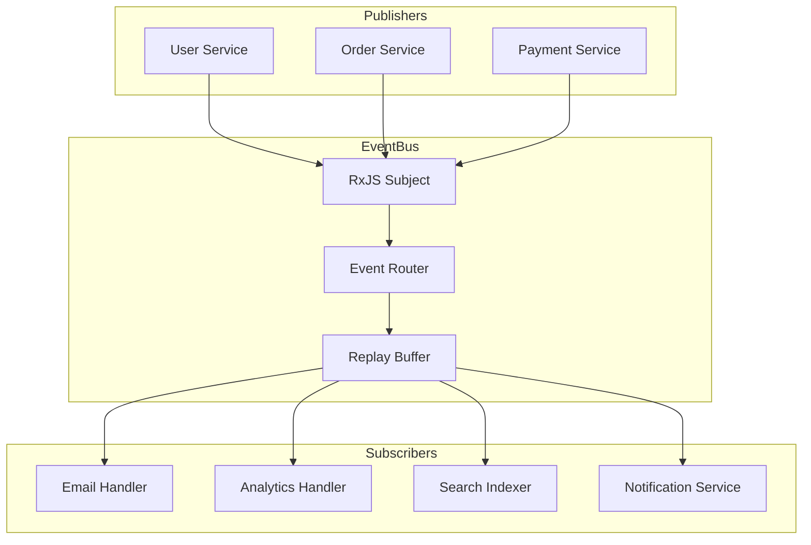

# How to Build an Event Bus with TypeScript and RxJS

Author: [nawazdhandala](https://www.github.com/nawazdhandala)

Tags: NodeJS, TypeScript, RxJS, Events, Architecture, Design Patterns, Reactive Programming

Description: Learn how to build a type-safe event bus in TypeScript using RxJS, with support for event filtering, replay, error handling, and cross-service communication.

---

Event-driven architecture decouples components by having them communicate through events rather than direct calls. An event bus serves as the central hub for publishing and subscribing to events. RxJS provides powerful primitives for building a robust event bus with features like filtering, buffering, and replay. This guide shows how to build a production-ready event bus with TypeScript and RxJS.

## Why RxJS for an Event Bus?

RxJS (Reactive Extensions for JavaScript) offers several advantages over simple EventEmitter:

| Feature | EventEmitter | RxJS |
|---------|--------------|------|
| Type safety | Weak | Strong with generics |
| Operators | None | 100+ built-in |
| Replay/buffer | Manual | Built-in |
| Backpressure | No | Yes |
| Completion | No | Yes |
| Error propagation | Basic | Sophisticated |

## Project Setup

```bash
# Install RxJS
npm install rxjs

# TypeScript configuration should have strict mode enabled
```

## Event Type Definitions

Start by defining a type-safe event system. We use a generic approach where event types map to their payload types.

```typescript
// src/events/event-types.ts
// Define all events in your system with their payload types
// This provides compile-time safety when publishing and subscribing

export interface UserCreatedEvent {
  type: 'user.created';
  payload: {
    userId: string;
    email: string;
    createdAt: Date;
  };
}

export interface UserUpdatedEvent {
  type: 'user.updated';
  payload: {
    userId: string;
    changes: Record<string, unknown>;
    updatedAt: Date;
  };
}

export interface UserDeletedEvent {
  type: 'user.deleted';
  payload: {
    userId: string;
    deletedAt: Date;
  };
}

export interface OrderCreatedEvent {
  type: 'order.created';
  payload: {
    orderId: string;
    userId: string;
    items: Array<{ productId: string; quantity: number }>;
    total: number;
  };
}

export interface OrderCompletedEvent {
  type: 'order.completed';
  payload: {
    orderId: string;
    completedAt: Date;
  };
}

// Union type of all events
export type AppEvent =
  | UserCreatedEvent
  | UserUpdatedEvent
  | UserDeletedEvent
  | OrderCreatedEvent
  | OrderCompletedEvent;

// Extract event type strings
export type EventType = AppEvent['type'];

// Map event type to event interface
export type EventByType<T extends EventType> = Extract<AppEvent, { type: T }>;

// Extract payload type from event type
export type EventPayload<T extends EventType> = EventByType<T>['payload'];
```

## Base Event Bus Implementation

The core event bus uses an RxJS Subject to broadcast events to all subscribers.

```typescript
// src/events/event-bus.ts
import { Subject, Observable, filter, map, takeUntil, share } from 'rxjs';
import { AppEvent, EventType, EventByType, EventPayload } from './event-types';

// Metadata attached to every event
export interface EventMetadata {
  eventId: string;
  timestamp: Date;
  source: string;
  correlationId?: string;
  causationId?: string;
}

// Internal event wrapper with metadata
export interface EventEnvelope<T extends AppEvent = AppEvent> {
  event: T;
  metadata: EventMetadata;
}

// Event bus implementation using RxJS Subject
// Provides type-safe publishing and subscribing
export class EventBus {
  private subject = new Subject<EventEnvelope>();
  private destroy$ = new Subject<void>();

  // Shared observable for all events
  // Using share() prevents multiple subscriptions from creating multiple streams
  private events$ = this.subject.asObservable().pipe(
    takeUntil(this.destroy$),
    share()
  );

  constructor(private source: string = 'default') {}

  // Publish an event with automatic metadata generation
  publish<T extends EventType>(
    type: T,
    payload: EventPayload<T>,
    options?: {
      correlationId?: string;
      causationId?: string;
    }
  ): void {
    const event = { type, payload } as EventByType<T>;

    const metadata: EventMetadata = {
      eventId: this.generateEventId(),
      timestamp: new Date(),
      source: this.source,
      correlationId: options?.correlationId,
      causationId: options?.causationId,
    };

    this.subject.next({ event, metadata });
  }

  // Subscribe to all events
  subscribeAll(): Observable<EventEnvelope> {
    return this.events$;
  }

  // Subscribe to a specific event type with full type safety
  subscribe<T extends EventType>(
    type: T
  ): Observable<EventEnvelope<EventByType<T>>> {
    return this.events$.pipe(
      filter((envelope): envelope is EventEnvelope<EventByType<T>> =>
        envelope.event.type === type
      )
    );
  }

  // Subscribe to multiple event types
  subscribeMany<T extends EventType>(
    types: T[]
  ): Observable<EventEnvelope<EventByType<T>>> {
    return this.events$.pipe(
      filter((envelope): envelope is EventEnvelope<EventByType<T>> =>
        types.includes(envelope.event.type as T)
      )
    );
  }

  // Subscribe with a custom filter
  subscribeWhere(
    predicate: (envelope: EventEnvelope) => boolean
  ): Observable<EventEnvelope> {
    return this.events$.pipe(filter(predicate));
  }

  // Get just the payload for a specific event type
  on<T extends EventType>(type: T): Observable<EventPayload<T>> {
    return this.subscribe(type).pipe(
      map(envelope => envelope.event.payload)
    );
  }

  private generateEventId(): string {
    return `${Date.now()}-${Math.random().toString(36).substring(2, 15)}`;
  }

  // Cleanup subscriptions
  destroy(): void {
    this.destroy$.next();
    this.destroy$.complete();
    this.subject.complete();
  }
}
```

## Event Bus with Replay

Sometimes subscribers need to receive events that were published before they subscribed. A ReplaySubject handles this.

```typescript
// src/events/replay-event-bus.ts
import { ReplaySubject, Observable, filter, takeUntil, share } from 'rxjs';
import { EventEnvelope, EventMetadata } from './event-bus';
import { AppEvent, EventType, EventByType, EventPayload } from './event-types';

// Event bus that replays recent events to new subscribers
// Useful for late-joining components that need historical context
export class ReplayEventBus {
  private subject: ReplaySubject<EventEnvelope>;
  private destroy$ = new ReplaySubject<void>(1);
  private events$: Observable<EventEnvelope>;

  constructor(
    private source: string = 'default',
    private bufferSize: number = 100,
    private windowTime?: number  // Optional time window in ms
  ) {
    // ReplaySubject buffers events and replays them to new subscribers
    this.subject = windowTime
      ? new ReplaySubject<EventEnvelope>(bufferSize, windowTime)
      : new ReplaySubject<EventEnvelope>(bufferSize);

    this.events$ = this.subject.asObservable().pipe(
      takeUntil(this.destroy$),
      share()
    );
  }

  publish<T extends EventType>(
    type: T,
    payload: EventPayload<T>,
    options?: { correlationId?: string; causationId?: string }
  ): void {
    const event = { type, payload } as EventByType<T>;

    const metadata: EventMetadata = {
      eventId: `${Date.now()}-${Math.random().toString(36).substring(2, 15)}`,
      timestamp: new Date(),
      source: this.source,
      correlationId: options?.correlationId,
      causationId: options?.causationId,
    };

    this.subject.next({ event, metadata });
  }

  subscribe<T extends EventType>(
    type: T
  ): Observable<EventEnvelope<EventByType<T>>> {
    return this.events$.pipe(
      filter((envelope): envelope is EventEnvelope<EventByType<T>> =>
        envelope.event.type === type
      )
    );
  }

  // Get buffer contents synchronously
  getBufferedEvents(): EventEnvelope[] {
    const events: EventEnvelope[] = [];
    // Create a subscription that immediately completes after collecting buffered events
    this.subject.subscribe(event => events.push(event)).unsubscribe();
    return events;
  }

  destroy(): void {
    this.destroy$.next();
    this.destroy$.complete();
    this.subject.complete();
  }
}
```

## Typed Event Handlers

Create a handler registration system that ensures type safety.

```typescript
// src/events/event-handler.ts
import { Subscription } from 'rxjs';
import { EventBus, EventEnvelope } from './event-bus';
import { EventType, EventByType, EventPayload } from './event-types';

// Handler function signature
type EventHandler<T extends EventType> = (
  payload: EventPayload<T>,
  metadata: EventEnvelope<EventByType<T>>['metadata']
) => void | Promise<void>;

// Registration for cleanup
interface HandlerRegistration {
  eventType: EventType;
  handler: EventHandler<any>;
  subscription: Subscription;
}

// Event handler registry with automatic subscription management
// Provides a cleaner API for registering multiple handlers
export class EventHandlerRegistry {
  private handlers: HandlerRegistration[] = [];

  constructor(private eventBus: EventBus) {}

  // Register a handler for a specific event type
  on<T extends EventType>(
    type: T,
    handler: EventHandler<T>
  ): this {
    const subscription = this.eventBus.subscribe(type).subscribe({
      next: async (envelope) => {
        try {
          await handler(envelope.event.payload, envelope.metadata);
        } catch (error) {
          console.error(`Error in handler for ${type}:`, error);
        }
      },
    });

    this.handlers.push({
      eventType: type,
      handler,
      subscription,
    });

    return this;
  }

  // Register handlers for multiple events at once
  onMany<T extends EventType>(
    types: T[],
    handler: EventHandler<T>
  ): this {
    for (const type of types) {
      this.on(type, handler);
    }
    return this;
  }

  // Unregister all handlers for a specific event type
  off(type: EventType): void {
    const handlersToRemove = this.handlers.filter(h => h.eventType === type);

    for (const handler of handlersToRemove) {
      handler.subscription.unsubscribe();
    }

    this.handlers = this.handlers.filter(h => h.eventType !== type);
  }

  // Unregister all handlers
  clear(): void {
    for (const handler of this.handlers) {
      handler.subscription.unsubscribe();
    }
    this.handlers = [];
  }
}
```

## Event Bus with Error Handling

Add robust error handling that prevents one failing subscriber from affecting others.

```typescript
// src/events/safe-event-bus.ts
import { Subject, Observable, filter, takeUntil, share, retry, catchError } from 'rxjs';
import { EMPTY } from 'rxjs';
import { EventEnvelope, EventMetadata } from './event-bus';
import { AppEvent, EventType, EventByType, EventPayload } from './event-types';

export interface ErrorHandler {
  (error: Error, envelope: EventEnvelope): void;
}

// Event bus with built-in error handling and retry logic
export class SafeEventBus {
  private subject = new Subject<EventEnvelope>();
  private destroy$ = new Subject<void>();
  private events$: Observable<EventEnvelope>;
  private errorHandler: ErrorHandler;

  constructor(
    private source: string = 'default',
    errorHandler?: ErrorHandler
  ) {
    this.errorHandler = errorHandler || ((error, envelope) => {
      console.error(`Event processing error for ${envelope.event.type}:`, error);
    });

    this.events$ = this.subject.asObservable().pipe(
      takeUntil(this.destroy$),
      share()
    );
  }

  publish<T extends EventType>(
    type: T,
    payload: EventPayload<T>,
    options?: { correlationId?: string; causationId?: string }
  ): void {
    const event = { type, payload } as EventByType<T>;

    const metadata: EventMetadata = {
      eventId: `${Date.now()}-${Math.random().toString(36).substring(2, 15)}`,
      timestamp: new Date(),
      source: this.source,
      correlationId: options?.correlationId,
      causationId: options?.causationId,
    };

    this.subject.next({ event, metadata });
  }

  // Subscribe with automatic retry on errors
  subscribeWithRetry<T extends EventType>(
    type: T,
    handler: (envelope: EventEnvelope<EventByType<T>>) => Promise<void>,
    retryCount: number = 3
  ): Observable<void> {
    return this.events$.pipe(
      filter((envelope): envelope is EventEnvelope<EventByType<T>> =>
        envelope.event.type === type
      ),
      // Process each event
      map(envelope => ({
        envelope,
        process: async () => {
          await handler(envelope);
        },
      })),
      // Retry on failure
      concatMap(({ envelope, process }) =>
        from(process()).pipe(
          retry({
            count: retryCount,
            delay: (error, retryCount) => {
              console.log(`Retry ${retryCount} for event ${envelope.metadata.eventId}`);
              return timer(1000 * Math.pow(2, retryCount - 1));
            },
          }),
          catchError(error => {
            this.errorHandler(error, envelope);
            return EMPTY;
          })
        )
      )
    );
  }

  // Subscribe with dead letter queue for failed events
  subscribeWithDLQ<T extends EventType>(
    type: T,
    handler: (envelope: EventEnvelope<EventByType<T>>) => Promise<void>,
    dlqHandler: (envelope: EventEnvelope<EventByType<T>>, error: Error) => void
  ): Subscription {
    return this.events$.pipe(
      filter((envelope): envelope is EventEnvelope<EventByType<T>> =>
        envelope.event.type === type
      )
    ).subscribe({
      next: async (envelope) => {
        try {
          await handler(envelope);
        } catch (error) {
          dlqHandler(envelope, error instanceof Error ? error : new Error(String(error)));
        }
      },
    });
  }

  destroy(): void {
    this.destroy$.next();
    this.destroy$.complete();
    this.subject.complete();
  }
}

import { map, concatMap, from, timer, Subscription } from 'rxjs';
```

## Event Aggregation

RxJS operators enable powerful event aggregation patterns.

```typescript
// src/events/event-aggregator.ts
import {
  Observable,
  bufferTime,
  bufferCount,
  groupBy,
  mergeMap,
  scan,
  distinctUntilChanged,
  debounceTime,
  throttleTime,
  map
} from 'rxjs';
import { EventBus, EventEnvelope } from './event-bus';
import { EventType, EventByType } from './event-types';

// Aggregation utilities for event streams
export class EventAggregator {
  constructor(private eventBus: EventBus) {}

  // Buffer events by time window
  // Useful for batch processing
  bufferByTime<T extends EventType>(
    type: T,
    timeMs: number
  ): Observable<EventEnvelope<EventByType<T>>[]> {
    return this.eventBus.subscribe(type).pipe(
      bufferTime(timeMs),
      // Only emit non-empty buffers
      filter(buffer => buffer.length > 0)
    );
  }

  // Buffer events by count
  bufferByCount<T extends EventType>(
    type: T,
    count: number
  ): Observable<EventEnvelope<EventByType<T>>[]> {
    return this.eventBus.subscribe(type).pipe(
      bufferCount(count)
    );
  }

  // Group events by a key extractor
  groupBy<T extends EventType, K>(
    type: T,
    keySelector: (envelope: EventEnvelope<EventByType<T>>) => K
  ): Observable<{ key: K; events: Observable<EventEnvelope<EventByType<T>>> }> {
    return this.eventBus.subscribe(type).pipe(
      groupBy(keySelector),
      map(group => ({
        key: group.key,
        events: group.asObservable(),
      }))
    );
  }

  // Aggregate running statistics
  aggregate<T extends EventType, A>(
    type: T,
    initialValue: A,
    accumulator: (acc: A, event: EventEnvelope<EventByType<T>>) => A
  ): Observable<A> {
    return this.eventBus.subscribe(type).pipe(
      scan(accumulator, initialValue)
    );
  }

  // Debounce rapid events
  debounce<T extends EventType>(
    type: T,
    timeMs: number
  ): Observable<EventEnvelope<EventByType<T>>> {
    return this.eventBus.subscribe(type).pipe(
      debounceTime(timeMs)
    );
  }

  // Throttle high-frequency events
  throttle<T extends EventType>(
    type: T,
    timeMs: number
  ): Observable<EventEnvelope<EventByType<T>>> {
    return this.eventBus.subscribe(type).pipe(
      throttleTime(timeMs)
    );
  }

  // Emit only when a specific field changes
  distinctBy<T extends EventType, V>(
    type: T,
    selector: (envelope: EventEnvelope<EventByType<T>>) => V
  ): Observable<EventEnvelope<EventByType<T>>> {
    return this.eventBus.subscribe(type).pipe(
      distinctUntilChanged((prev, curr) =>
        selector(prev) === selector(curr)
      )
    );
  }
}

import { filter } from 'rxjs';
```

## Usage Examples

Here is how to use the event bus in practice.

```typescript
// src/example/usage.ts
import { EventBus } from '../events/event-bus';
import { EventHandlerRegistry } from '../events/event-handler';
import { EventAggregator } from '../events/event-aggregator';

// Create the event bus
const eventBus = new EventBus('main-service');

// Register handlers using the registry
const handlers = new EventHandlerRegistry(eventBus);

handlers
  .on('user.created', async (payload, metadata) => {
    console.log(`User created: ${payload.email}`);
    // Send welcome email
    await sendWelcomeEmail(payload.userId, payload.email);
  })
  .on('user.created', async (payload, metadata) => {
    // Create analytics entry
    await trackUserSignup(payload.userId, metadata.timestamp);
  })
  .on('order.created', async (payload, metadata) => {
    console.log(`Order ${payload.orderId} created for user ${payload.userId}`);
    // Process payment
    await processPayment(payload.orderId, payload.total);
  });

// Publish events from your application code
eventBus.publish('user.created', {
  userId: 'user-123',
  email: 'john@example.com',
  createdAt: new Date(),
});

// Use aggregation for analytics
const aggregator = new EventAggregator(eventBus);

// Count orders in 1-minute windows
aggregator.aggregate(
  'order.created',
  { count: 0, total: 0 },
  (acc, envelope) => ({
    count: acc.count + 1,
    total: acc.total + envelope.event.payload.total,
  })
).subscribe(stats => {
  console.log(`Running totals: ${stats.count} orders, $${stats.total}`);
});

// Batch user events for bulk processing
aggregator.bufferByTime('user.updated', 5000).subscribe(events => {
  console.log(`Processing ${events.length} user updates`);
  // Bulk update search index
});

// Cleanup functions
async function sendWelcomeEmail(userId: string, email: string): Promise<void> {}
async function trackUserSignup(userId: string, timestamp: Date): Promise<void> {}
async function processPayment(orderId: string, total: number): Promise<void> {}
```

## Testing Event Handlers

Test event handlers by creating isolated event bus instances.

```typescript
// src/example/event-bus.test.ts
import { EventBus } from '../events/event-bus';
import { firstValueFrom, take, toArray } from 'rxjs';

describe('EventBus', () => {
  let eventBus: EventBus;

  beforeEach(() => {
    eventBus = new EventBus('test');
  });

  afterEach(() => {
    eventBus.destroy();
  });

  it('should publish and receive events', async () => {
    const received = firstValueFrom(eventBus.subscribe('user.created'));

    eventBus.publish('user.created', {
      userId: 'test-user',
      email: 'test@example.com',
      createdAt: new Date(),
    });

    const envelope = await received;
    expect(envelope.event.payload.userId).toBe('test-user');
    expect(envelope.metadata.source).toBe('test');
  });

  it('should filter events by type', async () => {
    const userEvents = eventBus.subscribe('user.created').pipe(
      take(2),
      toArray()
    );

    eventBus.publish('order.created', {
      orderId: 'order-1',
      userId: 'user-1',
      items: [],
      total: 100,
    });

    eventBus.publish('user.created', {
      userId: 'user-1',
      email: 'a@example.com',
      createdAt: new Date(),
    });

    eventBus.publish('user.created', {
      userId: 'user-2',
      email: 'b@example.com',
      createdAt: new Date(),
    });

    const events = await firstValueFrom(userEvents);
    expect(events).toHaveLength(2);
    expect(events[0].event.payload.userId).toBe('user-1');
    expect(events[1].event.payload.userId).toBe('user-2');
  });

  it('should include correlation ID in metadata', async () => {
    const received = firstValueFrom(eventBus.subscribe('user.created'));

    eventBus.publish('user.created', {
      userId: 'test-user',
      email: 'test@example.com',
      createdAt: new Date(),
    }, {
      correlationId: 'request-123',
    });

    const envelope = await received;
    expect(envelope.metadata.correlationId).toBe('request-123');
  });
});
```

## Architecture Diagram



## Summary

| Pattern | Use Case | RxJS Operator |
|---------|----------|---------------|
| Type-safe events | Compile-time checks | Generics + filter |
| Replay | Late subscribers | ReplaySubject |
| Buffering | Batch processing | bufferTime, bufferCount |
| Throttling | Rate limiting | throttleTime |
| Debouncing | Coalescing rapid events | debounceTime |
| Aggregation | Running statistics | scan |
| Grouping | Per-entity streams | groupBy |

Building an event bus with RxJS gives you a powerful foundation for event-driven architecture. The type safety ensures events are published and consumed correctly. RxJS operators provide sophisticated event processing without custom code. Start simple and add features like replay and error handling as your needs grow.
