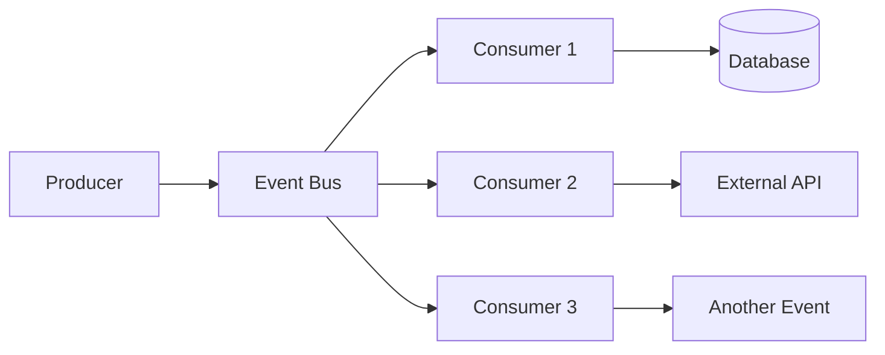

# How to Implement Event-Driven Testing

Author: [nawazdhandala](https://github.com/nawazdhandala)

Tags: Event-Driven Architecture, Testing, Kafka, Message Queue, DevOps

Description: Learn to test event-driven systems effectively, including event schema validation, consumer testing, saga pattern verification, and end-to-end event flow testing.

---

Event-driven architectures bring testing challenges that traditional request-response systems do not have. Events are asynchronous, consumers may process events out of order, and failures can be hard to trace. This guide covers testing strategies specifically designed for event-driven systems.

## Event-Driven Testing Challenges



Testing becomes complex because:
- Events are asynchronous
- Multiple consumers react to the same event
- Order is not guaranteed
- Failures may be silent

## Event Schema Testing

Validate event schemas match contracts:

```typescript
// event-schema.test.ts
import Ajv from 'ajv';
import addFormats from 'ajv-formats';

// Define event schemas
const eventSchemas = {
    'order.created': {
        type: 'object',
        required: ['eventId', 'eventType', 'timestamp', 'payload'],
        properties: {
            eventId: { type: 'string', format: 'uuid' },
            eventType: { const: 'order.created' },
            timestamp: { type: 'string', format: 'date-time' },
            payload: {
                type: 'object',
                required: ['orderId', 'userId', 'items', 'total'],
                properties: {
                    orderId: { type: 'string', format: 'uuid' },
                    userId: { type: 'string', format: 'uuid' },
                    items: {
                        type: 'array',
                        items: {
                            type: 'object',
                            required: ['productId', 'quantity', 'price'],
                            properties: {
                                productId: { type: 'string' },
                                quantity: { type: 'integer', minimum: 1 },
                                price: { type: 'number', minimum: 0 },
                            },
                        },
                    },
                    total: { type: 'number', minimum: 0 },
                },
            },
        },
    },
    'order.shipped': {
        type: 'object',
        required: ['eventId', 'eventType', 'timestamp', 'payload'],
        properties: {
            eventId: { type: 'string', format: 'uuid' },
            eventType: { const: 'order.shipped' },
            timestamp: { type: 'string', format: 'date-time' },
            payload: {
                type: 'object',
                required: ['orderId', 'trackingNumber', 'carrier'],
                properties: {
                    orderId: { type: 'string', format: 'uuid' },
                    trackingNumber: { type: 'string' },
                    carrier: { type: 'string' },
                    estimatedDelivery: { type: 'string', format: 'date' },
                },
            },
        },
    },
};

describe('Event Schema Validation', () => {
    const ajv = new Ajv({ allErrors: true });
    addFormats(ajv);

    test('order.created event matches schema', () => {
        const validate = ajv.compile(eventSchemas['order.created']);

        const validEvent = {
            eventId: '550e8400-e29b-41d4-a716-446655440000',
            eventType: 'order.created',
            timestamp: '2024-01-25T10:30:00Z',
            payload: {
                orderId: '550e8400-e29b-41d4-a716-446655440001',
                userId: '550e8400-e29b-41d4-a716-446655440002',
                items: [
                    { productId: 'PROD-001', quantity: 2, price: 29.99 },
                ],
                total: 59.98,
            },
        };

        expect(validate(validEvent)).toBe(true);
    });

    test('rejects invalid order.created event', () => {
        const validate = ajv.compile(eventSchemas['order.created']);

        const invalidEvent = {
            eventId: '550e8400-e29b-41d4-a716-446655440000',
            eventType: 'order.created',
            timestamp: '2024-01-25T10:30:00Z',
            payload: {
                orderId: '550e8400-e29b-41d4-a716-446655440001',
                // Missing userId
                items: [],
                total: -10, // Negative total
            },
        };

        expect(validate(invalidEvent)).toBe(false);
        expect(validate.errors).toContainEqual(
            expect.objectContaining({ keyword: 'required' })
        );
    });
});
```

## Producer Testing

Test that services produce correct events:

```typescript
// order-producer.test.ts
import { OrderService } from '../services/order.service';
import { EventBus } from '../events/event-bus';

// Mock event bus to capture published events
class MockEventBus implements EventBus {
    public publishedEvents: Array<{ topic: string; event: any }> = [];

    async publish(topic: string, event: any): Promise<void> {
        this.publishedEvents.push({ topic, event });
    }

    getEvents(topic: string) {
        return this.publishedEvents.filter(e => e.topic === topic);
    }

    clear() {
        this.publishedEvents = [];
    }
}

describe('Order Producer', () => {
    let orderService: OrderService;
    let mockEventBus: MockEventBus;

    beforeEach(() => {
        mockEventBus = new MockEventBus();
        orderService = new OrderService(mockEventBus);
    });

    test('publishes order.created event when order is created', async () => {
        const orderRequest = {
            userId: 'user-123',
            items: [
                { productId: 'prod-1', quantity: 2, price: 10.00 },
            ],
        };

        const order = await orderService.createOrder(orderRequest);

        // Verify event was published
        const events = mockEventBus.getEvents('order.created');
        expect(events).toHaveLength(1);

        const event = events[0].event;
        expect(event.eventType).toBe('order.created');
        expect(event.payload.orderId).toBe(order.id);
        expect(event.payload.userId).toBe('user-123');
        expect(event.payload.total).toBe(20.00);
    });

    test('does not publish event on validation failure', async () => {
        const invalidRequest = {
            userId: 'user-123',
            items: [], // Empty items should fail validation
        };

        await expect(orderService.createOrder(invalidRequest))
            .rejects.toThrow('Order must have at least one item');

        expect(mockEventBus.publishedEvents).toHaveLength(0);
    });

    test('includes all required fields in event', async () => {
        const order = await orderService.createOrder({
            userId: 'user-123',
            items: [{ productId: 'prod-1', quantity: 1, price: 50.00 }],
        });

        const event = mockEventBus.publishedEvents[0].event;

        // Verify required fields
        expect(event).toHaveProperty('eventId');
        expect(event).toHaveProperty('eventType');
        expect(event).toHaveProperty('timestamp');
        expect(event).toHaveProperty('payload');

        // Verify payload fields
        expect(event.payload).toHaveProperty('orderId');
        expect(event.payload).toHaveProperty('userId');
        expect(event.payload).toHaveProperty('items');
        expect(event.payload).toHaveProperty('total');
    });
});
```

## Consumer Testing

Test event consumers in isolation:

```typescript
// inventory-consumer.test.ts
import { InventoryConsumer } from '../consumers/inventory.consumer';
import { InventoryService } from '../services/inventory.service';

describe('Inventory Consumer', () => {
    let consumer: InventoryConsumer;
    let mockInventoryService: jest.Mocked<InventoryService>;

    beforeEach(() => {
        mockInventoryService = {
            reserveStock: jest.fn(),
            releaseStock: jest.fn(),
            getStock: jest.fn(),
        } as any;

        consumer = new InventoryConsumer(mockInventoryService);
    });

    test('reserves inventory on order.created event', async () => {
        const event = {
            eventId: 'evt-123',
            eventType: 'order.created',
            timestamp: new Date().toISOString(),
            payload: {
                orderId: 'order-123',
                userId: 'user-123',
                items: [
                    { productId: 'prod-1', quantity: 2, price: 10 },
                    { productId: 'prod-2', quantity: 1, price: 20 },
                ],
                total: 40,
            },
        };

        await consumer.handleOrderCreated(event);

        expect(mockInventoryService.reserveStock).toHaveBeenCalledTimes(2);
        expect(mockInventoryService.reserveStock).toHaveBeenCalledWith(
            'prod-1',
            2,
            'order-123'
        );
        expect(mockInventoryService.reserveStock).toHaveBeenCalledWith(
            'prod-2',
            1,
            'order-123'
        );
    });

    test('handles insufficient stock gracefully', async () => {
        mockInventoryService.reserveStock.mockRejectedValueOnce(
            new Error('Insufficient stock')
        );

        const event = {
            eventId: 'evt-123',
            eventType: 'order.created',
            timestamp: new Date().toISOString(),
            payload: {
                orderId: 'order-123',
                userId: 'user-123',
                items: [{ productId: 'prod-1', quantity: 100, price: 10 }],
                total: 1000,
            },
        };

        // Should not throw, but should handle the error
        await expect(consumer.handleOrderCreated(event)).resolves.not.toThrow();

        // Verify compensation logic was triggered
        expect(mockInventoryService.releaseStock).not.toHaveBeenCalled();
    });

    test('is idempotent for duplicate events', async () => {
        const event = {
            eventId: 'evt-123',
            eventType: 'order.created',
            timestamp: new Date().toISOString(),
            payload: {
                orderId: 'order-123',
                userId: 'user-123',
                items: [{ productId: 'prod-1', quantity: 1, price: 10 }],
                total: 10,
            },
        };

        // Process same event twice
        await consumer.handleOrderCreated(event);
        await consumer.handleOrderCreated(event);

        // Should only reserve once due to idempotency check
        expect(mockInventoryService.reserveStock).toHaveBeenCalledTimes(1);
    });
});
```

## Saga Testing

Test distributed transactions with saga patterns:

```typescript
// order-saga.test.ts
import { OrderSaga } from '../sagas/order.saga';
import { EventBus } from '../events/event-bus';

class TestEventBus implements EventBus {
    private handlers: Map<string, Function[]> = new Map();
    public publishedEvents: any[] = [];

    on(topic: string, handler: Function) {
        const handlers = this.handlers.get(topic) || [];
        handlers.push(handler);
        this.handlers.set(topic, handlers);
    }

    async publish(topic: string, event: any) {
        this.publishedEvents.push({ topic, event });

        // Simulate async event delivery
        const handlers = this.handlers.get(topic) || [];
        for (const handler of handlers) {
            await handler(event);
        }
    }

    getPublished(topic: string) {
        return this.publishedEvents.filter(e => e.topic === topic);
    }
}

describe('Order Saga', () => {
    let saga: OrderSaga;
    let eventBus: TestEventBus;

    beforeEach(() => {
        eventBus = new TestEventBus();
        saga = new OrderSaga(eventBus);
        saga.start();
    });

    test('completes successfully when all steps succeed', async () => {
        // Trigger saga
        await eventBus.publish('order.created', {
            eventId: 'evt-1',
            payload: { orderId: 'order-123', userId: 'user-123', total: 100 },
        });

        // Simulate inventory reserved
        await eventBus.publish('inventory.reserved', {
            eventId: 'evt-2',
            payload: { orderId: 'order-123' },
        });

        // Simulate payment processed
        await eventBus.publish('payment.processed', {
            eventId: 'evt-3',
            payload: { orderId: 'order-123' },
        });

        // Verify order.confirmed was published
        const confirmedEvents = eventBus.getPublished('order.confirmed');
        expect(confirmedEvents).toHaveLength(1);
        expect(confirmedEvents[0].event.payload.orderId).toBe('order-123');
    });

    test('compensates on payment failure', async () => {
        // Trigger saga
        await eventBus.publish('order.created', {
            eventId: 'evt-1',
            payload: { orderId: 'order-123', userId: 'user-123', total: 100 },
        });

        // Inventory reserved successfully
        await eventBus.publish('inventory.reserved', {
            eventId: 'evt-2',
            payload: { orderId: 'order-123' },
        });

        // Payment failed
        await eventBus.publish('payment.failed', {
            eventId: 'evt-3',
            payload: { orderId: 'order-123', reason: 'Insufficient funds' },
        });

        // Verify compensation events
        const releaseEvents = eventBus.getPublished('inventory.release');
        expect(releaseEvents).toHaveLength(1);

        const cancelledEvents = eventBus.getPublished('order.cancelled');
        expect(cancelledEvents).toHaveLength(1);
        expect(cancelledEvents[0].event.payload.reason).toContain('Payment failed');
    });

    test('handles timeout with compensation', async () => {
        jest.useFakeTimers();

        // Trigger saga
        await eventBus.publish('order.created', {
            eventId: 'evt-1',
            payload: { orderId: 'order-123', userId: 'user-123', total: 100 },
        });

        // Inventory reserved
        await eventBus.publish('inventory.reserved', {
            eventId: 'evt-2',
            payload: { orderId: 'order-123' },
        });

        // Payment never arrives - advance time past timeout
        jest.advanceTimersByTime(30000);

        // Verify timeout compensation
        const releaseEvents = eventBus.getPublished('inventory.release');
        expect(releaseEvents).toHaveLength(1);

        const cancelledEvents = eventBus.getPublished('order.cancelled');
        expect(cancelledEvents).toHaveLength(1);
        expect(cancelledEvents[0].event.payload.reason).toContain('timeout');

        jest.useRealTimers();
    });
});
```

## End-to-End Event Flow Testing

Test complete event flows with real infrastructure:

```typescript
// e2e-event-flow.test.ts
import { Kafka, Producer, Consumer, EachMessagePayload } from 'kafkajs';

describe('End-to-End Event Flow', () => {
    let kafka: Kafka;
    let producer: Producer;
    let consumer: Consumer;
    const receivedEvents: any[] = [];

    beforeAll(async () => {
        kafka = new Kafka({
            clientId: 'test-client',
            brokers: ['localhost:9092'],
        });

        producer = kafka.producer();
        consumer = kafka.consumer({ groupId: 'test-group' });

        await producer.connect();
        await consumer.connect();

        // Subscribe to result topics
        await consumer.subscribe({
            topics: ['order.confirmed', 'order.cancelled'],
            fromBeginning: false,
        });

        await consumer.run({
            eachMessage: async ({ message }: EachMessagePayload) => {
                const event = JSON.parse(message.value?.toString() || '{}');
                receivedEvents.push(event);
            },
        });
    });

    afterAll(async () => {
        await consumer.disconnect();
        await producer.disconnect();
    });

    beforeEach(() => {
        receivedEvents.length = 0;
    });

    test('order flow completes within SLA', async () => {
        const orderId = `order-${Date.now()}`;
        const startTime = Date.now();

        // Publish order.created event
        await producer.send({
            topic: 'order.created',
            messages: [{
                key: orderId,
                value: JSON.stringify({
                    eventId: `evt-${Date.now()}`,
                    eventType: 'order.created',
                    timestamp: new Date().toISOString(),
                    payload: {
                        orderId,
                        userId: 'user-123',
                        items: [{ productId: 'prod-1', quantity: 1, price: 50 }],
                        total: 50,
                    },
                }),
            }],
        });

        // Wait for order to be confirmed or cancelled
        await waitForEvent(
            () => receivedEvents.find(e => e.payload?.orderId === orderId),
            10000
        );

        const duration = Date.now() - startTime;
        const resultEvent = receivedEvents.find(e => e.payload?.orderId === orderId);

        expect(resultEvent).toBeDefined();
        expect(resultEvent.eventType).toBe('order.confirmed');
        expect(duration).toBeLessThan(5000); // SLA: 5 seconds
    });

    test('events are processed in correct order', async () => {
        const orderId = `order-${Date.now()}`;
        const eventSequence: string[] = [];

        // Track all events for this order
        const orderConsumer = kafka.consumer({ groupId: `order-tracker-${Date.now()}` });
        await orderConsumer.connect();
        await orderConsumer.subscribe({
            topics: [
                'order.created',
                'inventory.reserved',
                'payment.processed',
                'order.confirmed',
            ],
            fromBeginning: false,
        });

        await orderConsumer.run({
            eachMessage: async ({ topic, message }) => {
                const event = JSON.parse(message.value?.toString() || '{}');
                if (event.payload?.orderId === orderId) {
                    eventSequence.push(topic);
                }
            },
        });

        // Trigger order
        await producer.send({
            topic: 'order.created',
            messages: [{
                key: orderId,
                value: JSON.stringify({
                    eventId: `evt-${Date.now()}`,
                    eventType: 'order.created',
                    payload: { orderId, userId: 'user-123', items: [], total: 0 },
                }),
            }],
        });

        // Wait for completion
        await waitForCondition(
            () => eventSequence.includes('order.confirmed'),
            15000
        );

        await orderConsumer.disconnect();

        // Verify event order
        expect(eventSequence).toEqual([
            'order.created',
            'inventory.reserved',
            'payment.processed',
            'order.confirmed',
        ]);
    });
});

// Helper functions
async function waitForEvent(predicate: () => any, timeout: number) {
    const startTime = Date.now();
    while (Date.now() - startTime < timeout) {
        const result = predicate();
        if (result) return result;
        await new Promise(r => setTimeout(r, 100));
    }
    throw new Error('Timeout waiting for event');
}

async function waitForCondition(predicate: () => boolean, timeout: number) {
    const startTime = Date.now();
    while (Date.now() - startTime < timeout) {
        if (predicate()) return;
        await new Promise(r => setTimeout(r, 100));
    }
    throw new Error('Timeout waiting for condition');
}
```

## CI Pipeline Integration

```yaml
# .github/workflows/event-tests.yaml
name: Event-Driven Tests

on: [push, pull_request]

jobs:
  test:
    runs-on: ubuntu-latest
    services:
      kafka:
        image: confluentinc/cp-kafka:7.5.0
        ports:
          - 9092:9092
        env:
          KAFKA_BROKER_ID: 1
          KAFKA_ZOOKEEPER_CONNECT: zookeeper:2181
          KAFKA_ADVERTISED_LISTENERS: PLAINTEXT://localhost:9092

      zookeeper:
        image: confluentinc/cp-zookeeper:7.5.0
        ports:
          - 2181:2181
        env:
          ZOOKEEPER_CLIENT_PORT: 2181

    steps:
      - uses: actions/checkout@v4

      - name: Setup Node.js
        uses: actions/setup-node@v4
        with:
          node-version: '20'

      - name: Install dependencies
        run: npm ci

      - name: Wait for Kafka
        run: |
          timeout 60 bash -c 'until nc -z localhost 9092; do sleep 1; done'

      - name: Run event tests
        run: npm test -- --testPathPattern=event
```

## Summary

| Test Type | Purpose | Scope |
|-----------|---------|-------|
| **Schema tests** | Contract validation | Unit |
| **Producer tests** | Event emission | Unit |
| **Consumer tests** | Event handling | Unit |
| **Saga tests** | Distributed transactions | Integration |
| **E2E tests** | Complete flows | System |

Event-driven testing requires thinking about asynchronous flows, eventual consistency, and failure compensation. Build confidence incrementally from schema validation through to full system tests.
