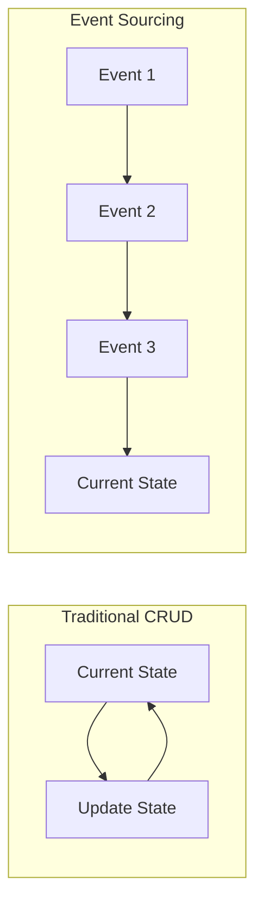

# How to Build Event-Sourced Apps with Marten in .NET

Author: [nawazdhandala](https://www.github.com/nawazdhandala)

Tags: .NET, C#, Event Sourcing, Marten, PostgreSQL, CQRS

Description: Learn how to build event-sourced applications using Marten and PostgreSQL in .NET. Implement aggregates, projections, and event streams for systems that need complete audit trails and temporal queries.

---

Traditional CRUD applications overwrite data. You know the current state but lose how you got there. Event sourcing flips this model by storing every change as an immutable event. The current state becomes a computation from the event history. Marten makes event sourcing practical on PostgreSQL without the complexity of specialized event stores.

## Why Event Sourcing?

Event sourcing provides complete audit trails, temporal queries, and the ability to rebuild state at any point in time. Financial systems, healthcare records, and compliance-heavy domains benefit from knowing exactly what happened and when.



## Setting Up Marten

Marten is a .NET library that uses PostgreSQL's JSON capabilities for document storage and event sourcing. Add the NuGet package and configure it.

```csharp
// Install: dotnet add package Marten

// Program.cs configuration
var builder = WebApplication.CreateBuilder(args);

// Configure Marten with PostgreSQL
builder.Services.AddMarten(options =>
{
    options.Connection(builder.Configuration.GetConnectionString("Postgres")!);

    // Configure event store
    options.Events.StreamIdentity = StreamIdentity.AsGuid;

    // Register event types
    options.Events.AddEventType<AccountCreated>();
    options.Events.AddEventType<MoneyDeposited>();
    options.Events.AddEventType<MoneyWithdrawn>();
    options.Events.AddEventType<AccountClosed>();

    // Configure projections
    options.Projections.Add<AccountProjection>(ProjectionLifecycle.Inline);
});

var app = builder.Build();
```

## Defining Events

Events describe what happened in the past. They are immutable facts. Name them in past tense and include all data needed to understand what occurred.

```csharp
// Events describe facts that happened in the system
// They are immutable and named in past tense

public record AccountCreated(
    Guid AccountId,
    string AccountHolderName,
    string Email,
    DateTime CreatedAt
);

public record MoneyDeposited(
    Guid AccountId,
    decimal Amount,
    string Description,
    DateTime DepositedAt
);

public record MoneyWithdrawn(
    Guid AccountId,
    decimal Amount,
    string Description,
    DateTime WithdrawnAt
);

public record AccountClosed(
    Guid AccountId,
    string Reason,
    DateTime ClosedAt
);

public record TransferInitiated(
    Guid TransferId,
    Guid FromAccountId,
    Guid ToAccountId,
    decimal Amount,
    DateTime InitiatedAt
);

public record TransferCompleted(
    Guid TransferId,
    DateTime CompletedAt
);

public record TransferFailed(
    Guid TransferId,
    string Reason,
    DateTime FailedAt
);
```

## Building Aggregates

Aggregates apply events to build current state and enforce business rules. The aggregate decides which events are valid based on its current state.

```csharp
// Aggregate that rebuilds its state from events
// Enforces business rules before accepting new events
public class BankAccount
{
    public Guid Id { get; private set; }
    public string AccountHolderName { get; private set; } = string.Empty;
    public string Email { get; private set; } = string.Empty;
    public decimal Balance { get; private set; }
    public bool IsClosed { get; private set; }
    public DateTime CreatedAt { get; private set; }
    public DateTime? ClosedAt { get; private set; }

    // Marten calls this to apply events when loading the aggregate
    public void Apply(AccountCreated @event)
    {
        Id = @event.AccountId;
        AccountHolderName = @event.AccountHolderName;
        Email = @event.Email;
        CreatedAt = @event.CreatedAt;
        Balance = 0;
        IsClosed = false;
    }

    public void Apply(MoneyDeposited @event)
    {
        Balance += @event.Amount;
    }

    public void Apply(MoneyWithdrawn @event)
    {
        Balance -= @event.Amount;
    }

    public void Apply(AccountClosed @event)
    {
        IsClosed = true;
        ClosedAt = @event.ClosedAt;
    }

    // Command handlers that validate and produce events
    public static AccountCreated Create(
        Guid accountId,
        string holderName,
        string email)
    {
        if (string.IsNullOrWhiteSpace(holderName))
            throw new ArgumentException("Account holder name is required");

        if (string.IsNullOrWhiteSpace(email))
            throw new ArgumentException("Email is required");

        return new AccountCreated(
            accountId,
            holderName,
            email,
            DateTime.UtcNow);
    }

    public MoneyDeposited Deposit(decimal amount, string description)
    {
        if (IsClosed)
            throw new InvalidOperationException("Cannot deposit to closed account");

        if (amount <= 0)
            throw new ArgumentException("Deposit amount must be positive");

        return new MoneyDeposited(Id, amount, description, DateTime.UtcNow);
    }

    public MoneyWithdrawn Withdraw(decimal amount, string description)
    {
        if (IsClosed)
            throw new InvalidOperationException("Cannot withdraw from closed account");

        if (amount <= 0)
            throw new ArgumentException("Withdrawal amount must be positive");

        if (amount > Balance)
            throw new InvalidOperationException("Insufficient funds");

        return new MoneyWithdrawn(Id, amount, description, DateTime.UtcNow);
    }

    public AccountClosed Close(string reason)
    {
        if (IsClosed)
            throw new InvalidOperationException("Account is already closed");

        if (Balance != 0)
            throw new InvalidOperationException("Account must have zero balance to close");

        return new AccountClosed(Id, reason, DateTime.UtcNow);
    }
}
```

## Application Service Layer

The application service coordinates loading aggregates, executing commands, and storing events.

```csharp
// Service that coordinates aggregate operations with the event store
public class BankAccountService
{
    private readonly IDocumentSession _session;
    private readonly ILogger<BankAccountService> _logger;

    public BankAccountService(
        IDocumentSession session,
        ILogger<BankAccountService> logger)
    {
        _session = session;
        _logger = logger;
    }

    public async Task<Guid> CreateAccountAsync(
        string holderName,
        string email,
        CancellationToken ct = default)
    {
        var accountId = Guid.NewGuid();

        // Create the event
        var @event = BankAccount.Create(accountId, holderName, email);

        // Start a new event stream
        _session.Events.StartStream<BankAccount>(accountId, @event);
        await _session.SaveChangesAsync(ct);

        _logger.LogInformation("Created account {AccountId}", accountId);
        return accountId;
    }

    public async Task DepositAsync(
        Guid accountId,
        decimal amount,
        string description,
        CancellationToken ct = default)
    {
        // Load aggregate from event stream
        var account = await _session.Events
            .AggregateStreamAsync<BankAccount>(accountId, token: ct);

        if (account == null)
            throw new ArgumentException($"Account {accountId} not found");

        // Execute command and get event
        var @event = account.Deposit(amount, description);

        // Append event to stream
        _session.Events.Append(accountId, @event);
        await _session.SaveChangesAsync(ct);

        _logger.LogInformation(
            "Deposited {Amount} to account {AccountId}",
            amount,
            accountId);
    }

    public async Task WithdrawAsync(
        Guid accountId,
        decimal amount,
        string description,
        CancellationToken ct = default)
    {
        var account = await _session.Events
            .AggregateStreamAsync<BankAccount>(accountId, token: ct);

        if (account == null)
            throw new ArgumentException($"Account {accountId} not found");

        var @event = account.Withdraw(amount, description);

        _session.Events.Append(accountId, @event);
        await _session.SaveChangesAsync(ct);

        _logger.LogInformation(
            "Withdrew {Amount} from account {AccountId}",
            amount,
            accountId);
    }

    public async Task CloseAccountAsync(
        Guid accountId,
        string reason,
        CancellationToken ct = default)
    {
        var account = await _session.Events
            .AggregateStreamAsync<BankAccount>(accountId, token: ct);

        if (account == null)
            throw new ArgumentException($"Account {accountId} not found");

        var @event = account.Close(reason);

        _session.Events.Append(accountId, @event);
        await _session.SaveChangesAsync(ct);

        _logger.LogInformation("Closed account {AccountId}", accountId);
    }

    // Query the current state without replaying events
    public async Task<BankAccount?> GetAccountAsync(
        Guid accountId,
        CancellationToken ct = default)
    {
        return await _session.Events
            .AggregateStreamAsync<BankAccount>(accountId, token: ct);
    }

    // Get account state at a specific point in time
    public async Task<BankAccount?> GetAccountAtTimeAsync(
        Guid accountId,
        DateTime timestamp,
        CancellationToken ct = default)
    {
        return await _session.Events
            .AggregateStreamAsync<BankAccount>(
                accountId,
                timestamp: timestamp,
                token: ct);
    }

    // Get account state at a specific version
    public async Task<BankAccount?> GetAccountAtVersionAsync(
        Guid accountId,
        long version,
        CancellationToken ct = default)
    {
        return await _session.Events
            .AggregateStreamAsync<BankAccount>(
                accountId,
                version: version,
                token: ct);
    }
}
```

## Projections for Read Models

Projections transform events into read-optimized views. Marten supports inline projections that update synchronously and async projections for eventual consistency.

```csharp
// Read model optimized for queries
// Projections build these from events
public class AccountSummary
{
    public Guid Id { get; set; }
    public string AccountHolderName { get; set; } = string.Empty;
    public string Email { get; set; } = string.Empty;
    public decimal Balance { get; set; }
    public bool IsClosed { get; set; }
    public int TransactionCount { get; set; }
    public DateTime LastActivityAt { get; set; }
}

// Projection that builds AccountSummary from events
public class AccountProjection : SingleStreamProjection<AccountSummary>
{
    public AccountProjection()
    {
        // Delete the projection when account is closed (optional)
        // DeleteEvent<AccountClosed>();
    }

    public AccountSummary Create(AccountCreated @event)
    {
        return new AccountSummary
        {
            Id = @event.AccountId,
            AccountHolderName = @event.AccountHolderName,
            Email = @event.Email,
            Balance = 0,
            IsClosed = false,
            TransactionCount = 0,
            LastActivityAt = @event.CreatedAt
        };
    }

    public void Apply(MoneyDeposited @event, AccountSummary summary)
    {
        summary.Balance += @event.Amount;
        summary.TransactionCount++;
        summary.LastActivityAt = @event.DepositedAt;
    }

    public void Apply(MoneyWithdrawn @event, AccountSummary summary)
    {
        summary.Balance -= @event.Amount;
        summary.TransactionCount++;
        summary.LastActivityAt = @event.WithdrawnAt;
    }

    public void Apply(AccountClosed @event, AccountSummary summary)
    {
        summary.IsClosed = true;
        summary.LastActivityAt = @event.ClosedAt;
    }
}

// Cross-stream projection for reporting
public class DailyTransactionReport
{
    public string Id { get; set; } = string.Empty; // "2024-01-15"
    public DateTime Date { get; set; }
    public int DepositCount { get; set; }
    public decimal TotalDeposits { get; set; }
    public int WithdrawalCount { get; set; }
    public decimal TotalWithdrawals { get; set; }
}

public class DailyTransactionProjection : MultiStreamProjection<DailyTransactionReport, string>
{
    public DailyTransactionProjection()
    {
        // Group events by date
        Identity<MoneyDeposited>(e => e.DepositedAt.ToString("yyyy-MM-dd"));
        Identity<MoneyWithdrawn>(e => e.WithdrawnAt.ToString("yyyy-MM-dd"));
    }

    public DailyTransactionReport Create(MoneyDeposited @event)
    {
        var date = @event.DepositedAt.Date;
        return new DailyTransactionReport
        {
            Id = date.ToString("yyyy-MM-dd"),
            Date = date,
            DepositCount = 1,
            TotalDeposits = @event.Amount,
            WithdrawalCount = 0,
            TotalWithdrawals = 0
        };
    }

    public DailyTransactionReport Create(MoneyWithdrawn @event)
    {
        var date = @event.WithdrawnAt.Date;
        return new DailyTransactionReport
        {
            Id = date.ToString("yyyy-MM-dd"),
            Date = date,
            DepositCount = 0,
            TotalDeposits = 0,
            WithdrawalCount = 1,
            TotalWithdrawals = @event.Amount
        };
    }

    public void Apply(MoneyDeposited @event, DailyTransactionReport report)
    {
        report.DepositCount++;
        report.TotalDeposits += @event.Amount;
    }

    public void Apply(MoneyWithdrawn @event, DailyTransactionReport report)
    {
        report.WithdrawalCount++;
        report.TotalWithdrawals += @event.Amount;
    }
}
```

## Querying Event Streams

Marten provides powerful querying capabilities for both events and projections.

```csharp
// Query service for reading event-sourced data
public class AccountQueryService
{
    private readonly IQuerySession _session;

    public AccountQueryService(IQuerySession session)
    {
        _session = session;
    }

    // Query projected read model
    public async Task<AccountSummary?> GetSummaryAsync(
        Guid accountId,
        CancellationToken ct = default)
    {
        return await _session.LoadAsync<AccountSummary>(accountId, ct);
    }

    // Query all accounts with filtering
    public async Task<List<AccountSummary>> GetActiveAccountsAsync(
        int skip = 0,
        int take = 20,
        CancellationToken ct = default)
    {
        return await _session.Query<AccountSummary>()
            .Where(a => !a.IsClosed)
            .OrderByDescending(a => a.LastActivityAt)
            .Skip(skip)
            .Take(take)
            .ToListAsync(ct);
    }

    // Get raw events for an account
    public async Task<IReadOnlyList<IEvent>> GetAccountHistoryAsync(
        Guid accountId,
        CancellationToken ct = default)
    {
        return await _session.Events
            .FetchStreamAsync(accountId, token: ct);
    }

    // Get events of a specific type across all streams
    public async Task<List<MoneyWithdrawn>> GetLargeWithdrawalsAsync(
        decimal threshold,
        CancellationToken ct = default)
    {
        return await _session.Events
            .QueryRawEventDataOnly<MoneyWithdrawn>()
            .Where(e => e.Amount > threshold)
            .OrderByDescending(e => e.WithdrawnAt)
            .Take(100)
            .ToListAsync(ct);
    }

    // Get daily reports
    public async Task<List<DailyTransactionReport>> GetDailyReportsAsync(
        DateTime from,
        DateTime to,
        CancellationToken ct = default)
    {
        return await _session.Query<DailyTransactionReport>()
            .Where(r => r.Date >= from && r.Date <= to)
            .OrderBy(r => r.Date)
            .ToListAsync(ct);
    }
}
```

## Handling Concurrency

Event sourcing naturally supports optimistic concurrency. Marten tracks stream versions and rejects conflicting writes.

```csharp
// Service with optimistic concurrency handling
public class ConcurrencyAwareBankService
{
    private readonly IDocumentSession _session;
    private readonly ILogger<ConcurrencyAwareBankService> _logger;

    public ConcurrencyAwareBankService(
        IDocumentSession session,
        ILogger<ConcurrencyAwareBankService> logger)
    {
        _session = session;
        _logger = logger;
    }

    public async Task WithdrawWithRetryAsync(
        Guid accountId,
        decimal amount,
        string description,
        int maxRetries = 3,
        CancellationToken ct = default)
    {
        for (int attempt = 0; attempt < maxRetries; attempt++)
        {
            try
            {
                // Fetch the stream state including version
                var state = await _session.Events
                    .FetchStreamStateAsync(accountId, ct);

                if (state == null)
                    throw new ArgumentException($"Account {accountId} not found");

                // Load aggregate at current version
                var account = await _session.Events
                    .AggregateStreamAsync<BankAccount>(accountId, token: ct);

                // Create event
                var @event = account!.Withdraw(amount, description);

                // Append with expected version for optimistic concurrency
                _session.Events.Append(
                    accountId,
                    state.Version, // Expected version
                    @event);

                await _session.SaveChangesAsync(ct);
                return; // Success
            }
            catch (EventStreamUnexpectedMaxEventIdException)
            {
                // Concurrent modification detected, retry
                _logger.LogWarning(
                    "Concurrency conflict on account {AccountId}, retry {Attempt}",
                    accountId,
                    attempt + 1);

                if (attempt == maxRetries - 1)
                    throw;

                // Small delay before retry
                await Task.Delay(50 * (attempt + 1), ct);
            }
        }
    }
}
```

## API Controller

Expose the event-sourced domain through a REST API.

```csharp
[ApiController]
[Route("api/[controller]")]
public class AccountsController : ControllerBase
{
    private readonly BankAccountService _accountService;
    private readonly AccountQueryService _queryService;

    public AccountsController(
        BankAccountService accountService,
        AccountQueryService queryService)
    {
        _accountService = accountService;
        _queryService = queryService;
    }

    [HttpPost]
    public async Task<ActionResult<Guid>> CreateAccount(
        CreateAccountRequest request,
        CancellationToken ct)
    {
        var accountId = await _accountService.CreateAccountAsync(
            request.HolderName,
            request.Email,
            ct);

        return CreatedAtAction(
            nameof(GetAccount),
            new { accountId },
            accountId);
    }

    [HttpGet("{accountId}")]
    public async Task<ActionResult<AccountSummary>> GetAccount(
        Guid accountId,
        CancellationToken ct)
    {
        var summary = await _queryService.GetSummaryAsync(accountId, ct);

        if (summary == null)
            return NotFound();

        return Ok(summary);
    }

    [HttpGet("{accountId}/history")]
    public async Task<ActionResult<List<object>>> GetHistory(
        Guid accountId,
        CancellationToken ct)
    {
        var events = await _queryService.GetAccountHistoryAsync(accountId, ct);

        var history = events.Select(e => new
        {
            e.EventType.Name,
            e.Timestamp,
            e.Version,
            Data = e.Data
        }).ToList();

        return Ok(history);
    }

    [HttpPost("{accountId}/deposit")]
    public async Task<IActionResult> Deposit(
        Guid accountId,
        DepositRequest request,
        CancellationToken ct)
    {
        await _accountService.DepositAsync(
            accountId,
            request.Amount,
            request.Description,
            ct);

        return NoContent();
    }

    [HttpPost("{accountId}/withdraw")]
    public async Task<IActionResult> Withdraw(
        Guid accountId,
        WithdrawRequest request,
        CancellationToken ct)
    {
        await _accountService.WithdrawAsync(
            accountId,
            request.Amount,
            request.Description,
            ct);

        return NoContent();
    }

    [HttpPost("{accountId}/close")]
    public async Task<IActionResult> CloseAccount(
        Guid accountId,
        CloseAccountRequest request,
        CancellationToken ct)
    {
        await _accountService.CloseAccountAsync(accountId, request.Reason, ct);
        return NoContent();
    }
}

public record CreateAccountRequest(string HolderName, string Email);
public record DepositRequest(decimal Amount, string Description);
public record WithdrawRequest(decimal Amount, string Description);
public record CloseAccountRequest(string Reason);
```

## Summary

Marten makes event sourcing practical on PostgreSQL. Key concepts:

| Concept | Purpose |
|---------|---------|
| Events | Immutable facts describing what happened |
| Aggregates | Apply events to build state, enforce rules |
| Projections | Transform events into read-optimized views |
| Streams | Group events by aggregate identity |
| Temporal queries | Get state at any point in history |

Start with simple aggregates and inline projections. Add async projections for complex read models that can tolerate eventual consistency. Use optimistic concurrency to handle conflicts gracefully. Event sourcing adds complexity, so apply it where the audit trail and temporal query capabilities justify the investment.
