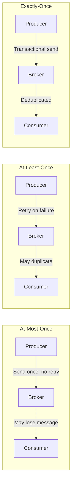

# How to Achieve Exactly-Once Processing in Kafka

Author: [nawazdhandala](https://www.github.com/nawazdhandala)

Tags: Kafka, Exactly-Once, Transactions, Idempotent Producer, Data Integrity

Description: A deep dive into Kafka's exactly-once semantics (EOS), covering idempotent producers, transactional messaging, and the consume-transform-produce pattern for building reliable data pipelines.

---

Exactly-once semantics (EOS) is one of Kafka's most powerful features for building reliable data pipelines. Without it, you face the choice between at-most-once delivery (messages may be lost) or at-least-once delivery (messages may be duplicated). This guide explains how to configure Kafka for exactly-once processing in production systems.

## Understanding Delivery Semantics

Before diving into configuration, let us clarify what each delivery guarantee means:



- **At-most-once**: Fast but lossy. Producer sends and moves on without confirmation.
- **At-least-once**: Safe but duplicates possible. Producer retries until acknowledged.
- **Exactly-once**: Each message is delivered and processed exactly one time.

## Component 1: Idempotent Producers

Idempotent producers prevent duplicate messages even with network retries. Kafka assigns a sequence number to each message and deduplicates on the broker side.

```java
import org.apache.kafka.clients.producer.*;
import org.apache.kafka.common.serialization.StringSerializer;
import java.util.Properties;

public class IdempotentProducerExample {

    public static void main(String[] args) {
        Properties props = new Properties();
        props.put(ProducerConfig.BOOTSTRAP_SERVERS_CONFIG, "kafka1:9092,kafka2:9092");
        props.put(ProducerConfig.KEY_SERIALIZER_CLASS_CONFIG, StringSerializer.class.getName());
        props.put(ProducerConfig.VALUE_SERIALIZER_CLASS_CONFIG, StringSerializer.class.getName());

        // Enable idempotence (this is the key setting)
        props.put(ProducerConfig.ENABLE_IDEMPOTENCE_CONFIG, "true");

        // Required settings for idempotence (Kafka sets these automatically)
        props.put(ProducerConfig.ACKS_CONFIG, "all"); // Wait for all replicas
        props.put(ProducerConfig.RETRIES_CONFIG, Integer.MAX_VALUE); // Retry indefinitely
        props.put(ProducerConfig.MAX_IN_FLIGHT_REQUESTS_PER_CONNECTION, 5); // Up to 5 in-flight

        try (KafkaProducer<String, String> producer = new KafkaProducer<>(props)) {
            for (int i = 0; i < 1000; i++) {
                ProducerRecord<String, String> record = new ProducerRecord<>(
                    "orders",
                    "order-" + i,
                    "{\"item\": \"widget\", \"quantity\": " + i + "}"
                );

                // Even if this send is retried due to network issues,
                // the broker will deduplicate based on sequence numbers
                producer.send(record, (metadata, exception) -> {
                    if (exception != null) {
                        System.err.println("Send failed: " + exception.getMessage());
                    }
                });
            }
        }
    }
}
```

Idempotent producers work within a single producer session. If the producer restarts, sequence numbers reset, so you may still see duplicates across restarts.

## Component 2: Transactional Producers

Transactions extend idempotence across producer restarts and multiple partitions. Messages are either all committed or none are visible to consumers.

```java
import org.apache.kafka.clients.producer.*;
import org.apache.kafka.common.serialization.StringSerializer;
import java.util.Properties;

public class TransactionalProducerExample {

    public static void main(String[] args) {
        Properties props = new Properties();
        props.put(ProducerConfig.BOOTSTRAP_SERVERS_CONFIG, "kafka1:9092,kafka2:9092");
        props.put(ProducerConfig.KEY_SERIALIZER_CLASS_CONFIG, StringSerializer.class.getName());
        props.put(ProducerConfig.VALUE_SERIALIZER_CLASS_CONFIG, StringSerializer.class.getName());

        // Enable idempotence (required for transactions)
        props.put(ProducerConfig.ENABLE_IDEMPOTENCE_CONFIG, "true");

        // Unique transaction ID (must be stable across restarts)
        props.put(ProducerConfig.TRANSACTIONAL_ID_CONFIG, "order-producer-1");

        // Transaction timeout (abort if not completed within this time)
        props.put(ProducerConfig.TRANSACTION_TIMEOUT_CONFIG, 60000);

        KafkaProducer<String, String> producer = new KafkaProducer<>(props);

        // Initialize transactions (call once per producer lifecycle)
        producer.initTransactions();

        try {
            // Begin a transaction
            producer.beginTransaction();

            // Send multiple messages atomically
            producer.send(new ProducerRecord<>("orders", "order-1", "{\"status\": \"created\"}"));
            producer.send(new ProducerRecord<>("inventory", "widget", "{\"reserved\": 1}"));
            producer.send(new ProducerRecord<>("notifications", "user-123", "{\"message\": \"Order placed\"}"));

            // Commit all messages atomically
            producer.commitTransaction();
            System.out.println("Transaction committed successfully");

        } catch (ProducerFencedException e) {
            // Another producer with the same transactional.id is active
            System.err.println("Producer fenced: " + e.getMessage());
            producer.close();
        } catch (KafkaException e) {
            // Abort on any error
            System.err.println("Transaction failed: " + e.getMessage());
            producer.abortTransaction();
        }

        producer.close();
    }
}
```

The `transactional.id` must be unique per producer instance but stable across restarts. Kafka uses it to fence zombie producers (instances that appear dead but are still running).

## Component 3: Transactional Consumers

Consumers must be configured to read only committed messages to participate in exactly-once processing.

```java
import org.apache.kafka.clients.consumer.*;
import org.apache.kafka.common.serialization.StringDeserializer;
import java.time.Duration;
import java.util.Collections;
import java.util.Properties;

public class TransactionalConsumerExample {

    public static void main(String[] args) {
        Properties props = new Properties();
        props.put(ConsumerConfig.BOOTSTRAP_SERVERS_CONFIG, "kafka1:9092,kafka2:9092");
        props.put(ConsumerConfig.GROUP_ID_CONFIG, "order-processors");
        props.put(ConsumerConfig.KEY_DESERIALIZER_CLASS_CONFIG, StringDeserializer.class.getName());
        props.put(ConsumerConfig.VALUE_DESERIALIZER_CLASS_CONFIG, StringDeserializer.class.getName());

        // Read only committed messages (critical for exactly-once)
        props.put(ConsumerConfig.ISOLATION_LEVEL_CONFIG, "read_committed");

        // Disable auto-commit (we commit as part of transactions)
        props.put(ConsumerConfig.ENABLE_AUTO_COMMIT_CONFIG, "false");

        try (KafkaConsumer<String, String> consumer = new KafkaConsumer<>(props)) {
            consumer.subscribe(Collections.singletonList("orders"));

            while (true) {
                ConsumerRecords<String, String> records = consumer.poll(Duration.ofMillis(100));

                for (ConsumerRecord<String, String> record : records) {
                    // Only see messages from committed transactions
                    System.out.printf("Offset: %d, Value: %s%n", record.offset(), record.value());
                }

                // Commit offsets manually
                consumer.commitSync();
            }
        }
    }
}
```

With `isolation.level=read_committed`, the consumer skips messages from aborted transactions and only reads messages once their transaction is committed.

## The Consume-Transform-Produce Pattern

The most common use case for exactly-once is consuming from one topic, processing, and producing to another. Kafka Streams handles this automatically, but here is how to do it manually:

```java
import org.apache.kafka.clients.consumer.*;
import org.apache.kafka.clients.producer.*;
import org.apache.kafka.common.TopicPartition;
import java.time.Duration;
import java.util.*;

public class ExactlyOnceProcessor {

    public static void main(String[] args) {
        // Consumer configuration
        Properties consumerProps = new Properties();
        consumerProps.put(ConsumerConfig.BOOTSTRAP_SERVERS_CONFIG, "kafka1:9092");
        consumerProps.put(ConsumerConfig.GROUP_ID_CONFIG, "transform-group");
        consumerProps.put(ConsumerConfig.ENABLE_AUTO_COMMIT_CONFIG, "false");
        consumerProps.put(ConsumerConfig.ISOLATION_LEVEL_CONFIG, "read_committed");
        consumerProps.put(ConsumerConfig.KEY_DESERIALIZER_CLASS_CONFIG,
            "org.apache.kafka.common.serialization.StringDeserializer");
        consumerProps.put(ConsumerConfig.VALUE_DESERIALIZER_CLASS_CONFIG,
            "org.apache.kafka.common.serialization.StringDeserializer");

        // Producer configuration
        Properties producerProps = new Properties();
        producerProps.put(ProducerConfig.BOOTSTRAP_SERVERS_CONFIG, "kafka1:9092");
        producerProps.put(ProducerConfig.ENABLE_IDEMPOTENCE_CONFIG, "true");
        producerProps.put(ProducerConfig.TRANSACTIONAL_ID_CONFIG, "transformer-1");
        producerProps.put(ProducerConfig.KEY_SERIALIZER_CLASS_CONFIG,
            "org.apache.kafka.common.serialization.StringSerializer");
        producerProps.put(ProducerConfig.VALUE_SERIALIZER_CLASS_CONFIG,
            "org.apache.kafka.common.serialization.StringSerializer");

        KafkaConsumer<String, String> consumer = new KafkaConsumer<>(consumerProps);
        KafkaProducer<String, String> producer = new KafkaProducer<>(producerProps);

        producer.initTransactions();
        consumer.subscribe(Collections.singletonList("raw-events"));

        try {
            while (true) {
                ConsumerRecords<String, String> records = consumer.poll(Duration.ofMillis(100));

                if (records.isEmpty()) continue;

                // Start transaction for this batch
                producer.beginTransaction();

                try {
                    Map<TopicPartition, OffsetAndMetadata> offsetsToCommit = new HashMap<>();

                    for (ConsumerRecord<String, String> record : records) {
                        // Transform the message
                        String transformed = transform(record.value());

                        // Produce to output topic within the transaction
                        producer.send(new ProducerRecord<>("processed-events",
                            record.key(), transformed));

                        // Track offsets for this partition
                        offsetsToCommit.put(
                            new TopicPartition(record.topic(), record.partition()),
                            new OffsetAndMetadata(record.offset() + 1)
                        );
                    }

                    // Commit consumer offsets as part of the transaction
                    producer.sendOffsetsToTransaction(offsetsToCommit, consumer.groupMetadata());

                    // Commit the transaction (atomically commits offsets and messages)
                    producer.commitTransaction();

                } catch (Exception e) {
                    // Abort transaction on any error
                    producer.abortTransaction();
                    System.err.println("Transaction aborted: " + e.getMessage());
                }
            }
        } finally {
            consumer.close();
            producer.close();
        }
    }

    private static String transform(String input) {
        // Your transformation logic here
        return input.toUpperCase();
    }
}
```

The key method is `sendOffsetsToTransaction()`, which commits consumer offsets as part of the producer transaction. If the transaction aborts, the offsets are not committed, and the consumer will re-read those messages.

## Broker Configuration for EOS

Enable transaction support on your Kafka brokers:

```properties
# server.properties

# Transaction coordinator settings
transaction.state.log.replication.factor=3
transaction.state.log.min.isr=2

# Transaction timeouts
transaction.max.timeout.ms=900000
transaction.abort.timed.out.transaction.cleanup.interval.ms=10000

# Enable log compaction for transaction state topic
log.cleaner.enable=true
```

## Performance Considerations

Exactly-once semantics adds latency due to transaction coordination. Here are optimization strategies:

```java
// Batch more records per transaction to amortize overhead
props.put(ProducerConfig.BATCH_SIZE_CONFIG, 65536); // 64KB batches
props.put(ProducerConfig.LINGER_MS_CONFIG, 10); // Wait up to 10ms for batching

// Increase transaction timeout for larger batches
props.put(ProducerConfig.TRANSACTION_TIMEOUT_CONFIG, 120000);
```

## When to Use Exactly-Once

Use exactly-once semantics when:

- Financial transactions where duplicates cause real harm
- Event sourcing systems requiring perfect ordering
- Data pipelines where downstream systems cannot deduplicate
- Regulatory compliance requires audit-perfect records

Skip exactly-once when:

- Consumers can handle duplicates (idempotent operations)
- Processing is stateless and can be safely retried
- Latency requirements are strict (sub-millisecond)
- You are writing to external systems that do not support transactions

---

Kafka's exactly-once semantics combine idempotent producers, transactions, and read-committed consumers to eliminate duplicates and data loss. For the consume-transform-produce pattern, use `sendOffsetsToTransaction()` to atomically commit offsets with output messages. While EOS adds some latency, it provides the strongest guarantee for data integrity in streaming pipelines.
