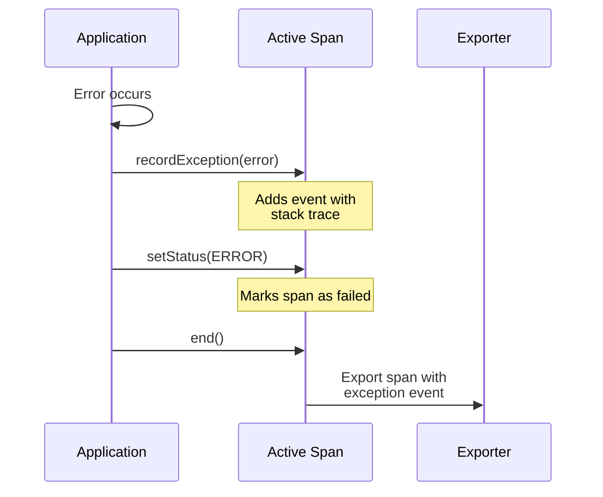

# How to Implement Exception Recording in OpenTelemetry

Author: [nawazdhandala](https://www.github.com/nawazdhandala)

Tags: OpenTelemetry, Exception Handling, Error Tracking, Tracing, Debugging, Observability

Description: Learn how to implement exception recording in OpenTelemetry to capture and correlate errors with traces. This guide covers recording exceptions, setting span status, and best practices for error observability.

---

When errors occur in production, you need more than just a stack trace. You need to know what happened before the error, which user was affected, and what the system state was. OpenTelemetry's exception recording ties errors directly to traces, giving you the full context.

This guide covers how to properly record exceptions in OpenTelemetry spans.

## The Basics of Exception Recording

OpenTelemetry provides two mechanisms for handling errors:

1. **recordException()**: Records the exception as a span event with stack trace
2. **setStatus()**: Sets the span status to ERROR

Both should be used together for complete error information.



## Node.js Exception Recording

### Basic Pattern

```javascript
// error-handling.js
const { trace, SpanStatusCode } = require('@opentelemetry/api');

const tracer = trace.getTracer('order-service');

async function processOrder(orderData) {
  const span = tracer.startSpan('process-order');

  try {
    // Business logic that might throw
    const order = await validateOrder(orderData);
    await chargePayment(order);
    await fulfillOrder(order);

    return order;
  } catch (error) {
    // Record the exception as a span event
    span.recordException(error);

    // Set span status to ERROR
    span.setStatus({
      code: SpanStatusCode.ERROR,
      message: error.message
    });

    // Re-throw to let caller handle
    throw error;
  } finally {
    // Always end the span
    span.end();
  }
}
```

### Recording with Additional Context

```javascript
// enhanced-error-recording.js
const { trace, SpanStatusCode } = require('@opentelemetry/api');

const tracer = trace.getTracer('payment-service');

async function chargeCard(paymentDetails) {
  const span = tracer.startSpan('charge-card', {
    attributes: {
      'payment.method': 'card',
      'payment.amount_cents': paymentDetails.amountCents,
      'payment.currency': paymentDetails.currency
    }
  });

  try {
    const result = await paymentGateway.charge(paymentDetails);
    span.setAttribute('payment.transaction_id', result.transactionId);
    return result;

  } catch (error) {
    // Record exception with additional attributes
    span.recordException(error, {
      // Add context about what was being attempted
      'exception.context': 'payment_gateway_charge',
      'payment.gateway': 'stripe',
      'payment.idempotency_key': paymentDetails.idempotencyKey
    });

    // Categorize the error for easier filtering
    const errorCategory = categorizePaymentError(error);
    span.setAttribute('error.category', errorCategory);
    span.setAttribute('error.retriable', isRetriable(error));

    span.setStatus({
      code: SpanStatusCode.ERROR,
      message: `Payment failed: ${errorCategory}`
    });

    throw error;
  } finally {
    span.end();
  }
}

function categorizePaymentError(error) {
  if (error.code === 'card_declined') return 'card_declined';
  if (error.code === 'insufficient_funds') return 'insufficient_funds';
  if (error.code === 'network_error') return 'network_error';
  if (error.type === 'StripeAuthenticationError') return 'authentication_error';
  return 'unknown';
}

function isRetriable(error) {
  const retriableCodes = ['network_error', 'rate_limit', 'service_unavailable'];
  return retriableCodes.includes(error.code);
}
```

### Express Error Middleware

```javascript
// error-middleware.js
const { trace, SpanStatusCode, context } = require('@opentelemetry/api');

function errorMiddleware(err, req, res, next) {
  // Get the current span from context
  const span = trace.getSpan(context.active());

  if (span) {
    // Record the exception
    span.recordException(err, {
      'http.request_id': req.headers['x-request-id'],
      'http.path': req.path,
      'http.method': req.method,
      'user.id': req.user?.id
    });

    // Set span status
    span.setStatus({
      code: SpanStatusCode.ERROR,
      message: err.message
    });

    // Add error attributes to span
    span.setAttribute('error.type', err.name);
    span.setAttribute('error.handled', true);
  }

  // Log the error
  console.error('Request failed:', {
    error: err.message,
    stack: err.stack,
    path: req.path,
    trace_id: span?.spanContext().traceId
  });

  // Send error response
  const statusCode = err.statusCode || 500;
  res.status(statusCode).json({
    error: statusCode >= 500 ? 'Internal server error' : err.message,
    request_id: req.headers['x-request-id']
  });
}

module.exports = errorMiddleware;
```

## Python Exception Recording

### Basic Pattern

```python
# error_handling.py
from opentelemetry import trace
from opentelemetry.trace import Status, StatusCode

tracer = trace.get_tracer("order-service")

def process_order(order_data):
    with tracer.start_as_current_span("process-order") as span:
        try:
            order = validate_order(order_data)
            charge_payment(order)
            fulfill_order(order)
            return order

        except ValidationError as e:
            # Record validation errors with context
            span.record_exception(e, attributes={
                "error.category": "validation",
                "error.field": e.field if hasattr(e, 'field') else None
            })
            span.set_status(Status(StatusCode.ERROR, str(e)))
            raise

        except PaymentError as e:
            # Record payment errors with additional context
            span.record_exception(e, attributes={
                "error.category": "payment",
                "payment.gateway_error_code": e.code
            })
            span.set_status(Status(StatusCode.ERROR, f"Payment failed: {e.code}"))
            raise

        except Exception as e:
            # Catch-all for unexpected errors
            span.record_exception(e)
            span.set_status(Status(StatusCode.ERROR, "Unexpected error"))
            raise
```

### Context Manager for Automatic Exception Recording

```python
# exception_context.py
from contextlib import contextmanager
from opentelemetry import trace
from opentelemetry.trace import Status, StatusCode

tracer = trace.get_tracer("app")

@contextmanager
def traced_operation(name, attributes=None, record_exceptions=True):
    """
    Context manager that automatically records exceptions on spans.

    Usage:
        with traced_operation("fetch-user", {"user.id": user_id}):
            user = fetch_user(user_id)
    """
    with tracer.start_as_current_span(name, attributes=attributes) as span:
        try:
            yield span
        except Exception as e:
            if record_exceptions:
                span.record_exception(e)
                span.set_status(Status(StatusCode.ERROR, str(e)))
            raise


# Usage examples
def get_user(user_id):
    with traced_operation("get-user", {"user.id": user_id}) as span:
        user = database.fetch_user(user_id)
        if user is None:
            # Raise a custom exception - will be auto-recorded
            raise UserNotFoundError(f"User {user_id} not found")
        span.set_attribute("user.email", user.email)
        return user


def process_batch(items):
    with traced_operation("process-batch", {"batch.size": len(items)}) as span:
        results = []
        errors = []

        for item in items:
            try:
                results.append(process_item(item))
            except Exception as e:
                # Record each error but continue processing
                errors.append({"item": item.id, "error": str(e)})
                span.add_event("item_processing_failed", {
                    "item.id": item.id,
                    "error.message": str(e)
                })

        # Set partial failure status if some items failed
        if errors:
            span.set_attribute("batch.error_count", len(errors))
            if len(errors) == len(items):
                span.set_status(Status(StatusCode.ERROR, "All items failed"))
            else:
                span.set_status(Status(StatusCode.OK))  # Partial success

        return results, errors
```

### Flask Error Handler

```python
# flask_error_handler.py
from flask import Flask, request, g
from opentelemetry import trace
from opentelemetry.trace import Status, StatusCode

app = Flask(__name__)

@app.errorhandler(Exception)
def handle_exception(error):
    """
    Global error handler that records exceptions to the current span.
    """
    span = trace.get_current_span()

    if span.is_recording():
        # Record the exception with request context
        span.record_exception(error, attributes={
            "http.request_id": request.headers.get("X-Request-ID"),
            "http.path": request.path,
            "http.method": request.method,
            "user.id": getattr(g, "user_id", None)
        })

        # Categorize and set status
        error_type = type(error).__name__
        span.set_attribute("error.type", error_type)

        if hasattr(error, "status_code"):
            status_code = error.status_code
        else:
            status_code = 500

        span.set_status(Status(StatusCode.ERROR, str(error)))

    # Return appropriate response
    if status_code >= 500:
        return {"error": "Internal server error"}, status_code
    else:
        return {"error": str(error)}, status_code
```

## Exception Event Attributes

When you call `recordException()`, OpenTelemetry creates a span event with standard attributes:

| Attribute | Description | Example |
|-----------|-------------|---------|
| exception.type | Exception class name | "ValueError" |
| exception.message | Error message | "Invalid input" |
| exception.stacktrace | Full stack trace | "Traceback..." |

You can add custom attributes for additional context:

```javascript
span.recordException(error, {
  // Standard attributes are added automatically
  // Add custom attributes for your use case
  'error.category': 'validation',
  'error.field': 'email',
  'error.expected_format': 'valid email address',
  'error.received_value': maskPII(input.email)
});
```

## Best Practices

### 1. Always Set Status on Error

Recording an exception alone does not mark the span as failed. Always set status:

```javascript
// Wrong - span shows as successful despite exception
span.recordException(error);
span.end();

// Right - span shows as failed
span.recordException(error);
span.setStatus({ code: SpanStatusCode.ERROR, message: error.message });
span.end();
```

### 2. Categorize Errors

Add error categories for easier filtering and alerting:

```javascript
const errorCategories = {
  'ValidationError': 'validation',
  'AuthenticationError': 'authentication',
  'DatabaseError': 'database',
  'TimeoutError': 'timeout',
  'NetworkError': 'network'
};

span.setAttribute('error.category', errorCategories[error.name] || 'unknown');
```

### 3. Sanitize Sensitive Data

Do not record sensitive information in exceptions:

```python
def sanitize_exception(error):
    """
    Remove sensitive data from error messages before recording.
    """
    message = str(error)

    # Remove potential PII patterns
    import re
    message = re.sub(r'\b[A-Za-z0-9._%+-]+@[A-Za-z0-9.-]+\.[A-Z|a-z]{2,}\b', '[EMAIL]', message)
    message = re.sub(r'\b\d{4}[\s-]?\d{4}[\s-]?\d{4}[\s-]?\d{4}\b', '[CARD]', message)
    message = re.sub(r'\b\d{3}-\d{2}-\d{4}\b', '[SSN]', message)

    return message
```

### 4. Record Business Exceptions Differently

Not all exceptions are errors from an observability perspective:

```python
def handle_request(request):
    with tracer.start_as_current_span("handle-request") as span:
        try:
            return process(request)

        except ItemNotFoundError as e:
            # This is expected behavior, not an error
            span.add_event("item_not_found", {"item.id": e.item_id})
            span.set_status(Status(StatusCode.OK))  # Not an error
            return {"error": "Item not found"}, 404

        except ValidationError as e:
            # Client error, record but OK status
            span.add_event("validation_failed", {"field": e.field})
            span.set_status(Status(StatusCode.OK))  # Client's fault
            return {"error": str(e)}, 400

        except Exception as e:
            # Actual server error
            span.record_exception(e)
            span.set_status(Status(StatusCode.ERROR))
            return {"error": "Internal error"}, 500
```

## Querying Exceptions

Once exceptions are recorded, query them in your backend:

```sql
-- Find all traces with exceptions
SELECT trace_id, span_name, exception_type, exception_message
FROM spans
JOIN span_events ON spans.span_id = span_events.span_id
WHERE span_events.name = 'exception'
  AND timestamp > NOW() - INTERVAL '1 hour'
ORDER BY timestamp DESC;

-- Group exceptions by type
SELECT exception_type, COUNT(*) as count
FROM span_events
WHERE name = 'exception'
  AND timestamp > NOW() - INTERVAL '24 hours'
GROUP BY exception_type
ORDER BY count DESC;
```

## Summary

Exception recording in OpenTelemetry connects errors to the full request context. Always use both `recordException()` and `setStatus()` together. Add custom attributes to categorize errors and provide debugging context. Sanitize sensitive data before recording. Distinguish between business exceptions (expected) and system errors (unexpected) when setting span status.

With proper exception recording, you can quickly find failing requests, see what happened before the error, and understand the impact on users.
