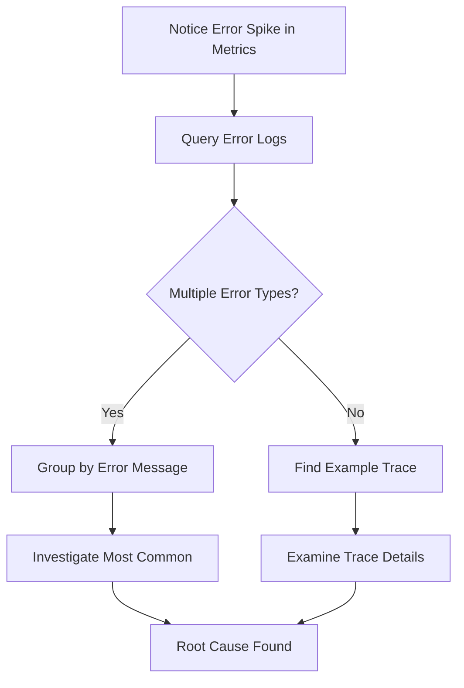

# How to Use Explore for Ad-Hoc Queries in Grafana

Author: [nawazdhandala](https://www.github.com/nawazdhandala)

Tags: Grafana, Explore, Ad-Hoc Queries, Debugging, Logs, Metrics, Traces, Observability

Description: Master Grafana's Explore interface for ad-hoc queries across metrics, logs, and traces during debugging and incident investigation.

---

## What Is Grafana Explore?

Dashboards are great for known questions, but what about when something breaks and you need to investigate? That is where Explore comes in. Grafana Explore is a query-focused interface designed for ad-hoc exploration, debugging, and correlation of your observability data.

Unlike dashboards, Explore is not about visualization perfection. It is about quickly answering questions: Why did latency spike? What errors are occurring? Which traces show the problem?

## Accessing Explore

Click the compass icon in Grafana's left sidebar to open Explore. You will see a query editor similar to dashboard panels, but optimized for iterative investigation.

The interface provides:
- A data source selector at the top
- A query editor that adapts to your chosen data source
- A flexible results view that adjusts based on the data type
- Split view for correlating multiple queries

## Querying Metrics

Let's start with a common scenario: investigating a latency increase.

### Basic Metric Query

Select your Prometheus data source and enter a query:

```promql
# Check current request rate
rate(http_requests_total{service="api-gateway"}[5m])
```

Explore renders a time series graph automatically. Adjust the time range using the picker in the top-right corner.

### Iterative Refinement

Explore shines when you need to narrow down issues. Start broad:

```promql
# All services experiencing high latency
histogram_quantile(0.99, rate(http_request_duration_seconds_bucket[5m])) > 0.5
```

Then narrow based on results:

```promql
# Focus on the problematic service
histogram_quantile(0.99, rate(http_request_duration_seconds_bucket{service="checkout"}[5m]))
```

Add more granularity:

```promql
# Break down by endpoint
histogram_quantile(0.99, rate(http_request_duration_seconds_bucket{service="checkout"}[5m])) by (endpoint)
```

### Using Query History

Explore saves your query history automatically. Click the clock icon next to the query editor to access previous queries. This is invaluable when returning to an investigation or refining a complex query through multiple iterations.

## Querying Logs

Switch to a log data source like Loki for log exploration.

### Basic Log Query

```logql
# Find all error logs from a service
{service="checkout"} |= "error"
```

Results appear in a log view showing individual entries with timestamps.

### Log Filtering Pipeline

Loki's pipeline syntax lets you filter and transform logs:

```logql
# Find errors, extract fields, filter by status code
{service="checkout"}
  |= "error"
  | json
  | status_code >= 500
  | line_format "{{.timestamp}} [{{.status_code}}] {{.message}}"
```

### Log to Metric Queries

Convert logs to metrics for trend analysis:

```logql
# Count errors over time
count_over_time({service="checkout"} |= "error" [5m])
```

This produces a graph showing error frequency, useful for correlating with other metrics.

## Querying Traces

With Tempo or Jaeger as your trace data source, Explore becomes a powerful trace investigation tool.

### Search by Service

```traceql
{service.name="checkout"}
```

Results show a trace list with duration, service counts, and span counts.

### Filter by Duration

Find slow traces:

```traceql
{service.name="checkout"} | duration > 1s
```

### Search by Attributes

Look for traces with specific characteristics:

```traceql
{service.name="checkout" && http.status_code >= 500}
```

### Trace Detail View

Click any trace to open the detail view showing:
- Full span waterfall
- Span attributes and events
- Related logs (if configured)
- Service dependency graph for that trace

## Split View for Correlation

The split view feature is essential for incident investigation. Click the "Split" button to get two query panels side by side.

### Metrics and Logs Correlation

Left panel (Prometheus):
```promql
rate(http_requests_total{service="checkout", status=~"5.."}[5m])
```

Right panel (Loki):
```logql
{service="checkout"} |= "error" | json
```

Now you can see error rates alongside the actual error messages. Adjust time ranges on one side and watch how the other changes.

### Metrics to Traces Flow

Left panel (Prometheus):
```promql
histogram_quantile(0.99, rate(http_request_duration_seconds_bucket{service="checkout"}[5m]))
```

Right panel (Tempo):
```traceql
{service.name="checkout"} | duration > 2s
```

When you spot a latency spike in metrics, immediately examine the slow traces from that period.

## Time Range Synchronization

Explore's time controls work across split views:

- **Sync time ranges**: Both panels update when you adjust either time picker
- **Relative vs. absolute**: Use relative ranges like "Last 1 hour" during active investigation, absolute ranges for post-incident analysis
- **Zoom**: Select a region in any graph to zoom the time range

### Keyboard Shortcuts

```
Shift + Click + Drag: Zoom to selection
Ctrl + Z: Undo time range change
Arrow keys: Navigate through time (when time picker is focused)
```

## Query Inspector

For complex queries or performance issues, the Query Inspector reveals what is happening under the hood.

Click the "Query Inspector" button to see:

### Request Tab
```json
{
  "queries": [
    {
      "expr": "rate(http_requests_total[5m])",
      "datasourceId": 1,
      "intervalMs": 15000,
      "maxDataPoints": 1920
    }
  ],
  "from": "1706140800000",
  "to": "1706144400000"
}
```

### Response Tab
Shows raw data returned by your data source, useful for debugging unexpected results.

### Stats Tab
Displays query execution time, bytes transferred, and processing metrics.

## Common Investigation Patterns

### The Golden Signals Check

When something is wrong, start with the four golden signals:

```promql
# Latency
histogram_quantile(0.99, rate(http_request_duration_seconds_bucket{service="$service"}[5m]))

# Traffic
rate(http_requests_total{service="$service"}[5m])

# Errors
rate(http_requests_total{service="$service", status=~"5.."}[5m])

# Saturation
container_memory_usage_bytes{pod=~"$service.*"} / container_spec_memory_limit_bytes{pod=~"$service.*"}
```

### Error Spike Investigation



### Dependency Failure Detection

Check upstream dependencies when a service fails:

```promql
# Outbound request failures
rate(http_client_requests_total{service="checkout", status=~"5.."}[5m]) by (target_service)
```

Then examine those dependencies:

```promql
# Target service health
up{service="payment-service"}
rate(http_requests_total{service="payment-service", status=~"5.."}[5m])
```

## Saving and Sharing Investigations

### Add to Dashboard

Found a useful query? Click "Add to dashboard" to create a panel on an existing or new dashboard.

### Share Link

The URL in Explore includes your query, time range, and data source. Share it with teammates:

```
https://grafana.example.com/explore?orgId=1&left={"datasource":"prometheus","queries":[{"expr":"rate(http_requests_total[5m])"}],"range":{"from":"now-1h","to":"now"}}
```

### Export Results

For reporting or offline analysis, export query results:
- CSV download for metrics
- JSON download for structured data
- Copy to clipboard for quick sharing

## Advanced Features

### Mixed Data Source Queries

In split view, each panel can use a different data source. This enables:
- Correlating application metrics (Prometheus) with infrastructure metrics (CloudWatch)
- Comparing production logs (Loki) with staging logs (different Loki instance)

### Query Templates

Create reusable query patterns using dashboard variables syntax:

```promql
# Even in Explore, you can use some variable syntax
rate(http_requests_total{service=~"$service"}[5m])
```

Some data sources support ad-hoc filters that work like variables.

### Annotations

Add annotations directly from Explore to mark important events:
1. Select a time point on a graph
2. Add annotation with description
3. Annotations appear across dashboards using the same time range

## Tips for Efficient Investigation

### Start Broad, Then Narrow
Begin with high-level queries and add filters as you identify patterns.

### Use Labels Effectively
Structure your queries to leverage label filtering before pattern matching:

```logql
# Good: Filter by label first
{service="checkout", environment="production"} |= "error"

# Less efficient: Pattern match everything then filter
{environment="production"} |= "error" | service="checkout"
```

### Save Useful Queries
Build a personal library of investigation queries. Use Explore's history, or maintain a runbook with common queries for your services.

### Know Your Cardinality
High-cardinality queries can be slow or fail. Start with constrained queries and expand:

```promql
# Start here
rate(http_requests_total{service="api"}[5m])

# Then expand if needed
rate(http_requests_total[5m]) by (service)
```

## Conclusion

Grafana Explore transforms incident investigation from a scattered, multi-tool experience into a focused workflow. Master the split view for correlation, learn the query syntax for your data sources, and build muscle memory for the keyboard shortcuts. When the next incident hits, you will move from detection to understanding in minutes, not hours.
