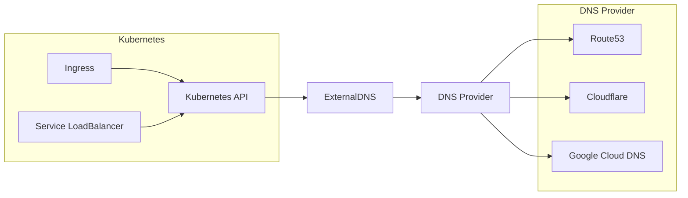

# How to Set Up External DNS with Kubernetes

Author: [nawazdhandala](https://www.github.com/nawazdhandala)

Tags: Kubernetes, External DNS, DNS, Ingress, DevOps, Automation

Description: Learn how to set up ExternalDNS in Kubernetes to automatically manage DNS records for your services and ingresses. This guide covers installation, configuration with various DNS providers, and production best practices.

---

Manually managing DNS records for Kubernetes services is tedious and error-prone. ExternalDNS automates this by watching for Ingress and Service resources and creating corresponding DNS records in your DNS provider. Deploy a service, get a DNS record automatically.

## How ExternalDNS Works



ExternalDNS watches Kubernetes resources and syncs DNS records to match.

## Installation

### Prerequisites

- A DNS zone managed by a supported provider
- Credentials for the DNS provider API
- A Kubernetes cluster with Ingress controller or LoadBalancer services

### Install with Helm

```bash
# Add the ExternalDNS Helm repository
helm repo add external-dns https://kubernetes-sigs.github.io/external-dns/
helm repo update

# Install (configuration varies by provider)
helm install external-dns external-dns/external-dns \
  --namespace external-dns \
  --create-namespace \
  --set provider=aws \
  --set txtOwnerId=my-cluster \
  --set policy=sync
```

## AWS Route53 Configuration

### Create IAM Policy

```json
{
    "Version": "2012-10-17",
    "Statement": [
        {
            "Effect": "Allow",
            "Action": [
                "route53:ChangeResourceRecordSets"
            ],
            "Resource": [
                "arn:aws:route53:::hostedzone/ZONE_ID"
            ]
        },
        {
            "Effect": "Allow",
            "Action": [
                "route53:ListHostedZones",
                "route53:ListResourceRecordSets"
            ],
            "Resource": ["*"]
        }
    ]
}
```

### Deploy with IRSA (Recommended)

```yaml
# external-dns-deployment.yaml
apiVersion: apps/v1
kind: Deployment
metadata:
  name: external-dns
  namespace: external-dns
spec:
  replicas: 1
  selector:
    matchLabels:
      app: external-dns
  template:
    metadata:
      labels:
        app: external-dns
    spec:
      serviceAccountName: external-dns
      containers:
        - name: external-dns
          image: registry.k8s.io/external-dns/external-dns:v0.14.0
          args:
            - --source=service
            - --source=ingress
            - --provider=aws
            - --aws-zone-type=public
            - --registry=txt
            - --txt-owner-id=my-cluster
            - --domain-filter=example.com  # Limit to this domain
            - --policy=sync  # Or 'upsert-only' for safety
          env:
            - name: AWS_DEFAULT_REGION
              value: us-east-1
```

### ServiceAccount with IAM Role

```yaml
# service-account.yaml
apiVersion: v1
kind: ServiceAccount
metadata:
  name: external-dns
  namespace: external-dns
  annotations:
    # EKS IRSA annotation
    eks.amazonaws.com/role-arn: arn:aws:iam::ACCOUNT_ID:role/external-dns-role
```

## Cloudflare Configuration

### Create API Token

Create a Cloudflare API token with:
- Zone.Zone: Read
- Zone.DNS: Edit

### Deploy ExternalDNS

```yaml
apiVersion: v1
kind: Secret
metadata:
  name: cloudflare-api-token
  namespace: external-dns
type: Opaque
stringData:
  cloudflare_api_token: YOUR_API_TOKEN
---
apiVersion: apps/v1
kind: Deployment
metadata:
  name: external-dns
  namespace: external-dns
spec:
  replicas: 1
  selector:
    matchLabels:
      app: external-dns
  template:
    metadata:
      labels:
        app: external-dns
    spec:
      serviceAccountName: external-dns
      containers:
        - name: external-dns
          image: registry.k8s.io/external-dns/external-dns:v0.14.0
          args:
            - --source=service
            - --source=ingress
            - --provider=cloudflare
            - --cloudflare-proxied  # Enable Cloudflare proxy
            - --registry=txt
            - --txt-owner-id=my-cluster
            - --domain-filter=example.com
          env:
            - name: CF_API_TOKEN
              valueFrom:
                secretKeyRef:
                  name: cloudflare-api-token
                  key: cloudflare_api_token
```

## Google Cloud DNS Configuration

### Create Service Account

```bash
# Create service account
gcloud iam service-accounts create external-dns \
    --display-name "ExternalDNS"

# Grant DNS admin role
gcloud projects add-iam-policy-binding PROJECT_ID \
    --member serviceAccount:external-dns@PROJECT_ID.iam.gserviceaccount.com \
    --role roles/dns.admin

# Create key
gcloud iam service-accounts keys create credentials.json \
    --iam-account external-dns@PROJECT_ID.iam.gserviceaccount.com
```

### Deploy ExternalDNS

```yaml
apiVersion: v1
kind: Secret
metadata:
  name: google-credentials
  namespace: external-dns
type: Opaque
data:
  credentials.json: BASE64_ENCODED_CREDENTIALS
---
apiVersion: apps/v1
kind: Deployment
metadata:
  name: external-dns
  namespace: external-dns
spec:
  replicas: 1
  selector:
    matchLabels:
      app: external-dns
  template:
    metadata:
      labels:
        app: external-dns
    spec:
      containers:
        - name: external-dns
          image: registry.k8s.io/external-dns/external-dns:v0.14.0
          args:
            - --source=service
            - --source=ingress
            - --provider=google
            - --google-project=PROJECT_ID
            - --registry=txt
            - --txt-owner-id=my-cluster
            - --domain-filter=example.com
          volumeMounts:
            - name: google-credentials
              mountPath: /etc/secrets
              readOnly: true
          env:
            - name: GOOGLE_APPLICATION_CREDENTIALS
              value: /etc/secrets/credentials.json
      volumes:
        - name: google-credentials
          secret:
            secretName: google-credentials
```

## Using ExternalDNS with Ingress

Add the `external-dns.alpha.kubernetes.io/hostname` annotation:

```yaml
apiVersion: networking.k8s.io/v1
kind: Ingress
metadata:
  name: myapp-ingress
  namespace: production
  annotations:
    # ExternalDNS will create this DNS record
    external-dns.alpha.kubernetes.io/hostname: myapp.example.com
    # Optional: Set TTL
    external-dns.alpha.kubernetes.io/ttl: "300"
spec:
  ingressClassName: nginx
  rules:
    - host: myapp.example.com
      http:
        paths:
          - path: /
            pathType: Prefix
            backend:
              service:
                name: myapp
                port:
                  number: 80
```

Or let ExternalDNS use the host from rules:

```yaml
apiVersion: networking.k8s.io/v1
kind: Ingress
metadata:
  name: myapp-ingress
  namespace: production
spec:
  ingressClassName: nginx
  rules:
    - host: myapp.example.com  # ExternalDNS uses this
      http:
        paths:
          - path: /
            pathType: Prefix
            backend:
              service:
                name: myapp
                port:
                  number: 80
```

## Using ExternalDNS with Services

### LoadBalancer Service

```yaml
apiVersion: v1
kind: Service
metadata:
  name: myapp
  namespace: production
  annotations:
    external-dns.alpha.kubernetes.io/hostname: api.example.com
    external-dns.alpha.kubernetes.io/ttl: "60"
spec:
  type: LoadBalancer
  selector:
    app: myapp
  ports:
    - port: 80
      targetPort: 8080
```

### Multiple Hostnames

```yaml
metadata:
  annotations:
    external-dns.alpha.kubernetes.io/hostname: api.example.com,api2.example.com
```

## Configuration Options

### Sync Policies

```bash
# sync: Create, update, and delete records
--policy=sync

# upsert-only: Create and update, never delete (safer)
--policy=upsert-only

# create-only: Only create, never update or delete
--policy=create-only
```

### Domain Filtering

```bash
# Only manage specific domains
--domain-filter=example.com
--domain-filter=another.com

# Exclude specific domains
--exclude-domains=internal.example.com

# Regex filtering
--regex-domain-filter=.*\.example\.com
```

### Source Filtering

```bash
# Specific sources
--source=service
--source=ingress
--source=istio-gateway
--source=contour-httpproxy

# Namespace filtering
--namespace=production
# Or multiple
--namespace=production,staging
```

### TXT Registry

ExternalDNS uses TXT records to track ownership:

```bash
# Unique identifier for this cluster
--txt-owner-id=my-cluster-prod

# Prefix for TXT records
--txt-prefix=external-dns-

# Example: For A record api.example.com
# Creates TXT record external-dns-api.example.com
```

## RBAC Configuration

```yaml
apiVersion: v1
kind: ServiceAccount
metadata:
  name: external-dns
  namespace: external-dns
---
apiVersion: rbac.authorization.k8s.io/v1
kind: ClusterRole
metadata:
  name: external-dns
rules:
  - apiGroups: [""]
    resources: ["services", "endpoints", "pods"]
    verbs: ["get", "watch", "list"]
  - apiGroups: ["extensions", "networking.k8s.io"]
    resources: ["ingresses"]
    verbs: ["get", "watch", "list"]
  - apiGroups: [""]
    resources: ["nodes"]
    verbs: ["list"]
---
apiVersion: rbac.authorization.k8s.io/v1
kind: ClusterRoleBinding
metadata:
  name: external-dns
roleRef:
  apiGroup: rbac.authorization.k8s.io
  kind: ClusterRole
  name: external-dns
subjects:
  - kind: ServiceAccount
    name: external-dns
    namespace: external-dns
```

## Troubleshooting

### Check ExternalDNS Logs

```bash
# View logs
kubectl logs -n external-dns -l app=external-dns -f

# Look for:
# - "All records are already up to date"
# - "Desired change: CREATE api.example.com A"
# - Error messages
```

### Verify DNS Records

```bash
# Check if record was created
dig api.example.com

# Check TXT record (ownership)
dig TXT external-dns-api.example.com
```

### Common Issues

**No records created**:
- Check domain-filter matches your domain
- Verify credentials and permissions
- Check for errors in logs

**Records deleted unexpectedly**:
- txt-owner-id might be different between instances
- Another ExternalDNS instance might be managing same zone

**Duplicate records**:
- Ensure txt-owner-id is unique per cluster
- Check for multiple ExternalDNS deployments

### Debug Mode

```bash
# Enable debug logging
args:
  - --log-level=debug
```

## Best Practices

1. **Use upsert-only policy** initially to prevent accidental deletions
2. **Set unique txt-owner-id** per cluster
3. **Use domain-filter** to limit scope
4. **Deploy in dedicated namespace** with proper RBAC
5. **Monitor ExternalDNS** metrics and logs
6. **Set appropriate TTLs** based on your needs

```yaml
# Production-ready configuration
args:
  - --source=ingress
  - --source=service
  - --provider=aws
  - --policy=upsert-only
  - --registry=txt
  - --txt-owner-id=prod-cluster-1
  - --txt-prefix=extdns-
  - --domain-filter=example.com
  - --aws-zone-type=public
  - --log-level=info
  - --interval=1m  # Sync every minute
```

---

ExternalDNS removes the toil of managing DNS records manually. Configure it once, and your Ingresses and Services automatically get DNS records. Pair it with cert-manager for fully automated HTTPS, and you have a complete ingress solution.
