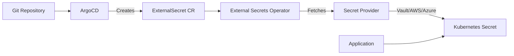

# How to Use External Secrets with ArgoCD

Author: [nawazdhandala](https://www.github.com/nawazdhandala)

Tags: ArgoCD, External Secrets, Kubernetes, Vault, AWS Secrets Manager, Security

Description: Learn how to integrate External Secrets Operator with ArgoCD to securely manage secrets from external providers like HashiCorp Vault, AWS Secrets Manager, and Azure Key Vault.

---

Storing secrets in Git is a bad idea, even encrypted ones. External Secrets Operator (ESO) solves this by syncing secrets from external providers into Kubernetes. Combined with ArgoCD, you get GitOps for configuration while secrets stay safe in dedicated vaults.

## How External Secrets Work



The flow:
1. Git contains ExternalSecret manifests (no actual secrets)
2. ArgoCD syncs ExternalSecret to cluster
3. ESO watches and fetches actual values from provider
4. ESO creates Kubernetes Secret
5. Application uses the Secret normally

## Installing External Secrets Operator

```bash
# Using Helm
helm repo add external-secrets https://charts.external-secrets.io
helm install external-secrets external-secrets/external-secrets \
  -n external-secrets \
  --create-namespace
```

Or include in your ArgoCD-managed infrastructure:

```yaml
# eso-application.yaml
apiVersion: argoproj.io/v1alpha1
kind: Application
metadata:
  name: external-secrets
  namespace: argocd
spec:
  project: infrastructure
  source:
    repoURL: https://charts.external-secrets.io
    chart: external-secrets
    targetRevision: 0.9.0
    helm:
      values: |
        installCRDs: true
  destination:
    server: https://kubernetes.default.svc
    namespace: external-secrets
  syncPolicy:
    automated:
      prune: true
```

## HashiCorp Vault Integration

### Configure Vault Authentication

Create a SecretStore that connects to Vault:

```yaml
# vault-secret-store.yaml
apiVersion: external-secrets.io/v1beta1
kind: ClusterSecretStore
metadata:
  name: vault-backend
spec:
  provider:
    vault:
      server: "https://vault.example.com"
      path: "secret"
      version: "v2"
      auth:
        kubernetes:
          mountPath: "kubernetes"
          role: "argocd-role"
          serviceAccountRef:
            name: external-secrets
            namespace: external-secrets
```

### Create an ExternalSecret

```yaml
# database-secret.yaml
apiVersion: external-secrets.io/v1beta1
kind: ExternalSecret
metadata:
  name: database-credentials
  namespace: myapp
spec:
  refreshInterval: 1h
  secretStoreRef:
    name: vault-backend
    kind: ClusterSecretStore
  target:
    name: db-credentials
    creationPolicy: Owner
  data:
    - secretKey: username
      remoteRef:
        key: myapp/database
        property: username
    - secretKey: password
      remoteRef:
        key: myapp/database
        property: password
```

## AWS Secrets Manager Integration

### Configure AWS Authentication

```yaml
# aws-secret-store.yaml
apiVersion: external-secrets.io/v1beta1
kind: ClusterSecretStore
metadata:
  name: aws-secrets-manager
spec:
  provider:
    aws:
      service: SecretsManager
      region: us-east-1
      auth:
        # Use IRSA (IAM Roles for Service Accounts)
        jwt:
          serviceAccountRef:
            name: external-secrets-sa
            namespace: external-secrets
```

### Create Service Account with IRSA

```yaml
apiVersion: v1
kind: ServiceAccount
metadata:
  name: external-secrets-sa
  namespace: external-secrets
  annotations:
    eks.amazonaws.com/role-arn: arn:aws:iam::123456789012:role/ExternalSecretsRole
```

### ExternalSecret for AWS

```yaml
apiVersion: external-secrets.io/v1beta1
kind: ExternalSecret
metadata:
  name: api-keys
  namespace: myapp
spec:
  refreshInterval: 30m
  secretStoreRef:
    name: aws-secrets-manager
    kind: ClusterSecretStore
  target:
    name: api-keys
  data:
    - secretKey: stripe-key
      remoteRef:
        key: myapp/api-keys
        property: stripe
    - secretKey: sendgrid-key
      remoteRef:
        key: myapp/api-keys
        property: sendgrid
```

## Azure Key Vault Integration

### Configure Azure Authentication

```yaml
# azure-secret-store.yaml
apiVersion: external-secrets.io/v1beta1
kind: ClusterSecretStore
metadata:
  name: azure-keyvault
spec:
  provider:
    azurekv:
      tenantId: "xxxxxxxx-xxxx-xxxx-xxxx-xxxxxxxxxxxx"
      vaultUrl: "https://myvault.vault.azure.net"
      authType: ManagedIdentity
      identityId: "xxxxxxxx-xxxx-xxxx-xxxx-xxxxxxxxxxxx"
```

### ExternalSecret for Azure

```yaml
apiVersion: external-secrets.io/v1beta1
kind: ExternalSecret
metadata:
  name: azure-secrets
  namespace: myapp
spec:
  refreshInterval: 1h
  secretStoreRef:
    name: azure-keyvault
    kind: ClusterSecretStore
  target:
    name: app-secrets
  data:
    - secretKey: connection-string
      remoteRef:
        key: database-connection-string
```

## Google Secret Manager Integration

```yaml
# gcp-secret-store.yaml
apiVersion: external-secrets.io/v1beta1
kind: ClusterSecretStore
metadata:
  name: gcp-secret-manager
spec:
  provider:
    gcpsm:
      projectID: my-gcp-project
      auth:
        workloadIdentity:
          clusterLocation: us-central1
          clusterName: my-cluster
          serviceAccountRef:
            name: external-secrets-sa
            namespace: external-secrets
```

## ArgoCD Integration Patterns

### Application with ExternalSecrets

```yaml
# myapp/base/kustomization.yaml
apiVersion: kustomize.config.k8s.io/v1beta1
kind: Kustomization

resources:
  - deployment.yaml
  - service.yaml
  - external-secret.yaml  # ExternalSecret, not actual Secret
```

```yaml
# myapp/base/external-secret.yaml
apiVersion: external-secrets.io/v1beta1
kind: ExternalSecret
metadata:
  name: myapp-secrets
spec:
  refreshInterval: 1h
  secretStoreRef:
    name: vault-backend
    kind: ClusterSecretStore
  target:
    name: myapp-secrets
  data:
    - secretKey: DATABASE_URL
      remoteRef:
        key: myapp/database
        property: url
    - secretKey: API_KEY
      remoteRef:
        key: myapp/api
        property: key
```

```yaml
# myapp/base/deployment.yaml
apiVersion: apps/v1
kind: Deployment
metadata:
  name: myapp
spec:
  template:
    spec:
      containers:
        - name: myapp
          envFrom:
            - secretRef:
                name: myapp-secrets  # References Secret created by ESO
```

### Sync Wave Ordering

Ensure ExternalSecrets are created before the application:

```yaml
# external-secret.yaml
apiVersion: external-secrets.io/v1beta1
kind: ExternalSecret
metadata:
  name: myapp-secrets
  annotations:
    argocd.argoproj.io/sync-wave: "-1"
spec:
  # ...

---
# deployment.yaml
apiVersion: apps/v1
kind: Deployment
metadata:
  name: myapp
  annotations:
    argocd.argoproj.io/sync-wave: "0"
```

### Health Check for ExternalSecrets

ArgoCD needs to know when ExternalSecrets are ready:

```yaml
# argocd-cm ConfigMap
data:
  resource.customizations.health.external-secrets.io_ExternalSecret: |
    hs = {}
    if obj.status ~= nil then
      if obj.status.conditions ~= nil then
        for i, condition in ipairs(obj.status.conditions) do
          if condition.type == "Ready" and condition.status == "True" then
            hs.status = "Healthy"
            hs.message = "Secret synced successfully"
            return hs
          end
          if condition.type == "Ready" and condition.status == "False" then
            hs.status = "Degraded"
            hs.message = condition.message
            return hs
          end
        end
      end
    end
    hs.status = "Progressing"
    hs.message = "Waiting for secret sync"
    return hs
```

## Template-Based Secrets

Create secrets with custom formatting:

```yaml
apiVersion: external-secrets.io/v1beta1
kind: ExternalSecret
metadata:
  name: connection-string
spec:
  refreshInterval: 1h
  secretStoreRef:
    name: vault-backend
    kind: ClusterSecretStore
  target:
    name: db-connection
    template:
      data:
        # Template the connection string
        connection.json: |
          {
            "host": "{{ .host }}",
            "port": {{ .port }},
            "username": "{{ .username }}",
            "password": "{{ .password }}"
          }
  data:
    - secretKey: host
      remoteRef:
        key: myapp/database
        property: host
    - secretKey: port
      remoteRef:
        key: myapp/database
        property: port
    - secretKey: username
      remoteRef:
        key: myapp/database
        property: username
    - secretKey: password
      remoteRef:
        key: myapp/database
        property: password
```

## Push Secrets (Bi-directional)

Push Kubernetes secrets to external providers:

```yaml
apiVersion: external-secrets.io/v1alpha1
kind: PushSecret
metadata:
  name: push-to-vault
  namespace: myapp
spec:
  refreshInterval: 1h
  secretStoreRefs:
    - name: vault-backend
      kind: ClusterSecretStore
  selector:
    secret:
      name: generated-credentials
  data:
    - match:
        secretKey: api-key
        remoteRef:
          remoteKey: myapp/generated
          property: api-key
```

## Multi-Environment Secrets

Use Kustomize overlays for environment-specific secret references:

```yaml
# base/external-secret.yaml
apiVersion: external-secrets.io/v1beta1
kind: ExternalSecret
metadata:
  name: myapp-secrets
spec:
  refreshInterval: 1h
  secretStoreRef:
    name: vault-backend
    kind: ClusterSecretStore
  target:
    name: myapp-secrets
  dataFrom:
    - extract:
        key: myapp/ENV/secrets  # ENV will be replaced
```

```yaml
# overlays/production/kustomization.yaml
apiVersion: kustomize.config.k8s.io/v1beta1
kind: Kustomization

resources:
  - ../../base

patches:
  - target:
      kind: ExternalSecret
      name: myapp-secrets
    patch: |
      - op: replace
        path: /spec/dataFrom/0/extract/key
        value: myapp/production/secrets
```

## Troubleshooting

### Check ExternalSecret Status

```bash
# View ExternalSecret status
kubectl get externalsecret -n myapp

# Describe for details
kubectl describe externalsecret myapp-secrets -n myapp

# Check if Secret was created
kubectl get secret myapp-secrets -n myapp
```

### Common Issues

**Secret not syncing:**
```bash
# Check ESO logs
kubectl logs -n external-secrets deployment/external-secrets

# Verify SecretStore connectivity
kubectl describe clustersecretstore vault-backend
```

**Permission denied:**
- Verify IAM/Vault policies
- Check service account annotations
- Validate authentication configuration

**Secret empty:**
- Confirm remote key path is correct
- Check property names match

## Best Practices

### Use ClusterSecretStore

For multi-namespace applications:

```yaml
apiVersion: external-secrets.io/v1beta1
kind: ClusterSecretStore  # Not SecretStore
metadata:
  name: vault-backend
  # No namespace - cluster-wide
```

### Set Appropriate Refresh Intervals

```yaml
spec:
  # Frequent for dynamic secrets
  refreshInterval: 5m

  # Less frequent for static secrets
  refreshInterval: 1h
```

### Monitor Secret Sync

```yaml
# Prometheus alert
groups:
  - name: external-secrets
    rules:
      - alert: ExternalSecretSyncFailed
        expr: |
          external_secrets_sync_calls_total{status="error"} > 0
        for: 5m
        annotations:
          summary: "ExternalSecret sync failed"
```

External Secrets with ArgoCD gives you the best of both worlds: GitOps for application configuration and secure secret management from dedicated providers. Keep your ExternalSecret manifests in Git, let ESO handle the actual secret values, and your deployments stay both auditable and secure.
