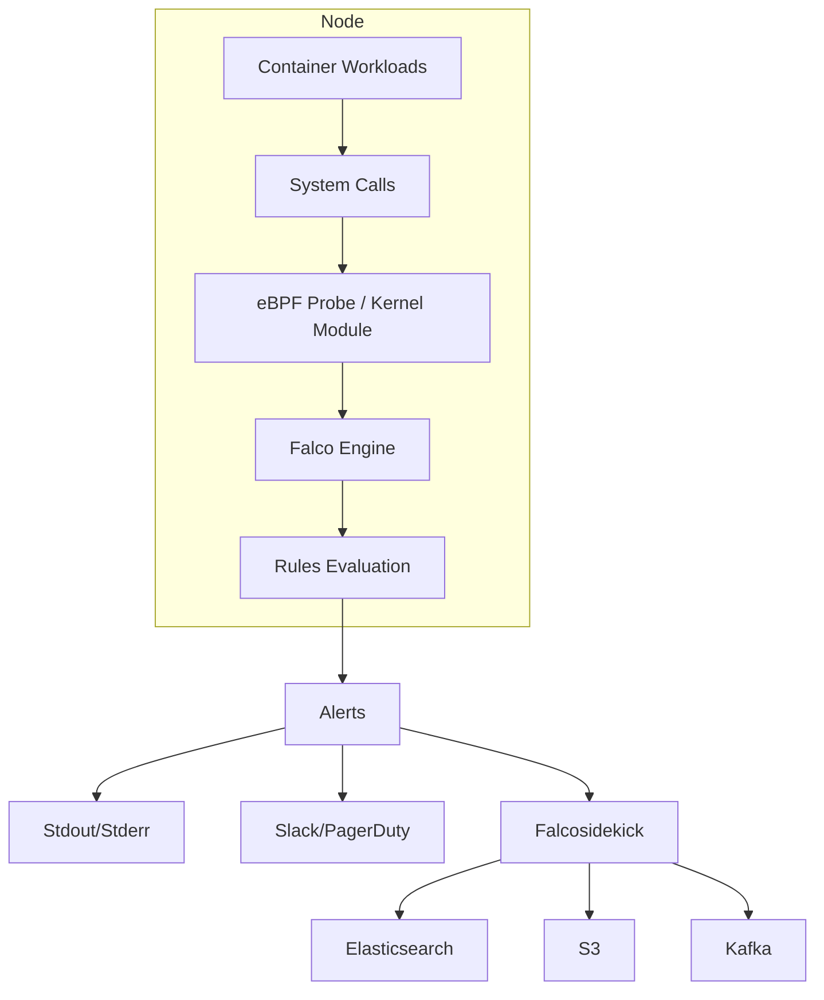

# How to Configure Falco for Runtime Security

Author: [nawazdhandala](https://www.github.com/nawazdhandala)

Tags: Security, Falco, Runtime Security, Kubernetes, Container Security, Threat Detection, Observability

Description: Learn how to deploy and configure Falco to detect threats, suspicious behavior, and policy violations in your containers and Kubernetes clusters at runtime.

---

Static scanning catches vulnerabilities before deployment, but runtime security catches attackers after they get in. Falco, a CNCF graduated project, monitors system calls and Kubernetes audit logs to detect suspicious behavior in real time. This guide covers installation, rule writing, alerting, and integration with your security stack.

## What Falco Detects

Falco watches for activities that indicate compromise or policy violation:

- Shell spawned inside a container
- Sensitive file access (/etc/shadow, /etc/passwd)
- Outbound network connections from unexpected processes
- Container privilege escalation
- Cryptocurrency mining signatures
- Unexpected process execution
- Secret access patterns in Kubernetes

It achieves this by hooking into the Linux kernel via eBPF or a kernel module, giving it visibility into every system call.

## Architecture Overview



## Installing Falco on Kubernetes

The recommended deployment uses Helm with the eBPF driver (no kernel module needed):

```bash
# Add the Falco Helm repository
helm repo add falcosecurity https://falcosecurity.github.io/charts
helm repo update

# Install Falco with eBPF driver
helm install falco falcosecurity/falco \
  --namespace falco \
  --create-namespace \
  --set driver.kind=ebpf \
  --set falcosidekick.enabled=true \
  --set falcosidekick.webui.enabled=true
```

Verify Falco is running:

```bash
kubectl get pods -n falco
# NAME                          READY   STATUS    RESTARTS   AGE
# falco-xxxxx                   2/2     Running   0          1m
# falco-falcosidekick-xxxxx     1/1     Running   0          1m
# falco-falcosidekick-ui-xxxxx  1/1     Running   0          1m
```

Check Falco logs for events:

```bash
kubectl logs -n falco -l app.kubernetes.io/name=falco -f
```

## Understanding Falco Rules

Falco rules are YAML files with three components:

- **Rules**: Define what to detect
- **Macros**: Reusable condition snippets
- **Lists**: Named collections of items

Here is an example rule that detects shell execution in containers:

```yaml
# Custom rule file: custom-rules.yaml

# Define a list of allowed shell binaries
- list: shell_binaries
  items: [bash, sh, zsh, ksh, csh, tcsh]

# Macro to check if running in a container
- macro: container
  condition: container.id != host

# Macro to identify shell execution
- macro: spawned_shell
  condition: evt.type = execve and proc.name in (shell_binaries)

# The actual detection rule
- rule: Shell Spawned in Container
  desc: Detect shell execution inside a container (potential compromise)
  condition: spawned_shell and container
  output: >
    Shell spawned in container
    (user=%user.name container=%container.name
    image=%container.image.repository
    shell=%proc.name parent=%proc.pname
    cmdline=%proc.cmdline)
  priority: WARNING
  tags: [container, shell, mitre_execution]
```

## Writing Custom Rules

Let's write rules for common security scenarios.

### Detecting Sensitive File Access

```yaml
# Detect reads of sensitive credential files
- list: sensitive_files
  items:
    - /etc/shadow
    - /etc/passwd
    - /etc/sudoers
    - /root/.ssh/authorized_keys
    - /root/.ssh/id_rsa

- rule: Read Sensitive File
  desc: Detect attempts to read sensitive system files
  condition: >
    open_read and
    fd.name in (sensitive_files) and
    container
  output: >
    Sensitive file read in container
    (file=%fd.name user=%user.name container=%container.name
    image=%container.image.repository command=%proc.cmdline)
  priority: WARNING
  tags: [filesystem, credential_access]
```

### Detecting Outbound Connections to Suspicious Ports

```yaml
# Alert on connections to known bad ports
- list: miner_ports
  items: [3333, 4444, 5555, 7777, 8888, 9999]

- rule: Cryptocurrency Mining Connection
  desc: Detect outbound connections to common mining pool ports
  condition: >
    outbound and
    fd.sport in (miner_ports) and
    container
  output: >
    Possible crypto mining activity
    (connection=%fd.name port=%fd.sport
    container=%container.name image=%container.image.repository
    command=%proc.cmdline)
  priority: CRITICAL
  tags: [network, cryptomining]
```

### Detecting Privilege Escalation

```yaml
# Detect setuid/setgid calls
- rule: Container Privilege Escalation
  desc: Detect privilege escalation via setuid/setgid
  condition: >
    evt.type in (setuid, setgid) and
    evt.dir = < and
    container and
    not user.name = root
  output: >
    Privilege escalation detected
    (user=%user.name container=%container.name
    syscall=%evt.type image=%container.image.repository)
  priority: CRITICAL
  tags: [privilege_escalation, mitre_privilege_escalation]
```

## Deploying Custom Rules

Create a ConfigMap with your custom rules:

```bash
kubectl create configmap falco-custom-rules \
  --from-file=custom-rules.yaml \
  -n falco
```

Update the Helm deployment to include custom rules:

```bash
helm upgrade falco falcosecurity/falco \
  --namespace falco \
  --set driver.kind=ebpf \
  --set falcosidekick.enabled=true \
  --set "customRules.custom-rules\.yaml=configmap://falco/falco-custom-rules"
```

Alternatively, inline rules in values.yaml:

```yaml
# values.yaml
customRules:
  custom-rules.yaml: |-
    - rule: Shell Spawned in Container
      desc: Detect shell execution inside containers
      condition: spawned_shell and container
      output: Shell spawned (container=%container.name command=%proc.cmdline)
      priority: WARNING
```

## Configuring Alerts with Falcosidekick

Falcosidekick routes Falco alerts to 50+ destinations. Configure outputs in the Helm values:

```yaml
# values.yaml for falcosidekick
falcosidekick:
  enabled: true
  config:
    slack:
      webhookurl: "https://hooks.slack.com/services/XXX/YYY/ZZZ"
      channel: "#security-alerts"
      minimumpriority: "warning"

    pagerduty:
      apikey: "your-pagerduty-api-key"
      minimumpriority: "critical"

    elasticsearch:
      hostport: "https://elasticsearch.example.com:9200"
      index: "falco"
      type: "_doc"

    prometheus:
      extralabels: "env:production,team:security"
```

Install with alerting configured:

```bash
helm upgrade falco falcosecurity/falco \
  --namespace falco \
  -f values.yaml
```

## Kubernetes Audit Log Integration

Falco can also consume Kubernetes audit logs to detect API-level threats:

```yaml
# Example audit rule: detect secret access
- rule: K8s Secret Get
  desc: Detect attempts to get secrets
  condition: >
    ka.verb = get and
    ka.target.resource = secrets and
    not ka.user.name in (allowed_service_accounts)
  output: >
    Secret accessed
    (user=%ka.user.name namespace=%ka.target.namespace
    secret=%ka.target.name reason=%ka.auth.reason)
  priority: WARNING
  source: k8s_audit
  tags: [k8s, secrets]
```

Enable audit log webhook to Falco:

```yaml
# kube-apiserver audit webhook configuration
apiVersion: v1
kind: Config
clusters:
  - name: falco
    cluster:
      server: http://falco.falco.svc.cluster.local:8765/k8s-audit
contexts:
  - context:
      cluster: falco
      user: ""
    name: default-context
current-context: default-context
```

## Tuning and Reducing Noise

False positives make alerts useless. Tune rules by excluding known-good patterns:

```yaml
# Macro for allowed debugging tools
- macro: allowed_debugging
  condition: >
    (container.image.repository = "gcr.io/my-project/debug-tools") or
    (k8s.ns.name = "debug-namespace")

# Modified rule with exception
- rule: Shell Spawned in Container
  desc: Detect shell execution inside containers
  condition: spawned_shell and container and not allowed_debugging
  output: Shell spawned (container=%container.name)
  priority: WARNING
```

Use the Falco tuning mode to identify noisy rules:

```bash
# Run Falco with stats enabled
falco --stats-interval 300 -r /etc/falco/falco_rules.yaml
```

## Monitoring Falco Itself

Export Falco metrics to Prometheus:

```yaml
# values.yaml
falco:
  metrics:
    enabled: true
    outputRule: true
    outputInterval: 30s
```

Key metrics to monitor:

- `falco_events_total`: Total events processed
- `falco_rules_matches_total`: Matches per rule
- `falco_kernel_drops_total`: Events dropped (indicates overload)

---

Runtime security completes the container security story. Falco gives you visibility into what actually happens inside your containers, not just what could happen. Start with the default rules, add custom detection for your environment, and route alerts to your security operations workflow.
