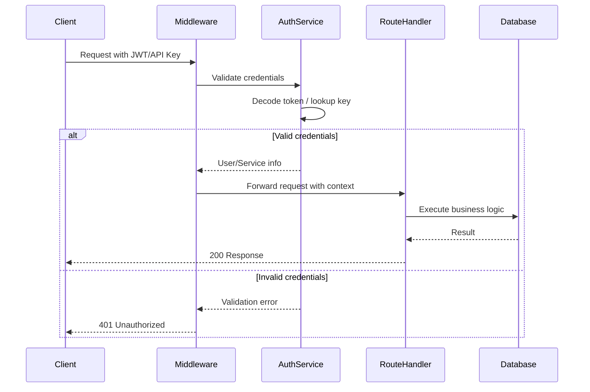

# How to Build Authentication Middleware in FastAPI

Author: [nawazdhandala](https://www.github.com/nawazdhandala)

Tags: Python, FastAPI, Authentication, Middleware, JWT, Security, API Development

Description: Learn how to build robust authentication middleware in FastAPI to protect your API endpoints. This guide covers JWT tokens, API keys, OAuth2 flows, and custom middleware patterns with practical examples.

---

> Authentication is the first line of defense for any API. Getting it wrong can expose your entire system to attackers. This guide shows you how to build authentication middleware in FastAPI that is secure, maintainable, and easy to test.

FastAPI provides excellent tools for authentication out of the box, but understanding how to structure your middleware properly makes the difference between a secure API and a vulnerable one.

---

## Understanding FastAPI Authentication

FastAPI supports multiple authentication patterns:

| Pattern | Use Case | Complexity |
|---------|----------|------------|
| **API Keys** | Service-to-service communication | Low |
| **JWT Tokens** | User authentication with sessions | Medium |
| **OAuth2** | Third-party authentication | High |
| **Custom Headers** | Internal microservices | Low |

### How Middleware Works in FastAPI

```python
# FastAPI processes requests through a pipeline:
# Request -> Middleware -> Route Handler -> Middleware -> Response
```

---

## Basic JWT Authentication Middleware

This implementation creates a complete JWT authentication system. The middleware validates tokens on protected routes and extracts user information for downstream handlers.

```python
# auth_middleware.py
# JWT Authentication middleware for FastAPI
from fastapi import FastAPI, Request, HTTPException, Depends
from fastapi.security import HTTPBearer, HTTPAuthorizationCredentials
from jose import jwt, JWTError
from datetime import datetime, timedelta
from typing import Optional
from pydantic import BaseModel

# Configuration - in production, load from environment variables
SECRET_KEY = "your-secret-key-keep-this-safe"
ALGORITHM = "HS256"
ACCESS_TOKEN_EXPIRE_MINUTES = 30

app = FastAPI()

# Security scheme for Swagger UI documentation
security = HTTPBearer()

class TokenData(BaseModel):
    """Structured token payload data"""
    user_id: str
    email: str
    roles: list[str] = []

class User(BaseModel):
    """User model returned after authentication"""
    id: str
    email: str
    roles: list[str]

def create_access_token(data: dict, expires_delta: Optional[timedelta] = None) -> str:
    """
    Create a new JWT access token.

    Args:
        data: Payload data to encode in the token
        expires_delta: Optional custom expiration time

    Returns:
        Encoded JWT string
    """
    to_encode = data.copy()

    # Set expiration time
    if expires_delta:
        expire = datetime.utcnow() + expires_delta
    else:
        expire = datetime.utcnow() + timedelta(minutes=ACCESS_TOKEN_EXPIRE_MINUTES)

    # Add standard JWT claims
    to_encode.update({
        "exp": expire,  # Expiration time
        "iat": datetime.utcnow(),  # Issued at
        "type": "access"  # Token type for validation
    })

    # Encode and return the token
    encoded_jwt = jwt.encode(to_encode, SECRET_KEY, algorithm=ALGORITHM)
    return encoded_jwt

def decode_token(token: str) -> TokenData:
    """
    Decode and validate a JWT token.

    Args:
        token: The JWT string to decode

    Returns:
        TokenData with user information

    Raises:
        HTTPException: If token is invalid or expired
    """
    try:
        # Decode the token and verify signature
        payload = jwt.decode(token, SECRET_KEY, algorithms=[ALGORITHM])

        # Extract user data from payload
        user_id = payload.get("sub")  # Subject claim holds user ID
        email = payload.get("email")
        roles = payload.get("roles", [])

        # Validate required fields exist
        if user_id is None or email is None:
            raise HTTPException(
                status_code=401,
                detail="Token payload is missing required fields"
            )

        return TokenData(user_id=user_id, email=email, roles=roles)

    except JWTError as e:
        # Handle any JWT decoding errors
        raise HTTPException(
            status_code=401,
            detail=f"Could not validate credentials: {str(e)}"
        )

async def get_current_user(
    credentials: HTTPAuthorizationCredentials = Depends(security)
) -> User:
    """
    Dependency that extracts and validates the current user from JWT.
    Use this as a dependency in protected route handlers.
    """
    # Extract token from Bearer header
    token = credentials.credentials

    # Decode and validate the token
    token_data = decode_token(token)

    # Return user object for use in route handlers
    return User(
        id=token_data.user_id,
        email=token_data.email,
        roles=token_data.roles
    )
```

---

## Role-Based Access Control Middleware

This middleware extends basic authentication with role-based access control (RBAC). You can restrict endpoints to specific user roles.

```python
# rbac_middleware.py
# Role-based access control for FastAPI
from functools import wraps
from typing import List, Callable
from fastapi import HTTPException, Depends

class RoleChecker:
    """
    Dependency class for checking user roles.

    Usage:
        @app.get("/admin", dependencies=[Depends(RoleChecker(["admin"]))])
        async def admin_only():
            return {"message": "Welcome, admin"}
    """

    def __init__(self, allowed_roles: List[str]):
        """
        Initialize with list of roles that can access the endpoint.

        Args:
            allowed_roles: List of role names that are permitted
        """
        self.allowed_roles = allowed_roles

    async def __call__(self, user: User = Depends(get_current_user)) -> User:
        """
        Check if the current user has required roles.

        Returns:
            User object if authorized

        Raises:
            HTTPException: 403 if user lacks required roles
        """
        # Check if user has any of the allowed roles
        has_permission = any(
            role in self.allowed_roles
            for role in user.roles
        )

        if not has_permission:
            raise HTTPException(
                status_code=403,
                detail=f"User does not have required roles: {self.allowed_roles}"
            )

        return user

# Create reusable role dependencies
require_admin = RoleChecker(["admin"])
require_moderator = RoleChecker(["admin", "moderator"])
require_user = RoleChecker(["admin", "moderator", "user"])

# Example usage in routes
@app.get("/admin/users")
async def list_all_users(user: User = Depends(require_admin)):
    """Only admins can list all users"""
    return {"message": f"Hello admin {user.email}"}

@app.get("/content/moderate")
async def moderate_content(user: User = Depends(require_moderator)):
    """Admins and moderators can moderate content"""
    return {"message": f"Moderating as {user.email}"}

@app.get("/profile")
async def get_profile(user: User = Depends(require_user)):
    """Any authenticated user can view their profile"""
    return {"user_id": user.id, "email": user.email}
```

---

## API Key Authentication

For service-to-service communication, API keys are simpler than JWT. This implementation supports multiple API keys with different permission levels.

```python
# api_key_auth.py
# API Key authentication for service-to-service communication
from fastapi import Security, HTTPException, status
from fastapi.security import APIKeyHeader
from typing import Optional
from enum import Enum

class ServicePermission(Enum):
    """Permission levels for API keys"""
    READ = "read"
    WRITE = "write"
    ADMIN = "admin"

# Store API keys with their permissions
# In production, load from database or secrets manager
API_KEYS = {
    "service-a-key-12345": {
        "service_name": "service-a",
        "permissions": [ServicePermission.READ]
    },
    "service-b-key-67890": {
        "service_name": "service-b",
        "permissions": [ServicePermission.READ, ServicePermission.WRITE]
    },
    "admin-key-99999": {
        "service_name": "admin-service",
        "permissions": [ServicePermission.READ, ServicePermission.WRITE, ServicePermission.ADMIN]
    }
}

# Define the header where API key is expected
api_key_header = APIKeyHeader(name="X-API-Key", auto_error=False)

class ServiceClient:
    """Represents an authenticated service client"""
    def __init__(self, name: str, permissions: list[ServicePermission]):
        self.name = name
        self.permissions = permissions

    def has_permission(self, required: ServicePermission) -> bool:
        """Check if client has a specific permission"""
        return required in self.permissions

async def get_api_key_client(
    api_key: Optional[str] = Security(api_key_header)
) -> ServiceClient:
    """
    Validate API key and return service client info.

    Returns:
        ServiceClient with permissions

    Raises:
        HTTPException: If API key is missing or invalid
    """
    if api_key is None:
        raise HTTPException(
            status_code=status.HTTP_401_UNAUTHORIZED,
            detail="API key is required in X-API-Key header"
        )

    # Look up the API key
    key_info = API_KEYS.get(api_key)

    if key_info is None:
        raise HTTPException(
            status_code=status.HTTP_401_UNAUTHORIZED,
            detail="Invalid API key"
        )

    return ServiceClient(
        name=key_info["service_name"],
        permissions=key_info["permissions"]
    )

def require_permission(permission: ServicePermission):
    """
    Factory function to create permission-checking dependencies.

    Usage:
        @app.post("/data", dependencies=[Depends(require_permission(ServicePermission.WRITE))])
    """
    async def check_permission(
        client: ServiceClient = Depends(get_api_key_client)
    ) -> ServiceClient:
        if not client.has_permission(permission):
            raise HTTPException(
                status_code=status.HTTP_403_FORBIDDEN,
                detail=f"Service {client.name} lacks {permission.value} permission"
            )
        return client

    return check_permission

# Example endpoints with API key authentication
@app.get("/api/data")
async def read_data(client: ServiceClient = Depends(get_api_key_client)):
    """Any authenticated service can read data"""
    return {"service": client.name, "data": "some data"}

@app.post("/api/data")
async def write_data(
    client: ServiceClient = Depends(require_permission(ServicePermission.WRITE))
):
    """Only services with write permission can create data"""
    return {"service": client.name, "status": "data written"}
```

---

## Custom Middleware for Request Logging

This middleware logs all authenticated requests with user context, which is essential for audit trails and debugging.

```python
# logging_middleware.py
# Request logging middleware with authentication context
from fastapi import Request
from starlette.middleware.base import BaseHTTPMiddleware
from datetime import datetime
import logging
import json

# Configure logger
logger = logging.getLogger("api.audit")
logger.setLevel(logging.INFO)

class AuthLoggingMiddleware(BaseHTTPMiddleware):
    """
    Middleware that logs all requests with authentication context.
    Useful for audit trails and debugging authentication issues.
    """

    async def dispatch(self, request: Request, call_next):
        # Record request start time
        start_time = datetime.utcnow()

        # Extract authentication info from headers
        auth_header = request.headers.get("Authorization", "")
        api_key = request.headers.get("X-API-Key", "")

        # Determine authentication method used
        if auth_header.startswith("Bearer "):
            auth_method = "jwt"
            # Mask the token for logging
            auth_identifier = auth_header[:20] + "..."
        elif api_key:
            auth_method = "api_key"
            # Mask the API key for logging
            auth_identifier = api_key[:8] + "..."
        else:
            auth_method = "none"
            auth_identifier = None

        # Process the request
        response = await call_next(request)

        # Calculate request duration
        duration_ms = (datetime.utcnow() - start_time).total_seconds() * 1000

        # Build log entry
        log_entry = {
            "timestamp": start_time.isoformat(),
            "method": request.method,
            "path": request.url.path,
            "status_code": response.status_code,
            "duration_ms": round(duration_ms, 2),
            "auth_method": auth_method,
            "client_ip": request.client.host if request.client else "unknown",
            "user_agent": request.headers.get("User-Agent", "unknown")
        }

        # Log based on response status
        if response.status_code >= 400:
            logger.warning(json.dumps(log_entry))
        else:
            logger.info(json.dumps(log_entry))

        return response

# Add middleware to the app
app.add_middleware(AuthLoggingMiddleware)
```

---

## Complete Authentication Flow

Here is how all the pieces fit together in a production application.



---

## Testing Authentication Middleware

Testing authentication is critical. Here is how to test your middleware with pytest.

```python
# test_auth.py
# Tests for authentication middleware
import pytest
from fastapi.testclient import TestClient
from datetime import timedelta

# Create test client
client = TestClient(app)

class TestJWTAuthentication:
    """Tests for JWT authentication flow"""

    def test_valid_token_allows_access(self):
        """Valid JWT should allow access to protected routes"""
        # Create a test token
        token = create_access_token(
            data={"sub": "user123", "email": "test@example.com", "roles": ["user"]}
        )

        # Make request with token
        response = client.get(
            "/profile",
            headers={"Authorization": f"Bearer {token}"}
        )

        assert response.status_code == 200
        assert response.json()["email"] == "test@example.com"

    def test_expired_token_returns_401(self):
        """Expired JWT should return 401 Unauthorized"""
        # Create an expired token
        token = create_access_token(
            data={"sub": "user123", "email": "test@example.com"},
            expires_delta=timedelta(seconds=-1)  # Already expired
        )

        response = client.get(
            "/profile",
            headers={"Authorization": f"Bearer {token}"}
        )

        assert response.status_code == 401

    def test_missing_token_returns_401(self):
        """Missing JWT should return 401 Unauthorized"""
        response = client.get("/profile")

        assert response.status_code == 401

class TestRoleBasedAccess:
    """Tests for RBAC middleware"""

    def test_admin_can_access_admin_routes(self):
        """Admin role should access admin-only routes"""
        token = create_access_token(
            data={"sub": "admin1", "email": "admin@example.com", "roles": ["admin"]}
        )

        response = client.get(
            "/admin/users",
            headers={"Authorization": f"Bearer {token}"}
        )

        assert response.status_code == 200

    def test_user_cannot_access_admin_routes(self):
        """Regular user should not access admin routes"""
        token = create_access_token(
            data={"sub": "user1", "email": "user@example.com", "roles": ["user"]}
        )

        response = client.get(
            "/admin/users",
            headers={"Authorization": f"Bearer {token}"}
        )

        assert response.status_code == 403
```

---

## Best Practices

### 1. Never Store Secrets in Code

```python
# BAD: Hardcoded secret
SECRET_KEY = "my-secret-key"

# GOOD: Load from environment
import os
SECRET_KEY = os.environ.get("JWT_SECRET_KEY")
if not SECRET_KEY:
    raise ValueError("JWT_SECRET_KEY environment variable is required")
```

### 2. Use Short Token Expiration

```python
# GOOD: Short-lived access tokens with refresh tokens
ACCESS_TOKEN_EXPIRE_MINUTES = 15  # Short lived
REFRESH_TOKEN_EXPIRE_DAYS = 7  # Longer lived, stored securely
```

### 3. Validate All Token Claims

```python
# GOOD: Check token type to prevent misuse
if payload.get("type") != "access":
    raise HTTPException(status_code=401, detail="Invalid token type")
```

### 4. Rate Limit Authentication Endpoints

```python
# Prevent brute force attacks on login
from fastapi_limiter.depends import RateLimiter

@app.post("/login", dependencies=[Depends(RateLimiter(times=5, seconds=60))])
async def login(credentials: LoginRequest):
    # Only allow 5 login attempts per minute per IP
    pass
```

---

## Conclusion

Building authentication middleware in FastAPI requires understanding:

- **JWT tokens** for stateless user authentication
- **API keys** for service-to-service communication
- **RBAC** for fine-grained access control
- **Middleware patterns** for request logging and validation

Start with simple JWT authentication and add complexity as needed. Always test your authentication logic thoroughly since security bugs are expensive to fix after deployment.

---

*Need to monitor your API authentication? [OneUptime](https://oneuptime.com) provides real-time monitoring with authentication failure alerting and audit logging.*

**Related Reading:**
- [How to Build Rate Limiting in FastAPI](https://oneuptime.com/blog/post/2025-01-06-fastapi-rate-limiting/view)
- [How to Build Health Checks in Python for Kubernetes](https://oneuptime.com/blog/post/2025-01-06-python-health-checks-kubernetes/view)
