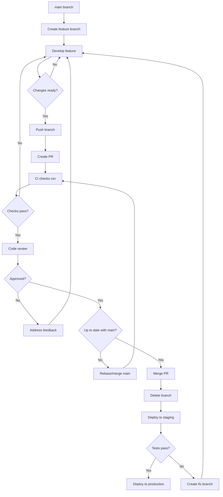

# How to Implement Feature Branch Workflows

Author: [nawazdhandala](https://www.github.com/nawazdhandala)

Tags: Git, Feature Branches, Developer Experience, CI/CD, Version Control

Description: Learn how to implement effective feature branch workflows that enable parallel development, clean history, and safe deployments through proper branching strategies.

---

Feature branches isolate work in progress from the stable main branch. Each feature, bug fix, or experiment lives in its own branch until it is ready for integration. This workflow enables multiple developers to work simultaneously without stepping on each other's changes.

## Feature Branch Fundamentals

The basic workflow is simple:

1. Create a branch from main
2. Develop the feature
3. Create a pull request
4. Review and merge
5. Delete the branch

```bash
# Create a feature branch
git checkout main
git pull origin main
git checkout -b feature/user-authentication

# Work on the feature
# ... make changes ...

# Commit changes
git add .
git commit -m "feat(auth): implement JWT authentication"

# Push to remote
git push -u origin feature/user-authentication

# Create pull request (via GitHub/GitLab UI or CLI)
gh pr create --title "Add user authentication" --body "Implements JWT-based auth"
```

## Branch Naming Conventions

Consistent naming helps teams organize and filter branches:

```bash
# Feature branches
feature/user-authentication
feature/payment-integration
feature/search-improvements

# Bug fixes
fix/login-redirect-loop
fix/null-pointer-exception
bugfix/memory-leak

# Hotfixes (urgent production fixes)
hotfix/security-patch
hotfix/database-connection

# Release branches (if using release branches)
release/1.2.0
release/2.0.0-beta

# Chores and refactoring
chore/update-dependencies
refactor/extract-validation-logic

# Experimental branches
experiment/graphql-api
spike/performance-testing
```

Configure branch name validation in CI:

```yaml
# .github/workflows/branch-name.yml
name: Validate Branch Name

on:
  push:
    branches-ignore:
      - main
      - develop

jobs:
  validate:
    runs-on: ubuntu-latest
    steps:
      - name: Check branch name
        run: |
          BRANCH_NAME="${GITHUB_REF#refs/heads/}"
          PATTERN="^(feature|fix|bugfix|hotfix|chore|refactor|release|experiment|spike)\/[a-z0-9-]+$"

          if [[ ! $BRANCH_NAME =~ $PATTERN ]]; then
            echo "Invalid branch name: $BRANCH_NAME"
            echo "Branch names must match: $PATTERN"
            exit 1
          fi

          echo "Branch name valid: $BRANCH_NAME"
```

## Keeping Branches Updated

Prevent merge conflicts by keeping branches current with main:

```bash
# Option 1: Rebase onto main (preferred for clean history)
git checkout feature/user-authentication
git fetch origin
git rebase origin/main

# If conflicts occur, resolve them and continue
git add .
git rebase --continue

# Force push after rebase (branch history changed)
git push --force-with-lease

# Option 2: Merge main into feature branch
git checkout feature/user-authentication
git fetch origin
git merge origin/main
git push
```

Automate this with a daily workflow:

```yaml
# .github/workflows/update-branches.yml
name: Update Stale Branches

on:
  schedule:
    - cron: '0 6 * * 1-5'  # Weekdays at 6am

jobs:
  update:
    runs-on: ubuntu-latest
    steps:
      - uses: actions/checkout@v4
        with:
          fetch-depth: 0
          token: ${{ secrets.GITHUB_TOKEN }}

      - name: Update branches
        run: |
          git config user.name "github-actions[bot]"
          git config user.email "github-actions[bot]@users.noreply.github.com"

          # Get all feature branches older than 3 days
          for branch in $(git branch -r --no-merged origin/main | grep "origin/feature/" | sed 's/origin\///'); do
            echo "Checking $branch..."

            # Try to merge main
            git checkout $branch
            if git merge origin/main --no-edit; then
              git push origin $branch
              echo "Updated $branch"
            else
              git merge --abort
              echo "Conflicts in $branch - manual intervention needed"
            fi
          done
```

## Pull Request Templates

Guide contributors with PR templates:

```markdown
<!-- .github/pull_request_template.md -->
## Description

<!-- Describe what this PR does and why -->

## Type of Change

- [ ] Bug fix (non-breaking change that fixes an issue)
- [ ] New feature (non-breaking change that adds functionality)
- [ ] Breaking change (fix or feature that would cause existing functionality to not work as expected)
- [ ] Documentation update

## Related Issues

<!-- Link to related issues: Closes #123, Fixes #456 -->

## Testing

<!-- Describe how you tested your changes -->

- [ ] Unit tests added/updated
- [ ] Integration tests added/updated
- [ ] Manual testing performed

## Screenshots

<!-- If applicable, add screenshots -->

## Checklist

- [ ] My code follows the project's style guidelines
- [ ] I have performed a self-review of my code
- [ ] I have commented my code, particularly in hard-to-understand areas
- [ ] I have made corresponding changes to the documentation
- [ ] My changes generate no new warnings
- [ ] Any dependent changes have been merged and published
```

## Branch Protection Rules

Protect the main branch with GitHub branch protection:

```yaml
# Settings configured via GitHub UI or API
# Repository Settings > Branches > Add rule

# Branch name pattern: main

# Protection rules:
# - Require pull request reviews before merging
#   - Required approving reviews: 1
#   - Dismiss stale reviews when new commits are pushed
#   - Require review from code owners

# - Require status checks to pass before merging
#   - Require branches to be up to date before merging
#   - Status checks: lint, test, build

# - Require conversation resolution before merging

# - Require linear history (enforce rebase merging)

# - Include administrators (apply rules to admins too)

# - Restrict who can push to matching branches
```

Configure via GitHub CLI:

```bash
# Set up branch protection
gh api repos/{owner}/{repo}/branches/main/protection \
  --method PUT \
  --field required_status_checks='{"strict":true,"contexts":["lint","test","build"]}' \
  --field enforce_admins=true \
  --field required_pull_request_reviews='{"required_approving_review_count":1,"dismiss_stale_reviews":true}' \
  --field restrictions=null
```

## Workflow Diagram

Here is the complete feature branch workflow:



## Short-Lived Branches

Keep branches short-lived to minimize merge conflicts:

```bash
# Check branch age
git for-each-ref --sort=-committerdate refs/heads/ \
  --format='%(refname:short) %(committerdate:relative)'

# List branches older than 7 days
git for-each-ref --sort=-committerdate refs/remotes/origin/ \
  --format='%(refname:short) %(committerdate:short)' | \
  while read branch date; do
    if [[ $(date -d "$date" +%s) -lt $(date -d "7 days ago" +%s) ]]; then
      echo "Stale: $branch ($date)"
    fi
  done
```

Set expectations in your contribution guide:

```markdown
## Branch Lifetime

Feature branches should be:
- Created from an up-to-date main branch
- Focused on a single feature or fix
- Merged within 3-5 days
- Deleted after merging

If a branch will take longer than a week:
- Break the work into smaller increments
- Use feature flags to merge incomplete features safely
- Communicate with the team about the longer timeline
```

## Feature Flags for Long-Running Features

When features take weeks, use feature flags to merge incrementally:

```typescript
// src/features/flags.ts
export const featureFlags = {
  newCheckoutFlow: process.env.ENABLE_NEW_CHECKOUT === 'true',
  betaSearch: process.env.ENABLE_BETA_SEARCH === 'true',
};

// Usage
if (featureFlags.newCheckoutFlow) {
  // New checkout implementation
  return <NewCheckout />;
} else {
  // Existing checkout
  return <LegacyCheckout />;
}
```

This allows merging work-in-progress to main without affecting users.

## Merge Strategies

Choose the right merge strategy for your team:

### Merge Commit

```bash
# Creates a merge commit preserving branch history
git checkout main
git merge --no-ff feature/user-auth
```

Pros: Full history preserved, easy to revert entire features
Cons: Cluttered history with merge commits

### Squash Merge

```bash
# Combines all commits into one
git checkout main
git merge --squash feature/user-auth
git commit -m "feat(auth): implement user authentication"
```

Pros: Clean linear history, one commit per feature
Cons: Loses granular commit history

### Rebase Merge

```bash
# Replays commits on top of main
git checkout feature/user-auth
git rebase main
git checkout main
git merge --ff-only feature/user-auth
```

Pros: Linear history without merge commits
Cons: Requires careful coordination, rewrites history

## Cleanup Automation

Automatically delete merged branches:

```yaml
# .github/workflows/cleanup.yml
name: Cleanup Merged Branches

on:
  pull_request:
    types: [closed]

jobs:
  delete-branch:
    if: github.event.pull_request.merged == true
    runs-on: ubuntu-latest
    steps:
      - name: Delete branch
        uses: actions/github-script@v7
        with:
          script: |
            const branch = context.payload.pull_request.head.ref;

            // Don't delete protected branches
            const protected = ['main', 'develop', 'release'];
            if (protected.includes(branch)) {
              console.log(`Skipping protected branch: ${branch}`);
              return;
            }

            try {
              await github.rest.git.deleteRef({
                owner: context.repo.owner,
                repo: context.repo.repo,
                ref: `heads/${branch}`
              });
              console.log(`Deleted branch: ${branch}`);
            } catch (error) {
              console.log(`Failed to delete branch: ${error.message}`);
            }
```

## Best Practices

1. **Branch from main**: Always create branches from an up-to-date main branch.

2. **Keep branches focused**: One feature or fix per branch. Smaller PRs are easier to review.

3. **Update frequently**: Rebase or merge main daily to avoid large conflicts.

4. **Delete after merge**: Clean up branches to keep the repository tidy.

5. **Use descriptive names**: Branch names should describe the work being done.

Feature branch workflows balance isolation with integration. Developers work independently on their features, but regular synchronization with main prevents branches from diverging too far. Combined with good CI/CD and code review, this workflow enables teams to ship features safely and frequently.
