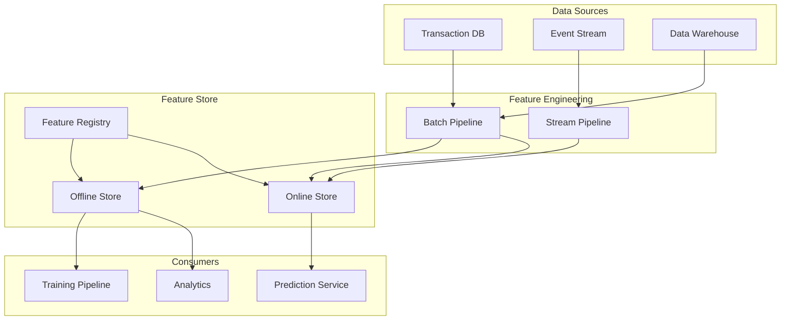

# How to Implement Feature Stores

Author: [nawazdhandala](https://www.github.com/nawazdhandala)

Tags: MLOps, Feature Store, Machine Learning, Data Engineering, Python, Feast, Redis

Description: Learn how to implement a feature store for machine learning systems, covering feature definition, storage strategies, online and offline serving, and integration with training pipelines.

---

Feature stores solve a fundamental problem in ML systems: the disconnect between features used during training and features available at prediction time. Without a feature store, teams often duplicate feature engineering code, leading to training-serving skew and maintenance headaches. This guide walks through implementing a feature store that serves consistent features for both training and inference.

## Feature Store Architecture



## Defining Features with Feast

Feast is a popular open-source feature store. Let us set it up and define features.

```python
# feature_repo/feature_definitions.py
from datetime import timedelta
from feast import Entity, Feature, FeatureView, FileSource, ValueType
from feast.types import Float32, Int64, String

# Define entities (primary keys for feature lookup)
customer = Entity(
    name="customer_id",
    value_type=ValueType.INT64,
    description="Unique customer identifier"
)

# Define data source for batch features
customer_transactions_source = FileSource(
    path="data/customer_transactions.parquet",
    timestamp_field="event_timestamp",
    created_timestamp_column="created_timestamp"
)

# Define feature view (a group of related features)
customer_transaction_features = FeatureView(
    name="customer_transaction_features",
    entities=["customer_id"],
    ttl=timedelta(days=90),  # Feature freshness requirement
    features=[
        Feature(name="total_transactions_30d", dtype=Float32),
        Feature(name="avg_transaction_amount_30d", dtype=Float32),
        Feature(name="max_transaction_amount_30d", dtype=Float32),
        Feature(name="transaction_count_7d", dtype=Int64),
        Feature(name="unique_merchants_30d", dtype=Int64),
    ],
    online=True,  # Enable online serving
    source=customer_transactions_source,
    tags={"team": "fraud", "version": "v1"}
)

# Streaming features for real-time updates
customer_realtime_source = FileSource(
    path="data/customer_realtime.parquet",
    timestamp_field="event_timestamp"
)

customer_realtime_features = FeatureView(
    name="customer_realtime_features",
    entities=["customer_id"],
    ttl=timedelta(hours=1),  # Short TTL for real-time features
    features=[
        Feature(name="transactions_last_hour", dtype=Int64),
        Feature(name="amount_last_hour", dtype=Float32),
        Feature(name="failed_transactions_last_hour", dtype=Int64),
    ],
    online=True,
    source=customer_realtime_source,
    tags={"team": "fraud", "version": "v1"}
)
```

### Feature Store Configuration

```yaml
# feature_repo/feature_store.yaml
project: fraud_detection
registry: data/registry.db
provider: local

online_store:
  type: redis
  connection_string: "localhost:6379"

offline_store:
  type: file

entity_key_serialization_version: 2
```

## Building Feature Engineering Pipelines

### Batch Feature Engineering

```python
# pipelines/batch_features.py
import pandas as pd
from datetime import datetime, timedelta
from typing import Optional

class CustomerFeatureBuilder:
    """
    Build batch features from transaction data.

    Calculates aggregated features over different time windows.
    """

    def __init__(self, transactions_df: pd.DataFrame):
        self.transactions = transactions_df
        self.transactions['timestamp'] = pd.to_datetime(
            self.transactions['timestamp']
        )

    def build_features(
        self,
        as_of_date: Optional[datetime] = None
    ) -> pd.DataFrame:
        """
        Build all customer features as of a specific date.

        Args:
            as_of_date: Point-in-time for feature calculation.
                       Defaults to now.

        Returns:
            DataFrame with customer_id and computed features
        """
        if as_of_date is None:
            as_of_date = datetime.now()

        # Filter transactions up to as_of_date (point-in-time correctness)
        valid_transactions = self.transactions[
            self.transactions['timestamp'] <= as_of_date
        ]

        # Calculate features for different windows
        features_30d = self._calculate_window_features(
            valid_transactions,
            as_of_date,
            days=30
        )

        features_7d = self._calculate_window_features(
            valid_transactions,
            as_of_date,
            days=7
        )

        # Merge features
        features = features_30d.merge(
            features_7d,
            on='customer_id',
            how='outer',
            suffixes=('_30d', '_7d')
        )

        # Add timestamp for Feast
        features['event_timestamp'] = as_of_date
        features['created_timestamp'] = datetime.now()

        return features

    def _calculate_window_features(
        self,
        df: pd.DataFrame,
        as_of_date: datetime,
        days: int
    ) -> pd.DataFrame:
        """Calculate aggregated features for a time window."""
        window_start = as_of_date - timedelta(days=days)

        window_df = df[
            (df['timestamp'] > window_start) &
            (df['timestamp'] <= as_of_date)
        ]

        features = window_df.groupby('customer_id').agg({
            'amount': ['sum', 'mean', 'max', 'count'],
            'merchant_id': 'nunique'
        }).reset_index()

        # Flatten column names
        features.columns = [
            'customer_id',
            f'total_transactions',
            f'avg_transaction_amount',
            f'max_transaction_amount',
            f'transaction_count',
            f'unique_merchants'
        ]

        return features

# Run batch feature pipeline
def run_batch_pipeline():
    # Load raw data
    transactions = pd.read_parquet("data/raw_transactions.parquet")

    # Build features
    builder = CustomerFeatureBuilder(transactions)
    features = builder.build_features()

    # Save for Feast to ingest
    features.to_parquet(
        "data/customer_transactions.parquet",
        index=False
    )

    print(f"Built features for {len(features)} customers")
```

### Streaming Feature Pipeline

For real-time features, use a streaming pipeline.

```python
# pipelines/streaming_features.py
from kafka import KafkaConsumer
import redis
import json
from datetime import datetime, timedelta
from collections import defaultdict
import threading

class StreamingFeatureProcessor:
    """
    Process transaction events in real-time and update features.

    Maintains sliding window aggregations in Redis.
    """

    def __init__(
        self,
        kafka_bootstrap: str,
        redis_host: str,
        redis_port: int = 6379
    ):
        self.consumer = KafkaConsumer(
            'transactions',
            bootstrap_servers=kafka_bootstrap,
            value_deserializer=lambda m: json.loads(m.decode('utf-8'))
        )
        self.redis = redis.Redis(host=redis_host, port=redis_port)

        # Window configuration
        self.window_duration = timedelta(hours=1)

    def process_event(self, event: dict):
        """
        Process a single transaction event.

        Updates real-time feature aggregations in Redis.
        """
        customer_id = event['customer_id']
        amount = event['amount']
        success = event.get('success', True)
        timestamp = datetime.fromisoformat(event['timestamp'])

        # Key for this customer's hourly features
        feature_key = f"customer:{customer_id}:realtime"

        # Use Redis pipeline for atomic updates
        pipe = self.redis.pipeline()

        # Increment transaction count
        pipe.hincrby(feature_key, 'transactions_last_hour', 1)

        # Add to amount total
        pipe.hincrbyfloat(feature_key, 'amount_last_hour', amount)

        # Track failed transactions
        if not success:
            pipe.hincrby(feature_key, 'failed_transactions_last_hour', 1)

        # Set TTL to auto-expire old data
        pipe.expire(feature_key, int(self.window_duration.total_seconds()))

        pipe.execute()

    def run(self):
        """Start consuming events."""
        print("Starting streaming feature processor...")

        for message in self.consumer:
            try:
                self.process_event(message.value)
            except Exception as e:
                print(f"Error processing event: {e}")

# More sophisticated sliding window with time buckets
class SlidingWindowAggregator:
    """
    Maintain accurate sliding window aggregations.

    Uses time buckets to efficiently expire old data.
    """

    def __init__(self, redis_client: redis.Redis, window_minutes: int = 60):
        self.redis = redis_client
        self.window_minutes = window_minutes
        self.bucket_minutes = 5  # 5-minute buckets

    def _get_bucket_key(self, customer_id: str, timestamp: datetime) -> str:
        """Get the bucket key for a timestamp."""
        bucket = timestamp.minute // self.bucket_minutes
        hour_key = timestamp.strftime("%Y%m%d%H")
        return f"customer:{customer_id}:bucket:{hour_key}:{bucket}"

    def add_transaction(self, customer_id: str, amount: float):
        """Add a transaction to the current bucket."""
        now = datetime.now()
        bucket_key = self._get_bucket_key(customer_id, now)

        pipe = self.redis.pipeline()
        pipe.hincrby(bucket_key, 'count', 1)
        pipe.hincrbyfloat(bucket_key, 'amount', amount)
        pipe.expire(bucket_key, self.window_minutes * 60 + 60)  # Extra buffer
        pipe.execute()

    def get_window_aggregates(self, customer_id: str) -> dict:
        """Get aggregated values across all buckets in the window."""
        now = datetime.now()
        total_count = 0
        total_amount = 0.0

        # Iterate through all buckets in the window
        for minutes_ago in range(0, self.window_minutes, self.bucket_minutes):
            bucket_time = now - timedelta(minutes=minutes_ago)
            bucket_key = self._get_bucket_key(customer_id, bucket_time)

            values = self.redis.hgetall(bucket_key)
            if values:
                total_count += int(values.get(b'count', 0))
                total_amount += float(values.get(b'amount', 0))

        return {
            'transactions_last_hour': total_count,
            'amount_last_hour': total_amount
        }
```

## Serving Features

### Online Feature Retrieval

```python
# serving/online_features.py
from feast import FeatureStore
from typing import List, Dict, Any
import numpy as np

class OnlineFeatureService:
    """
    Serve features for real-time predictions.

    Retrieves features from the online store with low latency.
    """

    def __init__(self, repo_path: str = "feature_repo"):
        self.store = FeatureStore(repo_path=repo_path)

        # Define which features to retrieve
        self.feature_refs = [
            "customer_transaction_features:total_transactions_30d",
            "customer_transaction_features:avg_transaction_amount_30d",
            "customer_transaction_features:max_transaction_amount_30d",
            "customer_transaction_features:transaction_count_7d",
            "customer_realtime_features:transactions_last_hour",
            "customer_realtime_features:amount_last_hour",
        ]

    def get_features(self, customer_ids: List[int]) -> Dict[int, Dict[str, Any]]:
        """
        Get features for a list of customers.

        Args:
            customer_ids: List of customer IDs

        Returns:
            Dictionary mapping customer_id to feature values
        """
        # Build entity rows
        entity_rows = [
            {"customer_id": cid} for cid in customer_ids
        ]

        # Retrieve from online store
        response = self.store.get_online_features(
            features=self.feature_refs,
            entity_rows=entity_rows
        )

        # Convert to dictionary format
        features_dict = response.to_dict()

        # Restructure by customer
        result = {}
        for i, cid in enumerate(customer_ids):
            result[cid] = {
                key: values[i]
                for key, values in features_dict.items()
                if key != 'customer_id'
            }

        return result

    def get_feature_vector(self, customer_id: int) -> np.ndarray:
        """
        Get features as a numpy array for model input.

        Returns features in a consistent order for the model.
        """
        features = self.get_features([customer_id])[customer_id]

        # Order matters for model input
        feature_order = [
            'total_transactions_30d',
            'avg_transaction_amount_30d',
            'max_transaction_amount_30d',
            'transaction_count_7d',
            'transactions_last_hour',
            'amount_last_hour',
        ]

        vector = np.array([
            features.get(f, 0.0) or 0.0  # Handle None values
            for f in feature_order
        ])

        return vector

# Usage in prediction service
feature_service = OnlineFeatureService()

def predict_fraud(customer_id: int, transaction_amount: float) -> float:
    # Get historical features
    features = feature_service.get_feature_vector(customer_id)

    # Add current transaction as a feature
    model_input = np.append(features, transaction_amount)

    # Run prediction
    prediction = fraud_model.predict([model_input])[0]

    return prediction
```

### Offline Feature Retrieval for Training

```python
# training/get_training_data.py
from feast import FeatureStore
import pandas as pd
from datetime import datetime

def get_training_dataset(
    entity_df: pd.DataFrame,
    feature_refs: List[str],
    repo_path: str = "feature_repo"
) -> pd.DataFrame:
    """
    Get point-in-time correct training dataset.

    Args:
        entity_df: DataFrame with customer_id and event_timestamp columns
        feature_refs: List of feature references to retrieve
        repo_path: Path to Feast feature repo

    Returns:
        DataFrame with entities joined to features
    """
    store = FeatureStore(repo_path=repo_path)

    # Feast handles point-in-time joins automatically
    training_df = store.get_historical_features(
        entity_df=entity_df,
        features=feature_refs
    ).to_df()

    return training_df

# Example: Build training dataset
def build_fraud_training_data():
    # Load labeled examples with timestamps
    labels = pd.read_parquet("data/fraud_labels.parquet")

    # Prepare entity dataframe
    entity_df = labels[['customer_id', 'event_timestamp', 'is_fraud']]

    # Get features point-in-time
    feature_refs = [
        "customer_transaction_features:total_transactions_30d",
        "customer_transaction_features:avg_transaction_amount_30d",
        "customer_transaction_features:max_transaction_amount_30d",
        "customer_transaction_features:transaction_count_7d",
        "customer_transaction_features:unique_merchants_30d",
    ]

    training_data = get_training_dataset(entity_df, feature_refs)

    # Now training_data has features as they existed at each event_timestamp
    # This prevents data leakage from future data

    return training_data
```

## Feature Validation and Monitoring

```python
# validation/feature_validator.py
from great_expectations.core import ExpectationSuite
import great_expectations as ge

class FeatureValidator:
    """
    Validate features before serving or training.

    Catches data quality issues early.
    """

    def __init__(self):
        self.expectations = {}

    def add_expectation(
        self,
        feature_name: str,
        min_value: float = None,
        max_value: float = None,
        not_null: bool = True
    ):
        """Add validation rules for a feature."""
        self.expectations[feature_name] = {
            'min': min_value,
            'max': max_value,
            'not_null': not_null
        }

    def validate(self, features: Dict[str, Any]) -> Dict[str, List[str]]:
        """
        Validate feature values against expectations.

        Returns dict of feature_name -> list of violations
        """
        violations = {}

        for name, rules in self.expectations.items():
            feature_violations = []
            value = features.get(name)

            if rules['not_null'] and value is None:
                feature_violations.append("Value is null")
            elif value is not None:
                if rules['min'] is not None and value < rules['min']:
                    feature_violations.append(
                        f"Value {value} below minimum {rules['min']}"
                    )
                if rules['max'] is not None and value > rules['max']:
                    feature_violations.append(
                        f"Value {value} above maximum {rules['max']}"
                    )

            if feature_violations:
                violations[name] = feature_violations

        return violations

# Configure validation
validator = FeatureValidator()
validator.add_expectation('total_transactions_30d', min_value=0, max_value=10000)
validator.add_expectation('avg_transaction_amount_30d', min_value=0, max_value=100000)
validator.add_expectation('transaction_count_7d', min_value=0)
```

## Summary

| Component | Purpose | Storage |
|-----------|---------|---------|
| **Offline Store** | Training data retrieval | Parquet/Data Warehouse |
| **Online Store** | Low-latency serving | Redis/DynamoDB |
| **Feature Registry** | Feature definitions | SQLite/PostgreSQL |
| **Batch Pipeline** | Compute aggregated features | Spark/Pandas |
| **Stream Pipeline** | Real-time feature updates | Kafka/Flink |

Feature stores bridge the gap between training and serving by providing a single source of truth for feature definitions and values. By implementing proper feature stores, you eliminate training-serving skew and make feature engineering reusable across models.
