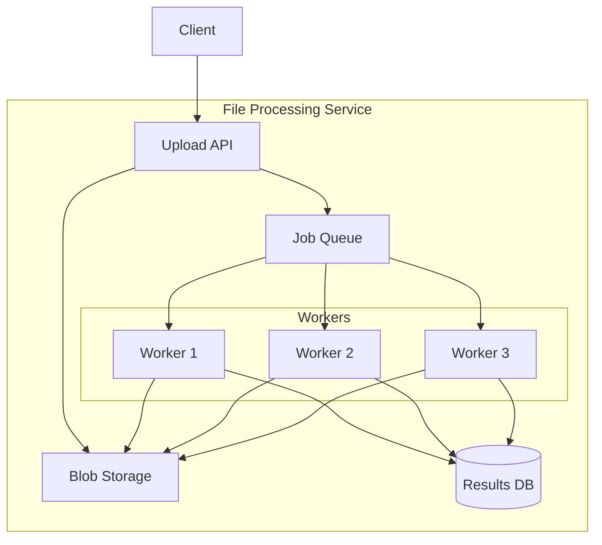

# How to Build a File Processing Service in .NET

Author: [nawazdhandala](https://www.github.com/nawazdhandala)

Tags: .NET, C#, File Processing, Background Services, Async, Streaming, DevOps

Description: Learn how to build a scalable file processing service in .NET using background services, streaming, parallel processing, and proper error handling for production workloads.

---

Processing files at scale requires careful design. Whether you are handling CSV imports, image transformations, or document parsing, a well-structured file processing service can handle thousands of files without running out of memory or blocking your main application.

## Architecture Overview

A file processing service typically consists of several components working together: an API to receive uploads, a queue for job management, background workers for actual processing, and storage for results.



## Setting Up the Project

First, create a new .NET project with the required packages.

```bash
dotnet new webapi -n FileProcessingService
cd FileProcessingService
dotnet add package Azure.Storage.Blobs
dotnet add package Microsoft.Extensions.Hosting
```

## File Upload API

The upload endpoint should stream files directly to storage rather than loading them entirely into memory. This approach handles large files efficiently.

```csharp
// Controllers/FileController.cs
using Microsoft.AspNetCore.Mvc;
using Microsoft.AspNetCore.WebUtilities;
using Microsoft.Net.Http.Headers;

[ApiController]
[Route("api/[controller]")]
public class FileController : ControllerBase
{
    private readonly IFileStorageService _storage;
    private readonly IJobQueue _jobQueue;
    private readonly ILogger<FileController> _logger;

    public FileController(
        IFileStorageService storage,
        IJobQueue jobQueue,
        ILogger<FileController> logger)
    {
        _storage = storage;
        _jobQueue = jobQueue;
        _logger = logger;
    }

    // Stream upload directly to storage without buffering in memory
    [HttpPost("upload")]
    [RequestSizeLimit(500_000_000)] // 500 MB limit
    [DisableRequestSizeLimit]
    public async Task<IActionResult> Upload()
    {
        // Check content type for multipart form data
        if (!Request.ContentType?.StartsWith("multipart/") ?? true)
        {
            return BadRequest("Expected multipart content");
        }

        var boundary = HeaderUtilities.RemoveQuotes(
            MediaTypeHeaderValue.Parse(Request.ContentType).Boundary
        ).Value;

        var reader = new MultipartReader(boundary!, Request.Body);
        var section = await reader.ReadNextSectionAsync();
        var uploadedFiles = new List<FileUploadResult>();

        while (section != null)
        {
            // Get the file name from content disposition header
            var hasContentDisposition = ContentDispositionHeaderValue.TryParse(
                section.ContentDisposition, out var contentDisposition);

            if (hasContentDisposition && contentDisposition!.DispositionType == "form-data"
                && !string.IsNullOrEmpty(contentDisposition.FileName.Value))
            {
                var fileName = Path.GetFileName(contentDisposition.FileName.Value);
                var fileId = Guid.NewGuid().ToString();

                // Stream directly to blob storage
                var blobPath = $"uploads/{fileId}/{fileName}";
                await _storage.UploadStreamAsync(blobPath, section.Body);

                // Queue a job for processing
                var job = new FileProcessingJob
                {
                    Id = fileId,
                    FileName = fileName,
                    BlobPath = blobPath,
                    UploadedAt = DateTime.UtcNow
                };
                await _jobQueue.EnqueueAsync(job);

                uploadedFiles.Add(new FileUploadResult
                {
                    FileId = fileId,
                    FileName = fileName,
                    Status = "Queued"
                });

                _logger.LogInformation(
                    "File {FileName} uploaded and queued for processing", fileName);
            }

            section = await reader.ReadNextSectionAsync();
        }

        return Ok(uploadedFiles);
    }

    // Check processing status
    [HttpGet("status/{fileId}")]
    public async Task<IActionResult> GetStatus(string fileId)
    {
        var job = await _jobQueue.GetJobStatusAsync(fileId);
        if (job == null)
        {
            return NotFound();
        }
        return Ok(job);
    }
}
```

## Blob Storage Service

The storage service abstracts away the underlying storage provider. This example uses Azure Blob Storage, but you can swap it for S3 or local file system.

```csharp
// Services/AzureBlobStorageService.cs
using Azure.Storage.Blobs;
using Azure.Storage.Blobs.Models;

public interface IFileStorageService
{
    Task UploadStreamAsync(string path, Stream content);
    Task<Stream> DownloadStreamAsync(string path);
    Task DeleteAsync(string path);
}

public class AzureBlobStorageService : IFileStorageService
{
    private readonly BlobContainerClient _container;
    private readonly ILogger<AzureBlobStorageService> _logger;

    public AzureBlobStorageService(
        IConfiguration configuration,
        ILogger<AzureBlobStorageService> logger)
    {
        var connectionString = configuration["Azure:StorageConnectionString"];
        var containerName = configuration["Azure:ContainerName"] ?? "files";

        _container = new BlobContainerClient(connectionString, containerName);
        _logger = logger;
    }

    public async Task UploadStreamAsync(string path, Stream content)
    {
        var blob = _container.GetBlobClient(path);

        // Upload with progress tracking for large files
        var options = new BlobUploadOptions
        {
            TransferOptions = new Azure.Storage.StorageTransferOptions
            {
                MaximumConcurrency = 4,
                MaximumTransferSize = 50 * 1024 * 1024 // 50 MB chunks
            }
        };

        await blob.UploadAsync(content, options);
        _logger.LogDebug("Uploaded file to {Path}", path);
    }

    public async Task<Stream> DownloadStreamAsync(string path)
    {
        var blob = _container.GetBlobClient(path);
        var response = await blob.DownloadStreamingAsync();
        return response.Value.Content;
    }

    public async Task DeleteAsync(string path)
    {
        var blob = _container.GetBlobClient(path);
        await blob.DeleteIfExistsAsync();
    }
}
```

## Background Worker Service

The worker service processes files from the queue. It runs as a hosted service and can scale horizontally by running multiple instances.

```csharp
// Services/FileProcessingWorker.cs
using System.Threading.Channels;

public class FileProcessingWorker : BackgroundService
{
    private readonly IJobQueue _jobQueue;
    private readonly IFileStorageService _storage;
    private readonly IServiceScopeFactory _scopeFactory;
    private readonly ILogger<FileProcessingWorker> _logger;
    private readonly int _maxConcurrency;

    public FileProcessingWorker(
        IJobQueue jobQueue,
        IFileStorageService storage,
        IServiceScopeFactory scopeFactory,
        IConfiguration configuration,
        ILogger<FileProcessingWorker> logger)
    {
        _jobQueue = jobQueue;
        _storage = storage;
        _scopeFactory = scopeFactory;
        _logger = logger;
        _maxConcurrency = configuration.GetValue<int>("Processing:MaxConcurrency", 4);
    }

    protected override async Task ExecuteAsync(CancellationToken stoppingToken)
    {
        _logger.LogInformation(
            "File processing worker started with concurrency {Concurrency}",
            _maxConcurrency);

        // Process multiple files concurrently using semaphore
        var semaphore = new SemaphoreSlim(_maxConcurrency);
        var tasks = new List<Task>();

        while (!stoppingToken.IsCancellationRequested)
        {
            try
            {
                // Wait for a job from the queue
                var job = await _jobQueue.DequeueAsync(stoppingToken);

                await semaphore.WaitAsync(stoppingToken);

                // Process in background task
                var task = Task.Run(async () =>
                {
                    try
                    {
                        await ProcessFileAsync(job, stoppingToken);
                    }
                    finally
                    {
                        semaphore.Release();
                    }
                }, stoppingToken);

                tasks.Add(task);

                // Clean up completed tasks periodically
                tasks.RemoveAll(t => t.IsCompleted);
            }
            catch (OperationCanceledException)
            {
                break;
            }
            catch (Exception ex)
            {
                _logger.LogError(ex, "Error in processing loop");
                await Task.Delay(1000, stoppingToken);
            }
        }

        // Wait for remaining tasks to complete
        await Task.WhenAll(tasks);
    }

    private async Task ProcessFileAsync(
        FileProcessingJob job,
        CancellationToken cancellationToken)
    {
        _logger.LogInformation("Processing file {FileId}: {FileName}",
            job.Id, job.FileName);

        try
        {
            await _jobQueue.UpdateStatusAsync(job.Id, JobStatus.Processing);

            // Download file stream
            await using var inputStream = await _storage.DownloadStreamAsync(job.BlobPath);

            // Process based on file type
            var result = job.FileName.ToLower() switch
            {
                var f when f.EndsWith(".csv") => await ProcessCsvAsync(inputStream, job),
                var f when f.EndsWith(".json") => await ProcessJsonAsync(inputStream, job),
                var f when f.EndsWith(".xml") => await ProcessXmlAsync(inputStream, job),
                _ => await ProcessGenericAsync(inputStream, job)
            };

            await _jobQueue.UpdateStatusAsync(job.Id, JobStatus.Completed, result);
            _logger.LogInformation("Completed processing file {FileId}", job.Id);
        }
        catch (Exception ex)
        {
            _logger.LogError(ex, "Failed to process file {FileId}", job.Id);
            await _jobQueue.UpdateStatusAsync(job.Id, JobStatus.Failed, null, ex.Message);
        }
    }

    private async Task<ProcessingResult> ProcessCsvAsync(
        Stream stream,
        FileProcessingJob job)
    {
        var rowCount = 0;
        var errors = new List<string>();

        // Use StreamReader for memory-efficient line reading
        using var reader = new StreamReader(stream);

        // Skip header
        await reader.ReadLineAsync();

        while (!reader.EndOfStream)
        {
            var line = await reader.ReadLineAsync();
            if (string.IsNullOrWhiteSpace(line)) continue;

            try
            {
                // Parse and validate each row
                var columns = line.Split(',');
                // Process row data here
                rowCount++;
            }
            catch (Exception ex)
            {
                errors.Add($"Row {rowCount + 1}: {ex.Message}");
            }
        }

        return new ProcessingResult
        {
            RowsProcessed = rowCount,
            Errors = errors
        };
    }

    private async Task<ProcessingResult> ProcessJsonAsync(
        Stream stream,
        FileProcessingJob job)
    {
        // Stream JSON parsing for large files
        var document = await JsonDocument.ParseAsync(stream);
        var elementCount = 0;

        if (document.RootElement.ValueKind == JsonValueKind.Array)
        {
            foreach (var element in document.RootElement.EnumerateArray())
            {
                // Process each element
                elementCount++;
            }
        }

        return new ProcessingResult { RowsProcessed = elementCount };
    }

    private async Task<ProcessingResult> ProcessXmlAsync(
        Stream stream,
        FileProcessingJob job)
    {
        var settings = new XmlReaderSettings { Async = true };
        var elementCount = 0;

        using var reader = XmlReader.Create(stream, settings);
        while (await reader.ReadAsync())
        {
            if (reader.NodeType == XmlNodeType.Element)
            {
                elementCount++;
            }
        }

        return new ProcessingResult { RowsProcessed = elementCount };
    }

    private Task<ProcessingResult> ProcessGenericAsync(
        Stream stream,
        FileProcessingJob job)
    {
        return Task.FromResult(new ProcessingResult
        {
            RowsProcessed = 1,
            Message = "File stored without processing"
        });
    }
}
```

## Job Queue Implementation

A simple in-memory queue works for development, but production systems need a persistent queue like Redis or RabbitMQ.

```csharp
// Services/JobQueue.cs
using System.Threading.Channels;

public interface IJobQueue
{
    Task EnqueueAsync(FileProcessingJob job);
    Task<FileProcessingJob> DequeueAsync(CancellationToken cancellationToken);
    Task<FileProcessingJob?> GetJobStatusAsync(string id);
    Task UpdateStatusAsync(string id, JobStatus status,
        ProcessingResult? result = null, string? error = null);
}

public class InMemoryJobQueue : IJobQueue
{
    private readonly Channel<FileProcessingJob> _queue;
    private readonly ConcurrentDictionary<string, FileProcessingJob> _jobs;

    public InMemoryJobQueue()
    {
        // Bounded channel prevents memory issues with too many queued jobs
        var options = new BoundedChannelOptions(1000)
        {
            FullMode = BoundedChannelFullMode.Wait
        };
        _queue = Channel.CreateBounded<FileProcessingJob>(options);
        _jobs = new ConcurrentDictionary<string, FileProcessingJob>();
    }

    public async Task EnqueueAsync(FileProcessingJob job)
    {
        job.Status = JobStatus.Queued;
        _jobs[job.Id] = job;
        await _queue.Writer.WriteAsync(job);
    }

    public async Task<FileProcessingJob> DequeueAsync(
        CancellationToken cancellationToken)
    {
        return await _queue.Reader.ReadAsync(cancellationToken);
    }

    public Task<FileProcessingJob?> GetJobStatusAsync(string id)
    {
        _jobs.TryGetValue(id, out var job);
        return Task.FromResult(job);
    }

    public Task UpdateStatusAsync(string id, JobStatus status,
        ProcessingResult? result = null, string? error = null)
    {
        if (_jobs.TryGetValue(id, out var job))
        {
            job.Status = status;
            job.Result = result;
            job.Error = error;
            job.CompletedAt = status == JobStatus.Completed || status == JobStatus.Failed
                ? DateTime.UtcNow
                : null;
        }
        return Task.CompletedTask;
    }
}
```

## Models

```csharp
// Models/FileProcessingModels.cs
public class FileProcessingJob
{
    public string Id { get; set; } = string.Empty;
    public string FileName { get; set; } = string.Empty;
    public string BlobPath { get; set; } = string.Empty;
    public DateTime UploadedAt { get; set; }
    public DateTime? CompletedAt { get; set; }
    public JobStatus Status { get; set; }
    public ProcessingResult? Result { get; set; }
    public string? Error { get; set; }
}

public enum JobStatus
{
    Queued,
    Processing,
    Completed,
    Failed
}

public class ProcessingResult
{
    public int RowsProcessed { get; set; }
    public List<string> Errors { get; set; } = new();
    public string? Message { get; set; }
}

public class FileUploadResult
{
    public string FileId { get; set; } = string.Empty;
    public string FileName { get; set; } = string.Empty;
    public string Status { get; set; } = string.Empty;
}
```

## Program Configuration

Wire everything together in Program.cs.

```csharp
// Program.cs
var builder = WebApplication.CreateBuilder(args);

// Add services
builder.Services.AddControllers();
builder.Services.AddSingleton<IJobQueue, InMemoryJobQueue>();
builder.Services.AddSingleton<IFileStorageService, AzureBlobStorageService>();
builder.Services.AddHostedService<FileProcessingWorker>();

// Configure request size limits
builder.WebHost.ConfigureKestrel(options =>
{
    options.Limits.MaxRequestBodySize = 500_000_000; // 500 MB
});

var app = builder.Build();

app.MapControllers();
app.Run();
```

## Error Handling and Retries

Add retry logic for transient failures during file processing.

```csharp
// Services/RetryPolicy.cs
public static class RetryPolicy
{
    public static async Task<T> ExecuteWithRetryAsync<T>(
        Func<Task<T>> operation,
        int maxRetries = 3,
        int baseDelayMs = 1000)
    {
        var attempt = 0;
        while (true)
        {
            try
            {
                return await operation();
            }
            catch (Exception ex) when (IsTransient(ex) && attempt < maxRetries)
            {
                attempt++;
                var delay = baseDelayMs * (int)Math.Pow(2, attempt - 1);
                await Task.Delay(delay);
            }
        }
    }

    private static bool IsTransient(Exception ex)
    {
        return ex is HttpRequestException
            || ex is TimeoutException
            || ex is IOException;
    }
}
```

## Summary

| Component | Responsibility |
|-----------|----------------|
| Upload API | Stream files to storage, queue jobs |
| Job Queue | Manage processing jobs with status tracking |
| Background Worker | Process files with concurrency control |
| Blob Storage | Store raw and processed files |

Building a file processing service in .NET requires streaming for memory efficiency, background workers for non-blocking processing, and proper error handling for reliability. The patterns shown here scale from handling a few files per day to thousands per hour.
