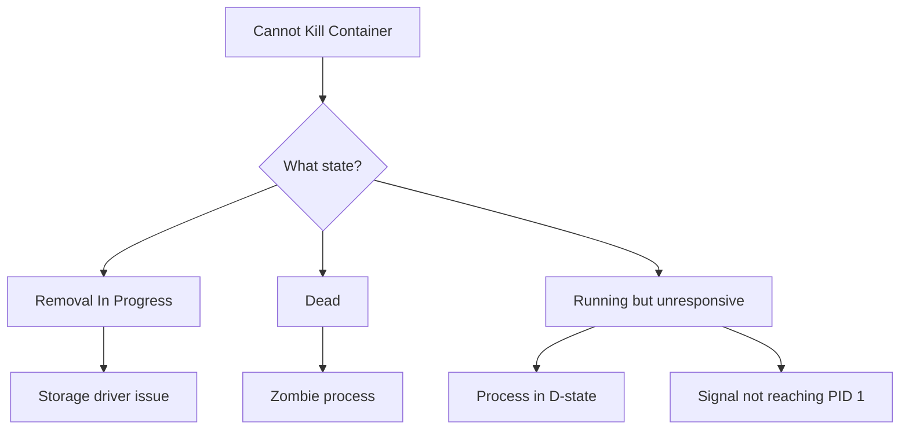

# How to Fix Docker 'Cannot Kill Container' Errors

Author: [nawazdhandala](https://www.github.com/nawazdhandala)

Tags: Docker, Troubleshooting, DevOps, Debugging, Linux

Description: Diagnose and resolve Docker containers that refuse to stop or be killed, including zombie processes, D-state hangs, and device mapper issues.

---

Few things are more frustrating than a container that refuses to die. You run `docker stop`, wait patiently, then `docker kill`, and nothing happens. The container sits there in a "Removal In Progress" or "Dead" state, blocking deployments and wasting resources. This guide covers the common causes and solutions.

## Understanding the Problem

When Docker cannot kill a container, the issue usually falls into one of these categories:



## Check Container State First

Before trying fixes, understand what state the container is in:

```bash
# Get detailed container state
docker inspect problem-container --format '{{json .State}}' | jq

# Check for any errors in state
docker inspect problem-container --format '{{.State.Error}}'

# List all containers including dead ones
docker ps -a --filter "status=dead" --filter "status=removing"
```

Common state scenarios:
- `Status: removing` with `Error: ""` - Storage driver hang
- `Status: dead` - Container process died but cleanup failed
- `Status: running` but `docker exec` hangs - Process in uninterruptible sleep

## Solution 1: Wait and Retry with Force

Sometimes Docker just needs time to clean up, especially with slow storage:

```bash
# Stop with extended timeout (default is 10 seconds)
docker stop --time=60 problem-container

# If stop does not work, try kill with different signals
docker kill --signal=SIGTERM problem-container
sleep 5
docker kill --signal=SIGKILL problem-container

# Force remove
docker rm --force problem-container
```

## Solution 2: Restart Docker Daemon

The simplest fix for most "cannot kill" issues is restarting Docker:

```bash
# Graceful restart (tries to stop containers properly)
sudo systemctl restart docker

# Check if container is gone
docker ps -a | grep problem-container

# If still there, check Docker logs
sudo journalctl -u docker.service --since "5 minutes ago"
```

Warning: Restarting Docker affects all containers on the host. In production, this may not be acceptable during business hours.

## Solution 3: Kill the Container Process Directly

Find and kill the container's main process at the host level:

```bash
# Find the container's PID
docker inspect problem-container --format '{{.State.Pid}}'

# Or find it using the container ID
CONTAINER_ID=$(docker inspect problem-container --format '{{.Id}}')
PID=$(cat /sys/fs/cgroup/memory/docker/$CONTAINER_ID/cgroup.procs | head -1)

# Kill the process directly
sudo kill -9 $PID

# Now Docker should be able to clean up
docker rm --force problem-container
```

If the process is in uninterruptible sleep (D state), direct kill will not work either:

```bash
# Check process state
ps aux | grep $PID

# D state means waiting on I/O - often NFS or device mapper
# Check what the process is waiting on
sudo cat /proc/$PID/wchan
sudo cat /proc/$PID/stack
```

## Solution 4: Fix Storage Driver Issues

Device mapper and overlay storage drivers can leave containers in a stuck state:

```bash
# Check for device mapper errors
sudo dmesg | grep -i "device-mapper\|dm-"

# List all device mapper devices
sudo dmsetup ls

# Find the container's device mapper device
CONTAINER_ID=$(docker inspect problem-container --format '{{.Id}}')
sudo dmsetup ls | grep $CONTAINER_ID

# Remove the device mapper device
sudo dmsetup remove /dev/mapper/docker-xxx--xxx--$CONTAINER_ID

# Now remove the container
docker rm --force problem-container
```

For overlay2 storage driver issues:

```bash
# Find the container's mount
mount | grep $CONTAINER_ID

# Force unmount if stuck
sudo umount -l /var/lib/docker/overlay2/$CONTAINER_ID/merged

# Clean up
docker rm --force problem-container
```

## Solution 5: Handle Zombie Containers

Zombie (defunct) container processes have finished but their parent has not acknowledged:

```bash
# Check for zombie processes
ps aux | awk '$8=="Z" {print}'

# Find zombie's parent
ZOMBIE_PID=12345
PARENT_PID=$(ps -o ppid= -p $ZOMBIE_PID)

# Kill the parent to clean up zombie
sudo kill -9 $PARENT_PID

# If parent is dockerd, restart Docker instead
sudo systemctl restart docker
```

## Solution 6: Clean Up Container Files Manually

As a last resort, remove the container's files directly:

```bash
# Stop Docker first
sudo systemctl stop docker

# Find and remove container directory
CONTAINER_ID=$(docker inspect problem-container --format '{{.Id}}' 2>/dev/null || echo "")

# If inspect does not work, find by name
sudo ls -la /var/lib/docker/containers/ | grep -i problem

# Remove container directory
sudo rm -rf /var/lib/docker/containers/$CONTAINER_ID

# Remove container config from Docker state
# This is in /var/lib/docker/containers/*/config.v2.json

# Start Docker
sudo systemctl start docker
```

Warning: Manual cleanup can leave orphaned resources. Run cleanup after:

```bash
# Remove orphaned volumes
docker volume prune

# Remove unused networks
docker network prune

# Full cleanup
docker system prune
```

## Solution 7: Fix NFS or Network Storage Hangs

Containers using NFS volumes can hang when the NFS server is unreachable:

```bash
# Check for NFS mounts in container
docker inspect problem-container --format '{{range .Mounts}}{{.Source}}{{"\n"}}{{end}}'

# Check NFS status
showmount -e nfs-server
nfsstat -c

# Check for hung NFS operations
mount | grep nfs
cat /proc/mounts | grep nfs

# Force unmount NFS (may lose data)
sudo umount -f /mnt/nfs-mount
sudo umount -l /mnt/nfs-mount  # Lazy unmount

# Now Docker should be able to clean up
docker rm --force problem-container
```

## Prevention: Configure Proper Signal Handling

Many "cannot kill" issues stem from applications not handling signals properly:

```dockerfile
# Use exec form for CMD to ensure signals reach your app
CMD ["node", "server.js"]

# NOT shell form (signals go to shell, not app)
# CMD node server.js

# For shell scripts, trap signals
COPY entrypoint.sh /entrypoint.sh
ENTRYPOINT ["/entrypoint.sh"]
```

```bash
#!/bin/sh
# entrypoint.sh with proper signal handling

# Trap SIGTERM and SIGINT
trap 'echo "Caught signal, shutting down..."; kill -TERM $PID; wait $PID' TERM INT

# Start application in background
node server.js &
PID=$!

# Wait for application to exit
wait $PID
EXIT_STATUS=$?

echo "Application exited with status $EXIT_STATUS"
exit $EXIT_STATUS
```

## Prevention: Use Health Checks and Restart Policies

Proper health checks prevent containers from getting into stuck states:

```yaml
# docker-compose.yml
version: '3.8'
services:
  api:
    image: myapp:latest
    healthcheck:
      test: ["CMD", "curl", "-f", "http://localhost:8080/health"]
      interval: 30s
      timeout: 10s
      retries: 3
      start_period: 40s
    stop_grace_period: 30s
    deploy:
      restart_policy:
        condition: on-failure
        max_attempts: 3
```

## Diagnostic Commands Reference

Keep these commands handy for debugging:

```bash
# Full container state dump
docker inspect problem-container > container-debug.json

# Docker daemon logs
sudo journalctl -u docker.service -f

# System-wide container process list
ps auxf | grep -A 5 containerd-shim

# Check for stuck I/O
iostat -x 1 5

# Check for memory pressure
vmstat 1 5
cat /proc/meminfo | grep -E "MemFree|Buffers|Cached|Dirty"

# Network connections from container
sudo ss -tulpn | grep $CONTAINER_PID
```

---

A container that will not die points to deeper issues: storage driver problems, unresponsive network mounts, or applications that ignore shutdown signals. Fix the immediate problem with force removal, then address the root cause to prevent recurrence. Proper signal handling and health checks eliminate most stuck container scenarios before they happen.
