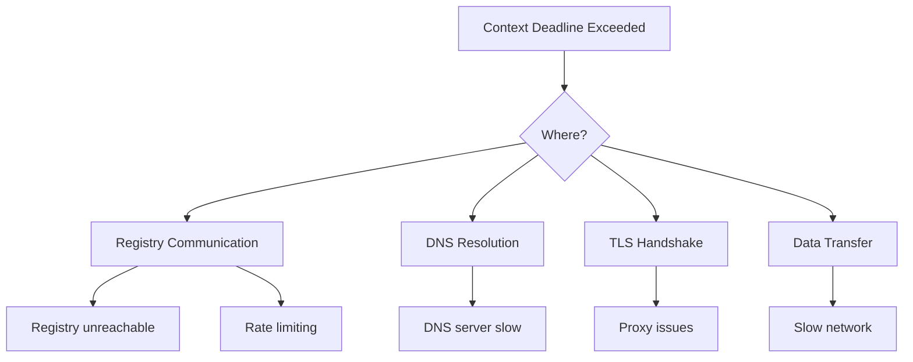

# How to Fix Docker 'Context Deadline Exceeded' Errors

Author: [nawazdhandala](https://www.github.com/nawazdhandala)

Tags: Docker, Troubleshooting, Networking, DevOps, Timeout

Description: Diagnose and resolve Docker context deadline exceeded errors during image pulls, builds, and registry operations caused by network issues, proxy configurations, and timeout settings.

---

The "context deadline exceeded" error means a Docker operation timed out before completing. This typically happens during image pulls, pushes, or registry communications when network conditions are poor or timeouts are too aggressive. This guide covers the common causes and solutions.

## Understanding the Error

The error appears in several forms:

```bash
# During image pull
Error response from daemon: Get "https://registry-1.docker.io/v2/": context deadline exceeded

# During build
failed to solve: nginx:alpine: failed to resolve source metadata: context deadline exceeded

# During push
error pushing image: context deadline exceeded
```

The root cause is always a timeout, but the underlying reason varies:



## Quick Fixes to Try First

### 1. Retry the Command

Transient network issues often resolve themselves:

```bash
# Retry pull a few times
for i in 1 2 3; do
  docker pull nginx:alpine && break
  echo "Attempt $i failed, retrying in 10 seconds..."
  sleep 10
done
```

### 2. Check Basic Connectivity

```bash
# Test if you can reach Docker Hub
curl -I https://registry-1.docker.io/v2/

# Test DNS resolution
nslookup registry-1.docker.io

# Test with a different DNS
nslookup registry-1.docker.io 8.8.8.8
```

### 3. Restart Docker Daemon

```bash
sudo systemctl restart docker

# Or on macOS
# Restart Docker Desktop from the menu bar
```

## Cause 1: Network Connectivity Issues

### Diagnose Network Problems

```bash
# Check if Docker can reach the internet
docker run --rm alpine ping -c 3 8.8.8.8

# Check if DNS works inside containers
docker run --rm alpine nslookup registry-1.docker.io

# Test registry connectivity
docker run --rm alpine wget -q -O- https://registry-1.docker.io/v2/
```

### Solutions

Configure Docker DNS:

```json
// /etc/docker/daemon.json
{
  "dns": ["8.8.8.8", "8.8.4.4"]
}
```

```bash
sudo systemctl restart docker
```

For corporate networks with internal DNS:

```json
{
  "dns": ["10.0.0.53", "8.8.8.8"],
  "dns-search": ["corp.example.com"]
}
```

## Cause 2: Proxy Configuration

Corporate proxies often cause timeout issues:

### Diagnose Proxy Issues

```bash
# Check current proxy settings
echo $HTTP_PROXY $HTTPS_PROXY $NO_PROXY

# Test if proxy is working
curl -x $HTTP_PROXY https://registry-1.docker.io/v2/
```

### Configure Docker Proxy

Create systemd override for dockerd:

```bash
sudo mkdir -p /etc/systemd/system/docker.service.d
sudo tee /etc/systemd/system/docker.service.d/proxy.conf << EOF
[Service]
Environment="HTTP_PROXY=http://proxy.example.com:8080"
Environment="HTTPS_PROXY=http://proxy.example.com:8080"
Environment="NO_PROXY=localhost,127.0.0.1,.example.com"
EOF

sudo systemctl daemon-reload
sudo systemctl restart docker
```

For Docker Desktop, configure proxy in Settings > Resources > Proxies.

### Build-time Proxy

Pass proxy settings during build:

```bash
docker build \
  --build-arg HTTP_PROXY=$HTTP_PROXY \
  --build-arg HTTPS_PROXY=$HTTPS_PROXY \
  --build-arg NO_PROXY=$NO_PROXY \
  -t myapp .
```

## Cause 3: Registry Rate Limiting

Docker Hub limits anonymous pulls to 100 per 6 hours:

```bash
# Check your rate limit status
TOKEN=$(curl -s "https://auth.docker.io/token?service=registry.docker.io&scope=repository:library/alpine:pull" | jq -r .token)
curl -sI -H "Authorization: Bearer $TOKEN" https://registry-1.docker.io/v2/library/alpine/manifests/latest | grep -i ratelimit
```

### Solutions

Login to Docker Hub:

```bash
docker login

# Check authentication
cat ~/.docker/config.json | jq '.auths'
```

Use a registry mirror:

```json
// /etc/docker/daemon.json
{
  "registry-mirrors": ["https://mirror.gcr.io"]
}
```

## Cause 4: Slow or Unreliable Network

Large images on slow connections timeout before completing:

### Increase Docker Timeouts

```json
// /etc/docker/daemon.json
{
  "max-concurrent-downloads": 3,
  "max-concurrent-uploads": 3
}
```

For Buildkit builds:

```bash
# Increase timeout for builds
BUILDKIT_STEP_LOG_MAX_SIZE=10485760 docker build -t myapp .
```

### Pull Layers Individually

```bash
# Get manifest to see layers
docker manifest inspect nginx:alpine

# Pull might succeed with retries
docker pull nginx:alpine --quiet
```

## Cause 5: TLS/SSL Issues

Certificate problems cause handshake timeouts:

```bash
# Test TLS connection
openssl s_client -connect registry-1.docker.io:443 -servername registry-1.docker.io

# Check certificate chain
curl -vI https://registry-1.docker.io/v2/
```

### Solutions

Update CA certificates:

```bash
# Debian/Ubuntu
sudo apt update && sudo apt install -y ca-certificates
sudo update-ca-certificates

# RHEL/CentOS
sudo yum install -y ca-certificates
sudo update-ca-trust
```

For private registries with self-signed certificates:

```bash
# Copy certificate
sudo mkdir -p /etc/docker/certs.d/registry.example.com:5000
sudo cp ca.crt /etc/docker/certs.d/registry.example.com:5000/

# Restart Docker
sudo systemctl restart docker
```

## Cause 6: Firewall Blocking Connections

### Diagnose Firewall Issues

```bash
# Check if port 443 is accessible
nc -zv registry-1.docker.io 443

# Test with different ports
curl -v telnet://registry-1.docker.io:443

# Check local firewall rules
sudo iptables -L -n | grep -E "REJECT|DROP"
```

### Solutions

Allow Docker traffic:

```bash
# UFW
sudo ufw allow out 443/tcp
sudo ufw allow out 80/tcp

# iptables
sudo iptables -A OUTPUT -p tcp --dport 443 -j ACCEPT
sudo iptables -A OUTPUT -p tcp --dport 80 -j ACCEPT
```

## Cause 7: Docker Daemon Issues

The Docker daemon itself may be having problems:

```bash
# Check Docker daemon status
sudo systemctl status docker

# Check Docker logs
sudo journalctl -u docker.service --since "10 minutes ago"

# Check Docker info
docker info 2>&1 | grep -i error
```

### Solutions

Reset Docker networking:

```bash
# Stop Docker
sudo systemctl stop docker

# Remove Docker networks
sudo rm -rf /var/lib/docker/network

# Restart Docker
sudo systemctl start docker
```

Clean up Docker state:

```bash
# Remove unused data
docker system prune -a

# Remove all images and containers
docker system prune -a --volumes
```

## CI/CD Pipeline Solutions

For CI/CD systems that frequently hit this error:

### GitHub Actions

```yaml
jobs:
  build:
    runs-on: ubuntu-latest
    steps:
      - name: Pull with retry
        uses: nick-fields/retry@v2
        with:
          timeout_minutes: 10
          max_attempts: 3
          command: docker pull myimage:latest
```

### GitLab CI

```yaml
build:
  script:
    - |
      for i in 1 2 3 4 5; do
        docker pull $CI_REGISTRY_IMAGE:latest && break
        echo "Retry $i"
        sleep $((i * 10))
      done
```

### Scripted Retry Logic

```bash
#!/bin/bash
# docker-pull-retry.sh

pull_with_retry() {
  local image=$1
  local max_attempts=${2:-5}
  local delay=${3:-10}

  for ((i=1; i<=max_attempts; i++)); do
    echo "Attempt $i of $max_attempts: Pulling $image"

    if docker pull "$image"; then
      echo "Successfully pulled $image"
      return 0
    fi

    if [ $i -lt $max_attempts ]; then
      echo "Pull failed, waiting ${delay}s before retry..."
      sleep $delay
      delay=$((delay * 2))  # Exponential backoff
    fi
  done

  echo "Failed to pull $image after $max_attempts attempts"
  return 1
}

# Usage
pull_with_retry nginx:alpine 5 10
```

## Debugging Checklist

```bash
#!/bin/bash
# diagnose-timeout.sh

echo "=== Docker Daemon Status ==="
sudo systemctl status docker --no-pager

echo -e "\n=== Docker Info ==="
docker info 2>&1 | head -30

echo -e "\n=== Network Connectivity ==="
ping -c 2 8.8.8.8 || echo "Cannot reach internet"

echo -e "\n=== DNS Resolution ==="
nslookup registry-1.docker.io || echo "DNS failed"

echo -e "\n=== Registry Connectivity ==="
curl -sI --connect-timeout 10 https://registry-1.docker.io/v2/ | head -5

echo -e "\n=== Proxy Configuration ==="
echo "HTTP_PROXY: $HTTP_PROXY"
echo "HTTPS_PROXY: $HTTPS_PROXY"

echo -e "\n=== Docker Configuration ==="
cat /etc/docker/daemon.json 2>/dev/null || echo "No daemon.json"

echo -e "\n=== Recent Docker Logs ==="
sudo journalctl -u docker.service --since "5 minutes ago" --no-pager | tail -20
```

---

Context deadline exceeded errors point to network or timeout issues between Docker and registries. Start with basic connectivity checks, then investigate DNS, proxy, and firewall configurations. Use retry logic with exponential backoff for CI/CD pipelines, and configure registry mirrors to reduce dependency on a single registry endpoint. When all else fails, check Docker daemon logs for more specific error information.
