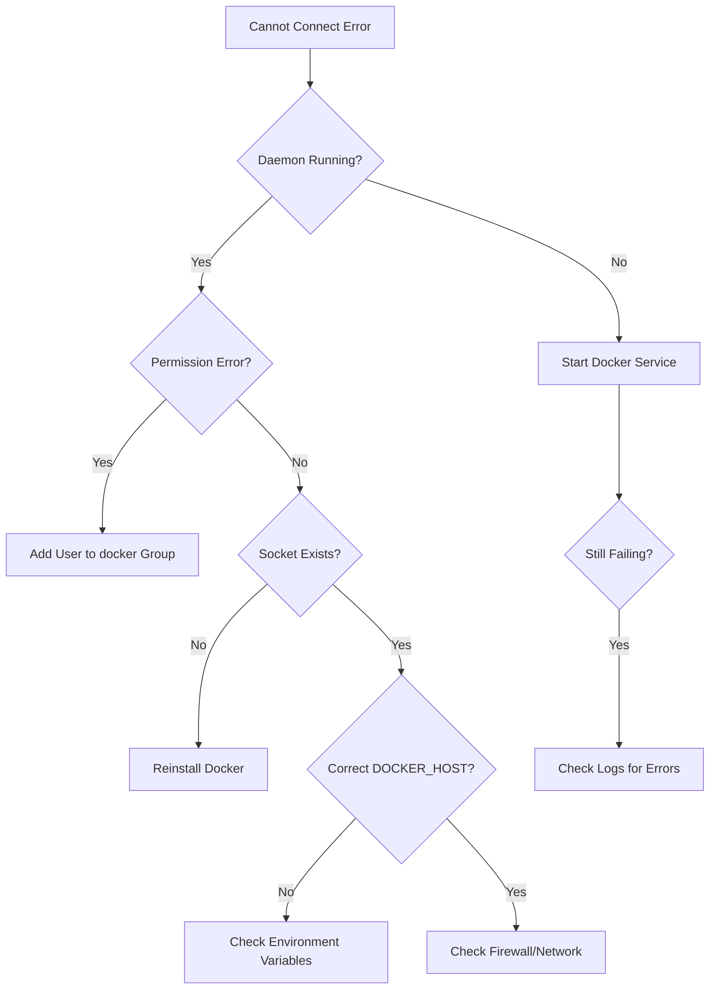

# How to Fix Docker 'Cannot Connect to Docker Daemon' Errors

Author: [nawazdhandala](https://www.github.com/nawazdhandala)

Tags: Docker, Troubleshooting, Docker Daemon, DevOps, Installation

Description: Diagnose and resolve the common 'Cannot connect to Docker daemon' error including daemon startup issues, socket permission problems, and Docker Desktop connectivity failures.

---

The "Cannot connect to the Docker daemon" error prevents all Docker commands from working. This guide walks through identifying why the daemon is unreachable and how to fix it across different platforms.

## Understanding the Error

```bash
# Common error messages
Cannot connect to the Docker daemon at unix:///var/run/docker.sock. Is the docker daemon running?

docker: Cannot connect to the Docker daemon at tcp://localhost:2375. Is the docker daemon running?

Error response from daemon: dial unix /var/run/docker.sock: connect: permission denied
```

The Docker CLI communicates with the Docker daemon through a socket. When this connection fails, the CLI cannot execute any commands.

## Quick Diagnostic Steps

```bash
# Check if Docker daemon is running
systemctl status docker          # Linux with systemd
service docker status            # Linux with SysVinit

# Check the Docker socket exists
ls -la /var/run/docker.sock

# Check if you can connect
docker info
```

## Linux: Daemon Not Running

### Start the Docker Service

```bash
# Start Docker daemon
sudo systemctl start docker

# Enable Docker to start on boot
sudo systemctl enable docker

# Check service status
sudo systemctl status docker

# View daemon logs if startup failed
sudo journalctl -u docker.service --no-pager -n 50
```

### If Docker Fails to Start

```bash
# Check for configuration errors
sudo dockerd --validate

# Start daemon manually in foreground to see errors
sudo dockerd

# Common issues in logs:
# - "failed to start daemon: Error initializing network controller" (network conflict)
# - "failed to load plugin" (plugin corruption)
# - "failed to mount overlay" (storage driver issues)
```

### Fix Storage Driver Issues

```bash
# Check current storage driver
docker info | grep "Storage Driver"

# If overlay2 is failing, try resetting Docker data
# WARNING: This deletes all containers, images, and volumes
sudo systemctl stop docker
sudo rm -rf /var/lib/docker
sudo systemctl start docker
```

## Linux: Permission Denied

The socket has permissions that prevent your user from accessing it.

```bash
# Check socket permissions
ls -la /var/run/docker.sock
# srw-rw---- 1 root docker 0 Jan 25 10:00 /var/run/docker.sock

# Check if your user is in the docker group
groups $USER

# Add your user to the docker group
sudo usermod -aG docker $USER

# Apply group change (logout/login or use newgrp)
newgrp docker

# Verify access
docker info
```

> **Security Note**: Adding users to the docker group grants root-equivalent privileges. Only do this for trusted users on trusted systems.

### Temporary Fix Without Group Change

```bash
# Run Docker commands with sudo
sudo docker info

# Or temporarily change socket permissions (resets on reboot)
sudo chmod 666 /var/run/docker.sock
```

## macOS: Docker Desktop Issues

### Docker Desktop Not Running

```bash
# Check if Docker Desktop process is running
pgrep -f "Docker Desktop"

# Start Docker Desktop from command line
open -a Docker

# Or from Applications folder
# Finder -> Applications -> Docker
```

### Reset Docker Desktop

If Docker Desktop is stuck or corrupted:

1. Click the Docker icon in the menu bar
2. Select "Troubleshoot"
3. Click "Reset to factory defaults"

Or from command line:

```bash
# Kill Docker processes
killall Docker

# Remove Docker Desktop settings (keeps data)
rm -rf ~/Library/Group\ Containers/group.com.docker/settings.json

# Start fresh
open -a Docker
```

### Check Docker Context

```bash
# View current context
docker context ls

# If using wrong context, switch to default
docker context use default
```

## Windows: Docker Desktop Issues

### Docker Desktop Service Not Running

```powershell
# Check Docker Desktop service
Get-Service *docker*

# Start Docker Desktop service
Start-Service docker

# Or start Docker Desktop application
Start-Process "C:\Program Files\Docker\Docker\Docker Desktop.exe"
```

### WSL2 Backend Issues

```powershell
# Check WSL status
wsl --status

# Update WSL
wsl --update

# Restart WSL
wsl --shutdown

# Then restart Docker Desktop
```

### Hyper-V Issues (Windows Pro/Enterprise)

```powershell
# Enable Hyper-V if disabled
Enable-WindowsOptionalFeature -Online -FeatureName Microsoft-Hyper-V -All

# Restart after enabling
Restart-Computer
```

## Remote Docker Daemon Connection

When connecting to a remote Docker host:

```bash
# Check if remote host is accessible
ping docker-host.example.com

# Test TCP connection (if using TCP socket)
nc -zv docker-host.example.com 2375

# Check DOCKER_HOST environment variable
echo $DOCKER_HOST

# Connect to remote daemon
export DOCKER_HOST=tcp://docker-host.example.com:2375
docker info

# For TLS-secured daemon
export DOCKER_HOST=tcp://docker-host.example.com:2376
export DOCKER_TLS_VERIFY=1
export DOCKER_CERT_PATH=/path/to/certs
docker info
```

### SSH-Based Remote Access

```bash
# Connect via SSH (no daemon TCP exposure needed)
export DOCKER_HOST=ssh://user@docker-host.example.com
docker info

# Or use docker context for persistent configuration
docker context create remote-host --docker "host=ssh://user@docker-host.example.com"
docker context use remote-host
```

## Debugging Daemon Startup

### Check Daemon Configuration

```bash
# View daemon configuration
cat /etc/docker/daemon.json

# Common configuration issues:
# - Invalid JSON syntax
# - Conflicting options
# - Non-existent directories

# Validate JSON syntax
python3 -m json.tool /etc/docker/daemon.json
```

```json
// Example valid daemon.json
{
  "storage-driver": "overlay2",
  "log-driver": "json-file",
  "log-opts": {
    "max-size": "10m",
    "max-file": "3"
  },
  "dns": ["8.8.8.8", "8.8.4.4"]
}
```

### Inspect Daemon Logs

```bash
# Linux (systemd)
sudo journalctl -u docker.service -f

# Linux (syslog)
sudo tail -f /var/log/syslog | grep docker

# macOS (Docker Desktop logs)
tail -f ~/Library/Containers/com.docker.docker/Data/log/vm/dockerd.log

# Windows (Event Viewer)
# Open Event Viewer -> Windows Logs -> Application
# Filter by Source: Docker
```

## Common Causes and Solutions



### Summary Table

| Platform | Common Cause | Solution |
|----------|--------------|----------|
| Linux | Daemon not started | `sudo systemctl start docker` |
| Linux | Permission denied | `sudo usermod -aG docker $USER` |
| macOS | Docker Desktop closed | Open Docker Desktop app |
| macOS | Context misconfigured | `docker context use default` |
| Windows | Service stopped | Start Docker Desktop |
| Windows | WSL2 issue | `wsl --update && wsl --shutdown` |
| Remote | Network unreachable | Check firewall, verify DOCKER_HOST |

## Prevention Tips

```bash
# Enable Docker to start on boot (Linux)
sudo systemctl enable docker

# Verify group membership is configured (Linux)
grep docker /etc/group

# Keep Docker Desktop updated (macOS/Windows)
# Enable automatic updates in Docker Desktop settings

# Monitor daemon health
docker events --filter type=daemon
```

---

The "Cannot connect to Docker daemon" error usually falls into three categories: the daemon is not running, you lack permissions, or the connection configuration is wrong. On Linux, check the service status and socket permissions. On macOS and Windows, ensure Docker Desktop is running and properly configured. For remote connections, verify network accessibility and authentication settings. The daemon logs provide specific error messages when startup fails.
