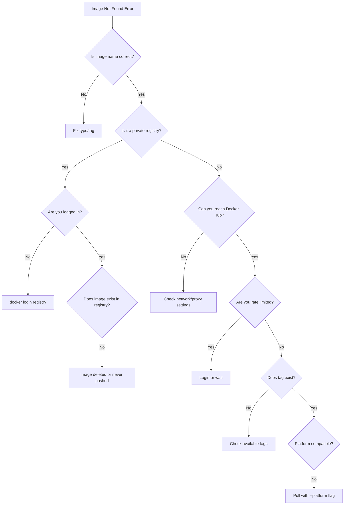

# How to Fix Docker 'Image Not Found' Errors

Author: [nawazdhandala](https://www.github.com/nawazdhandala)

Tags: Docker, Troubleshooting, Container Registry, DevOps, Images

Description: Diagnose and resolve Docker image not found errors including repository naming issues, authentication problems, platform mismatches, and registry connectivity failures.

---

The "image not found" error appears when Docker cannot locate an image either locally or in configured registries. While the error message seems simple, the root causes vary from typos to authentication failures to platform compatibility issues.

## Understanding the Error

```bash
# Common error messages
Unable to find image 'myapp:latest' locally
docker: Error response from daemon: pull access denied for myapp, repository does not exist or may require 'docker login'

# Or for specific tags
Error response from daemon: manifest for nginx:1.25.99 not found: manifest unknown: manifest unknown
```

Docker searches in this order:
1. Local image cache
2. Default registry (Docker Hub) or specified registry
3. Returns error if not found in either location

## Step 1: Verify Image Name and Tag

Typos are the most common cause. Check the exact image name against the source.

```bash
# Common mistakes
docker pull ngnix:latest       # Wrong: 'ngnix' instead of 'nginx'
docker pull node:18-alpine3.9  # Wrong: '3.9' instead of '3.18' or '3.19'
docker pull postgres:lastest   # Wrong: 'lastest' instead of 'latest'

# Verify available tags on Docker Hub
# Visit: https://hub.docker.com/_/nginx/tags

# For other registries, use the registry's web UI or API
curl -s "https://registry.hub.docker.com/v2/repositories/library/nginx/tags?page_size=10" | jq '.results[].name'
```

### Check for Platform-Specific Tags

Some images only exist for certain architectures.

```bash
# Check if image supports your platform
docker manifest inspect nginx:alpine

# Output shows supported platforms
# "platform": {
#   "architecture": "amd64",
#   "os": "linux"
# }

# Explicitly pull for specific platform
docker pull --platform linux/amd64 myimage:tag
docker pull --platform linux/arm64 myimage:tag
```

## Step 2: Check Registry Authentication

Private registries and rate-limited public registries require authentication.

```bash
# Check if you're logged in to Docker Hub
docker info | grep "Username"

# Login to Docker Hub
docker login

# Login to other registries
docker login ghcr.io          # GitHub Container Registry
docker login gcr.io           # Google Container Registry
docker login <account>.dkr.ecr.<region>.amazonaws.com  # AWS ECR

# Verify credentials work by pulling a known image
docker pull hello-world
```

### Docker Hub Rate Limits

Anonymous pulls from Docker Hub are rate-limited. You may get "not found" when actually hitting rate limits.

```bash
# Check your current rate limit status
TOKEN=$(curl -s "https://auth.docker.io/token?service=registry.docker.io&scope=repository:library/nginx:pull" | jq -r '.token')
curl -s -H "Authorization: Bearer $TOKEN" -I "https://registry-1.docker.io/v2/library/nginx/manifests/latest" | grep -i ratelimit

# Output shows remaining pulls
# ratelimit-limit: 100;w=21600
# ratelimit-remaining: 95;w=21600
```

If rate limited, authenticate to get higher limits or wait for the window to reset.

## Step 3: Verify Registry Connectivity

Network issues can prevent reaching the registry.

```bash
# Test connectivity to Docker Hub
curl -I https://registry-1.docker.io/v2/

# Test connectivity to private registry
curl -I https://your-registry.example.com/v2/

# Check if DNS resolves
nslookup registry-1.docker.io

# Check for proxy issues
echo $HTTP_PROXY
echo $HTTPS_PROXY

# Configure Docker to use proxy if needed
# Edit ~/.docker/config.json or /etc/docker/daemon.json
```

```json
// ~/.docker/config.json - User-level proxy configuration
{
  "proxies": {
    "default": {
      "httpProxy": "http://proxy.example.com:8080",
      "httpsProxy": "http://proxy.example.com:8080",
      "noProxy": "localhost,127.0.0.1,.internal.company.com"
    }
  }
}
```

## Step 4: Handle Private Registry Images

For images in private registries, the full path must include the registry hostname.

```bash
# Wrong: Docker looks on Docker Hub
docker pull mycompany/myapp:v1

# Correct: Specify full registry path
docker pull registry.mycompany.com/mycompany/myapp:v1
docker pull ghcr.io/myorg/myapp:v1
docker pull gcr.io/my-project/myapp:v1
```

### AWS ECR Authentication

ECR tokens expire after 12 hours and require special handling.

```bash
# Get ECR login token (AWS CLI v2)
aws ecr get-login-password --region us-east-1 | \
  docker login --username AWS --password-stdin 123456789.dkr.ecr.us-east-1.amazonaws.com

# Then pull the image
docker pull 123456789.dkr.ecr.us-east-1.amazonaws.com/myapp:latest
```

### Google Container Registry / Artifact Registry

```bash
# Configure Docker to use gcloud credential helper
gcloud auth configure-docker

# For Artifact Registry regions
gcloud auth configure-docker us-central1-docker.pkg.dev

# Pull image
docker pull gcr.io/my-project/myapp:latest
```

## Step 5: Build Missing Local Images

If the image should be built locally rather than pulled, you need to build it first.

```bash
# Error when image doesn't exist locally
docker run myapp:dev
# Unable to find image 'myapp:dev' locally

# Solution: Build the image first
docker build -t myapp:dev .

# Or use docker compose which builds automatically
docker compose up --build
```

```yaml
# docker-compose.yml
services:
  app:
    # This builds if image doesn't exist
    build:
      context: .
      dockerfile: Dockerfile
    image: myapp:dev
```

## Step 6: Check Image Deletion or Tag Movement

Images or tags may have been deleted or moved.

```bash
# List locally cached images
docker images | grep myapp

# An old reference might point to deleted image
docker run myapp@sha256:abc123...
# Error: manifest for myapp@sha256:abc123... not found

# Solution: Pull by current tag instead
docker pull myapp:latest

# Or find the correct digest
docker manifest inspect myapp:latest --verbose | jq '.[0].Descriptor.digest'
```

## Debugging Workflow



## Common Scenarios and Solutions

### Scenario 1: CI/CD Pipeline Failure

```yaml
# GitHub Actions - Ensure login before pull
jobs:
  build:
    steps:
      - name: Login to Container Registry
        uses: docker/login-action@v3
        with:
          registry: ghcr.io
          username: ${{ github.actor }}
          password: ${{ secrets.GITHUB_TOKEN }}

      - name: Pull base image
        run: docker pull ghcr.io/myorg/base:latest
```

### Scenario 2: Kubernetes Pod ImagePullBackOff

```bash
# Check pod events for details
kubectl describe pod mypod | grep -A10 Events

# Common issue: Missing imagePullSecrets
# Create secret for private registry
kubectl create secret docker-registry regcred \
  --docker-server=registry.example.com \
  --docker-username=user \
  --docker-password=pass

# Reference in pod spec
# imagePullSecrets:
#   - name: regcred
```

### Scenario 3: Multi-Architecture Build Issues

```bash
# Image exists but not for your platform (e.g., M1 Mac pulling amd64-only image)
# Check supported platforms
docker manifest inspect myimage:tag

# Pull with explicit platform
docker pull --platform linux/amd64 myimage:tag

# Run with emulation (slower but works)
docker run --platform linux/amd64 myimage:tag
```

---

When facing "image not found" errors, work through the checklist systematically: verify the image name and tag are correct, confirm authentication to the registry, check network connectivity, ensure platform compatibility, and verify the image actually exists in the registry. Most issues fall into one of these categories, and the solution becomes clear once you identify which one applies.
